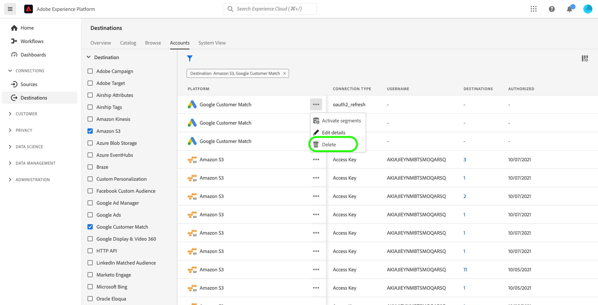

# 대상 계정 삭제

## 개요 {#overview}

**[!UICONTROL 계정]** 탭에는 다양한 대상으로 설정한 연결에 대한 세부 정보가 표시됩니다. 각 대상 계정에서 확인할 수 있는 모든 정보는 [계정 개요](../ui/destinations-workspace.md#accounts)를 참조하세요.

이 자습서에서는 Experience Platform UI를 사용하여 더 이상 필요하지 않은 대상 계정을 삭제하는 단계를 설명합니다.

## 계정 삭제 {#delete}

>[!TIP]
>
>대상 계정을 삭제하기 전에 먼저 대상 계정과 연결된 기존 데이터 흐름을 삭제해야 합니다. 기존 대상 데이터 흐름을 삭제하려면 [UI에서 대상 데이터 흐름 삭제](./delete-destinations.md)에 대한 자습서를 참조하십시오.

기존 대상 계정을 삭제하려면 아래 단계를 따르십시오.

1. [Experience Platform UI](https://platform.adobe.com/)에 로그인하고 왼쪽 탐색 모음에서 **[!UICONTROL 대상]**&#x200B;을 선택합니다. 기존 계정을 보려면 상단 헤더에서 **[!UICONTROL 계정]**&#x200B;을 선택하십시오.

   

2. 왼쪽 상단의 필터 아이콘 을(를) 선택하여 정렬 패널을 시작합니다. 정렬 패널에서는 모든 대상의 목록을 제공합니다. 목록에서 대상을 두 개 이상 선택하여 선택한 대상과 연관된 계정의 필터링된 선택을 확인할 수 있습니다.

   

3. 삭제하려는 계정 이름 옆의 생략 부호(`...`)를 선택합니다. 팝업 패널이 표시되어 계정을 **[!UICONTROL 대상자 활성화]**, **[!UICONTROL 세부 정보 편집]** 및 **[!UICONTROL 삭제]**&#x200B;하는 옵션을 제공합니다.  **[!UICONTROL 삭제]** 단추를 선택하여 원하는 계정을 삭제합니다.

   

4. 마지막 확인 대화 상자가 나타나면 **[!UICONTROL 삭제]**&#x200B;를 선택하여 프로세스를 완료합니다.

## 다음 단계

이 자습서에 따라 대상 작업 영역을 사용하여 기존 계정을 삭제했습니다.

[!DNL Flow Service] API를 사용하여 프로그래밍 방식으로 이러한 작업을 수행하는 방법에 대한 단계는 [흐름 서비스 API를 사용하여 연결 삭제](../api/delete-destination-account.md)에 대한 자습서를 참조하십시오.
