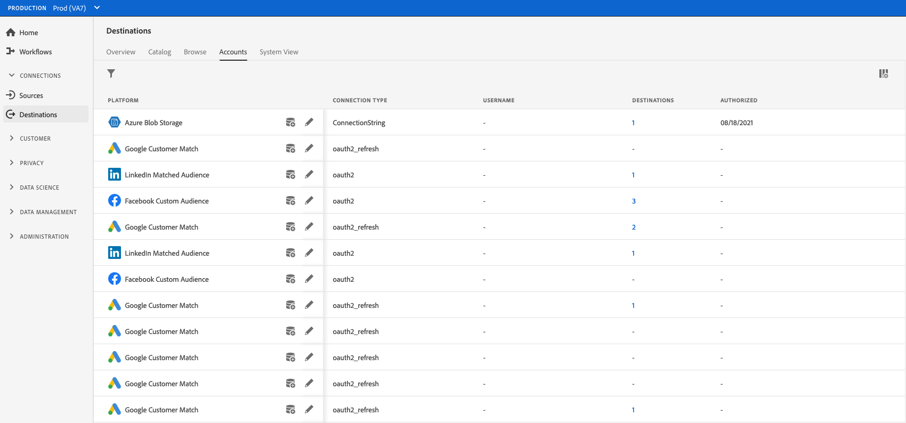

# 대상 계정 삭제

## 개요 {#overview}

다음 **[!UICONTROL 계정]** 탭에는 다양한 대상과 함께 설정한 연결에 대한 세부 사항이 표시됩니다. 다음을 참조하십시오. [계정 개요](../ui/destinations-workspace.md#accounts) 각 대상 계정에서 확인할 수 있는 모든 정보에 대해 설명합니다.

이 자습서에서는 Experience Platform UI를 사용하여 더 이상 필요하지 않은 대상 계정을 삭제하는 단계를 설명합니다.

## 계정 삭제 {#delete}

>[!TIP]
>
>대상 계정을 삭제하기 전에 먼저 대상 계정과 연결된 기존 데이터 흐름을 삭제해야 합니다. 기존 대상 데이터 흐름을 삭제하려면 다음 자습서를 참조하십시오 [UI에서 대상 데이터 흐름 삭제](./delete-destinations.md).

기존 대상 계정을 삭제하려면 아래 단계를 따르십시오.

1. 에 로그인합니다 [EXPERIENCE PLATFORM UI](https://platform.adobe.com/) 및 선택 **[!UICONTROL 대상]** 왼쪽 탐색 모음에서 을 클릭합니다. 선택 **[!UICONTROL 계정]** 을 클릭하여 기존 계정을 확인합니다.

   

2. 필터 아이콘 선택  왼쪽 상단에서 정렬 패널을 시작합니다. 정렬 패널에서는 모든 대상의 목록을 제공합니다. 목록에서 대상을 두 개 이상 선택하여 선택한 대상과 연관된 계정의 필터링된 선택을 확인할 수 있습니다.

   

3. 줄임표(`...`)를 클릭하여 제품에서 사용할 수 있습니다. 옵션을 제공하는 팝업 패널이 나타납니다. **[!UICONTROL 세그먼트 활성화]**, **[!UICONTROL 세부 정보 편집]**, 및 **[!UICONTROL 삭제]** 계정입니다. 다음 항목 선택  **[!UICONTROL 삭제]** 단추를 클릭하여 원하는 계정을 삭제합니다.

   

4. 최종 확인 대화 상자가 나타나면 다음을 선택합니다. **[!UICONTROL 삭제]** 을 클릭하여 프로세스를 완료합니다.

## 다음 단계

이 자습서에 따라 대상 작업 영역을 사용하여 기존 계정을 삭제했습니다.

프로그래밍 방식으로 이러한 작업을 수행하는 방법에 대한 자세한 내용은 [!DNL Flow Service] API에 대한 자습서를 참조하십시오. [흐름 서비스 API를 사용하여 연결 삭제](../api/delete-destination-account.md)
