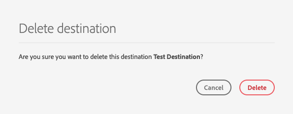

# 대상 삭제 {#delete-destinations}

## 개요 {#overview}

Adobe Experience Platform 사용자 인터페이스에서 대상에 대한 기존 연결을 삭제할 수 있습니다.

대상을 삭제하면 기존 데이터 흐름이 해당 대상으로 제거됩니다. 삭제한 대상에 활성화된 모든 세그먼트는 데이터 흐름을 삭제하기 전에 매핑되지 않습니다.

[!DNL Platform] [!DNL UI]에서 대상을 삭제할 수 있는 방법에는 두 가지가 있습니다. 다음을 수행할 수 있습니다.

* [[!UICONTROL 찾아보기] 탭에서 대상 삭제](#delete-browse-tab)
* [대상 세부 사항 페이지에서 대상 삭제](#delete-destination-details-page)

>[!IMPORTANT]
>
>이 문서에 설명된 대로 기존 *대상 연결을 삭제할 수 있지만 Platform에서는 현재 기존*[&#x200B;대상 계정&#x200B;](/help/destinations/ui/destinations-workspace.md#accounts)*을 삭제할 수 없습니다.*

## 찾아보기 탭에서 대상 삭제{#delete-browse-tab}

아래 단계에 따라 [!UICONTROL 찾아보기] 탭에서 대상을 삭제합니다.

1. [Experience Platform UI](https://platform.adobe.com/)에 로그인하고 왼쪽 탐색 막대에서 **[!UICONTROL 대상]**&#x200B;을 선택합니다. 기존 대상을 보려면 상단 헤더에서 **[!UICONTROL 찾아보기]**&#x200B;를 선택하십시오.

   

2. 왼쪽 상단에 있는 필터 아이콘 을 선택하여 정렬 패널을 시작합니다. 정렬 패널에서는 모든 대상 목록을 제공합니다. 목록에서 둘 이상의 대상을 선택하여 선택한 대상과 연관된 필터링된 데이터 흐름 선택을 볼 수 있습니다.

   

3. 이름 열에서  단추를 선택한 다음  **[!UICONTROL 삭제]**를 선택하여 기존 대상 연결을 제거합니다.
   

4. **[!UICONTROL 삭제]**&#x200B;를 선택하여 대상 연결 제거를 확인합니다.

   

## 대상 세부 사항 페이지에서 대상 삭제{#delete-destination-details-page}

대상 세부 사항 페이지에서 대상을 삭제하려면 아래 절차를 따르십시오.

1. [Experience Platform UI](https://platform.adobe.com/)에 로그인하고 왼쪽 탐색 막대에서 **[!UICONTROL 대상]**&#x200B;을 선택합니다. 기존 대상을 보려면 상단 헤더에서 **[!UICONTROL 찾아보기]**&#x200B;를 선택하십시오.

   

2. 왼쪽 상단에 있는 필터 아이콘 을 선택하여 정렬 패널을 시작합니다. 정렬 패널에서는 모든 대상 목록을 제공합니다. 목록에서 둘 이상의 대상을 선택하여 선택한 대상과 연관된 필터링된 데이터 흐름 선택을 볼 수 있습니다.

   

3. 삭제할 대상의 이름을 선택합니다.

   

   * 대상에 기존 데이터 흐름이 있는 경우 [!UICONTROL 데이터 흐름 실행] 탭으로 이동합니다.

      

   * 대상에 기존 데이터 흐름이 없는 경우 대상 활성화를 시작할 수 있는 빈 페이지가 표시됩니다.

      

4. 오른쪽 레일에서 **[!UICONTROL 삭제]**&#x200B;를 선택합니다.

   

5. 확인 대화 상자에서 **[!UICONTROL 삭제]**&#x200B;를 선택하여 대상을 제거합니다.

   

   >[!NOTE]
   >
   >서버 로드에 따라 [!DNL Platform]이 대상을 삭제하는 데 몇 분이 걸릴 수 있습니다.
