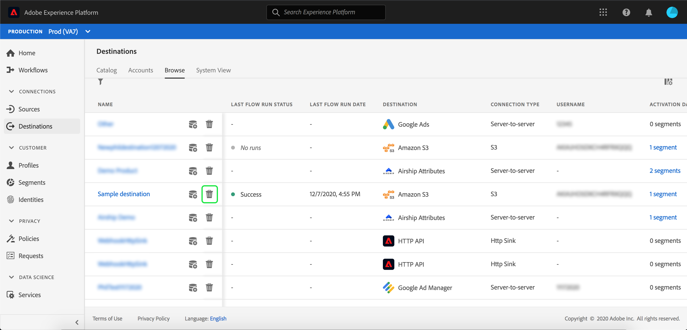

# 대상 세부 사항 보기

## 개요 {#overview}

Adobe Experience Platform 사용자 인터페이스에서 대상의 속성 및 활동을 보고 모니터링할 수 있습니다. 이러한 세부 사항에는 대상의 이름 및 ID, 대상을 활성화 또는 비활성화하는 컨트롤 등이 포함됩니다. 일괄 처리 대상에 대한 세부 사항에는 활성화된 프로필 레코드에 대한 지표 및 데이터 흐름 실행 내역이 포함됩니다.

>[!NOTE]
>
>대상 세부 사항 페이지는 플랫폼 UI에서 [!UICONTROL Destinations] 작업 영역의 일부입니다. 자세한 내용은 [[!UICONTROL Destinations] 작업 영역 개요](./destinations-workspace.md)를 참조하십시오.

플랫폼 UI 내의 **[!UICONTROL Destinations]** 작업 영역에서 **[!UICONTROL Browse]** 탭으로 이동하여 보려는 대상의 이름을 선택합니다.

대상에 대한 세부 사항 페이지가 나타나고 사용 가능한 컨트롤이 표시됩니다. 배치 대상의 세부 사항을 보는 경우 모니터링 대시보드도 나타납니다.

또한 [찾아보기] 탭에서  아이콘을 선택하여 선택한 데이터 흐름을 삭제하도록 선택할 수 있습니다. 대상에 대해 활성화된 모든 세그먼트는 데이터 흐름 삭제 전에 매핑되지 않습니다.

## 오른쪽 레일

오른쪽 레일에는 대상에 대한 기본 정보가 표시됩니다.

다음 표에서는 오른쪽 레일에서 제공하는 컨트롤과 세부 사항을 설명합니다.

| 오른쪽 레일 항목 | 설명 |
| --- | --- |
| [!UICONTROL Activate] | 대상에 매핑되는 세그먼트를 편집하려면 이 컨트롤을 선택합니다. 자세한 내용은 [대상](./activate-destinations.md)에 세그먼트 활성화에 대한 안내서를 참조하십시오. |
| [!UICONTROL Delete] | 이 데이터 흐름을 삭제하고 이전에 활성화한 세그먼트(있는 경우)를 매핑하지 않을 수 있습니다. |
| [!UICONTROL Destination name] | 대상 이름을 업데이트하려면 이 필드를 편집할 수 있습니다. |
| [!UICONTROL Description] | 대상에 선택적 설명을 업데이트하거나 추가하기 위해 이 필드를 편집할 수 있습니다. |
| [!UICONTROL Destination] | 대상이 전송되는 대상 플랫폼을 나타냅니다. 자세한 내용은 [대상 카탈로그](../catalog/overview.md)를 참조하십시오. |
| [!UICONTROL Status] | 대상이 활성화되었는지 여부를 나타냅니다. |
| [!UICONTROL Marketing actions] | 데이터 거버넌스 목적으로 이 대상에 적용되는 마케팅 작업(사용 사례)을 나타냅니다. |
| [!UICONTROL Category] | 대상 유형을 나타냅니다. 자세한 내용은 [대상 카탈로그](../catalog/overview.md)를 참조하십시오. |
| [!UICONTROL Connection type] | 대상을 대상으로 보내는 양식을 나타냅니다. 가능한 값은 &quot;[!UICONTROL Cookie]&quot; 및 &quot;[!UICONTROL Profile-based]&quot;입니다. |
| [!UICONTROL Frequency] | 대상이 대상으로 전송되는 빈도를 나타냅니다. 가능한 값은 &quot;[!UICONTROL Streaming]&quot; 및 &quot;[!UICONTROL Batch]&quot;입니다. |
| [!UICONTROL Identity] | 대상이 허용하는 ID 네임스페이스를 나타냅니다(예: `GAID`, `IDFA` 또는 `email`). 허용되는 ID 네임스페이스에 대한 자세한 내용은 [ID 네임스페이스 개요](../../identity-service/namespaces.md)를 참조하십시오. |
| [!UICONTROL Created by] | 이 대상을 만든 사용자를 나타냅니다. |
| [!UICONTROL Created] | 이 대상을 만들 때의 UTC datetime을 나타냅니다. |

## [!UICONTROL Enabled]/[!UICONTROL Disabled] 토글

**[!UICONTROL Enabled]/[!UICONTROL Disabled]** 토글을 사용하여 대상에 대한 모든 데이터 내보내기를 시작 및 일시 중지할 수 있습니다.

## [!UICONTROL Dataflow runs]

[!UICONTROL Dataflow runs] 탭은 데이터 흐름 실행에 대한 지표 데이터를 일괄 처리 대상으로 제공합니다. 프로필 레코드에 대한 다음 합계와 함께 개별 실행 및 해당 특정 지표 목록이 표시됩니다.

* **[!UICONTROL Profile records activated]**:활성화용으로 만들거나 업데이트된 프로필 레코드의 총 수입니다.
* **[!UICONTROL Profile records skipped]**:프로필 종료 또는 누락된 특성을 기반으로 활성화용으로 건너뛴 프로필 레코드의 총 수입니다.

>[!NOTE]
>
>Dataflow는 대상 데이터 흐름의 예약 빈도를 기반으로 생성됩니다. 세그먼트에 적용된 각 병합 정책에 대해 별도의 데이터 흐름 실행이 수행됩니다.

특정 데이터 흐름 실행에 대한 세부 정보를 보려면 목록에서 실행 시작 시간을 선택합니다. 데이터 흐름 실행에 대한 세부 정보 페이지에는 처리된 데이터 크기 및 오류 진단에 대한 세부 정보와 함께 발생한 오류 목록과 같은 추가 정보가 들어 있습니다.

## [!UICONTROL Activation data] {#activation-data}

[!UICONTROL Activation data] 탭에는 시작 날짜 및 종료 날짜(해당하는 경우)를 포함하여 대상에 매핑된 세그먼트 목록이 표시됩니다. 특정 세그먼트에 대한 세부 사항을 보려면 목록에서 해당 이름을 선택합니다.

>[!NOTE]
>
>세그먼트의 세부 사항 페이지를 탐색하는 방법에 대한 자세한 내용은 [세그멘테이션 UI 개요](../../segmentation/ui/overview.md#segment-details)를 참조하십시오.

## 다음 단계

이 문서에서는 대상 세부 사항 페이지의 기능을 다룹니다. UI에서 대상을 관리하는 방법에 대한 자세한 내용은 [[!UICONTROL Destinations] 작업 영역](./destinations-workspace.md)의 개요를 참조하십시오.