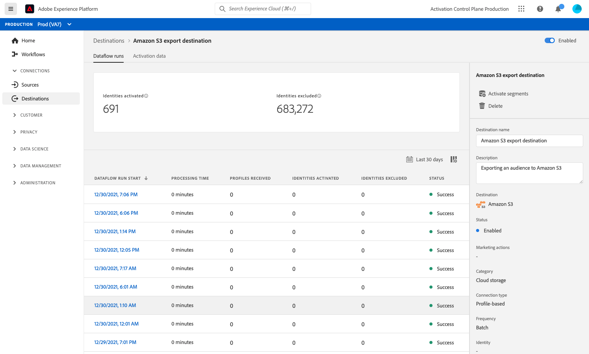

# 대상 세부 사항 보기

## 개요 {#overview}

Adobe Experience Platform 사용자 인터페이스에서 대상의 속성 및 활동을 보고 모니터링할 수 있습니다. 이러한 세부 정보에는 대상 이름 및 ID, 대상을 활성화하거나 비활성화하는 컨트롤 등이 포함됩니다. 세부 사항에는 활성화된 프로필 레코드, 활성화, 실패 및 제외된 ID 및 데이터 흐름 실행 기록에 대한 지표도 포함됩니다.

>[!NOTE]
>
>대상 세부 사항 페이지는 [!UICONTROL 대상] 의 작업 공간 [!DNL Platform] [!DNL UI]. 다음을 참조하십시오. [[!UICONTROL 대상] 작업 영역 개요](./destinations-workspace.md) 추가 정보.

## 대상 세부 사항 보기 {#view-details}

기존 대상에 대한 자세한 내용을 보려면 아래 단계를 따르십시오.

1. 에 로그인합니다 [EXPERIENCE PLATFORM UI](https://platform.adobe.com/) 및 선택 **[!UICONTROL 대상]** 왼쪽 탐색 모음에서 을 클릭합니다. 선택 **[!UICONTROL 찾아보기]** 을 클릭하여 기존 대상을 확인합니다.

   

1. 필터 아이콘 선택  왼쪽 상단에서 정렬 패널을 시작합니다. 정렬 패널에서는 모든 대상의 목록을 제공합니다. 목록에서 두 개 이상의 대상을 선택하여 선택한 대상과 연관된 데이터 흐름의 필터링된 선택을 확인할 수 있습니다.

   

1. 보려는 대상의 이름을 선택합니다.

   

1. 대상에 대한 세부 정보 페이지가 나타나고 사용 가능한 컨트롤이 표시됩니다.

   

## 오른쪽 레일 {#right-rail}

오른쪽 레일에는 선택한 대상에 대한 기본 정보가 표시됩니다.

다음 표는 오른쪽 레일에서 제공하는 제어 및 세부 사항을 다룹니다.

| 오른쪽 레일 항목 | 설명 |
| --- | --- |
| [!UICONTROL 대상자 활성화] | 대상에 매핑된 대상을 편집하거나, 내보내기 일정을 업데이트하거나, 매핑된 속성 및 ID를 추가 및 제거하려면 이 컨트롤을 선택하십시오. 의 안내서 보기 [대상자 데이터를 대상자 스트리밍 대상으로 활성화](./activate-segment-streaming-destinations.md), [대상자 데이터를 프로필 기반 대상 일괄 처리로 활성화](./activate-batch-profile-destinations.md), 및 [대상자 데이터를 스트리밍 프로필 기반 대상으로 활성화](./activate-streaming-profile-destinations.md) 추가 정보. |
| [!UICONTROL 삭제] | 이 데이터 흐름을 삭제하고 이전에 활성화한 대상(있는 경우)의 매핑을 해제할 수 있습니다. |
| [!UICONTROL 대상 이름] | 이 필드는 대상의 이름을 업데이트하기 위해 편집할 수 있습니다. |
| [!UICONTROL 설명] | 이 필드를 편집하여 대상에 선택적 설명을 업데이트하거나 추가할 수 있습니다. |
| [!UICONTROL 대상] | 대상자를 보낼 대상 플랫폼을 나타냅니다. 다음을 참조하십시오. [대상 카탈로그](../catalog/overview.md) 추가 정보. |
| [!UICONTROL 상태] | 대상의 활성화 여부를 나타냅니다. |
| [!UICONTROL 마케팅 액션] | 데이터 거버넌스 목적으로 이 대상에 적용되는 마케팅 작업(사용 사례)을 나타냅니다. |
| [!UICONTROL 범주] | 대상 유형을 나타냅니다. 다음을 참조하십시오. [대상 카탈로그](../catalog/overview.md) 추가 정보. |
| [!UICONTROL 연결 유형] | 대상자를 대상으로 전송하는 양식을 나타냅니다. 가능한 값은 다음과 같습니다. [!UICONTROL 쿠키] 및 [!UICONTROL 프로필 기반]. |
| [!UICONTROL 빈도] | 대상자를 대상으로 보내는 빈도를 나타냅니다. 가능한 값은 다음과 같습니다. [!UICONTROL 스트리밍] 및 [!UICONTROL 일괄 처리]. |
| [!UICONTROL 신원] | 대상이 허용하는 ID 네임스페이스를 나타냅니다. 예: `GAID`, `IDFA`, 또는 `email`. 허용되는 ID 네임스페이스에 대한 자세한 내용은 [id 네임스페이스 개요](../../identity-service/features/namespaces.md). |
| [!UICONTROL 작성자] | 이 대상을 만든 사용자를 나타냅니다. |
| [!UICONTROL 생성일] | 이 대상을 만들 때의 UTC 날짜/시간을 나타냅니다. |

{style="table-layout:auto"}

## [!UICONTROL 활성화됨]/[!UICONTROL 비활성화됨] 전환 {#enabled-disabled-toggle}

다음을 사용할 수 있습니다. **[!UICONTROL 활성화됨]/[!UICONTROL 비활성화됨]** 대상으로 모든 데이터 내보내기를 시작 및 일시 중지하려면 전환하십시오.

## [!UICONTROL 데이터 흐름 실행] {#dataflow-runs}

다음 [!UICONTROL 데이터 흐름 실행] 탭은 일괄 처리 및 스트리밍 대상으로 실행되는 데이터 흐름에 대한 지표 데이터를 제공합니다. 을(를) 참조하십시오 [데이터 흐름 모니터링](monitor-dataflows.md) 세부 정보 및 지표 정의를 참조하십시오.

>[!NOTE]
>
>* 대상 모니터링 기능은 현재 Experience Platform의 모든 대상에 대해 지원됩니다 *제외* 다음 [Adobe Target](/help/destinations/catalog/personalization/adobe-target-connection.md), [사용자 정의 개인화](/help/destinations/catalog/personalization/custom-personalization.md) 및 [Experience Cloud 대상](/help/destinations/catalog/adobe/experience-cloud-audiences.md) 대상.
>* 의 경우 [Amazon Kinesis](/help/destinations/catalog/cloud-storage/amazon-kinesis.md), [Azure 이벤트 허브](/help/destinations/catalog/cloud-storage/azure-event-hubs.md), 및 [HTTP API](/help/destinations/catalog/streaming/http-destination.md) 대상, 제외, 실패 및 활성화된 ID와 관련된 지표를 예측합니다. 활성화 데이터의 볼륨이 높을수록 지표의 정확도가 높아집니다.

### 데이터 흐름 실행 기간 {#dataflow-runs-duration}

스트리밍과 파일 기반 대상 간에 표시되는 데이터 흐름 실행 기간에는 차이가 있습니다.

### 스트리밍 대상 {#streaming}

동안 **[!UICONTROL 처리 기간]** 대부분의 스트리밍 데이터 흐름 실행에 대해 아래 이미지에 표시된 대로 약 4시간이 표시되므로 데이터 흐름 실행의 실제 처리 시간이 훨씬 짧습니다. 데이터 흐름 실행 창은 Experience Platform이 대상에 대한 호출을 다시 시도해야 하는 경우 더 오랫동안 열어 두어야 하며, 동일한 시간 동안 늦게 도착하는 데이터를 놓치지 않도록 해야 합니다.

자세한 내용은 다음을 참조하십시오 [스트리밍 대상으로 데이터 흐름 실행](/help/dataflows/ui/monitor-destinations.md#dataflow-runs-for-streaming-destinations) 을 참조하십시오.

### 파일 기반 대상 {#file-based}

파일 기반 대상에 대한 데이터 흐름 실행의 경우 **[!UICONTROL 처리 기간]** 내보내는 데이터의 크기 및 시스템 로드에 따라 다릅니다. 파일 기반 대상으로 실행되는 데이터 흐름은 대상자별로 분류되어 있습니다.

자세한 내용은 다음을 참조하십시오 [배치(파일 기반) 대상으로 데이터 흐름 실행](/help/dataflows/ui/monitor-destinations.md#dataflow-runs-for-batch-destinations) 을 참조하십시오.

## [!UICONTROL 활성화 데이터] {#activation-data}

다음 [!UICONTROL 활성화 데이터] 탭에는 시작 날짜와 종료 날짜(해당하는 경우)를 포함하여 대상에 매핑된 대상자의 목록과 데이터 내보내기를 위한 기타 관련 정보(내보내기 유형, 일정 및 빈도)가 표시됩니다. 특정 대상에 대한 세부 정보를 보려면 목록에서 해당 이름을 선택합니다.

>[!TIP]
>
>대상에 매핑된 속성 및 ID에 대한 세부 사항을 보고 편집하려면 다음을 선택합니다. **[!UICONTROL 대상자 활성화]** 다음에서 [오른쪽 레일](#right-rail).

>[!NOTE]
>
>대상자의 세부 정보 페이지 탐색에 대한 자세한 내용은 [세그멘테이션 UI 개요](../../segmentation/ui/overview.md#segment-details).
