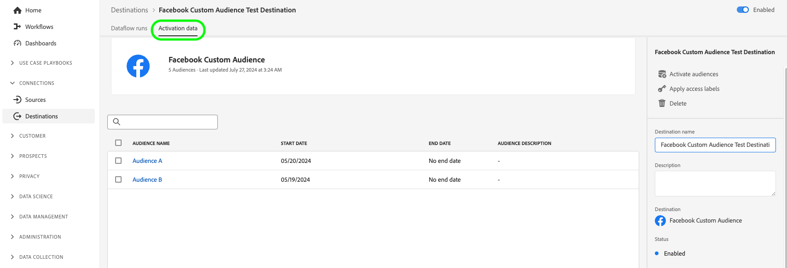
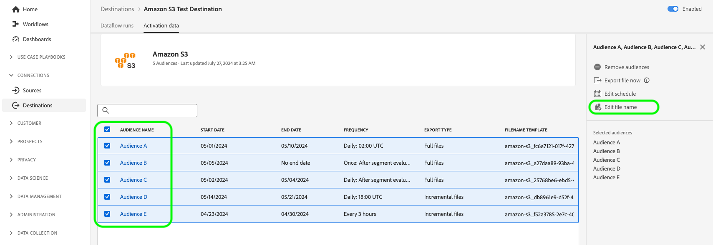

# 대상 세부 사항 보기

## 개요 {#overview}

Adobe Experience Platform 사용자 인터페이스에서 대상의 속성 및 활동을 보고 모니터링할 수 있습니다. 이러한 세부 정보에는 대상 이름 및 ID, 대상을 활성화하거나 비활성화하는 컨트롤 등이 포함됩니다. 세부 사항에는 활성화된 프로필 레코드, 활성화, 실패 및 제외된 ID 및 데이터 흐름 실행 기록에 대한 지표도 포함됩니다.

>[!NOTE]
>
>대상 세부 정보 페이지는 [!DNL Platform] [!DNL UI]의 [!UICONTROL 대상] 작업 영역에 속합니다. 자세한 내용은 [[!UICONTROL 대상] 작업 영역 개요](./destinations-workspace.md)를 참조하십시오.

## 대상 세부 사항 보기 {#view-details}

기존 대상에 대한 자세한 내용을 보려면 아래 단계를 따르십시오. 대상의 대상 ID, 대상을 만든 사용자, 대상을 만든 시간 및 기타 정보를 확인할 수 있습니다.

1. [Experience Platform UI](https://platform.adobe.com/)에 로그인하고 왼쪽 탐색 모음에서 **[!UICONTROL 대상]**&#x200B;을 선택합니다. 기존 대상을 보려면 상단 헤더에서 **[!UICONTROL 찾아보기]**&#x200B;를 선택하십시오.

   

2. 왼쪽 상단의 필터 아이콘 을(를) 선택하여 정렬 패널을 시작합니다. 정렬 패널에서는 모든 대상의 목록을 제공합니다. 목록에서 두 개 이상의 대상을 선택하여 선택한 대상과 연관된 데이터 흐름의 필터링된 선택을 확인할 수 있습니다.

   

3. 추가 정보를 표시할 대상 행을 선택합니다. 이렇게 하면 대상 ID, 대상 연결을 만든 사용자 및 기타 정보를 포함한 대상에 대한 정보가 있는 오른쪽 레일이 표시됩니다.

   

4. 또는 보려는 *대상 이름*&#x200B;을 선택하여 대상에 대한 다른 정보를 표시할 수 있습니다.

   

5. 대상에 대한 세부 정보 페이지가 오른쪽 레일에 표시되어 사용 가능한 컨트롤을 표시합니다.

   

## 오른쪽 레일 {#right-rail}

오른쪽 레일에는 선택한 대상에 대한 기본 정보가 표시됩니다.

다음 표는 오른쪽 레일에서 제공하는 제어 및 세부 사항을 다룹니다.

| 오른쪽 레일 항목 | 설명 |
| --- | --- |
| [!UICONTROL 대상자 활성화] | 대상에 매핑된 대상을 편집하거나, 내보내기 일정을 업데이트하거나, 매핑된 속성 및 ID를 추가 및 제거하려면 이 컨트롤을 선택하십시오. 자세한 내용은 [대상 데이터를 대상 스트리밍 대상으로 활성화](./activate-segment-streaming-destinations.md), [대상 데이터를 프로필 기반 대상으로 활성화](./activate-batch-profile-destinations.md) 및 [대상 데이터를 스트리밍 프로필 기반 대상으로 활성화](./activate-streaming-profile-destinations.md)에 대한 안내서를 참조하십시오. |
| [!UICONTROL 삭제] | 이 데이터 흐름을 삭제하고 이전에 활성화한 대상(있는 경우)의 매핑을 해제할 수 있습니다. |
| [!UICONTROL 대상 이름] | 이 필드는 대상의 이름을 업데이트하기 위해 편집할 수 있습니다. |
| [!UICONTROL 설명] | 이 필드를 편집하여 대상에 선택적 설명을 업데이트하거나 추가할 수 있습니다. |
| [!UICONTROL 대상] | 대상자를 보낼 대상 플랫폼을 나타냅니다. 자세한 내용은 [대상 카탈로그](../catalog/overview.md)를 참조하세요. |
| [!UICONTROL 상태] | 대상의 활성화 여부를 나타냅니다. |
| [!UICONTROL 마케팅 액션] | 데이터 거버넌스 목적으로 이 대상에 적용되는 마케팅 작업(사용 사례)을 나타냅니다. |
| [!UICONTROL 범주] | 대상 유형을 나타냅니다. 자세한 내용은 [대상 카탈로그](../catalog/overview.md)를 참조하세요. |
| [!UICONTROL 연결 유형] | 대상자를 대상으로 전송하는 양식을 나타냅니다. 가능한 값에는 [!UICONTROL 쿠키] 및 [!UICONTROL 프로필 기반]이 포함됩니다. |
| [!UICONTROL 빈도] | 대상자를 대상으로 보내는 빈도를 나타냅니다. 가능한 값은 [!UICONTROL 스트리밍] 및 [!UICONTROL 일괄 처리]입니다. |
| [!UICONTROL 신원] | `GAID`, `IDFA` 또는 `email` 등 대상에서 허용하는 ID 네임스페이스를 나타냅니다. 허용되는 ID 네임스페이스에 대한 자세한 내용은 [ID 네임스페이스 개요](../../identity-service/features/namespaces.md)를 참조하십시오. |
| [!UICONTROL 만든 사람] | 이 대상을 만든 사용자를 나타냅니다. |
| [!UICONTROL 생성일] | 이 대상을 만들 때의 UTC 날짜/시간을 나타냅니다. |

{style="table-layout:auto"}

## [!UICONTROL 사용]/[!UICONTROL 사용 안 함] 전환 {#enabled-disabled-toggle}

**[!UICONTROL 사용]/[!UICONTROL 사용 안 함]** 전환을 사용하여 대상으로 모든 데이터 내보내기를 시작하고 일시 중지할 수 있습니다.

## [!UICONTROL 데이터 흐름 실행] {#dataflow-runs}

[!UICONTROL 데이터 흐름 실행] 탭은 일괄 처리 및 스트리밍 대상에 대한 데이터 흐름 실행의 지표 데이터를 제공합니다. 자세한 내용 및 지표 정의는 [데이터 흐름 모니터링](monitor-dataflows.md)을 참조하세요.

>[!NOTE]
>
>* 대상 모니터링 기능은 현재 *Experience Platform의 모든 대상에 대해 [Adobe Target](/help/destinations/catalog/personalization/adobe-target-connection.md), [사용자 지정 개인화](/help/destinations/catalog/personalization/custom-personalization.md) 및 [대상 Experience Cloud](/help/destinations/catalog/adobe/experience-cloud-audiences.md) 대상을 제외한*&#x200B;에 대해 지원됩니다.
>* [Amazon Kinesis](/help/destinations/catalog/cloud-storage/amazon-kinesis.md), [Azure Event Hubs](/help/destinations/catalog/cloud-storage/azure-event-hubs.md) 및 [HTTP API](/help/destinations/catalog/streaming/http-destination.md) 대상의 경우 제외, 실패 및 활성화된 ID와 관련된 지표를 예측합니다. 활성화 데이터의 볼륨이 높을수록 지표의 정확도가 높아집니다.

### 데이터 흐름 실행 기간 {#dataflow-runs-duration}

스트리밍과 파일 기반 대상 간에 표시되는 데이터 흐름 실행 기간에는 차이가 있습니다.

### 스트리밍 대상 {#streaming}

대부분의 스트리밍 데이터 흐름 실행에 대해 지정된 **[!UICONTROL 처리 기간]**&#x200B;은(는) 아래 그림과 같이 약 4시간이지만, 데이터 흐름 실행의 실제 처리 시간은 훨씬 짧습니다. 데이터 흐름 실행 창은 Experience Platform이 대상에 대한 호출을 다시 시도해야 하는 경우 더 오랫동안 열어 두어야 하며, 동일한 시간 동안 늦게 도착하는 데이터를 놓치지 않도록 해야 합니다.

자세한 내용은 모니터링 설명서에서 [스트리밍 대상으로 데이터 흐름 실행](/help/dataflows/ui/monitor-destinations.md#dataflow-runs-for-streaming-destinations)에 대해 읽어 보십시오.

### 파일 기반 대상 {#file-based}

파일 기반 대상으로 데이터 흐름이 실행되는 경우 **[!UICONTROL 처리 기간]**&#x200B;은(는) 내보내는 데이터의 크기와 시스템 로드에 따라 다릅니다. 파일 기반 대상으로 실행되는 데이터 흐름은 대상자별로 분류되어 있습니다.

자세한 내용은 모니터링 설명서에서 [배치(파일 기반) 대상에 대한 데이터 흐름 실행](/help/dataflows/ui/monitor-destinations.md#dataflow-runs-for-batch-destinations)을 참조하십시오.

## [!UICONTROL 활성화 데이터] {#activation-data}

**[!UICONTROL 활성화 데이터]** 탭에는 시작 날짜와 종료 날짜(해당하는 경우)를 포함하여 대상에 매핑된 대상자의 목록과 데이터 내보내기를 위한 기타 관련 정보(내보내기 유형, 일정 및 빈도)가 표시됩니다. 특정 대상에 대한 세부 정보를 보려면 목록에서 해당 이름을 선택합니다.

>[!TIP]
>
>대상에 매핑된 특성 및 ID에 대한 세부 정보를 보고 편집하려면 [오른쪽 레일](#right-rail)에서 **[!UICONTROL 대상 활성화]**&#x200B;를 선택하십시오.

>[!BEGINSHADEBOX]

파일 기반 대상에 대한 **[!UICONTROL 활성화 데이터]** 탭입니다.

>[!ENDSHADEBOX]

>[!BEGINSHADEBOX]

스트리밍 대상의 **[!UICONTROL 활성화 데이터]** 탭입니다.

>[!ENDSHADEBOX]

### 활성화된 대상자 필터링 {#filter-audiences}

대상에 활성화된 대상자 목록을 필터링하려면 검색 상자에 대상자 이름을 입력합니다. 대상자 목록은 검색 결과와 함께 자동으로 업데이트됩니다.

### 활성화 흐름에서 여러 대상 제거 {#bulk-remove}

기존 활성화 흐름에서 여러 대상을 제거하려면 대상을 선택한 다음 **[!UICONTROL 대상 제거]**&#x200B;를 선택하십시오.

### 주문형 여러 파일을 배치 대상으로 내보내기 {#bulk-export}

**[!UICONTROL 활성화 데이터]** 페이지에서 [필요 시 여러 파일을 내보내기](../ui/export-file-now.md)할 수 있습니다. 이렇게 하려면 파일을 온디맨드로 내보낼 대상을 선택하고 **[!UICONTROL 지금 파일 내보내기]** 컨트롤을 선택하여 선택한 각 대상에 대한 파일을 배치 대상으로 전달하는 일회성 내보내기를 트리거합니다.

### 배치 대상으로 내보낸 여러 대상에 대한 활성화 일정 편집 {#bulk-edit-schedule}

여러 대상의 기존 활성화 일정을 동시에 편집하려면 원하는 대상을 선택한 다음 **[!UICONTROL 일정 편집]**&#x200B;을 선택하십시오. 내보내기 일정을 정의하거나 편집하는 방법에 대한 자세한 내용은 [대상자 내보내기 예약](../ui/activate-batch-profile-destinations.md#scheduling) 섹션을 참조하십시오.

>[!NOTE]
>
>대상자의 세부 정보 페이지 탐색에 대한 자세한 내용은 [대상자 포털 개요](../../segmentation/ui/audience-portal.md#segment-details)를 참조하세요.

### 배치 대상으로 내보낸 여러 대상에 대한 파일 이름 편집 {#bulk-edit-file-names}

내보낸 여러 대상자의 파일 이름을 동시에 편집하려면 원하는 대상자를 선택한 다음 **[!UICONTROL 파일 이름 편집]**&#x200B;을 선택합니다. 파일 이름을 정의하거나 편집하는 방법에 대한 자세한 내용은 [파일 이름을 구성하는 방법](../ui/activate-batch-profile-destinations.md#configure-file-names) 섹션을 참조하십시오.

