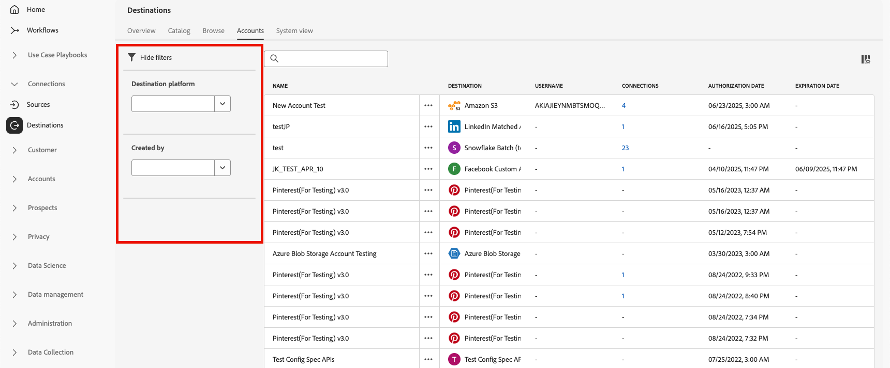

# 대상 작업 영역 {#destinations-workspace}

Adobe Experience Platform의 왼쪽 탐색 모음에서 **[!UICONTROL Destinations]**&#x200B;을(를) 선택하여 [!UICONTROL Destinations] 작업 영역에 액세스합니다.

[!UICONTROL Destinations] 작업 영역은 아래 섹션에 설명된 5개의 섹션 [!UICONTROL Overview], [!UICONTROL Catalog], [!UICONTROL Browse], [!UICONTROL Accounts] 및 [!UICONTROL System View]으로 구성됩니다.

## [!UICONTROL Overview] {#overview}

**[!UICONTROL Overview]** 탭에는 조직의 대상 데이터와 관련된 주요 지표를 제공하는 [!UICONTROL Destinations] 대시보드가 표시됩니다. 자세한 내용은 [[!UICONTROL Destinations] 대시보드 가이드](../../dashboards/guides/destinations.md)를 참조하세요.

>[!NOTE]
>
>조직이 Experience Platform을 처음 사용하고 아직 활성 대상이 없는 경우 [!UICONTROL Destinations] 대시보드 및 [!UICONTROL Overview] 탭이 표시되지 않습니다. 대신 왼쪽 탐색에서 [!UICONTROL Destinations]을(를) 선택하면 [[!UICONTROL Catalog] 탭](#catalog)이 표시됩니다.

## [!UICONTROL Catalog] {#catalog}

**[!UICONTROL Catalog]** 탭에는 데이터를 보낼 수 있는 [!DNL Experience Platform]에서 사용 가능한 모든 대상 목록이 표시됩니다.

[!DNL Experience Platform] 사용자 인터페이스는 대상 카탈로그 페이지에서 여러 검색 및 필터 옵션을 제공합니다.

* 페이지의 검색 기능을 사용하여 특정 대상을 찾습니다.
* **[!UICONTROL Categories]** 컨트롤을 사용하여 대상을 필터링합니다.
* **[!UICONTROL All destinations]**&#x200B;과(와) **[!UICONTROL My destinations]** 사이를 전환합니다. **[!UICONTROL All destinations]**&#x200B;을(를) 선택하면 사용 가능한 모든 [!DNL Experience Platform] 대상이 표시됩니다. **[!UICONTROL My destinations]**&#x200B;을(를) 선택하면 연결을 설정한 대상만 표시됩니다.
* **[!UICONTROL Connections]** 및/또는 **[!UICONTROL Extensions]** 형식을 보려면 선택하십시오. 두 범주의 차이점을 이해하려면 [대상 형식 및 범주](../destination-types.md)를 읽어 보세요.
* 지원되는 [데이터 형식](/help/destinations/destination-sdk/functionality/destination-configuration/audience-data-type.md)을(를) 기준으로 사용 가능한 대상을 필터링합니다. 사용자 대상, 계정 대상, 잠재 고객 대상 또는 데이터 세트 내보내기 중에서 선택합니다.

대상 카드에는 기본 및 보조 제어 옵션이 있습니다. 기본 컨트롤은 [!UICONTROL Set up], [!UICONTROL Activate], [!UICONTROL Activate audiences] 또는 [!UICONTROL Export datasets]입니다. 보조 컨트롤을 사용하여 옵션을 볼 수 있습니다. 이러한 컨트롤은 아래에 설명되어 있습니다.

| 제어 | 설명 |
|---------|----------|
| [!UICONTROL Set up] | 대상에 대한 연결을 만들 수 있습니다. |
| [!UICONTROL Activate] | 대상에 대한 연결이 설정되면 대상을 활성화하거나 데이터 세트를 이 대상으로 내보낼 수 있습니다. |
| [!UICONTROL Activate audiences] | 대상에 대한 연결이 설정되면 이 대상에 대한 대상을 활성화할 수 있습니다. |
| [!UICONTROL Export datasets] | 대상에 대한 연결이 설정되면 데이터 세트를 이 대상으로 내보낼 수 있습니다. |
| [!UICONTROL View account] | 대상에 대해 연결한 계정을 봅니다. |
| [!UICONTROL View dataflows] | 대상에 대해 존재하는 데이터 활성화 플로우를 봅니다. |
| [!UICONTROL View documentation] | 자세한 내용을 알고 설정하는 데 도움이 되도록 해당 특정 대상의 설명서 페이지에 대한 링크를 엽니다. |

{style="table-layout:auto"}

대상 카드의 

카탈로그에서 대상 카드를 선택하여 오른쪽 레일을 엽니다. 여기에서 대상에 대한 설명을 볼 수 있습니다. 오른쪽 레일은 대상 설명, 대상 범주 및 유형 표시를 포함하여 위 표에 설명된 것과 동일한 컨트롤을 제공합니다.

대상 범주 및 각 대상에 대한 자세한 내용은 [대상 카탈로그](../catalog/overview.md) 및 [대상 유형 및 범주](../destination-types.md)를 참조하십시오.

## [!UICONTROL Browse] {#browse}

>[!NOTE]
>
>액세스 레이블 구성으로 인해 사용자가 액세스할 수 없는 대상 데이터 흐름이 UI에 회색으로 표시될 수 있습니다. 자세한 내용은 [액세스 레이블을 사용하여 대상 데이터 흐름에 대한 사용자 액세스를 관리](../../access-control/abac/apply-access-labels-destinations.md#important-callouts-and-items-to-know)하는 방법에 대한 설명서를 참조하십시오.

**[!UICONTROL Browse]** 탭에는 연결을 설정한 대상이 표시됩니다.

>[!TIP]
>
> [검색 창](#search-browse)(으)로 시작하여 특정 데이터 흐름을 찾은 다음 [사이드바 필터](#filter-options-browse)를 사용하여 결과를 더 좁혀 보세요.

**[!UICONTROL Enabled/Disabled]** 토글이 켜진 대상은 각각 **[!UICONTROL Enabled]** 또는 **[!UICONTROL Disabled]**(으)로 설정합니다. **[!UICONTROL Audiences]** > **[!UICONTROL Browse]**&#x200B;을(를) 선택하고 검사할 대상을 선택하여 데이터가 흐르는 대상을 볼 수도 있습니다.

>[!TIP]
>
> 
> 
> * `...` 열에서 줄임표([!UICONTROL Name])를 선택하고  **[!UICONTROL Activate audiences]** 컨트롤을 사용하여 대상 또는 데이터 세트를 해당 대상으로 내보냅니다.
> * `...` 열에서 줄임표([!UICONTROL Name])를 선택하고 **[!UICONTROL Edit destination]**&#x200B;컨트롤을 사용하여 기존 대상 연결을 편집합니다. 자세한 내용은 [대상 편집](/help/destinations/ui/edit-destination.md)에 대한 자습서를 참조하십시오.
> * `...` 열에서 줄임표([!UICONTROL Name])를 선택하고  **[!UICONTROL Edit marketing actions]** 컨트롤을 [선택한 대상에 대한 마케팅 작업 변경](/help/destinations/ui/edit-activation.md#edit-marketing-actions)(으)로 사용합니다.
> * `...` 열에서 줄임표([!UICONTROL Name])를 선택하고  **[!UICONTROL Delete]** 컨트롤을 사용하여 대상에 대한 기존 연결을 [제거](delete-destinations.md)합니다.
> * `...` 열에서 줄임표([!UICONTROL Name])를 선택하고  **[!UICONTROL View in monitoring]** 컨트롤을 사용하여 [모니터링 대시보드](/help/dataflows/ui/monitor-destinations.md#monitoring-destinations-dashboard)에서 이 대상에 대한 활성화 정보를 봅니다.
> * `...` 열에서 줄임표([!UICONTROL Name])를 선택하고  **[!UICONTROL Subscribe to alerts]** 컨트롤을 사용하여 대상 데이터 흐름 경고를 구독합니다. 경고를 구독하면 플로우 실행의 상태, 성공 또는 실패와 관련된 메시지를 받을 수 있습니다. 대상 데이터 흐름 경고에 대한 자세한 내용은 [컨텍스트 내 대상 경고 구독](alerts.md)을 참조하십시오.
> * `...` 열에서 줄임표([!UICONTROL Name])를 선택하고  **[!UICONTROL Manage tags]** 컨트롤을 사용하여 대상에 태그를 추가하거나 제거하십시오. 태그 사용에 대한 자세한 내용은 [대상 태그 관리](#manage-tags) 섹션을 참조하십시오.

[!UICONTROL Browse] 탭에서 각 대상에 대해 제공된 모든 정보를 보려면 아래 표를 참조하십시오.

| 요소 | 설명 |
|---------|----------|
| 이름 | 이 대상에 대한 활성화 흐름에 제공한 이름입니다. |
| 데이터 유형 | 대상 연결에서 지원하는 데이터 유형입니다. 지원되는 데이터 유형: <ul><li>**[!UICONTROL Customers]**</li><li>**[!UICONTROL Prospects]**</li><li>**[!UICONTROL Accounts]**</li><li>**[!UICONTROL Datasets]**</li></ul> |
| [!UICONTROL Last Dataflow Run Status] | 마지막 데이터 흐름 실행의 상태입니다. 데이터 흐름 실행에 대한 자세한 내용은 [대상 세부 정보 보기](destination-details-page.md)를 참조하십시오. |
| [!UICONTROL Last Dataflow Run Date] | 마지막 데이터 흐름 실행이 발생한 시간 및 날짜. 정렬 옵션(**[!UICONTROL Sort Ascending]**, **[!UICONTROL Sort Descending]**)에 액세스하려면 열 헤더를 선택하십시오. 데이터 흐름 실행에 대한 자세한 내용은 [대상 세부 정보 보기](destination-details-page.md)를 참조하십시오. |
| [!UICONTROL Destination] | 활성화 흐름에 대해 선택한 대상 플랫폼입니다. |
| [!UICONTROL Account Expiration Date] | 이 대상에 대한 연결 인증이 만료되는 날짜입니다.   경고 아이콘 이(가) 만료일 전에 표시되어 연결이 만료되며 갱신이 필요할 수 있음을 알려줍니다. 만료된 연결에 대한 데이터 흐름이 중지되며 활성화 워크플로우를 다시 시작하려면 다시 인증해야 합니다.  **중요**: 이 열은 현재 [Pinterest](../catalog/advertising/pinterest.md), [LinkedIn](../catalog/social/linkedin.md) 및 [LinkedIn 일치하는 대상](../catalog/social/linkedin-b2b.md) 연결에만 사용할 수 있습니다.   {width="100" zoomable="yes" alt="Screenshot showing the account expiration warning icon and expiration date in the Browse tab."} |
| [!UICONTROL Username] | 대상 흐름에 대해 선택한 계정 자격 증명입니다. |
| [!UICONTROL Activation Data] | 이 대상에 대해 활성화 중인 대상 수를 나타냅니다. 활성화된 대상자에 대한 자세한 내용을 확인하려면 이 컨트롤을 선택하십시오. 활성화된 대상에 대한 자세한 내용은 대상 세부 정보 페이지의 [활성화 데이터](/help/destinations/ui/destination-details-page.md#activation-data)를 참조하십시오. |
| [!UICONTROL Created] | 대상으로의 활성화 흐름이 생성된 날짜 및 시간입니다. 활성화 흐름을 가장 최근 첫 번째 또는 가장 오래된 순으로 정렬하려면 위쪽/아래쪽 화살표 기호를 선택합니다. |
| [!UICONTROL Modified] | 대상으로의 활성화 흐름이 마지막으로 수정된 날짜 및 시간입니다. |
| [!UICONTROL Status] | `Enabled` 또는 `Disabled`. 이 대상에 대해 데이터가 활성화되는지 여부를 나타냅니다. |
| [!UICONTROL Access labels] | 이 대상 데이터 흐름에 추가된 모든 액세스 레이블을 표시합니다. [대상 데이터 흐름에 액세스 레이블을 적용](/help/access-control/abac/apply-access-labels-destinations.md)하는 방법에 대해 자세히 알아보세요. |
| [!UICONTROL Tags] | 이 대상 데이터 흐름에 추가된 모든 태그를 표시합니다. 태그를 사용하여 데이터 흐름을 구성하고 분류하여 보다 쉽게 관리할 수 있습니다. |

대상 ID, 설명, 활성화된 대상 수 등과 같은 대상 정보를 오른쪽 레일에 표시하려면 대상 행을 클릭합니다.

대상 이름을 선택하여 이 대상에 활성화된 대상에 대한 정보를 확인합니다. **[!UICONTROL Edit destination]**&#x200B;을(를) 클릭하여 [대상 설정을 수정](/help/destinations/ui/edit-destination.md)하거나 **[!UICONTROL Activate audiences]**&#x200B;을(를) 클릭하여 데이터 흐름에 새 대상을 추가합니다.

### 찾아보기 탭에서 데이터 흐름 필터링 {#filter-browse}

**[!UICONTROL Browse]** 탭에는 대상 데이터 흐름을 빠르게 찾고 관리하는 데 도움이 되는 향상된 필터링 및 검색 기능이 포함되어 있습니다. 왼쪽 사이드바를 사용하여 필터를 적용하고 검색 막대를 사용하여 이름별로 특정 데이터 흐름을 찾습니다.

### 검색 기능 {#search-browse}

이름별 데이터 흐름을 빠르게 찾으려면 표 상단의 검색 막대를 사용합니다. 입력하면 결과가 일치하는 데이터 흐름만 표시하도록 자동으로 필터링됩니다.

### 필터 옵션 {#filter-options-browse}

왼쪽 사이드바의 필터를 사용하여 검색 범위를 좁힙니다.

* **[!UICONTROL Destination platform]**: 특정 대상 플랫폼(예: [!DNL Amazon S3], [!DNL Facebook Custom Audience], [!DNL LinkedIn Matched Audience] 등)별로 데이터 흐름을 필터링합니다. 여러 플랫폼을 동시에 선택할 수 있습니다.
* **[!UICONTROL Has any tag]**: 특정 태그가 지정된 데이터 흐름을 필터링합니다. 이렇게 하면 사용자 지정 태그 지정에 따라 데이터 흐름을 구성하고 찾는 데 도움이 됩니다.
* **[!UICONTROL Status]**: 작동 상태별로 데이터 흐름을 필터링합니다.
   * **[!UICONTROL Enabled]**: 활성 데이터 흐름만 표시합니다.
   * **[!UICONTROL Disabled]**: 비활성 데이터 흐름만 표시합니다.
* **[!UICONTROL Account name]**: 연결된 계정 이름별로 데이터 흐름을 필터링합니다. 이렇게 하면 특정 대상 계정에 연결된 모든 데이터 흐름을 찾을 수 있습니다.
* **[!UICONTROL Created]**: 데이터 흐름을 만든 사용자별로 데이터 흐름을 필터링합니다. 이 필터를 사용하여 특정 팀 멤버가 만든 데이터 흐름을 찾을 수 있습니다.
* **[!UICONTROL Modified by]**: 데이터 흐름을 마지막으로 수정한 사용자별로 필터링합니다. 이 필터를 사용하여 특정 사용자가 수행한 최근 변경 사항을 식별합니다.
* **[!UICONTROL Creation date]**: 날짜 범위를 사용하여 만든 날짜별로 데이터 흐름을 필터링합니다.
   * **[!UICONTROL Start date]**: 날짜 범위의 시작을 설정합니다.
   * **[!UICONTROL End date]**: 날짜 범위의 끝을 설정합니다.
* **[!UICONTROL Modified date]**: 날짜 범위를 사용하여 수정 날짜별로 데이터 흐름을 필터링합니다.
   * **[!UICONTROL Start date]**: 날짜 범위의 시작을 설정합니다.
   * **[!UICONTROL End date]**: 날짜 범위의 끝을 설정합니다.

### 활성 필터 {#active-filters-browse}

필터를 적용하면 검색 창 아래에 태그로 표시됩니다.

여기에서 다음을 수행할 수 있습니다.

* 현재 활성화된 모든 필터 보기
* 각 필터 태그의 `X` 아이콘을 클릭하여 개별 필터 제거
* **[!UICONTROL Clear all]** 옵션을 사용하여 한 번에 모든 필터 지우기

### 대상 태그 관리 {#manage-tags}

태그를 사용하면 쉽게 관리할 수 있도록 대상 데이터 흐름을 구성하고 분류할 수 있습니다. 개별 데이터 흐름에서 태그를 추가 및 제거하여 비즈니스 요구 사항에 따라 그룹화할 수 있습니다.

데이터 흐름에 태그를 추가하려면 `...` 열에서 줄임표(**[!UICONTROL Name]**)를 선택하고 상황에 맞는 메뉴에서 **[!UICONTROL Manage tags]**&#x200B;을(를) 선택합니다.
**[!UICONTROL Tags]** 필드에 새 태그 이름을 입력하고 **[!UICONTROL Save]**&#x200B;을(를) 선택하여 변경 내용을 적용합니다.

데이터 흐름에서 태그를 제거하려면 `...` 열에서 줄임표(**[!UICONTROL Name]**)를 선택하고 컨텍스트 메뉴에서 **[!UICONTROL Manage tags]**&#x200B;을(를) 선택한 다음 제거할 태그에서 `X` 아이콘을 선택합니다.

### 태그 지정 우수 사례 {#tag-best-practices}

아래 태그 지정 지침에 따라 대상 데이터 흐름이 정리되고, 쉽게 찾고, 관리할 수 있도록 하십시오.

* **설명 이름 사용**: 데이터 흐름의 목적 또는 범주를 명확하게 나타내는 태그를 만듭니다(예: &quot;마케팅 캠페인&quot;, &quot;고객 유지&quot;, &quot;시즌 프로모션&quot;).
* **일관성 유지**: 조직 전체에서 일관된 명명 규칙을 사용합니다.
* **단순하게 유지**: 너무 많은 태그를 만들지 마십시오. 이렇게 하면 필터링의 효과가 떨어질 수 있습니다
* **계층적 태그 사용**: 접두사를 사용하여 관련 태그를 그룹화하는 것이 좋습니다(예: &quot;Campaign-Q4&quot;, &quot;Campaign-Q1&quot;).

## [!UICONTROL Accounts] {#accounts}

**[!UICONTROL Accounts]** 탭에는 다양한 대상으로 설정한 연결에 대한 세부 정보가 표시되며, 이를 통해 기존 계정 세부 정보를 업데이트하거나 삭제할 수 있습니다. 각 대상 계정에서 확인할 수 있는 모든 정보는 아래 표를 참조하십시오.

>[!TIP]
>
> * `...` 열에서 줄임표([!UICONTROL Platform])를 선택하고 **[!UICONTROL Activate]**/**[!UICONTROL Activate audiences]**/**[!UICONTROL Export datasets]**&#x200B;컨트롤을 사용하여 대상 또는 데이터 세트를 해당 대상으로 내보냅니다.
> * `...` 열에서 줄임표([!UICONTROL Platform])를 선택하고 **[!UICONTROL Edit details]**&#x200B;컨트롤을 사용하여 기존 대상 계정의 세부 정보를 [업데이트](update-accounts.md)합니다.
> * `...` 열에서 줄임표([!UICONTROL Platform])를 선택하고 **[!UICONTROL Delete]**&#x200B;컨트롤을 사용하여 기존 대상 계정을 [삭제](delete-destination-account.md)합니다.

| 요소 | 설명 |
|---|---|
| [!UICONTROL Name] | 대상을 [설정](connect-destination.md#authenticate)하는 동안 대상 계정에 할당한 이름입니다. 정렬 옵션(**[!UICONTROL Sort Ascending]**, **[!UICONTROL Sort Descending]**)에 액세스하려면 열 헤더를 선택하십시오. |
| [!UICONTROL Destination] | 연결을 설정한 대상 커넥터입니다. |
| [!UICONTROL Connection Type] | 저장소 버킷 또는 대상에 대한 계정 연결 유형을 나타냅니다. 대상에 따라 인증 옵션은 다음과 같습니다. <ul><li>이메일 마케팅 대상의 경우: S3, FTP 또는 Azure Blob일 수 있습니다.</li><li>실시간 광고 대상: 서버 간</li><li>Amazon S3 클라우드 스토리지 대상의 경우: 액세스 키 </li><li>SFTP 클라우드 스토리지 대상의 경우: SFTP에 대한 기본 인증</li><li>OAuth 1 또는 OAuth 2 인증</li><li>전달자 토큰 인증</li></ul> |
| [!UICONTROL Username] | [대상 연결 워크플로](../catalog/email-marketing/overview.md#connect-destination)에서 선택한 사용자 이름입니다. |
| [!UICONTROL Connections] | 대상에 대해 만들어진 기본 정보와 연결된 성공한 고유 대상 데이터 흐름 수를 나타냅니다. |
| [!UICONTROL Authorization date] | 이 대상에 대한 연결이 승인된 날짜입니다. |
| [!UICONTROL Expiration date] | 이 대상에 대한 연결 인증이 만료되는 날짜입니다.   경고 아이콘 이(가) 만료일 전에 표시되어 연결이 만료되며 갱신이 필요할 수 있음을 알려줍니다. 만료된 연결에 대한 데이터 흐름이 중지되며 활성화 워크플로우를 다시 시작하려면 다시 인증해야 합니다.  **중요**: 이 열은 현재 [Pinterest](../catalog/advertising/pinterest.md), [LinkedIn](../catalog/social/linkedin.md) 및 [LinkedIn 일치하는 대상](../catalog/social/linkedin-b2b.md) 연결에만 사용할 수 있습니다.   {width="100" zoomable="yes"} |

{style="table-layout:auto"}

### 계정 필터링 {#filter-accounts}

**[!UICONTROL Accounts]** 탭에는 대상 계정을 빠르게 찾고 관리하는 데 도움이 되는 향상된 필터링 및 검색 기능이 포함되어 있습니다. 왼쪽 사이드바를 사용하여 필터를 적용하고 검색 막대를 사용하여 이름별로 특정 계정을 찾습니다.

#### 계정 검색 {#search-accounts}

이름별로 계정을 빠르게 찾으려면 표 상단의 검색 창을 사용하십시오. 입력하면 일치하는 계정만 표시하도록 결과가 자동으로 필터링됩니다.

#### 필터 옵션 {#filter-options-accounts}

왼쪽 사이드바의 필터를 사용하여 검색 범위를 좁힙니다.

* **[!UICONTROL Destination platform]**: 특정 대상 플랫폼별로 계정을 필터링합니다(예: [!DNL Microsoft Bing], [!DNL Amazon S3], [!DNL Facebook Custom Audiences], [!DNL LinkedIn Matched Audiences] 등). 여러 플랫폼을 동시에 선택할 수 있습니다.
* **[!UICONTROL Created by]**: 계정을 만든 사용자별로 계정을 필터링합니다. 이 필터를 사용하여 특정 팀원이 생성한 계정을 찾습니다.

#### 활성 필터 {#active-filters-accounts}

필터를 적용하면 검색 창 아래에 태그로 표시됩니다.

여기에서 다음을 수행할 수 있습니다.

* 현재 활성화된 모든 필터 보기
* 각 필터 태그의 `X` 아이콘을 클릭하여 개별 필터 제거
* **[!UICONTROL Clear all]** 옵션을 사용하여 한 번에 모든 필터 지우기

## [!UICONTROL System View] {#system-view}

**[!UICONTROL System View]** 탭에는 Adobe Experience Platform에서 설정한 활성화 흐름이 그래픽으로 표시됩니다.

페이지에 표시된 대상을 선택하고 **[!UICONTROL View dataflows]**&#x200B;을(를) 클릭하여 각 대상에 대해 설정한 모든 연결에 대한 정보를 확인합니다.

