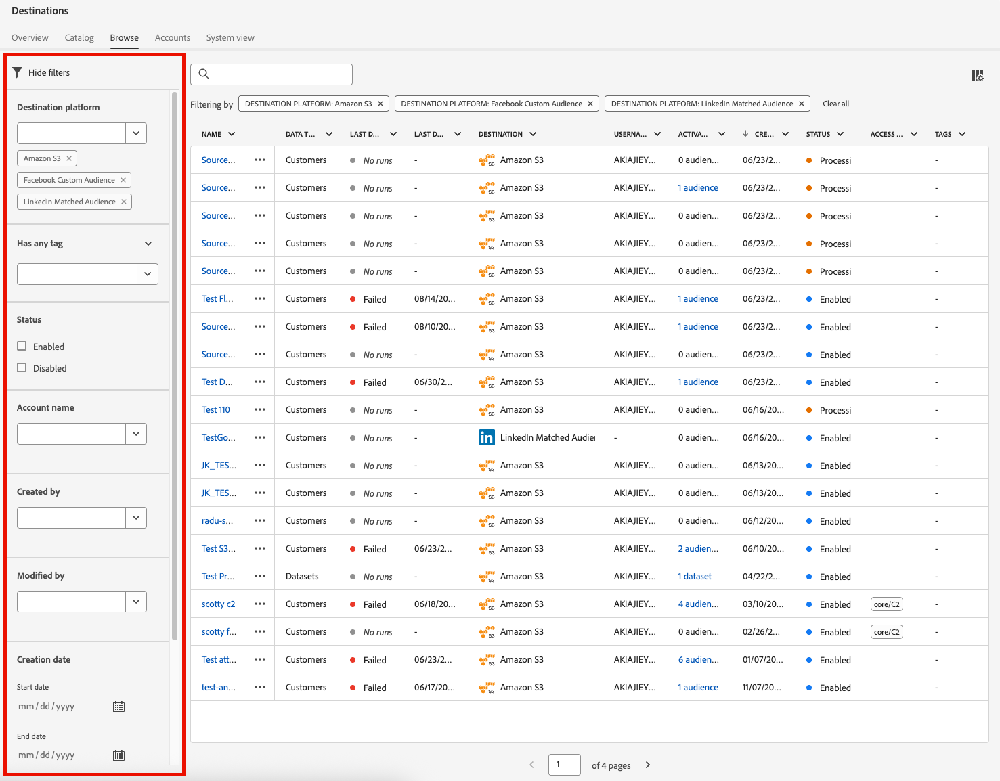
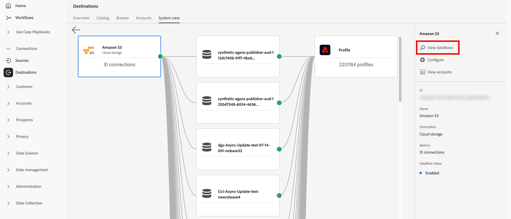

# 대상 작업 영역 {#destinations-workspace}

Adobe Experience Platform의 왼쪽 탐색 모음에서 **[!UICONTROL 대상]**&#x200B;을 선택하여 [!UICONTROL 대상] 작업 영역에 액세스합니다.

[!UICONTROL 대상] 작업 영역은 아래 섹션에 설명된 5개의 섹션, [!UICONTROL 개요], [!UICONTROL 카탈로그], [!UICONTROL 찾아보기], [!UICONTROL 계정] 및 [!UICONTROL 시스템 보기]로 구성됩니다.

## [!UICONTROL 개요] {#overview}

**[!UICONTROL 개요]** 탭에는 조직의 대상 데이터와 관련된 주요 지표를 제공하는 [!UICONTROL 대상] 대시보드가 표시됩니다. 자세한 내용은 [[!UICONTROL 대상] 대시보드 가이드](../../dashboards/guides/destinations.md)를 참조하세요.

>[!NOTE]
>
>조직이 Experience Platform을 처음 사용하고 아직 활성 대상이 없는 경우 [!UICONTROL 대상] 대시보드 및 [!UICONTROL 개요] 탭이 표시되지 않습니다. 대신 왼쪽 탐색에서 [!UICONTROL 대상]을 선택하면 [[!UICONTROL 카탈로그] 탭](#catalog)이 표시됩니다.

## [!UICONTROL 카탈로그] {#catalog}

**[!UICONTROL 카탈로그]** 탭에는 데이터를 보낼 수 있는 [!DNL Experience Platform]에서 사용 가능한 모든 대상 목록이 표시됩니다.

[!DNL Experience Platform] 사용자 인터페이스는 대상 카탈로그 페이지에서 여러 검색 및 필터 옵션을 제공합니다.

* 페이지의 검색 기능을 사용하여 특정 대상을 찾습니다.
* **[!UICONTROL Categories]** 컨트롤을 사용하여 대상을 필터링합니다.
* **[!UICONTROL 모든 대상]**&#x200B;과(와) **[!UICONTROL 내 대상]** 사이를 전환합니다. **[!UICONTROL 모든 대상]**&#x200B;을 선택하면 사용 가능한 모든 [!DNL Experience Platform] 대상이 표시됩니다. **[!UICONTROL 내 대상]**&#x200B;을 선택하면 연결을 설정한 대상만 표시됩니다.
* **[!UICONTROL 연결]** 및/또는 **[!UICONTROL 확장]** 유형을 보려면 선택하십시오. 두 범주의 차이점을 이해하려면 [대상 형식 및 범주](../destination-types.md)를 읽어 보세요.
* 지원되는 [데이터 형식](/help/destinations/destination-sdk/functionality/destination-configuration/audience-data-type.md)을(를) 기준으로 사용 가능한 대상을 필터링합니다. 사용자 대상, 계정 대상, 잠재 고객 대상 또는 데이터 세트 내보내기 중에서 선택합니다.

대상 카드에는 기본 및 보조 제어 옵션이 있습니다. 기본 컨트롤에는 [!UICONTROL 설정], [!UICONTROL 활성화], [!UICONTROL 대상 활성화] 또는 [!UICONTROL 데이터 세트 내보내기]가 포함됩니다. 보조 컨트롤을 사용하여 옵션을 볼 수 있습니다. 이러한 컨트롤은 아래에 설명되어 있습니다.

| 제어 | 설명 |
|---------|----------|
| [!UICONTROL 설정] | 대상에 대한 연결을 만들 수 있습니다. |
| [!UICONTROL 활성화] | 대상에 대한 연결이 설정되면 대상을 활성화하거나 데이터 세트를 이 대상으로 내보낼 수 있습니다. |
| [!UICONTROL 대상자 활성화] | 대상에 대한 연결이 설정되면 이 대상에 대한 대상을 활성화할 수 있습니다. |
| [!UICONTROL 데이터 세트 내보내기] | 대상에 대한 연결이 설정되면 데이터 세트를 이 대상으로 내보낼 수 있습니다. |
| [!UICONTROL 계정 보기] | 대상에 대해 연결한 계정을 봅니다. |
| [!UICONTROL 데이터 흐름 보기] | 대상에 대해 존재하는 데이터 활성화 플로우를 봅니다. |
| [!UICONTROL 설명서 보기] | 자세한 내용을 알고 설정하는 데 도움이 되도록 해당 특정 대상의 설명서 페이지에 대한 링크를 엽니다. |

{style="table-layout:auto"}

대상 카드의 

카탈로그에서 대상 카드를 선택하여 오른쪽 레일을 엽니다. 여기에서 대상에 대한 설명을 볼 수 있습니다. 오른쪽 레일은 대상 설명, 대상 범주 및 유형 표시를 포함하여 위 표에 설명된 것과 동일한 컨트롤을 제공합니다.

대상 범주 및 각 대상에 대한 자세한 내용은 [대상 카탈로그](../catalog/overview.md) 및 [대상 유형 및 범주](../destination-types.md)를 참조하십시오.

## [!UICONTROL 찾아보기] {#browse}

**[!UICONTROL 찾아보기]** 탭에는 연결을 설정한 대상이 표시됩니다.

>[!TIP]
>
> [검색 창](#search-browse)(으)로 시작하여 특정 데이터 흐름을 찾은 다음 [사이드바 필터](#filter-options-browse)를 사용하여 결과를 더 좁혀 보세요.

**[!UICONTROL 사용/사용 안 함]** 토글이 켜진 대상은 각각 **[!UICONTROL 사용]** 또는 **[!UICONTROL 사용 안 함]**(으)로 설정합니다. **[!UICONTROL 대상]** > **[!UICONTROL 찾아보기]**&#x200B;를 선택하고 검사할 대상을 선택하여 데이터가 흐르는 대상을 볼 수도 있습니다.

>[!TIP]
>
> 
> 
> * `...`이름[!UICONTROL  열에서 줄임표(])를 선택하고  **[!UICONTROL 대상 활성화]** 컨트롤을 사용하여 대상 또는 데이터 세트를 해당 대상으로 내보냅니다.
> * `...`이름[!UICONTROL  열에서 줄임표(])를 선택하고 **[!UICONTROL 대상 편집&#x200B;]**컨트롤을 사용하여 기존 대상 연결을 편집합니다. 자세한 내용은 [대상 편집](/help/destinations/ui/edit-destination.md)에 대한 자습서를 참조하십시오.
> * `...`이름[!UICONTROL  열에서 줄임표(])를 선택하고  **[!UICONTROL 마케팅 작업 편집]** 컨트롤을 [마케팅 작업 변경](/help/destinations/ui/edit-activation.md#edit-marketing-actions)(으)로 사용합니다.
> * `...`이름[!UICONTROL  열에서 줄임표(])를 선택하고  **[!UICONTROL 삭제]** 컨트롤을 사용하여 대상에 대한 기존 연결을 [제거](delete-destinations.md)합니다.
> * `...`이름[!UICONTROL  열에서 줄임표(])를 선택하고  **[!UICONTROL 모니터링에서 보기]** 제어를 사용하여 [모니터링 대시보드](/help/dataflows/ui/monitor-destinations.md#monitoring-destinations-dashboard)에서 이 대상에 대한 활성화 정보를 봅니다.
> * `...`이름[!UICONTROL  열에서 줄임표(])를 선택하고  **[!UICONTROL 경고 구독]** 컨트롤을 사용하여 대상 데이터 흐름 경고를 구독합니다. 경고를 구독하면 플로우 실행의 상태, 성공 또는 실패와 관련된 메시지를 받을 수 있습니다. 대상 데이터 흐름 경고에 대한 자세한 내용은 [컨텍스트 내 대상 경고 구독](alerts.md)을 참조하십시오.
> * `...`이름[!UICONTROL  열에서 줄임표(])를 선택하고  **[!UICONTROL 태그 관리]** 컨트롤을 사용하여 대상에 태그를 추가하거나 제거합니다. 태그 사용에 대한 자세한 내용은 [대상 태그 관리](#manage-tags) 섹션을 참조하십시오.

[!UICONTROL 찾아보기] 탭에서 각 대상에 대해 제공된 모든 정보를 보려면 아래 표를 참조하십시오.

| 요소 | 설명 |
|---------|----------|
| 이름 | 이 대상에 대한 활성화 흐름에 제공한 이름입니다. |
| 데이터 유형 | 대상 연결에서 지원하는 데이터 유형입니다. 지원되는 데이터 유형: <ul><li>**[!UICONTROL 고객]**</li><li>**[!UICONTROL 잠재 고객]**</li><li>**[!UICONTROL 계정]**</li><li>**[!UICONTROL 데이터 세트]**</li></ul> |
| [!UICONTROL 마지막 데이터 흐름 실행 상태] | 마지막 데이터 흐름 실행의 상태입니다. 데이터 흐름 실행에 대한 자세한 내용은 [대상 세부 정보 보기](destination-details-page.md)를 참조하십시오. |
| [!UICONTROL 마지막 데이터 흐름 실행 날짜] | 마지막 데이터 흐름 실행이 발생한 시간 및 날짜. 데이터 흐름 실행에 대한 자세한 내용은 [대상 세부 정보 보기](destination-details-page.md)를 참조하십시오. |
| [!UICONTROL 대상] | 활성화 흐름에 대해 선택한 대상 플랫폼입니다. |
| [!UICONTROL 계정 만료일] | 이 대상에 대한 연결 인증이 만료되는 날짜입니다.  **중요**: 이 열은 현재 [Facebook](../catalog/social/facebook.md) 연결에만 사용할 수 있습니다. |
| [!UICONTROL 사용자 이름] | 대상 흐름에 대해 선택한 계정 자격 증명입니다. |
| [!UICONTROL 활성화 데이터] | 이 대상에 대해 활성화 중인 대상 수를 나타냅니다. 활성화된 대상자에 대한 자세한 내용을 확인하려면 이 컨트롤을 선택하십시오. 활성화된 대상에 대한 자세한 내용은 대상 세부 정보 페이지의 [활성화 데이터](/help/destinations/ui/destination-details-page.md#activation-data)를 참조하십시오. |
| [!UICONTROL 생성일] | 대상으로의 활성화 흐름이 생성된 날짜와 UTC 시간. 활성화 흐름을 가장 최근 첫 번째 또는 가장 오래된 순으로 정렬하려면 위쪽/아래쪽 화살표 기호를 선택합니다. |
| [!UICONTROL 상태] | `Enabled` 또는 `Disabled`. 이 대상에 대해 데이터가 활성화되는지 여부를 나타냅니다. |
| [!UICONTROL 액세스 레이블] | 이 대상 데이터 흐름에 추가된 모든 액세스 레이블을 표시합니다. [대상 데이터 흐름에 액세스 레이블을 적용](/help/access-control/abac/apply-access-labels-destinations.md)하는 방법에 대해 자세히 알아보세요. |
| [!UICONTROL 태그] | 이 대상 데이터 흐름에 추가된 모든 태그를 표시합니다. 태그를 사용하여 데이터 흐름을 구성하고 분류하여 보다 쉽게 관리할 수 있습니다. |

대상 ID, 설명, 활성화된 대상 수 등과 같은 대상 정보를 오른쪽 레일에 표시하려면 대상 행을 클릭합니다.

대상 이름을 선택하여 이 대상에 활성화된 대상에 대한 정보를 확인합니다. 데이터 흐름에 새 대상을 추가하려면 **[!UICONTROL 대상 편집]**&#x200B;을 클릭하여 [대상 설정을 수정](/help/destinations/ui/edit-destination.md)하거나 **[!UICONTROL 대상 활성화]**&#x200B;를 클릭하십시오.

### 찾아보기 탭에서 데이터 흐름 필터링 {#filter-browse}

**[!UICONTROL 찾아보기]** 탭에는 대상 데이터 흐름을 빠르게 찾고 관리하는 데 도움이 되는 향상된 필터링 및 검색 기능이 포함되어 있습니다. 왼쪽 사이드바를 사용하여 필터를 적용하고 검색 막대를 사용하여 이름별로 특정 데이터 흐름을 찾습니다.

### 검색 기능 {#search-browse}

이름별 데이터 흐름을 빠르게 찾으려면 표 상단의 검색 막대를 사용합니다. 입력하면 결과가 일치하는 데이터 흐름만 표시하도록 자동으로 필터링됩니다.

>[!NOTE]
>
> 검색 상자를 사용하여 데이터 흐름을 검색할 때 [사용자 액세스 레이블](/help/access-control/abac/apply-access-labels-destinations.md)에서 볼 수 없도록 제한하는 데이터 흐름이 결과에 포함될 수 있습니다. 이 동작은 향후 업데이트에서 수정될 예정입니다. 이러한 데이터 흐름을 선택하면 올바른 레일에 정보가 표시되지 않으며 필수 레이블에 대한 액세스 권한이 없는 사용자는 데이터 흐름에 대상을 매핑하거나 일정을 편집하는 등의 수정 작업을 수행할 수 없습니다.

### 필터 옵션 {#filter-options-browse}

왼쪽 사이드바의 필터를 사용하여 검색 범위를 좁힙니다.

* **[!UICONTROL 대상 플랫폼]**: 특정 대상 플랫폼(예: [!DNL Amazon S3], [!DNL Facebook Custom Audience], [!DNL LinkedIn Matched Audience] 등)별로 데이터 흐름을 필터링합니다. 여러 플랫폼을 동시에 선택할 수 있습니다.
* **[!UICONTROL 태그가 있습니다]**: 특정 태그가 지정된 데이터 흐름을 필터링합니다. 이렇게 하면 사용자 지정 태그 지정에 따라 데이터 흐름을 구성하고 찾는 데 도움이 됩니다.
* **[!UICONTROL 상태]**: 작동 상태별로 데이터 흐름을 필터링합니다.
   * **[!UICONTROL 사용]**: 활성 데이터 흐름만 표시합니다.
   * **[!UICONTROL 사용 안 함]**: 비활성 데이터 흐름만 표시합니다.
* **[!UICONTROL 계정 이름]**: 연결된 계정 이름으로 데이터 흐름을 필터링합니다. 이렇게 하면 특정 대상 계정에 연결된 모든 데이터 흐름을 찾을 수 있습니다.
* **[!UICONTROL 생성됨]**: 데이터 흐름을 만든 사용자별로 데이터 흐름을 필터링합니다. 이 필터를 사용하여 특정 팀 멤버가 만든 데이터 흐름을 찾을 수 있습니다.
* **[!UICONTROL 수정자]**: 데이터 흐름을 마지막으로 수정한 사용자별로 필터링합니다. 이 필터를 사용하여 특정 사용자가 수행한 최근 변경 사항을 식별합니다.
* **[!UICONTROL 만든 날짜]**: 날짜 범위를 사용하여 만든 날짜별로 데이터 흐름을 필터링합니다.
   * **[!UICONTROL 시작 날짜]**: 날짜 범위의 시작 날짜를 설정합니다.
   * **[!UICONTROL 종료 날짜]**: 날짜 범위의 끝을 설정합니다.
* **[!UICONTROL 수정한 날짜]**: 날짜 범위를 사용하여 수정 날짜별로 데이터 흐름을 필터링합니다.
   * **[!UICONTROL 시작 날짜]**: 날짜 범위의 시작 날짜를 설정합니다.
   * **[!UICONTROL 종료 날짜]**: 날짜 범위의 끝을 설정합니다.

### 활성 필터 {#active-filters-browse}

필터를 적용하면 검색 창 아래에 태그로 표시됩니다.

여기에서 다음을 수행할 수 있습니다.

* 현재 활성화된 모든 필터 보기
* 각 필터 태그의 `X` 아이콘을 클릭하여 개별 필터 제거
* **[!UICONTROL 모두 지우기]** 옵션을 사용하여 한 번에 모든 필터 지우기

### 대상 태그 관리 {#manage-tags}

태그를 사용하면 쉽게 관리할 수 있도록 대상 데이터 흐름을 구성하고 분류할 수 있습니다. 개별 데이터 흐름에서 태그를 추가 및 제거하여 비즈니스 요구 사항에 따라 그룹화할 수 있습니다.

데이터 흐름에 태그를 추가하려면 `...`이름&#x200B;**[!UICONTROL 열에서 줄임표(]**)를 선택하고 컨텍스트 메뉴에서 **[!UICONTROL 태그 관리]**를 선택합니다.
**[!UICONTROL 태그]** 필드에 새 태그 이름을 입력하고 **[!UICONTROL 저장]**&#x200B;을 선택하여 변경 내용을 적용합니다.

데이터 흐름에서 태그를 제거하려면 `...`이름&#x200B;**[!UICONTROL 열에서 줄임표(]**)를 선택하고 컨텍스트 메뉴에서 **[!UICONTROL 태그 관리]**&#x200B;를 선택한 다음 제거할 태그에서 `X` 아이콘을 선택합니다.

### 태그 지정 우수 사례 {#tag-best-practices}

아래 태그 지정 지침에 따라 대상 데이터 흐름이 정리되고, 쉽게 찾고, 관리할 수 있도록 하십시오.

* **설명 이름 사용**: 데이터 흐름의 목적 또는 범주를 명확하게 나타내는 태그를 만듭니다(예: &quot;마케팅 캠페인&quot;, &quot;고객 유지&quot;, &quot;시즌 프로모션&quot;).
* **일관성 유지**: 조직 전체에서 일관된 명명 규칙을 사용합니다.
* **단순하게 유지**: 너무 많은 태그를 만들지 마십시오. 이렇게 하면 필터링의 효과가 떨어질 수 있습니다
* **계층적 태그 사용**: 접두사를 사용하여 관련 태그를 그룹화하는 것이 좋습니다(예: &quot;Campaign-Q4&quot;, &quot;Campaign-Q1&quot;).

## [!UICONTROL 계정] {#accounts}

**[!UICONTROL 계정]** 탭에는 다양한 대상으로 설정한 연결에 대한 세부 정보가 표시되며, 이를 통해 기존 계정 세부 정보를 업데이트하거나 삭제할 수 있습니다. 각 대상 계정에서 확인할 수 있는 모든 정보는 아래 표를 참조하십시오.

>[!TIP]
>
> * `...`Platform[!UICONTROL  열에서 줄임표(])를 선택하고 **[!UICONTROL 활성화&#x200B;]**/**[!UICONTROL &#x200B;대상 활성화&#x200B;]**/**[!UICONTROL &#x200B;데이터 세트 내보내기&#x200B;]**컨트롤을 사용하여 대상 또는 데이터 세트를 해당 대상으로 내보냅니다.
> * `...`플랫폼[!UICONTROL  열에서 줄임표(])를 선택하고 **[!UICONTROL 세부 정보 편집&#x200B;]**컨트롤을 사용하여 기존 대상 계정의 세부 정보를 [업데이트](update-accounts.md)합니다.
> * `...`Platform[!UICONTROL  열에서 줄임표(])를 선택하고 **[!UICONTROL Delete ]**컨트롤을 사용하여 기존 대상 계정을 [삭제](delete-destination-account.md)합니다.

| 요소 | 설명 |
|---|---|
| [!UICONTROL 이름] | 대상을 [설정](connect-destination.md#authenticate)하는 동안 대상 계정에 할당한 이름입니다. |
| [!UICONTROL 대상] | 연결을 설정한 대상 커넥터입니다. |
| [!UICONTROL 연결 유형] | 저장소 버킷 또는 대상에 대한 계정 연결 유형을 나타냅니다. 대상에 따라 인증 옵션은 다음과 같습니다. <ul><li>이메일 마케팅 대상의 경우: S3, FTP 또는 Azure Blob일 수 있습니다.</li><li>실시간 광고 대상: 서버 간</li><li>Amazon S3 클라우드 스토리지 대상의 경우: 액세스 키 </li><li>SFTP 클라우드 스토리지 대상의 경우: SFTP에 대한 기본 인증</li><li>OAuth 1 또는 OAuth 2 인증</li><li>전달자 토큰 인증</li></ul> |
| [!UICONTROL 사용자 이름] | [대상 연결 워크플로](../catalog/email-marketing/overview.md#connect-destination)에서 선택한 사용자 이름입니다. |
| [!UICONTROL 연결] | 대상에 대해 만들어진 기본 정보와 연결된 성공한 고유 대상 데이터 흐름 수를 나타냅니다. |
| [!UICONTROL 인증 날짜] | 이 대상에 대한 연결이 승인된 날짜입니다. |
| [!UICONTROL 만료 날짜] | 이 대상에 대한 연결 인증이 만료되는 날짜입니다.  **중요**: 이 열은 현재 [Facebook](../catalog/social/facebook.md) 연결에만 사용할 수 있습니다. |

{style="table-layout:auto"}

### 계정 필터링 {#filter-accounts}

**[!UICONTROL 계정]** 탭에는 대상 계정을 빠르게 찾고 관리하는 데 도움이 되는 향상된 필터링 및 검색 기능이 포함되어 있습니다. 왼쪽 사이드바를 사용하여 필터를 적용하고 검색 막대를 사용하여 이름별로 특정 계정을 찾습니다.

#### 계정 검색 {#search-accounts}

이름별로 계정을 빠르게 찾으려면 표 상단의 검색 창을 사용하십시오. 입력하면 일치하는 계정만 표시하도록 결과가 자동으로 필터링됩니다.

#### 필터 옵션 {#filter-options-accounts}

왼쪽 사이드바의 필터를 사용하여 검색 범위를 좁힙니다.

* **[!UICONTROL 대상 플랫폼]**: 특정 대상 플랫폼별로 계정을 필터링합니다(예: [!DNL Microsoft Bing], [!DNL Amazon S3], [!DNL Facebook Custom Audiences], [!DNL LinkedIn Matched Audiences]). 여러 플랫폼을 동시에 선택할 수 있습니다.
* **[!UICONTROL 만든 사람]**: 계정을 만든 사용자별로 계정을 필터링합니다. 이 필터를 사용하여 특정 팀원이 생성한 계정을 찾습니다.

#### 활성 필터 {#active-filters-accounts}

필터를 적용하면 검색 창 아래에 태그로 표시됩니다.

여기에서 다음을 수행할 수 있습니다.

* 현재 활성화된 모든 필터 보기
* 각 필터 태그의 `X` 아이콘을 클릭하여 개별 필터 제거
* **[!UICONTROL 모두 지우기]** 옵션을 사용하여 한 번에 모든 필터 지우기

## [!UICONTROL 시스템 보기] {#system-view}

**[!UICONTROL 시스템 보기]** 탭에는 Adobe Experience Platform에서 설정한 활성화 흐름이 그래픽으로 표시됩니다.

페이지에 표시된 대상을 선택하고 **[!UICONTROL 데이터 흐름 보기]**&#x200B;를 클릭하여 각 대상에 대해 설정한 모든 연결에 대한 정보를 확인합니다.

