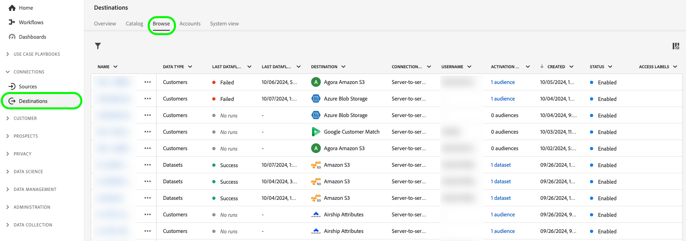

# 활성화 데이터 흐름 편집 {#edit-activation-flows}

Adobe Experience Platform에서 다음과 같이 대상에 대한 기존 활성화 데이터 흐름의 다양한 구성 요소를 구성할 수 있습니다.

* [활성화 데이터 흐름을 활성화 또는 비활성화](#enable-disable-dataflows)합니다.
* 활성화 데이터 흐름에 [추가 대상 추가](#add-audiences)
* [매핑된 속성 및 ID 편집](#edit-mapped-attributes)
* [활성화 일정 및 내보내기 빈도 편집](#edit-schedule-frequency)
* 활성화 워크플로에 [추가 데이터 세트 추가](#add-datasets)
* 활성화 데이터 흐름의 [이름 및 설명 편집](#edit-names-descriptions)

<!-- * [Apply access labels](#apply-access-labels) to exported data; -->

## 활성화 데이터 흐름 찾아보기 {#browse-activation-dataflows}

기존 활성화 데이터 흐름을 검색하고 편집할 데이터 흐름을 식별하려면 아래 단계를 따르십시오.

1. [Experience Platform UI](https://platform.adobe.com/)에 로그인하고 왼쪽 탐색 모음에서 **[!UICONTROL 대상]**&#x200B;을 선택합니다. 기존 대상 데이터 흐름을 보려면 상단 헤더에서 **[!UICONTROL 찾아보기]**&#x200B;를 선택하십시오.

   

2. 왼쪽 상단의 필터 아이콘 을(를) 선택하여 정렬 패널을 시작합니다. 정렬 패널에서는 모든 대상의 목록을 제공합니다. 목록에서 두 개 이상의 대상을 선택하여 선택한 대상과 연관된 데이터 흐름의 필터링된 선택을 확인할 수 있습니다.

   

3. 편집할 대상 데이터 흐름의 이름을 선택합니다.

   

4. 대상에 대한 **[!UICONTROL 데이터 흐름 실행]** 페이지가 나타나고 사용 가능한 컨트롤이 표시됩니다. 대상 유형에 따라 다양한 데이터 흐름 작업을 수행할 수 있습니다. 지원되는 각 데이터 흐름 작업에 대해 다음 섹션을 참조하십시오.

## 활성화 데이터 흐름 활성화 또는 비활성화 {#enable-disable-dataflows}

**[!UICONTROL 사용]/[!UICONTROL 사용 안 함]** 전환을 사용하여 대상으로 모든 데이터 내보내기를 시작하거나 일시 중지합니다.

## 활성화 데이터 흐름에 대상 추가 {#add-audiences}

대상으로 보낼 대상을 변경하려면 오른쪽 레일에서 **[!UICONTROL 대상 활성화]**&#x200B;를 선택하십시오. 이 작업은 활성화 워크플로우로 이동합니다.

활성화 워크플로의 **[!UICONTROL 대상자 선택]** 단계에서 기존 대상자를 제거하거나 새 대상자를 활성화 워크플로에 추가할 수 있습니다.

활성화 워크플로우는 대상 유형에 따라 약간 다릅니다. 각 대상 유형의 활성화 워크플로에 대한 자세한 내용은 다음 안내서를 참조하십시오.

* [스트리밍 대상에 대상 활성화](./activate-segment-streaming-destinations.md)(예: Facebook 또는 Twitter);
* [프로필 내보내기 대상을 일괄 활성화하려면 대상을 활성화하십시오](./activate-batch-profile-destinations.md)(예: Amazon S3 또는 Oracle Eloqua);
* [스트리밍 프로필 내보내기 대상에 대상 활성화](./activate-streaming-profile-destinations.md)(예: HTTP API 또는 Amazon Kinesis).

## 활성화 일정 및 내보내기 빈도 편집 {#edit-schedule-frequency}

오른쪽 레일에서 **[!UICONTROL 대상자 활성화]**&#x200B;를 선택합니다. 이 작업은 활성화 워크플로우로 이동합니다.

활성화 워크플로에서 **[!UICONTROL 예약]** 단계를 선택하여 데이터 흐름의 활성화 일정 및 내보내기 빈도를 편집합니다. 이 단계에서는 데이터를 대상으로 내보내는 빈도를 구성할 수 있습니다.

활성화 워크플로의 **[!UICONTROL 예약]** 단계에서 다음을 수행할 수 있습니다.
* 내보내기 빈도를 조정합니다.
* 활성화 데이터 흐름의 시작 및 종료 날짜 등을 설정하거나 수정합니다.

수행할 수 있는 예약 작업은 대상 유형에 따라 약간 달라집니다. 각 대상 유형의 활성화 워크플로에 대한 자세한 내용은 다음 안내서를 참조하십시오.

* [스트리밍 대상에 대상 활성화](./activate-segment-streaming-destinations.md)(예: Facebook 또는 Twitter);
* [프로필 내보내기 대상을 일괄 활성화하려면 대상을 활성화하십시오](./activate-batch-profile-destinations.md)(예: Amazon S3 또는 Oracle Eloqua);
* [스트리밍 프로필 내보내기 대상에 대상 활성화](./activate-streaming-profile-destinations.md)(예: HTTP API 또는 Amazon Kinesis).

## 매핑된 속성 및 ID 편집 {#edit-mapped-attributes}

오른쪽 레일에서 **[!UICONTROL 대상자 활성화]**&#x200B;를 선택합니다. 이 작업은 활성화 워크플로우로 이동합니다.

활성화 워크플로에서 **[!UICONTROL 매핑]** 단계를 선택하여 활성화 데이터 흐름의 매핑된 특성 및 ID를 편집합니다. 이를 통해 대상으로 내보낼 프로필 속성 및 ID를 조정할 수 있습니다.

활성화 워크플로의 **[!UICONTROL 매핑]** 단계에서 다음을 수행할 수 있습니다.

* 새 속성 또는 ID를 매핑에 추가합니다.
* 매핑에서 기존 속성 또는 ID를 제거합니다.
* 매핑 순서를 조정하여 내보낸 파일의 열 순서를 정의합니다.

활성화 워크플로우는 대상 유형에 따라 약간 다릅니다. 각 대상 유형의 활성화 워크플로에 대한 자세한 내용은 다음 안내서를 참조하십시오.

* [스트리밍 대상에 대상 활성화](./activate-segment-streaming-destinations.md)(예: Facebook 또는 Twitter);
* [프로필 내보내기 대상을 일괄 활성화하려면 대상을 활성화하십시오](./activate-batch-profile-destinations.md)(예: Amazon S3 또는 Oracle Eloqua);
* [스트리밍 프로필 내보내기 대상에 대상 활성화](./activate-streaming-profile-destinations.md)(예: HTTP API 또는 Amazon Kinesis).

## 활성화 데이터 흐름에 데이터 세트 추가 {#add-datasets}

대상으로 내보낼 추가 데이터 세트를 선택하려면 오른쪽 레일에서 **[!UICONTROL 데이터 세트 내보내기]**&#x200B;를 선택하십시오. 이 옵션을 사용하면 [데이터 집합 내보내기 워크플로](export-datasets.md)로 이동합니다.

>[!NOTE]
>
>이 옵션은 데이터 집합 내보내기를 지원하는 [대상](export-datasets.md#supported-destinations)에만 표시됩니다.

<!-- ## Apply access labels {#apply-access-labels}

Select **[!UICONTROL Apply access labels]** to edit the data usage labels for the exported data. See the [data usage labels documentation](../../data-governance/labels/overview.md) to learn more.

 -->

## 활성화 데이터 흐름 이름 및 설명 편집 {#edit-names-descriptions}

활성화 데이터 흐름 이름 및 설명을 편집하려면 **[!UICONTROL 대상 이름]** 및 **[!UICONTROL 설명]** 필드를 사용하십시오.

## 다음 단계 {#next-steps}

이 자습서에 따라 **[!UICONTROL 대상]** 작업 영역을 사용하여 기존 대상 데이터 흐름을 업데이트했습니다.

대상에 대한 자세한 내용은 [대상 개요](../catalog/overview.md)를 참조하세요.
