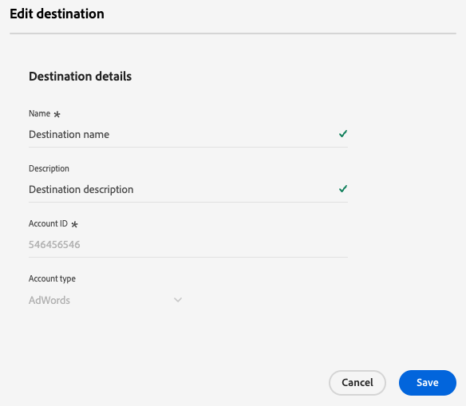

# 대상 편집

Experience Platform UI를 사용하여 인증 자격 증명을 업데이트하는 방법, 내보내기 위치 등을 포함하여 기존 대상 연결의 다양한 구성 요소를 편집하는 방법에 대해 알아봅니다.

>[!NOTE]
>
> 이 자습서에 설명된 편집 작업은 API 작업을 통해서도 지원됩니다. 자세한 내용은 API에서 대상을 [편집](/help/destinations/api/edit-destination.md)하는 방법에 대한 자습서를 참조하십시오.

## 전제 조건 {#prerequisites}

대상 연결을 편집하려면 **[!UICONTROL Manage Destinations]** [액세스 제어 권한](/help/access-control/home.md#permissions)이 필요합니다. [액세스 제어 개요](/help/access-control/ui/overview.md)를 읽거나 제품 관리자에게 문의하여 필요한 권한을 받으십시오.

## 대상 연결 편집 {#edit}

기존 대상 연결의 다양한 구성 요소를 편집하려면 다음을 수행하십시오.

1. **[!UICONTROL Destinations]** > **[!UICONTROL Browse]**(으)로 이동합니다.
2. 편집할 대상을 선택합니다.
3. `...` 열에서 줄임표([!UICONTROL Name])를 선택하고 **[!UICONTROL Edit destination]**컨트롤을 사용하여 기존 대상 연결을 편집합니다.
4. 모달 창에서 원하는 설정을 편집합니다. 완료되면 **[!UICONTROL Save]**&#x200B;을(를) 선택하십시오.

대상 편집 창에서 대상에 처음 연결할 때 구성한 모든 설정을 업데이트할 수 있습니다. 이러한 설정은 업데이트하려는 대상 플랫폼에 따라 다릅니다.

대상이 구성된 방식에 따라 일부 필드는 읽기 전용이므로 편집할 수 없습니다. 읽기 전용 필드의 값을 변경하려면 새 필드 값으로 [새 대상 연결을 만들어야](../ui/connect-destination.md) 합니다.

다음은 [Amazon S3](../catalog/cloud-storage/amazon-s3.md), [Azure Event Hubs](../catalog/cloud-storage/azure-event-hubs.md) 및 [Google Ads](../catalog/advertising/google-ads-destination.md) 대상에 대해 업데이트할 수 있는 설정의 예입니다.

  
  
  

>[!SUCCESS]
>
>이제 대상 연결 설정이 업데이트되었습니다.

## 기타 편집 옵션

Experience Platform UI 또는 플로우 서비스 API를 사용하여 아래 링크에 자세히 설명된 대로 다양한 대상 구성을 편집할 수 있습니다.

| Experience Platform UI 사용 | 흐름 서비스 API 사용 |
|---------|----------|
| 대상 연결 편집(이 페이지) | [대상 연결 구성 요소(저장소 위치 및 기타 구성 요소) 편집](/help/destinations/api/edit-destination.md#patch-target-connection) |
| [계정 편집](/help/destinations/ui/update-accounts.md) | [기본 연결 구성 요소(인증 매개 변수 및 기타 구성 요소) 편집](/help/destinations/api/edit-destination.md#patch-base-connection) |
| [활성화 데이터 흐름 편집](/help/destinations/ui/edit-activation.md) | [대상 데이터 흐름 업데이트](/help/destinations/api/update-destination-dataflows.md) |

## 다음 단계

이 자습서에 따라 **[!UICONTROL destinations]** 작업 영역을 사용하여 기존 대상 연결을 업데이트했습니다.

대상에 대한 자세한 내용은 [대상 개요](../catalog/overview.md)를 참조하세요.
