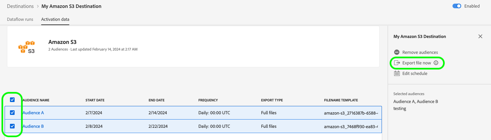

# Experience Platform UI를 사용하여 주문형 파일을 배치 대상으로 내보내기

>[!IMPORTANT]
> 
>데이터를 활성화하려면 **[!UICONTROL View Destinations]**, **[!UICONTROL Activate Destinations]**, **[!UICONTROL View Profiles]** 및 **[!UICONTROL View Segments]** [액세스 제어 권한](/help/access-control/home.md#permissions)이 필요합니다. [액세스 제어 개요](/help/access-control/ui/overview.md)를 읽거나 제품 관리자에게 문의하여 필요한 권한을 받으십시오.

## **[!UICONTROL Export file now]** 개요 {#overview}

>[!CONTEXTUALHELP]
>id="platform_destinations_activationchaining_activatenow"
>title="지금 파일 내보내기"
>abstract="이 컨트롤을 선택하여 이전에 예약된 내보내기와 전체 파일 내보내기를 게재합니다. 파일 내보내기가 즉시 트리거되어 Experience Platform 세분화 실행에서 최신 결과를 선택합니다."

이 문서에서는 Experience Platform UI를 사용하여 주문형 파일을 [클라우드 저장소](/help/destinations/catalog/cloud-storage/overview.md) 및 [이메일 마케팅](/help/destinations/catalog/email-marketing/overview.md) 대상과 같은 배치 대상으로 내보내는 방법에 대해 설명합니다.

**[!UICONTROL Export file now]** 컨트롤을 사용하면 이전에 예약된 대상자의 현재 내보내기 일정을 중단하지 않고 전체 파일을 내보낼 수 있습니다. 이 내보내기는 이전에 예약한 내보내기 외에 추가로 수행되며 대상자의 내보내기 빈도는 변경되지 않습니다. 파일 내보내기가 즉시 트리거되어 Experience Platform 세분화 실행에서 최신 결과를 선택합니다.

이러한 목적으로 Experience Platform API를 사용할 수도 있습니다. 임시 활성화 API를 통해 [주문형 대상을 일괄 대상으로 활성화](/help/destinations/api/ad-hoc-activation-api.md)하는 방법을 읽어 보십시오.

## 전제 조건 {#prerequisites}

주문형 파일을 일괄 처리 대상으로 내보내려면 대상에 성공적으로 [연결](./connect-destination.md)해야 합니다. 아직 수행하지 않았다면 [대상 카탈로그](../catalog/overview.md)(으)로 이동하여 지원되는 대상을 탐색하고 사용할 대상을 구성합니다.

## 온디맨드로 파일을 내보내는 방법 {#how-to-export-files-on-demand}

1. **[!UICONTROL Connections > Destinations]**(으)로 이동하여 **[!UICONTROL Browse]** 탭과 필터 기호를 선택하여 원하는 배치 대상에 대한 기존 연결을 표시합니다.

   

2. 원하는 대상 연결을 선택하여 대상에 대한 기존 데이터 흐름을 검사합니다.

   

3. **[!UICONTROL Activation data]** 탭을 선택하고 파일을 온디맨드로 내보낼 대상을 선택한 다음 **[!UICONTROL Export file now]** 컨트롤을 선택하여 선택한 각 대상에 대한 파일을 배치 대상으로 전달하는 일회성 내보내기를 트리거합니다.

   

4. **[!UICONTROL Yes]**&#x200B;을(를) 선택하여 파일 내보내기를 확인하고 트리거합니다.

   

5. 파일 내보내기가 시작되었음을 알리는 확인 메시지가 나타납니다.

   

6. **[!UICONTROL Dataflow runs]** 탭으로 전환하여 파일 내보내기가 시작되었는지 확인할 수도 있습니다.

## 고려 사항 {#considerations}

**[!UICONTROL Export file now]** 컨트롤을 사용할 때는 다음 사항을 고려해야 합니다.

* **[!UICONTROL Export file now]**&#x200B;은(는) 배치 활성화 데이터 흐름의 일정이 현재 날짜와 겹치는 대상자에 대해서만 작동합니다. 여기에는 종료 날짜가 없거나(내보내기 빈도: **[!UICONTROL Once]**) 종료 날짜가 아직 지나지 않은 예약의 대상이 포함됩니다.
* 기존 데이터 흐름에 대상을 추가하는 경우 **컨트롤을 사용하기 전에 최소** 1시간&#x200B;**[!UICONTROL Export file now]**&#x200B;을(를) 기다리십시오.
* 대상자의 병합 정책을 변경하거나 새 병합 정책을 사용하는 대상자를 만드는 경우 **[!UICONTROL Export file now]** 컨트롤을 사용할 때까지 24시간 대기합니다.
* **[!UICONTROL Export file now]**&#x200B;은(는) 예약된 스냅숏 내보내기의 데이터만 사용합니다. API에서 트리거된 내보내기 작업에서는 데이터를 가져오지 않습니다. API에서 트리거된 내보내기 작업 후 최신 데이터를 내보내려면 다음에 예약된 내보내기가 실행될 때까지 기다리십시오.

## UI 오류 메시지 {#ui-error-messages}

**[!UICONTROL Export file now]** 컨트롤을 사용하는 경우 아래 나열된 오류 메시지가 표시될 수 있습니다. 표가 표시될 때 이를 처리하는 방법을 이해하려면 표를 검토하십시오.

| 오류 메시지 | 해결 방법 |
|---------|----------|
| 실행 ID가 `segment ID`인 주문 `dataflow ID`의 대상 `flow run ID`에 대해 이미 실행 중입니다. | 이 오류 메시지는 대상에 대해 현재 임시 활성화 흐름이 진행 중임을 나타냅니다. 활성화 작업을 다시 트리거하기 전에 작업이 완료될 때까지 기다립니다. |
| 대상 `<segment name>`이(가) 이 데이터 흐름의 일부가 아니거나 일정 범위를 벗어났습니다. | 이 오류 메시지는 활성화하기 위해 선택한 대상이 데이터 흐름에 매핑되지 않았거나 대상에 대해 설정된 활성화 일정이 만료되었거나 아직 시작되지 않았음을 나타냅니다. 대상이 데이터 흐름에 실제로 매핑되었는지 확인하고 대상 활성화 일정이 현재 날짜와 겹치는지 확인합니다. |

## 관련 정보 {#related-information}

* [Experience Platform API를 사용하여 대상을 온디맨드로 일괄 처리할 수 있도록 활성화](/help/destinations/api/ad-hoc-activation-api.md)
* [대상자 데이터를 활성화하여 프로필 내보내기 대상 일괄 처리](/help/destinations/ui/activate-batch-profile-destinations.md)
