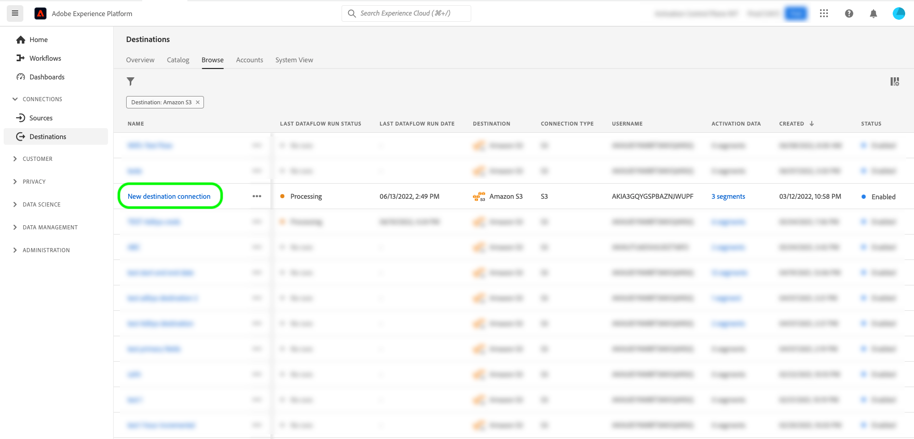

# (베타) Experience Platform UI를 사용하여 주문형 파일을 배치 대상으로 내보내기

>[!IMPORTANT]
>
>다음 **[!UICONTROL 지금 파일 내보내기]** Adobe Experience Platform의 옵션은 현재 베타 버전입니다. 설명서 및 기능은 변경될 수 있습니다.
>이 기능에 액세스하려면 Adobe 담당자에게 문의하십시오.

>[!IMPORTANT]
> 
>데이터를 활성화하려면 **[!UICONTROL 대상 관리]**, **[!UICONTROL 대상 활성화]**, **[!UICONTROL 프로필 보기]**, 및 **[!UICONTROL 세그먼트 보기]** [액세스 제어 권한](/help/access-control/home.md#permissions). 읽기 [액세스 제어 개요](/help/access-control/ui/overview.md) 필요한 권한을 얻으려면 제품 관리자에게 문의하십시오.

## **[!UICONTROL 지금 파일 내보내기]** 개요 {#overview}

>[!CONTEXTUALHELP]
>id="platform_destinations_activationchaining_activatenow"
>title="지금 파일 내보내기"
>abstract="이전에 예약된 내보내기 외에 전체 파일 내보내기를 전달하려면 이 컨트롤을 선택합니다. 파일 내보내기가 즉시 트리거되고 Experience Platform 세그멘테이션 실행에서 최신 결과가 선택됩니다."

이 문서에서는 Experience Platform UI를 사용하여 주문형 파일을 다음과 같은 배치 대상으로 내보내는 방법에 대해 설명합니다. [클라우드 스토리지](/help/destinations/catalog/cloud-storage/overview.md) 및 [이메일 마케팅](/help/destinations/catalog/email-marketing/overview.md) 대상.

다음 **[!UICONTROL 지금 파일 내보내기]** 컨트롤을 사용하면 이전에 예약된 세그먼트의 현재 내보내기 일정을 중단하지 않고 전체 파일을 내보낼 수 있습니다. 이 내보내기는 이전에 예약한 내보내기 외에 추가로 수행되며 세그먼트의 내보내기 빈도는 변경되지 않습니다. 파일 내보내기가 즉시 트리거되고 Experience Platform 세그멘테이션 실행에서 최신 결과가 선택됩니다.

이 용도로 Experience Platform API를 사용할 수도 있습니다. 방법 읽기 [애드혹 활성화 API를 통해 대상 세그먼트를 배치 대상으로 온디맨드 활성화](/help/destinations/api/ad-hoc-activation-api.md).

## 전제 조건 {#prerequisites}

주문형 파일을 배치 대상으로 내보내려면 성공적으로 작업을 완료해야 합니다. [대상에 연결됨](./connect-destination.md). 아직 수행하지 않았다면 [대상 카탈로그](../catalog/overview.md)에서 지원되는 대상을 탐색하고 사용할 대상을 구성합니다.

## 온디맨드로 파일을 내보내는 방법 {#how-to-export-files-on-demand}

1. 다음으로 이동 **[!UICONTROL 연결 > 대상]**&#x200B;를 선택하고 **[!UICONTROL 찾아보기]** 탭과 필터 기호를 사용하여 원하는 배치 대상에 대한 기존 연결을 표시할 수 있습니다.

   

2. 원하는 대상 연결을 선택하여 대상에 대한 기존 데이터 흐름을 검사합니다.

   

3. 다음 항목 선택 **[!UICONTROL 활성화 데이터]** 탭을 클릭하고 파일을 온디맨드로 내보낼 세그먼트를 선택한 다음 **[!UICONTROL 지금 파일 내보내기]** 파일을 배치 대상에 전달하는 일회성 내보내기를 트리거하도록 제어합니다.

   >[!IMPORTANT]
   >
   >파일을 온디맨드로 대량으로 내보내도록 여러 세그먼트를 선택하는 것은 현재 UI에서 지원되지 않습니다. 사용 [임시 활성화 API](/help/destinations/api/ad-hoc-activation-api.md) 그 목적을 위해.

   

4. 선택 **[!UICONTROL 예]** 을 클릭하여 파일 내보내기를 확인하고 트리거합니다.

   

5. 파일 내보내기가 시작되었음을 알리는 확인 메시지가 나타납니다.

   

6. 로 전환할 수도 있습니다. **[!UICONTROL 데이터 흐름 실행]** 를 탭하여 파일 내보내기가 시작되었는지 확인합니다.

## 고려 사항 {#considerations}

를 사용할 때는 다음 사항을 고려해야 합니다. **[!UICONTROL 지금 파일 내보내기]** 제어:

* **[!UICONTROL 지금 파일 내보내기]** 일괄 활성화 데이터 흐름의 일정이 현재 날짜와 겹치는 세그먼트에만 작동합니다. 여기에는 종료 일자가 없는 스케줄이 있는 세그먼트가 포함됩니다(내보내기 빈도). **[!UICONTROL 한 번]**) 또는 종료 날짜가 아직 지나지 않은 경우.
* 기존 데이터 흐름에 세그먼트를 추가할 때 를 사용할 때까지 최소 15분 동안 기다립니다. **[!UICONTROL 지금 파일 내보내기]** 제어.
* 세그먼트의 병합 정책을 변경하거나 새 병합 정책을 사용하는 세그먼트를 만드는 경우 **[!UICONTROL 지금 파일 내보내기]** 제어.

## UI 오류 메시지 {#ui-error-messages}

사용 시 **[!UICONTROL 지금 파일 내보내기]** 제어하면 아래 나열된 오류 메시지가 표시될 수 있습니다. 표가 표시될 때 이를 처리하는 방법을 이해하려면 표를 검토하십시오.

| 오류 메시지 | 해결 방법 |
|---------|----------|
| 세그먼트에 대한 실행이 이미 진행 중입니다. `segment ID` 주문용 `dataflow ID` 실행 id 사용 `flow run ID` | 이 오류 메시지는 세그먼트에 대해 임시 활성화 흐름이 현재 진행 중임을 나타냅니다. 활성화 작업을 다시 트리거하기 전에 작업이 완료될 때까지 기다립니다. |
| 세그먼트 `<segment name>` 은(는) 이 데이터 흐름의 일부가 아니거나 일정 범위를 벗어났습니다! | 이 오류 메시지는 활성화하기 위해 선택한 세그먼트가 데이터 흐름에 매핑되지 않았거나 세그먼트에 대해 설정된 활성화 일정이 만료되었거나 아직 시작되지 않았음을 나타냅니다. 세그먼트가 데이터 흐름에 실제로 매핑되었는지 확인하고 세그먼트 활성화 일정이 현재 날짜와 겹치는지 확인합니다. |

## 관련 정보 {#related-information}

* [Experience Platform API를 사용하여 대상 세그먼트를 온디맨드로 일괄 처리할 수 있습니다](/help/destinations/api/ad-hoc-activation-api.md)
* [대상자 데이터를 활성화하여 프로필 내보내기 대상 일괄 처리](/help/destinations/ui/activate-batch-profile-destinations.md)
