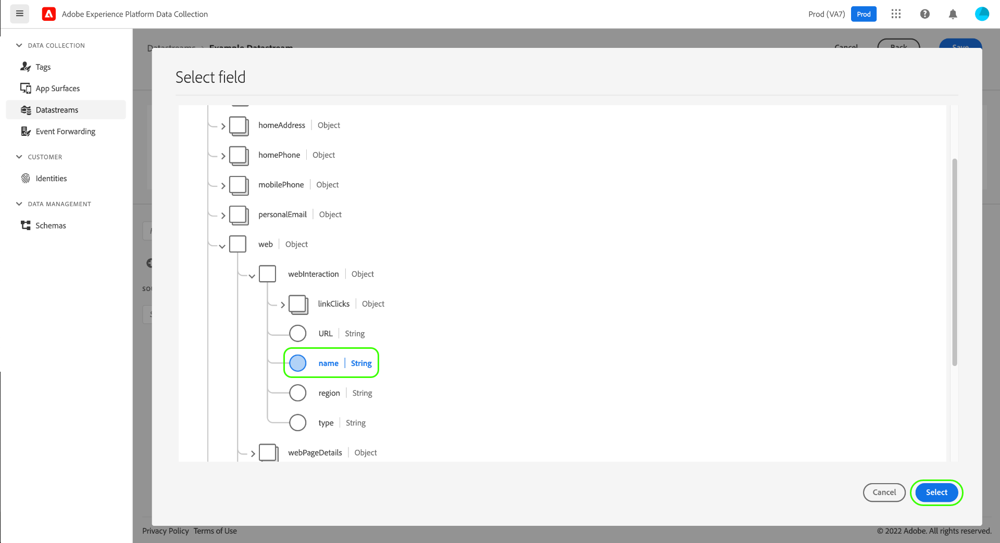
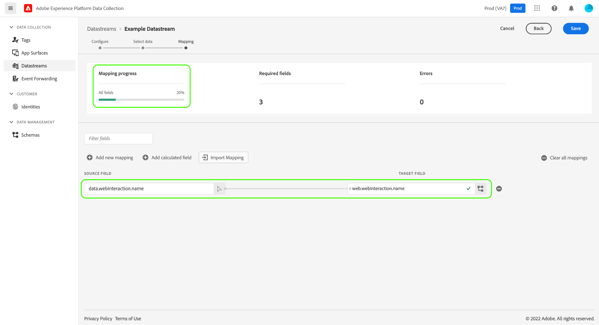
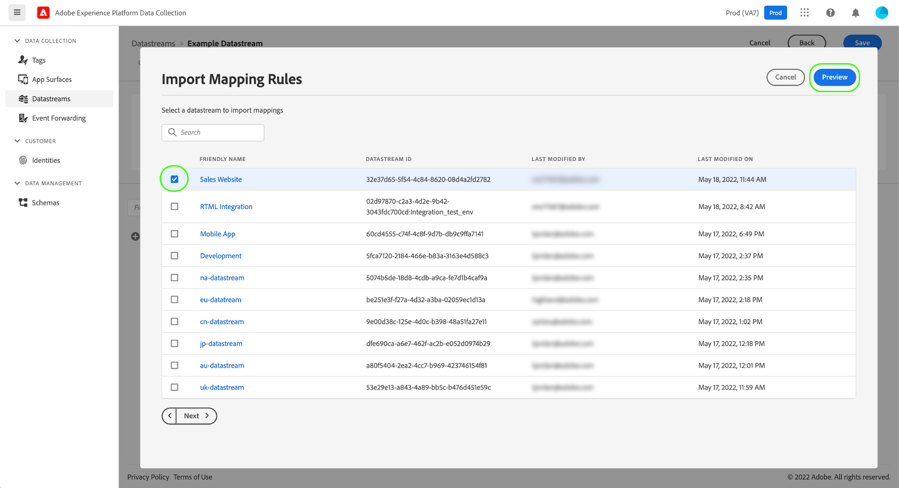

# 데이터 수집을 위한 데이터 준비

데이터 준비는 데이터를 매핑, 변환 및 유효성 검사를 할 수 있는 Adobe Experience Platform 서비스입니다 [XDM(경험 데이터 모델)](../../xdm/home.md). 플랫폼 사용 설정 구성 시 [데이터 스트림](./overview.md)에서는 데이터 준비 기능을 사용하여 Platform Edge 네트워크에 소스 데이터를 전송할 때 XDM에 매핑할 수 있습니다.

>[!NOTE]
>
>계산된 필드에 대한 변형 기능을 포함하여 모든 데이터 준비 기능에 대한 포괄적인 지침은 다음 설명서를 참조하십시오.
>
>* [데이터 준비 개요](../../data-prep/home.md)
>* [데이터 준비 매핑 함수](../../data-prep/functions.md)
>* [데이터 준비를 사용하여 데이터 형식 처리](../../data-prep/data-handling.md)


이 안내서에서는 데이터 수집 UI 내에 데이터를 매핑하는 방법을 다룹니다. 단계를 따라 데이터 스트림을 만드는 프로세스를 최대(및 포함)까지 시작합니다 [기본 구성 단계](./overview.md#create).

데이터 수집을 위한 데이터 준비 프로세스에 대한 빠른 데모는 다음 비디오를 참조하십시오.

>[!VIDEO](https://video.tv.adobe.com/v/342120?quality=12&enable10seconds=on&speedcontrol=on)

## [!UICONTROL 데이터 선택] {#select-data}

선택 **[!UICONTROL 매핑 저장 및 추가]** 데이터 스트림에 대한 기본 구성을 완료한 후 및 **[!UICONTROL 데이터 선택]** 단계가 나타납니다. 여기에서 Platform으로 전송할 데이터의 구조를 나타내는 샘플 JSON 개체를 제공해야 합니다.

데이터 계층에서 직접 속성을 캡처하려면 JSON 개체에 단일 루트 속성이 있어야 합니다 `data`. 의 하위 속성 `data` 그런 다음 캡처할 데이터 레이어 속성에 매핑되는 방식으로 객체를 구성해야 합니다. 를 사용하여 올바른 형식의 JSON 개체의 예를 보려면 아래 섹션을 선택하십시오 `data` 루트

+++JSON 파일 샘플 `data` 루트

```json
{
  "data": {
    "eventMergeId": "cce1b53c-571f-4f36-b3c1-153d85be6602",
    "eventType": "view:load",
    "timestamp": "2021-09-30T14:50:09.604Z",
    "web": {
      "webPageDetails": {
        "siteSection": "Product section",
        "server": "example.com",
        "name": "product home",
        "URL": "https://www.example.com"
      },
      "webReferrer": {
        "URL": "https://www.adobe.com/index2.html",
        "type": "external"
      }
    },
    "commerce": {
      "purchase": 1,
      "order": {
        "orderID": "1234"
      }
    },
    "product": [
      {
        "productInfo": {
          "productID": "123"
        }
      },
      {
        "productInfo": {
          "productID": "1234"
        }
      }
    ],
    "reservation": {
      "id": "anc45123xlm",
      "name": "Embassy Suits",
      "SKU": "12345-L",
      "skuVariant": "12345-LG-R",
      "priceTotal": "112.99",
      "currencyCode": "USD",
      "adults": 2,
      "children": 3,
      "productAddMethod": "PDP",
      "_namespace": {
        "test": 1,
        "priceTotal": "112.99",
        "category": "Overnight Stay"
      },
      "freeCancellation": false,
      "cancellationFee": 20,
      "refundable": true
    }
  }
}
```

+++

XDM 개체 데이터 요소에서 속성을 캡처하려면 동일한 규칙이 JSON 개체에 적용되지만 루트 속성은 `xdm` 을 가리키도록 업데이트하는 것이 좋습니다. 아래 섹션을 선택하여 `xdm` 루트

+++JSON 파일 샘플 `xdm` 루트

```json
{
  "xdm": {
    "environment": {
      "type": "browser",
      "browserDetails": {
        "userAgent": "Mozilla/5.0 (Macintosh; Intel Mac OS X 10_7_5) AppleWebkit/537.36 (KHTML, like Gecko) Chrome/49.0.2623.112 Safari/537.36",
        "javaScriptEnabled": true,
        "javaScriptVersion": "1.8.5",
        "cookiesEnabled": true,
        "viewportHeight": 900,
        "viewportWidth": 1680,
        "javaEnabled": true
      },
      "domain": "adobe.com",
      "colorDepth": 24,
      "viewportHeight": 1050,
      "viewportWidth": 1680
    },
    "device": {
      "screenHeight": 1050,
      "screenWidth": 1680
    }
  }
}
```

+++

옵션을 선택하여 개체를 파일로 업로드하거나 원시 개체를 제공된 텍스트 상자에 대신 붙여넣을 수 있습니다. JSON이 유효하면 오른쪽 패널에 미리 보기 스키마가 표시됩니다. 선택 **[!UICONTROL 다음]** 계속하십시오.


## [!UICONTROL 매핑]

다음 **[!UICONTROL 매핑]** 소스 데이터의 필드를 Platform의 target 이벤트 스키마의 필드에 매핑할 수 있는 단계가 나타납니다. 여기에서 다음 두 가지 방법으로 매핑을 구성할 수 있습니다.

* [새 매핑 규칙 만들기](#create-mapping) 수동 프로세스를 통해 이 데이터 스트림에 대해 설명합니다.
* [매핑 규칙 가져오기](#import-mapping) 기존 데이터 스트림에서

### 새 매핑 만들기 {#create-mapping}

시작하려면 다음을 선택합니다 **[!UICONTROL 새 매핑 추가]** 새 매핑 행을 만들려면


소스 아이콘()이고 표시되는 대화 상자에서 제공된 캔버스에 매핑할 소스 필드를 선택합니다. 필드를 선택한 후에는 **[!UICONTROL 선택]** 계속하려면 클릭하십시오.


다음으로 스키마 아이콘()를 클릭하여 target 이벤트 스키마에 대한 유사한 대화 상자를 엽니다. 확인을 하기 전에 데이터를 매핑할 필드를 선택합니다 **[!UICONTROL 선택]**.



완료된 필드 매핑이 표시된 채 매핑 페이지가 다시 나타납니다. 다음 **[!UICONTROL 매핑 진행률]** 섹션에 성공적으로 매핑된 총 필드 수를 반영하도록 업데이트했습니다.



>[!TIP]
>
>소스 필드의 객체 배열을 다른 객체 배열(대상 필드)에 매핑하려면 를 추가합니다 `[*]` 소스 및 대상 필드 경로의 배열 이름 뒤에 놓습니다.
>
>

### 기존 매핑 규칙 가져오기 {#import-mapping}

이전에 데이터 스트림을 만든 경우 새 데이터 스트림에 대해 구성된 매핑 규칙을 다시 사용할 수 있습니다.

>[!WARNING]
>
>다른 데이터 스트림에서 매핑 규칙을 가져오면 가져오기 전에 추가했을 수 있는 모든 필드 매핑을 덮어씁니다.

시작하려면 다음을 선택합니다 **[!UICONTROL 가져오기 매핑]**.

![이미지를 보여주는 이미지 [!UICONTROL 가져오기 매핑] 선택한 단추](../images/datastreams/data-prep/import-mapping-button.png)

표시되는 대화 상자에서 매핑 규칙을 가져오려는 데이터 스트림을 선택합니다. 데이터 스트림을 선택하면 **[!UICONTROL 미리 보기]**.



>[!NOTE]
>
>데이터 저장소는 동일한 내에서만 가져올 수 있습니다 [샌드박스](../../sandboxes/home.md). 즉, 한 샌드박스에서 다른 샌드박스로 데이터 스트림을 가져올 수 없습니다.

다음 화면에서는 선택한 데이터 스트림에 대해 저장된 매핑 규칙의 미리 보기를 보여줍니다. 표시된 매핑이 예상과 같은지 확인한 다음 **[!UICONTROL 가져오기]** 매핑을 확인하고 새 데이터 스트림에 추가합니다.


>[!NOTE]
>
>가져온 매핑 규칙의 소스 필드가 사용자가 샘플 JSON 데이터에 포함되지 않은 경우 [이전에 제공됨](#select-data)와 같은 필드 매핑은 가져오기에 포함되지 않습니다.

### 매핑 완료

위의 단계에 따라 나머지 필드를 대상 스키마에 매핑합니다. 사용 가능한 모든 소스 필드를 매핑할 필요는 없지만 이 단계를 완료하려면 필요에 따라 설정된 대상 스키마의 모든 필드를 매핑해야 합니다. 다음 **[!UICONTROL 필수 필드]** 카운터는 현재 구성에 아직 매핑되지 않은 필수 필드 수를 나타냅니다.

필수 필드 수가 0에 도달하고 매핑에 만족하면 을(를) 선택합니다 **[!UICONTROL 저장]** 변경 사항을 확정하려면 다음을 수행하십시오.


## 다음 단계

이 안내서에서는 데이터 수집 UI에서 데이터 스트림을 설정할 때 데이터를 XDM에 매핑하는 방법을 다룹니다. 일반 데이터 스트림 자습서를 따르는 경우 이제 다음 단계로 돌아갈 수 있습니다 [데이터 스트림 세부 정보 보기](./overview.md).
