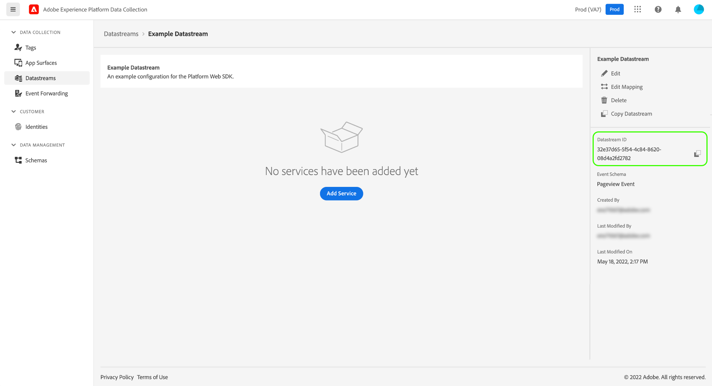

# 데이터 스트림 개요

데이터 스트림은 Adobe Experience Platform Web 및 Mobile SDK를 구현할 때 서버측 구성을 나타냅니다. 반면에 [명령 구성](../fundamentals/configuring-the-sdk.md) sdk에서 는 클라이언트(예: `edgeDomain`), 데이터 세트는 SDK에 대한 다른 모든 구성을 처리합니다. Adobe Experience Platform Edge Network에 요청이 전송되면 `edgeConfigId` 는 데이터 스트림을 참조하는 데 사용됩니다. 이렇게 하면 웹 사이트에서 코드를 변경하지 않고도 서버측 구성을 업데이트할 수 있습니다.

이 문서에서는 UI에서 데이터 스트림을 구성하는 절차에 대해 설명합니다.

## 액세스 권한 [!UICONTROL 데이터 스트림] 작업 영역

을(를) 선택하여 데이터 수집 UI 또는 Experience Platform UI에서 데이터 세트를 만들고 관리할 수 있습니다 **[!UICONTROL 데이터 스트림]** 을 클릭합니다.

다음 [!UICONTROL 데이터 스트림] 탭에는 친숙한 이름, ID 및 마지막으로 수정한 날짜를 포함하여 기존 데이터 저장소 목록이 표시됩니다. 데이터 스트림의 이름을 선택합니다 [세부 정보 보기 및 서비스 구성](#view-details).

자세히 아이콘(**...**)를 추가하여 특정 데이터 스트림에 더 많은 옵션을 표시합니다. 선택 **[!UICONTROL 편집]** 를 업데이트하려면 [기본 구성](#configure) 데이터 스트림의 경우 또는 **[!UICONTROL 삭제]** 데이터 스트림을 제거하려면 다음을 수행하십시오.

## 새 데이터 스트림 만들기 {#create}

데이터 스트림을 만들려면 먼저 **[!UICONTROL 새 데이터 스트림]**.

구성 단계에서 시작하여 데이터 스트림 만들기 워크플로우가 나타납니다. 여기에서 데이터 스트림에 대한 이름과 선택적 설명을 제공해야 합니다.

Experience Platform에서 사용하도록 이 데이터 스트림을 구성하고 Platform Web SDK를 사용 중인 경우, [이벤트 기반 경험 데이터 모델(XDM) 스키마](../../xdm/classes/experienceevent.md) 수집 중인 데이터를 나타냅니다.

선택 **[!UICONTROL 고급 옵션]** 데이터 스트림을 구성하는 추가 컨트롤을 표시하려면 다음을 수행하십시오.

| 설정 | 설명 |
| --- | --- |
| [!UICONTROL 지리적 위치] | 사용자의 IP 주소를 기준으로 GPS 조회가 발생하는지 여부를 결정합니다. 기본 설정 **[!UICONTROL 없음]** GPS 조회가 비활성화되고 **[!UICONTROL 구/군/시]** 설정은 GPS 좌표를 소수점 이하 두 자리로 제공합니다. |
| [!UICONTROL 자사 ID 쿠키] | 이 설정이 활성화되면 Edge Network에 [자사 장치 ID](../identity/first-party-device-ids.md)를 채우는 것이 좋습니다.  이 설정을 활성화할 때 ID가 저장되어야 하는 쿠키의 이름을 제공해야 합니다. |
| [!UICONTROL 타사 ID 동기화] | ID 동기화를 컨테이너로 그룹화하여 다른 시간에 다른 ID 동기화를 실행할 수 있습니다. 이 설정을 사용하면 이 데이터 스트림에 대해 실행 중인 ID 동기화 컨테이너를 지정할 수 있습니다. |
| [!UICONTROL 액세스 유형] | Adobe Analytics에서 [!DNL Edge Network] 는 데이터 스트림에 대해 허용합니다. <ul><li>**[!UICONTROL 혼합 인증]**: 이 옵션을 선택하면 Edge Network에서 인증된 요청과 인증되지 않은 요청을 모두 허용합니다. 웹 SDK를 사용할 계획이나 [Mobile SDK](https://aep-sdks.gitbook.io/docs/)와 함께 [서버 API](../../server-api/overview.md). </li><li>**[!UICONTROL 인증만]**: 이 옵션을 선택하면 에지 네트워크에서 인증된 요청만 허용합니다. 서버 API만 사용하고 인증되지 않은 요청이 에 의해 처리되지 않도록 하려면 이 옵션을 선택합니다 [!DNL Edge Network]. </li></ul> |

여기에서 Experience Platform을 위해 데이터 스트림을 구성하는 경우 다음 자습서를 따르십시오. [데이터 수집을 위한 데이터 준비](./data-prep.md) 이 안내서로 돌아가기 전에 Platform 이벤트 스키마에 데이터를 매핑하려면 다음을 수행하십시오. 그렇지 않으면 을 선택합니다. **[!UICONTROL 저장]** 그리고 다음 섹션으로 계속하십시오.

## 데이터 스트림 세부 정보 보기 {#view-details}

새 데이터 스트림을 구성하거나 기존 데이터 스트림을 선택하여 보면 해당 데이터 스트림에 대한 세부 정보 페이지가 나타납니다. 여기에서 해당 ID를 포함하여 데이터 스트림에 대한 추가 정보를 찾을 수 있습니다.

데이터 스트림 세부 사항 화면에서 다음을 수행할 수 있습니다 [서비스 추가](#add-services) 액세스 권한이 있는 Adobe Experience Cloud 제품의 기능을 활성화하기 위한 것입니다. 데이터 스트림의 데이터 스트림을 편집할 수도 있습니다 [기본 구성](#create), 업데이트 [매핑 규칙](./data-prep.md), [데이터 스트림 복사](#copy)또는 완전히 삭제합니다.

## 데이터 스트림에 서비스 추가 {#add-services}

데이터 스트림의 세부 정보 페이지에서 **[!UICONTROL 서비스 추가]** 해당 데이터 스트림에 사용 가능한 서비스 추가를 시작하려면 다음을 수행하십시오.

![계속하려면 [서비스 추가]를 선택하십시오](../images/datastreams/overview/add-service.png)

다음 화면에서 드롭다운 메뉴를 사용하여 이 데이터 스트림에 대해 구성할 서비스를 선택합니다. 액세스 권한이 있는 서비스만 이 목록에 표시됩니다.

원하는 서비스를 선택하고 나타나는 구성 옵션을 입력한 다음 선택합니다 **[!UICONTROL 저장]** 를 눌러 데이터 스트림에 서비스를 추가합니다. 추가된 모든 서비스가 데이터 스트림에 대한 세부 정보 보기에 나타납니다.

아래 하위 섹션에서는 각 서비스의 구성 옵션에 대해 설명합니다.

>[!NOTE]
>
>각 서비스 구성에는 **[!UICONTROL 활성화됨]** 서비스를 선택하면 자동으로 활성화되는 전환합니다. 이 데이터 스트림에 대해 선택한 서비스를 비활성화하려면 **[!UICONTROL 활성화됨]** 다시 전환합니다.

### Adobe Analytics 설정 {#analytics}

이 서비스는 Adobe Analytics으로 데이터를 전송할지 여부와 방법을 제어합니다. 자세한 내용은 [analytics에 데이터 보내기](../data-collection/adobe-analytics/analytics-overview.md).

| 설정 | 설명 |
| --- | --- |
| [!UICONTROL 보고서 세트 ID] | **(필수)** 데이터를 전송할 Analytics 보고서 세트의 ID입니다. 이 ID는 아래의 Adobe Analytics UI에서 찾을 수 있습니다 [!UICONTROL 관리] > [!UICONTROL 보고서 세트]. 여러 보고서 세트를 지정하면 데이터가 각 보고서 세트에 복사됩니다. |

### Adobe Audience Manager 설정 {#audience-manager}

이 서비스는 Adobe Audience Manager으로 데이터를 전송할지 여부와 방법을 제어합니다. Audience Manager으로 데이터를 전송하는 데 필요한 모든 것은 이 섹션을 활성화하는 것입니다. 다른 설정은 선택 사항이지만 권장됩니다.

| 설정 | 설명 |
| --- | --- |
| [!UICONTROL 쿠키 대상 활성화] | SDK가 를 통해 세그먼트 정보를 공유할 수 있도록 허용합니다 [쿠키 대상](https://experienceleague.adobe.com/docs/audience-manager/user-guide/features/destinations/custom-destinations/create-cookie-destination.html) 변환 전: [!DNL Audience Manager]. |
| [!UICONTROL URL 대상 사용] | SDK가 를 통해 세그먼트 정보를 공유할 수 있도록 허용합니다 [URL 대상](https://experienceleague.adobe.com/docs/audience-manager/user-guide/features/destinations/custom-destinations/create-url-destination.html) 변환 전: [!DNL Audience Manager]. |

### Adobe Experience Platform 설정 {#aep}

>[!IMPORTANT]
>
>Platform용 데이터 스트림을 활성화할 때 UI의 위쪽 리본에 표시된 대로 현재 사용 중인 Platform 샌드박스를 주목하십시오.
>
>
>
>샌드박스는 조직의 다른 샌드박스와 데이터 및 구현을 분리할 수 있는 Adobe Experience Platform의 가상 파티션입니다. 데이터 스트림을 만들면 해당 샌드박스를 변경할 수 없습니다. Experience Platform에서 샌드박스의 역할에 대한 자세한 내용은 [샌드박스 설명서](../../sandboxes/home.md).

이 서비스는 Adobe Experience Platform으로 데이터를 전송할지 여부와 방법을 제어합니다.

| 설정 | 설명 |
|---| --- |
| [!UICONTROL 이벤트 데이터 세트] | **(필수)** 고객 이벤트 데이터를 스트리밍할 플랫폼 데이터 세트를 선택합니다. 이 스키마는 [XDM ExperienceEvent 클래스](../../xdm/classes/experienceevent.md). |
| [!UICONTROL 프로필 데이터 세트] | 고객 특성 데이터를 전송할 Platform 데이터 세트를 선택합니다. 이 스키마는 [XDM 개별 프로필 클래스](../../xdm/classes/individual-profile.md). |
| [!UICONTROL Offer Decisioning] | Platform Web SDK 구현에 Offer decisioning을 활성화하려면 이 확인란을 선택하십시오. 다음 안내서를 참조하십시오. [platform Web SDK에서 Offer decisioning 사용](../personalization/offer-decisioning/offer-decisioning-overview.md) 를 참조하십시오. offer decisioning 기능에 대한 자세한 내용은 [Adobe Journey Optimizer 설명서](https://experienceleague.adobe.com/docs/journey-optimizer/using/offer-decisioniong/get-started/starting-offer-decisioning.html?lang=ko-KR). |
| [!UICONTROL 에지 세그멘테이션] | 이 확인란을 선택하여 [에지 세분화](../../segmentation/ui/edge-segmentation.md) 이 데이터 스트림에 대해 설명합니다. SDK가 에지 세그먼테이션이 활성화된 데이터 스트림을 통해 데이터를 전송하면 해당 프로필에 대해 업데이트된 세그먼트 멤버십이 응답으로 다시 전송됩니다.  이 옵션은 [!UICONTROL 개인화 대상] 대상 [다음 페이지 개인화 사용 사례](../../destinations/ui/configure-personalization-destinations.md). |
| [!UICONTROL 개인화 대상] | 을 활성화한 후 이 설정을 활성화할 때 [!UICONTROL 에지 세그멘테이션] 확인란을 선택하면 이 옵션을 통해 데이터 스트림이 다음과 같은 개인화 대상에 연결할 수 있습니다 [사용자 지정 개인화](../../destinations/catalog/personalization/custom-personalization.md). 의 특정 단계에 대해서는 대상 설명서 를 참조하십시오 [개인화 대상 구성](../../destinations/ui/configure-personalization-destinations.md). |

### Adobe Target 설정 {#target}

이 서비스는 Adobe Target으로 데이터를 전송할지 여부와 방법을 제어합니다.

| 설정 | 설명 |
| --- | --- |
| [!UICONTROL 속성 토큰] | [!DNL Target] 을 사용하면 고객이 속성을 사용하여 권한을 제어할 수 있습니다. 속성에 대한 자세한 내용은 [enterprise 권한 구성](https://experienceleague.adobe.com/docs/target/using/administer/manage-users/enterprise/properties-overview.html) 에서 [!DNL Target] 설명서.  속성 토큰은 아래의 Adobe Target UI에 있습니다 [!UICONTROL 설정] > [!UICONTROL 속성]. |
| [!UICONTROL Target 환경 ID] | [Adobe Target의 환경](https://experienceleague.adobe.com/docs/target/using/administer/hosts.html) 은 모든 개발 단계를 통해 구현을 관리하는 데 도움이 됩니다. 이 설정은 이 데이터 스트림에 사용할 환경을 지정합니다.  가장 좋은 방법은 각 사용자 `dev`, `stage`, 및 `prod` 데이터 스트림 환경을 통해 작업을 단순화할 수 있습니다. 그러나 이미 Adobe Target 환경이 정의된 경우 해당 환경을 사용할 수 있습니다. |
| [!UICONTROL Target 타사 ID 네임스페이스] | 에 대한 ID 네임스페이스 `mbox3rdPartyId` 이 데이터 스트림에 를 사용하려는 경우 다음 안내서를 참조하십시오. [구현 `mbox3rdPartyId` 웹 SDK 사용](../personalization/adobe-target/using-mbox-3rdpartyid.md) 추가 정보. |

### [!UICONTROL 이벤트 전달] 설정

이 서비스는 로 데이터를 전송할지 여부와 방법을 제어합니다 [이벤트 전달](../../tags/ui/event-forwarding/overview.md).

| 설정 | 설명 |
| --- | --- |
| [!UICONTROL Launch 속성] | **(필수)** 데이터를 보낼 이벤트 전달 속성입니다. |
| [!UICONTROL Launch 환경] | **(필수)** 선택한 속성에 데이터를 보낼 환경입니다. |

>[!NOTE]
>
>선택할 수 있습니다 **[!UICONTROL 수동으로 ID 입력]** 드롭다운 메뉴를 사용하지 않고 속성 및 환경 이름을 입력합니다.

## 데이터 스트림 복사 {#copy}

기존 데이터 스트림의 복사본을 만들고 필요에 따라 세부 정보를 변경할 수 있습니다.

>[!NOTE]
>
>데이터 저장소는 동일한 내부에서만 복사할 수 있습니다 [샌드박스](../../sandboxes/home.md). 즉, 한 샌드박스에서 다른 샌드박스로 데이터 스트림을 복사할 수 없습니다.

의 기본 페이지에서 [!UICONTROL 데이터 스트림] 작업 영역에서 줄임표(**....**)을 클릭하여 해당 데이터 스트림을 설정한 다음 **[!UICONTROL 복사]**.

![이미지를 보여주는 이미지 [!UICONTROL 복사] 데이터 스트림 목록 보기에서 선택하는 옵션](../images/datastreams/overview/copy-datastream-list.png)

또는 다음을 선택할 수 있습니다 **[!UICONTROL 데이터 스트림 복사]** 지정된 데이터 스트림의 세부 정보 보기에서

![이미지를 보여주는 이미지 [!UICONTROL 복사] 데이터 스트림 세부 정보 보기에서 선택하는 옵션](../images/datastreams/overview/copy-datastream-details.png)

복사할 구성 옵션에 대한 세부 사항과 함께 새로 만들 데이터 스트림에 고유한 이름을 제공하라는 확인 대화 상자가 나타납니다. 준비되면 을 선택합니다. **[!UICONTROL 복사]**.

의 기본 페이지 [!UICONTROL 데이터 스트림] 새 데이터 스트림이 나열된 작업 공간이 다시 나타납니다.

## 다음 단계

이 안내서에서는 UI에서 데이터 세트를 관리하는 방법을 다룹니다. 데이터 스트림을 설정한 후 Web SDK를 설치하고 구성하는 방법에 대한 자세한 내용은 [데이터 수집 E2E 안내서](../../collection/e2e.md#install).
