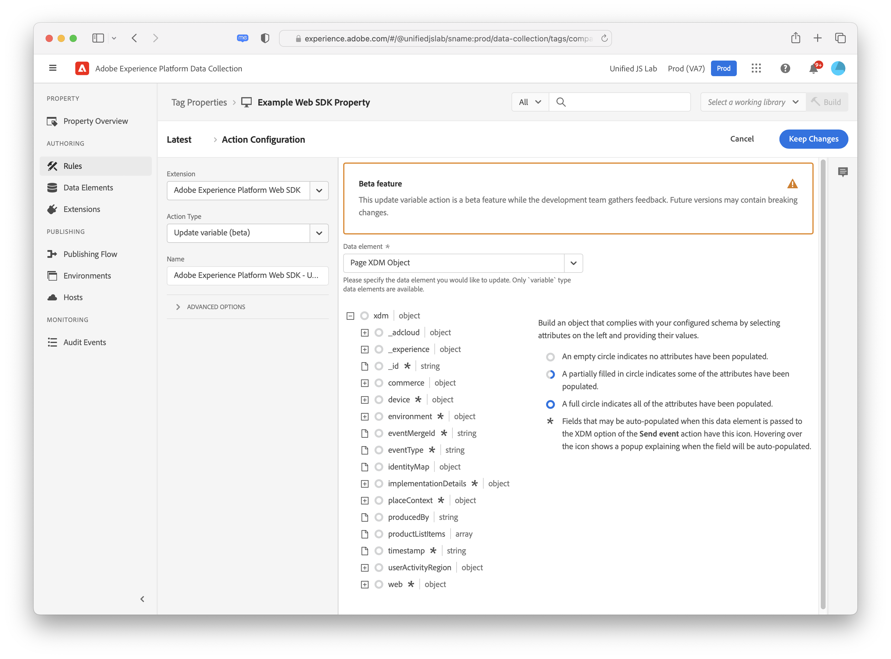

# 작업 유형

구성 후 [Adobe Experience Platform 웹 SDK 태그 확장](web-sdk-extension-configuration.md), 작업 유형을 구성해야 합니다.

이 페이지에서는 [Adobe Experience Platform 웹 SDK 태그 확장](web-sdk-extension-configuration.md).

## 이벤트 보내기 {#send-event}

이벤트를 Adobe에 보냅니다. [!DNL Experience Platform] 사용자가 전송하는 데이터를 수집하고 해당 정보에 대해 조치를 취할 수 있도록 Adobe Experience Platform이 합니다. 인스턴스를 선택합니다(인스턴스가 두 개 이상인 경우). 전송하려는 모든 데이터는 **[!UICONTROL XDM 데이터]** 필드. XDM 스키마의 구조를 준수하는 JSON 개체를 사용합니다. 이 개체는 페이지 또는 **[!UICONTROL 사용자 지정 코드]** **[!UICONTROL 데이터 요소]**.

이벤트 보내기 작업 유형에는 구현에 따라 유용할 수 있는 몇 가지 다른 필드가 있습니다. 이러한 필드는 모두 선택 사항입니다.

- **유형:** 이 필드에서는 XDM 스키마에 기록할 이벤트 유형을 지정할 수 있습니다. 자세한 내용은 [설명서](https://experienceleague.adobe.com/docs/experience-platform/edge/fundamentals/tracking-events.html?lang=en#using-the-sendbeacon-api) 기본 이벤트 유형에 대한 자세한 내용을 참조하십시오.
- **데이터:** XDM 스키마와 일치하지 않는 데이터는 이 필드를 사용하여 보낼 수 있습니다. 이 필드는 Adobe Target 프로필을 업데이트하거나 Target Recommendations 속성을 전송하려고 하는 경우 유용합니다. 예 보기 [설명서](https://experienceleague.adobe.com/docs/experience-platform/edge/fundamentals/tracking-events.html?lang=ko-KR).<!--- **Merge ID:** If you would like to specify a merge ID for your event, you can do so in this field. Please note that the solutions downstream are not able to merge your event data at this time. -->
- **데이터 세트 ID:** 데이터 스트림에 지정한 데이터 세트 이외의 데이터 세트에 데이터를 보내야 하는 경우 여기에서 해당 데이터 세트 ID를 지정할 수 있습니다.
- **문서가 언로드됩니다.** 사용자가 페이지에서 멀리 탐색하더라도 이벤트가 서버에 도달하는지 확인하려면 **[!UICONTROL 문서가 언로드됨]** 확인란을 선택합니다. 이를 통해 이벤트가 서버에 도달할 수 있지만 응답은 무시됩니다.
- **시각적 개인화 의사 결정 렌더링:** 페이지에서 개인화된 컨텐츠를 렌더링하려면 다음을 확인합니다. **[!UICONTROL 시각적 개인화 결정 렌더링]** 확인란을 선택합니다. 필요한 경우 결정 범위 및/또는 서피스를 지정할 수도 있습니다. 자세한 내용은 [개인화 설명서](../personalization/rendering-personalization-content.md#automatically-rendering-content) 을 참조하십시오.

## 동의 설정 {#set-consent}

사용자로부터 동의를 받은 후 &quot;동의 설정&quot; 작업 유형을 사용하여 이 동의를 Adobe Experience Platform Web SDK에 전달해야 합니다. 현재 &quot;Adobe&quot; 및 &quot;IAB TCF&quot;, 2가지 유형의 표준이 지원됩니다. 자세한 내용은 [고객 동의 기본 설정 지원](../consent/supporting-consent.md). Adobe 버전 2.0을 사용하는 경우 데이터 요소 값만 지원됩니다. 동의 개체로 확인되는 데이터 요소를 만들어야 합니다.

이 작업에서는 동의를 받으면 ID를 동기화할 수 있도록 ID 맵을 포함하는 선택적 필드도 제공됩니다. 동기화는 동의 호출이 첫 번째 호출을 실행할 가능성이 높으므로 동의가 &quot;보류 중&quot; 또는 &quot;종료&quot;로 구성되는 경우 유용합니다.

## 이벤트 병합 ID 재설정 {#reset-event-merge-id}

페이지에서 이벤트 병합 ID를 재설정하려면 이 작업을 통해 이 작업을 수행할 수 있습니다. ID를 재설정하려면 재설정할 병합 ID를 선택하고 필요에 따라 작업을 실행합니다.

## (베타) 변수 업데이트 {#update-variable}

>[!IMPORTANT]
>
>현재 베타 기능이며 변경될 수 있습니다. 이후 버전에는 변경 사항이 포함될 수 있습니다.

이벤트의 결과로 XDM 개체를 수정하려면 이 작업을 사용하십시오. 이 작업은 나중에 **[!UICONTROL 이벤트 보내기]** 작업: 이벤트 XDM 개체를 기록합니다.

이 작업 유형을 사용하려면 [변수](data-element-types.md#variable) 데이터 요소를 생성하지 않습니다. 수정할 변수 데이터 요소를 선택하면 에 대한 편집기와 유사한 편집기가 나타납니다 [XDM 개체](data-element-types.md#xdm-object) 데이터 요소를 생성하지 않습니다.

편집기에 사용되는 XDM 스키마는 [!UICONTROL 변수] 데이터 요소를 생성하지 않습니다. 왼쪽의 트리에 있는 속성 중 하나를 클릭한 다음 오른쪽의 값을 수정하여 개체의 속성을 한 개 이상 설정할 수 있습니다. 예를 들어 아래 스크린샷에서 productedBy 속성이 데이터 요소 &quot;Completed by data element&quot;로 설정됩니다.

업데이트 변수 작업의 편집기와 XDM 개체 데이터 요소의 편집기가 서로 다릅니다. 먼저 업데이트 변수 작업에는 &quot;xdm&quot;이라는 루트 수준 항목이 있습니다. 이 항목을 클릭하면 전체 개체를 설정하는 데 사용할 데이터 요소를 지정할 수 있습니다. 둘째, 변수 업데이트 작업에는 xdm 개체에서 데이터를 지우는 확인란이 있습니다. 왼쪽의 속성 중 하나를 클릭한 다음 오른쪽의 확인란을 선택하여 값을 지웁니다. 이렇게 하면 변수에서 값을 설정하기 전에 현재 값이 지워집니다.

## 다음 단계 {#next-steps}

이 문서를 읽은 후에는 작업을 구성하는 방법을 더 잘 이해할 수 있어야 합니다. 다음, 다음 방법 [데이터 요소 유형 구성](data-element-types.md).
