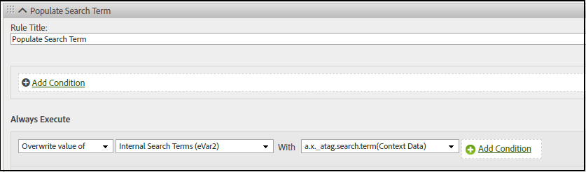

# Analytics에서 수동으로 변수 매핑

Adobe Experience Platform(AEP)는 특정 변수를 자동으로 매핑할 [!DNL Web SDK] 수 있지만 사용자 지정 변수는 수동으로 매핑해야 합니다.

자동으로 매핑되지 않는 XDM 데이터의 경우 [!DNL Analytics]컨텍스트 데이터 [를 사용하여](https://docs.adobe.com/content/help/ko-KR/analytics/implementation/vars/page-vars/contextdata.html) 스키마와 [일치시킬 수 있습니다](https://docs.adobe.com/content/help/ko-KR/experience-platform/xdm/schema/composition.html). 그런 다음 [!DNL Analytics] 처리 규칙 [을 사용하여](https://docs.adobe.com/content/help/ko-KR/analytics/admin/admin-tools/processing-rules/processing-rules-configuration/t-processing-rules.html) 변수 [!DNL Analytics] 를 채울 수 있습니다.

또한 기본 작업 및 제품 목록을 사용하여 AEP를 사용하여 데이터를 전송 또는 검색할 수 있습니다 [!DNL Web SDK]. 이렇게 하려면 [제품을 참조하십시오](https://docs.adobe.com/content/help/en/experience-platform/edge/implement/commerce.html).

## 컨텍스트 데이터

에서 사용하기 위해 XDM 데이터 [!DNL Analytics]`contextData`는 점 표기법을 사용하여 분리되고, 다음 값 쌍 목록은 다음 예시를 보여줍니다 `context data`.

```javascript
{
          "bh": "900",
          "bw": "1680",
          "c": "24",
          "c.a.d.key.[0]": "value1",
          "c.a.d.key.[1]": "value2",
          "c.a.d.object.key1": "value1",
          "c.a.d.object.key2.[0]": "value2",
          "c.a.x.environment.browserdetails.javascriptenabled": "true",
          "c.a.x.environment.type": "browser",
          "cust_hit_time_gmt": "1579781427",
          "g": "http://example.com/home",
          "gn": "home",
          "j": "1.8.5",
          "k": "Y",
          "s": "1680x1050",
          "tnta": "218287:1:0|0,218287:1:0|2,218287:1:0|1,218287:1:0|32767,218287:1:0|1,218287:1:0|0,218287:1:0|1,218287:1:0|0,218287:1:0|1",
          "user_agent": "Mozilla/5.0 AppleWebKit/537.36 Safari/537.36",
          "v": "Y"
        }
```

## 처리 규칙

Edge Network에서 수집한 모든 데이터는 [처리 규칙을 통해 액세스할 수 있습니다](https://docs.adobe.com/content/help/ko-KR/analytics/admin/admin-tools/processing-rules/processing-rules-configuration/t-processing-rules.html). 에서 [!DNL Analytics]처리 규칙을 사용하여 컨텍스트 데이터를 변수에 통합할 수 [!DNL Analytics] 있습니다.

예를 들어 다음 규칙에서 Analytics은 **내부 검색어(eVar2)** 를 **a.x_atag.search.term(컨텍스트 데이터)과 연관된 데이터로 채우도록 설정됩니다**.




## XDM 스키마

[!DNL Experience Platform] 스키마를 사용하여 데이터의 구조를 일관되고 재사용 가능한 방식으로 설명합니다. 여러 시스템에서 데이터를 일관되게 정의하면 의미를 쉽게 유지할 수 있으므로 데이터를 통해 가치를 창출할 수 있습니다. [!DNL Analytics] 컨텍스트 데이터는 스키마에 의해 정의된 구조와 함께 작동합니다.

다음 예에서는 AEP를 사용하여 데이터를 보내고 검색하는 [`event` 옵션과 함께 명령을](https://docs.adobe.com/content/help/en/experience-platform/edge/fundamentals/tracking-events.html) 사용할 수 있는 방법을 보여줍니다 `xdm` [!DNL Web SDK]. 이 예에서 이 `event` 명령은 productListItems [및](https://github.com/adobe/xdm/blob/1c22180490558e3c13352fe3e0540cb7e93c69ca/docs/reference/context/experienceevent-commerce.schema.md) 값을 추적하도록 `name` ExperienceEvent Commerce Details 스키마와 `SKU` 일치합니다.


```
alloy("event",{
  "xdm":{
    "commerce":{
      "productViews":{
        "value":1
      }
    },
    "productListItems":[
      {
        "SKU":"HT105",
        "name":"Large Field Hat",
      },
      {
        "SKU":"HT104",
        "name":"Small Field Hat",
      }
    ]
  }
});
```

AEP를 사용한 이벤트 추적에 대한 자세한 내용 [!DNL Web SDK]은 이벤트 [추적을 참조하십시오](https://docs.adobe.com/content/help/en/experience-platform/edge/fundamentals/tracking-events.html).
