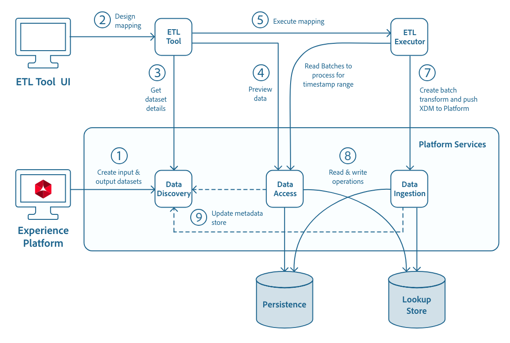

# Adobe Experience Platform용 ETL 통합 개발

ETL 통합 안내서에서는 [!DNL Experience Platform]을(를) 위한 고성능, 보안 커넥터를 만들고 데이터를 [!DNL Experience Platform]&#x200B;(으)로 수집하기 위한 일반적인 단계를 간략하게 설명합니다.


- [[!DNL Catalog]](https://www.adobe.io/experience-platform-apis/references/catalog/)
- [[!DNL Data Access]](https://www.adobe.io/experience-platform-apis/references/data-access/)
- [[!DNL Batch Ingestion]](https://developer.adobe.com/experience-platform-apis/references/batch-ingestion/)
- [[!DNL Streaming Ingestion]](https://developer.adobe.com/experience-platform-apis/references/streaming-ingestion/)
- [Experience Platform API에 대한 인증 및 권한 부여](https://www.adobe.com/go/platform-api-authentication-en)
- [[!DNL Schema Registry]](https://www.adobe.io/experience-platform-apis/references/schema-registry/)

이 안내서에는 ETL 커넥터를 디자인할 때 사용할 샘플 API 호출, 각 [!DNL Experience Platform] 서비스에 대해 간략하게 설명하는 설명서 링크 및 해당 API 사용에 대한 자세한 내용도 포함되어 있습니다.

[!DNL Apache] 라이선스 버전 2.0의 [ETL 생태계 통합 참조 코드](https://github.com/adobe/acp-data-services-etl-reference)를 통해 [!DNL GitHub]에서 샘플 통합을 사용할 수 있습니다.

## 워크플로

다음 워크플로우 다이어그램은 Adobe Experience Platform 구성 요소와 ETL 애플리케이션 및 커넥터의 통합에 대한 높은 수준의 개요를 제공합니다.



## Adobe Experience Platform 구성 요소

ETL 커넥터 통합과 관련된 여러 Experience Platform 구성 요소가 있습니다. 다음 목록에서는 몇 가지 주요 구성 요소 및 기능에 대해 간략히 설명합니다.

- **Adobe IMS(Identity Management System)** - Adobe 서비스에 인증을 위한 프레임워크를 제공합니다.
- **IMS 조직** - 제품 및 서비스를 소유하거나 라이선스를 부여하고 해당 구성원에 대한 액세스를 허용할 수 있는 회사 엔터티.
- **IMS 사용자** - IMS 조직의 구성원입니다. 조직 대 사용자 관계는 다대다수입니다.
- **[!DNL Sandbox]** - 디지털 경험 응용 프로그램을 개발하고 발전시키는 데 도움이 되는 단일 [!DNL Experience Platform] 인스턴스의 가상 파티션입니다.
- **데이터 검색** - 수집 및 변환된 데이터의 메타데이터를 [!DNL Experience Platform]에 기록합니다.
- **[!DNL Data Access]** - 사용자에게 [!DNL Experience Platform]의 데이터에 액세스할 수 있는 인터페이스를 제공합니다.
- **[!DNL Data Ingestion]** - [!DNL Data Ingestion]개의 API를 사용하여 데이터를 [!DNL Experience Platform]에 푸시합니다.
- **[!DNL Schema Registry]** - [!DNL Experience Platform]에서 사용할 데이터의 구조를 설명하는 스키마를 정의하고 저장합니다.

## [!DNL Experience Platform] API 시작

다음 섹션에서는 [!DNL Experience Platform]개의 API를 성공적으로 호출하기 위해 알고 있거나 진행 중인 추가 정보를 제공합니다.

### 샘플 API 호출 읽기

이 안내서에서는 요청 형식을 지정하는 방법을 보여 주는 예제 API 호출을 제공합니다. 여기에는 경로, 필수 헤더 및 적절한 형식의 요청 페이로드가 포함됩니다. API 응답에서 반환되는 샘플 JSON도 제공됩니다. 샘플 API 호출에 대한 설명서에 사용된 규칙에 대한 자세한 내용은 [!DNL Experience Platform] 문제 해결 안내서의 [예제 API 호출을 읽는 방법](../landing/troubleshooting.md#how-do-i-format-an-api-request)에 대한 섹션을 참조하십시오.

### 필수 헤더에 대한 값 수집

[!DNL Experience Platform] API를 호출하려면 먼저 [인증 자습서](https://www.adobe.com/go/platform-api-authentication-en)를 완료해야 합니다. 인증 튜토리얼을 완료하면 아래와 같이 모든 [!DNL Experience Platform] API 호출의 필수 헤더 각각에 대한 값이 제공됩니다.

- 인증: 전달자 `{ACCESS_TOKEN}`
- x-api 키: `{API_KEY}`
- x-gw-ims-org-id: `{ORG_ID}`

[!DNL Experience Platform]의 모든 리소스는 특정 가상 샌드박스로 격리되어 있습니다. [!DNL Experience Platform] API에 대한 모든 요청에는 작업이 수행될 샌드박스의 이름을 지정하는 헤더가 필요합니다.

- x-sandbox-name: `{SANDBOX_NAME}`

>[!NOTE]
>
>[!DNL Experience Platform]의 샌드박스에 대한 자세한 내용은 [샌드박스 개요 설명서](../sandboxes/home.md)를 참조하십시오.

페이로드(POST, PUT, PATCH)가 포함된 모든 요청에는 추가 헤더가 필요합니다.

- Content-Type: application/json

## 일반 사용자 흐름

먼저 ETL 사용자는 [!DNL Experience Platform] UI(사용자 인터페이스)에 로그인하고 표준 커넥터 또는 푸시 서비스 커넥터를 사용하여 수집할 데이터 세트를 만듭니다.

UI에서 사용자는 데이터 세트 스키마를 선택하여 출력 데이터 세트를 만듭니다. 스키마의 선택은 [!DNL Experience Platform]에 수집되는 데이터 유형(레코드 또는 시계열)에 따라 다릅니다. UI 내의 스키마 탭을 클릭하면 스키마가 지원하는 동작 유형을 포함하여 사용 가능한 모든 스키마를 볼 수 있습니다.

ETL 도구에서 사용자는 자격 증명을 사용하여 적절한 연결을 구성한 후 매핑 변형 디자인을 시작합니다. ETL 도구에는 이미 [!DNL Experience Platform]개의 커넥터가 설치되어 있는 것으로 간주됩니다(이 통합 가이드에 정의되지 않은 프로세스).

샘플 ETL 도구 및 워크플로에 대한 모형이 [ETL 워크플로](./workflow.md)에서 제공되었습니다. ETL 도구는 형식이 다를 수 있지만 대부분의 경우 유사한 기능을 제공합니다.

>[!NOTE]
>
>ETL 커넥터는 데이터 및 오프셋을 수집할 날짜를 표시하는 타임스탬프 필터를 지정해야 합니다(예: 데이터를 읽을 창입니다). ETL 도구는 이 UI 또는 다른 관련 UI에서 이러한 두 매개 변수를 사용할 수 있도록 지원해야 합니다. Adobe Experience Platform에서 이러한 매개 변수는 사용 가능한 날짜(있는 경우) 또는 데이터 세트의 배치 개체에 있는 캡처된 날짜에 매핑됩니다.

### 데이터 세트 목록 보기

매핑에 데이터 소스를 사용하여 [[!DNL Catalog API]](https://www.adobe.io/experience-platform-apis/references/catalog/)을(를) 사용하여 사용 가능한 모든 데이터 세트 목록을 가져올 수 있습니다.

단일 API 요청을 실행하여 사용 가능한 모든 데이터 세트(예: `GET /dataSets`)를 볼 수 있습니다. 가장 좋은 방법은 응답 크기를 제한하는 쿼리 매개 변수를 포함하는 것입니다.

전체 데이터 세트 정보가 요청되는 경우 응답 페이로드의 크기가 3GB를 초과할 수 있으므로 전체 성능이 저하될 수 있습니다. 따라서 쿼리 매개 변수를 사용하여 필요한 정보만 필터링하면 [!DNL Catalog]개의 쿼리를 보다 효율적으로 만들 수 있습니다.

#### 목록 필터링

응답을 필터링할 때 앰퍼샌드(`&`)로 매개 변수를 구분하여 한 번의 호출에서 여러 필터를 사용할 수 있습니다. 일부 쿼리 매개 변수는 아래 샘플 요청의 &quot;속성&quot; 필터와 같이, 쉼표로 구분된 값 목록을 허용합니다.

구성된 제한에 따라 [!DNL Catalog] 응답이 자동으로 측정되지만 &quot;limit&quot; 쿼리 매개 변수를 사용하여 제약 조건을 사용자 지정하고 반환되는 개체 수를 제한할 수 있습니다. 미리 구성된 [!DNL Catalog] 응답 제한은 다음과 같습니다.

- 제한 매개 변수를 지정하지 않으면 응답 페이로드당 최대 개체 수는 20개입니다.
- 다른 모든 [!DNL Catalog] 쿼리에 대한 전역 제한은 100개입니다.
- 데이터 세트 쿼리의 경우 속성 쿼리 매개 변수를 사용하여 observableSchema가 요청되면 반환되는 최대 데이터 세트 수는 20개입니다.
- 잘못된 제한 매개 변수(`limit=0` 포함)가 적절한 범위를 나타내는 HTTP 400 오류를 충족합니다.
- 제한이나 오프셋이 쿼리 매개 변수로 전달되면 헤더로 전달된 것보다 우선합니다.

쿼리 매개 변수에 대한 자세한 내용은 [카탈로그 서비스 개요](../catalog/home.md)를 참조하세요.

**API 형식**

```http
GET /catalog/dataSets
GET /catalog/dataSets?{filter1}={value1},{value2}&{filter2}={value3}
```

**요청**

```shell
curl -X GET "https://platform.adobe.io/data/foundation/catalog/dataSets?limit=3&properties=name,description,schemaRef" \
  -H "Authorization: Bearer {ACCESS_TOKEN}" \
  -H "x-api-key: {API_KEY}" \
  -H "x-gw-ims-org-id: {ORG_ID}" \
  -H "x-sandbox-name: {SANDBOX_NAME}"
```

[[!DNL Catalog API]](https://www.adobe.io/experience-platform-apis/references/catalog/)을(를) 호출하는 방법에 대한 자세한 예는 [카탈로그 서비스 개요](../catalog/home.md)를 참조하십시오.

**응답**

응답에는 `properties` 쿼리 매개 변수로 표시된 대로 &quot;name&quot;, &quot;description&quot; 및 &quot;schemaRef&quot;를 표시하는 세 개(`limit=3`) 데이터 세트가 포함됩니다.

```json
{
    "5b95b155419ec801e6eee780": {
        "name": "Store Transactions",
        "description": "Retails Store Transactions",
        "schemaRef": {
            "id": "https://ns.adobe.com/{TENANT_ID}/schemas/274f17bc5807ff307a046bab1489fb18",
            "contentType": "application/vnd.adobe.xed+json;version=1"
        }
    },
    "5c351fa2f5fee300000fa9e8": {
        "name": "Loyalty Members",
        "description": "Loyalty Program Members",
        "schemaRef": {
            "id": "https://ns.adobe.com/{TENANT_ID}/schemas/fbc52b243d04b5d4f41eaa72a8ba58be",
            "contentType": "application/vnd.adobe.xed+json;version=1"
        }
    },
    "5c1823b19e6f400000993885": {
        "name": "Web Traffic",
        "description": "Retail Web Traffic",
        "schemaRef": {
            "id": "https://ns.adobe.com/{TENANT_ID}/schemas/2025a705890c6d4a4a06b16f8cf6f4ca",
            "contentType": "application/vnd.adobe.xed+json;version=1"
        }
    }
}
```

### 데이터 세트 스키마 보기

데이터 세트의 &quot;schemaRef&quot; 속성은 데이터 세트가 기반으로 하는 XDM 스키마를 참조하는 URI를 포함합니다. XDM 스키마(&quot;schemaRef&quot;)는 데이터 세트에서 사용할 수 있는 모든 잠재적 필드를 나타내며 사용 중인 필드일 필요는 없습니다(아래 &quot;observableSchema&quot; 참조).

XDM 스키마는 쓸 수 있는 모든 사용 가능한 필드 목록을 사용자에게 제시해야 할 때 사용하는 스키마입니다.

이전 응답 개체(`https://ns.adobe.com/{TENANT_ID}/schemas/274f17bc5807ff307a046bab1489fb18`)의 첫 번째 &quot;schemaRef.id&quot; 값은 [!DNL Schema Registry]의 특정 XDM 스키마를 가리키는 URI입니다. [!DNL Schema Registry] API에 대한 조회(GET) 요청을 통해 스키마를 검색할 수 있습니다.

>[!NOTE]
>
>이제 더 이상 사용되지 않는 &quot;schema&quot; 속성을 &quot;schemaRef&quot; 속성으로 바꿉니다. 데이터 세트에 &quot;schemaRef&quot;가 없거나 값을 포함하지 않으면 &quot;schema&quot; 속성이 있는지 확인해야 합니다. 이 작업은 이전 호출의 `properties` 쿼리 매개 변수에서 &quot;schemaRef&quot;를 &quot;schema&quot;로 바꾸어 수행할 수 있습니다. &quot;schema&quot; 속성에 대한 자세한 내용은 다음 [데이터 세트 &quot;schema&quot; 속성](#dataset-schema-property-deprecated---eol-2019-05-30) 섹션에서 확인할 수 있습니다.

**API 형식**

```http
GET /schemaregistry/tenant/schemas/{url encoded schemaRef.id}
```

**요청**

요청에서 스키마의 URL 인코딩 `id` URI(&quot;schemaRef.id&quot; 특성 값)를 사용하고 Accept 헤더가 필요합니다.

```shell
curl -X GET \
  https://platform.adobe.io/data/foundation/schemaregistry/tenant/schemas/https%3A%2F%2Fns.adobe.com%2F{TENANT_ID}%2Fschemas%2F274f17bc5807ff307a046bab1489fb18 \
  -H 'Authorization: Bearer {ACCESS_TOKEN}' \
  -H 'x-api-key: {API_KEY}' \
  -H 'x-gw-ims-org-id: {ORG_ID}' \
  -H 'x-sandbox-name: {SANDBOX_NAME}' \
  -H 'Accept: application/vnd.adobe.xed-full+json; version=1' \
```

응답 형식은 요청에서 전송된 Accept 헤더 유형에 따라 다릅니다. 조회 요청에는 Accept 헤더에도 `version`이(가) 포함되어야 합니다. 다음 표에서는 조회에 사용 가능한 Accept 헤더를 간략하게 설명합니다.

| 수락 | 설명 |
| ------ | ----------- |
| `application/vnd.adobe.xed-id+json` | (GET) 요청, 제목, ID 및 버전 나열 |
| `application/vnd.adobe.xed-full+json; version={major version}` | $refs 및 allOf resolved, 제목 및 설명 포함 |
| `application/vnd.adobe.xed+json; version={major version}` | $ref 및 allOf가 있는 Raw에 제목 및 설명이 있음 |
| `application/vnd.adobe.xed-notext+json; version={major version}` | $ref 및 allOf가 있는 Raw, 제목 또는 설명 없음 |
| `application/vnd.adobe.xed-full-notext+json; version={major version}` | $refs 및 allOf resolved, 제목 또는 설명 없음 |
| `application/vnd.adobe.xed-full-desc+json; version={major version}` | $refs 및 allOf 해결됨, 설명자가 포함됨 |

>[!NOTE]
>
>`application/vnd.adobe.xed-id+json` 및 `application/vnd.adobe.xed-full+json; version={major version}`이(가) 가장 일반적으로 사용되는 Accept 헤더입니다. `application/vnd.adobe.xed-id+json`은(는) &quot;title&quot;, &quot;id&quot; 및 &quot;version&quot;만 반환하므로 [!DNL Schema Registry]의 리소스를 나열하는 데 선호됩니다. `application/vnd.adobe.xed-full+json; version={major version}`은(는) 제목 및 설명뿐만 아니라 모든 필드(&quot;속성&quot; 아래에 중첩된)를 반환하므로 특정 리소스(&quot;id&quot;로)를 볼 때 선호됩니다.

**응답**

반환되는 JSON 스키마는 JSON으로 직렬화된 데이터의 구조 및 필드 수준 정보(&quot;type&quot;, &quot;format&quot;, &quot;minimum&quot;, &quot;maximum&quot; 등)를 설명합니다. 수집에 JSON 이외의 serialization 형식을 사용하는 경우(예: Parquet 또는 Scala) [스키마 레지스트리 안내서](../xdm/tutorials/create-schema-api.md)에는 원하는 JSON 형식(&quot;meta:xdmType&quot;)과 해당 표현을 다른 형식으로 표시하는 테이블이 포함됩니다.

이 표와 함께 [!DNL Schema Registry] 개발자 안내서에는 [!DNL Schema Registry] API를 사용하여 호출할 수 있는 모든 호출에 대한 자세한 예제가 포함되어 있습니다.

### 데이터 세트 &quot;스키마&quot; 속성(더 이상 사용되지 않음 - EOL 2019-05-30)

데이터 세트에는 이제 더 이상 사용되지 않으며 이전 버전과의 호환성을 위해 일시적으로 사용할 수 있는 &quot;스키마&quot; 속성이 포함될 수 있습니다. 예를 들어 `properties` 쿼리 매개 변수에서 &quot;schema&quot;가 &quot;schemaRef&quot;로 대체된 이전에 만든 요청과 유사한 목록(GET) 요청은 다음을 반환할 수 있습니다.

```json
{
  "5ba9452f7de80400007fc52a": {
    "name": "Sample Dataset 1",
    "description": "Description of Sample Dataset 1.",
    "schema": "@/xdms/context/person"
  }
}
```

데이터 세트의 &quot;schema&quot; 속성이 채워지면 스키마가 더 이상 사용되지 않는 `/xdms` 스키마임을 알리고, 지원되는 경우 ETL 커넥터는 레거시 스키마를 검색하기 위해 `/xdms` 끝점([[!DNL Catalog API]](https://www.adobe.io/experience-platform-apis/references/catalog/)에서 더 이상 사용되지 않는 끝점)이 있는 &quot;schema&quot; 속성의 값을 사용해야 합니다.

**API 형식**

```http
GET /catalog/{"schema" property without the "@"}
```

**요청**

```shell
curl -X GET "https://platform.adobe.io/data/foundation/catalog/xdms/context/person?expansion=xdm" \
  -H "x-gw-ims-org-id: {ORG_ID}" \
  -H "x-sandbox-name: {SANDBOX_NAME}" \
  -H "Authorization: Bearer {ACCESS_TOKEN}" \
  -H "x-api-key: {API_KEY}"
```

>[!NOTE]
>
>선택적 쿼리 매개 변수 `expansion=xdm`은(는) API에 참조된 모든 스키마를 완전히 확장하고 인라인하도록 지시합니다. 모든 잠재적 필드 목록을 사용자에게 제공할 때 이 작업을 수행할 수 있습니다.

**응답**

[데이터 집합 스키마 보기](#view-dataset-schema)에 대한 단계와 유사하게, 응답에는 JSON으로 직렬화된 데이터의 구조 및 필드 수준 정보를 설명하는 JSON 스키마가 포함되어 있습니다.

>[!NOTE]
>
>&quot;schema&quot; 필드가 비어 있거나 완전히 없으면 커넥터는 &quot;schemaRef&quot; 필드를 읽고 이전 단계에 표시된 대로 [스키마 레지스트리 API](https://www.adobe.io/experience-platform-apis/references/schema-registry/)를 사용하여 [데이터 세트 스키마를 봅니다](#view-dataset-schema).

### &quot;observableSchema&quot; 속성

데이터 세트의 &quot;observableSchema&quot; 속성에는 XDM 스키마 JSON의 구조와 일치하는 JSON 구조가 있습니다. &quot;observableSchema&quot;에는 들어오는 입력 파일에 있었던 필드가 포함되어 있습니다. [!DNL Experience Platform]에 데이터를 쓸 때 사용자가 대상 스키마의 모든 필드를 사용할 필요는 없습니다. 대신 사용 중인 필드만 제공해야 합니다.

관찰 가능한 스키마는 데이터를 읽거나 읽기/매핑할 수 있는 필드 목록을 표시할 때 사용할 스키마입니다.

```json
{
    "598d6e81b2745f000015edcb": {
        "observableSchema": {
            "type": "object",
            "meta:xdmType": "object",
            "properties": {
                "name": {
                    "type": "string",
                },
                "age": {
                    "type": "string",
                }
            }
        }
    }
}
```

### 데이터 미리 보기

ETL 애플리케이션은 데이터를 미리 보는 기능을 제공할 수 있습니다(](./workflow.md) ETL 워크플로우의 [&quot;그림 8&quot;). 데이터 액세스 API는 데이터를 미리 볼 수 있는 몇 가지 옵션을 제공합니다.

데이터 액세스 API를 사용하여 데이터를 미리 보는 단계별 지침을 비롯한 추가 정보는 [데이터 액세스 자습서](../data-access/tutorials/dataset-data.md)에서 확인할 수 있습니다.

### &quot;속성&quot; 쿼리 매개 변수를 사용하여 데이터 세트 세부 정보 가져오기

위의 [데이터 세트 목록 보기](#view-list-of-datasets) 단계에 표시된 대로 &quot;속성&quot; 쿼리 매개 변수를 사용하여 &quot;파일&quot;을 요청할 수 있습니다.

데이터 세트 쿼리 및 사용 가능한 응답 필터에 대한 자세한 내용은 [카탈로그 서비스 개요](../catalog/home.md)를 참조하십시오.

**API 형식**

```http
GET /catalog/dataSets?limit={value}&properties={value}
```

**요청**

```shell
curl -X GET "https://platform.adobe.io/data/foundation/catalog/dataSets?limit=1&properties=files" \
  -H "Authorization: Bearer {ACCESS_TOKEN}" \
  -H "x-api-key: {API_KEY}" \
  -H "x-gw-ims-org-id: {ORG_ID}" \
  -H "x-sandbox-name: {SANDBOX_NAME}"
```

**응답**

응답에는 &quot;files&quot; 속성을 표시하는 하나의 데이터 집합(`limit=1`)이 포함됩니다.

```json
{
  "5bf479a6a8c862000050e3c7": {
    "files": "@/dataSetFiles?dataSetId=5bf479a6a8c862000050e3c7"
  }
}
```

### &quot;files&quot; 속성을 사용하여 데이터 세트 파일 나열

GET 요청을 사용하여 &quot;files&quot; 속성을 사용하여 파일 세부 정보를 가져올 수도 있습니다.

**API 형식**

```http
GET /catalog/dataSets/{DATASET_ID}/views/{VIEW_ID}/files
```

**요청**

```shell
curl -X GET "https://platform.adobe.io/data/foundation/catalog/dataSets/5bf479a6a8c862000050e3c7/views/5bf479a654f52014cfffe7f1/files" \
  -H "Accept: application/json" \
  -H "x-gw-ims-org-id: {ORG_ID}" \
  -H "x-sandbox-name: {SANDBOX_NAME}" \
  -H "Authorization: Bearer {ACCESS_TOKEN}" \
  -H "x-api-key: {API_KEY}"
```

**응답**

응답에는 데이터 세트 파일 ID가 최상위 속성으로 포함되며, 파일 세부 정보는 데이터 세트 파일 ID 개체 내에 포함됩니다.

```json
{
    "194e89b976494c9c8113b968c27c1472-1": {
        "batchId": "194e89b976494c9c8113b968c27c1472",
        "dataSetViewId": "5bf479a654f52014cfffe7f1",
        "imsOrg": "{ORG_ID}",
        "availableDates": {},
        "createdUser": "{USER_ID}",
        "createdClient": "{API_KEY}",
        "updatedUser": "{USER_ID}",
        "version": "1.0.0",
        "created": 1542749145828,
        "updated": 1542749145828
    },
    "14d5758c107443e1a83c714e56ca79d0-1": {
        "batchId": "14d5758c107443e1a83c714e56ca79d0",
        "dataSetViewId": "5bf479a654f52014cfffe7f1",
        "imsOrg": "{ORG_ID}",
        "availableDates": {},
        "createdUser": "{USER_ID}",
        "createdClient": "{API_KEY}",
        "updatedUser": "{USER_ID}",
        "version": "1.0.0",
        "created": 1542752699111,
        "updated": 1542752699111
    },
    "ea40946ac03140ec8ac4f25da360620a-1": {
        "batchId": "ea40946ac03140ec8ac4f25da360620a",
        "dataSetViewId": "5bf479a654f52014cfffe7f1",
        "imsOrg": "{ORG_ID}",
        "availableDates": {},
        "createdUser": "{USER_ID}",
        "createdClient": "{API_KEY}",
        "updatedUser": "{USER_ID}",
        "version": "1.0.0",
        "created": 1542756935535,
        "updated": 1542756935535
    }
}
```

### 파일 세부 정보 가져오기

이전 응답에서 반환된 데이터 세트 파일 ID는 GET 요청에서 [!DNL Data Access] API를 통해 추가 파일 세부 정보를 가져오는 데 사용할 수 있습니다.

[데이터 액세스 개요](../data-access/home.md)에는 [!DNL Data Access] API를 사용하는 방법에 대한 자세한 내용이 포함되어 있습니다.

**API 형식**

```http
GET /export/files/{DATASET_FILE_ID}
```

**요청**

```shell
curl -X GET "https://platform.adobe.io/data/foundation/export/files/ea40946ac03140ec8ac4f25da360620a-1" \
  -H "x-gw-ims-org-id: {ORG_ID}" \
  -H "x-sandbox-name: {SANDBOX_NAME}" \
  -H "Authorization: Bearer {ACCESS_TOKEN}" \
  -H "x-api-key: {API_KEY}"
```

**응답**

```json
[
    {
    "name": "{FILE_NAME}.parquet",
    "length": 2576,
    "_links": {
        "self": {
            "href": "https://platform.adobe.io/data/foundation/export/files/ea40946ac03140ec8ac4f25da360620a-1?path=samplefile.parquet"
            }
        }
    }
]
```

### 파일 데이터 미리 보기

[[!DNL Data Access API]](../data-access/home.md)을(를) 통해 미리 보기 데이터를 가져오는 데 &quot;href&quot; 속성을 사용할 수 있습니다.

**API 형식**

```http
GET /export/files/{FILE_ID}?path={FILE_NAME}.{FILE_FORMAT}
```

**요청**

```shell
curl -X GET "https://platform.adobe.io/data/foundation/export/files/ea40946ac03140ec8ac4f25da360620a-1?path=samplefile.parquet" \
  -H "x-gw-ims-org-id: {ORG_ID}" \
  -H "x-sandbox-name: {SANDBOX_NAME}" \
  -H "Authorization: Bearer {ACCESS_TOKEN}" \
  -H "x-api-key: {API_KEY}"
```

위의 요청에 대한 응답에는 파일 내용의 미리보기가 포함됩니다.

자세한 요청 및 응답을 포함하여 [!DNL Data Access] API에 대한 자세한 내용은 [데이터 액세스 개요](../data-access/home.md)에서 확인할 수 있습니다.

### 데이터 세트에서 &quot;fileDescription&quot; 가져오기

대상 구성 요소를 변환된 데이터의 출력으로, 데이터 엔지니어는 출력 데이터 세트(](workflow.md) ETL 워크플로우의 [&quot;그림 12&quot;)를 선택합니다. XDM 스키마는 출력 데이터 세트와 연결됩니다. 기록할 데이터는 데이터 검색 API에서 데이터 세트 엔티티의 &quot;fileDescription&quot; 속성으로 식별됩니다. 데이터 세트 ID(`{DATASET_ID}`)를 사용하여 이 정보를 가져올 수 있습니다. JSON 응답의 &quot;fileDescription&quot; 속성은 요청된 정보를 제공합니다.

**API 형식**

```shell
GET /catalog/dataSets/{DATASET_ID}
```

| 속성 | 설명 |
| -------- | ----------- |
| `{DATASET_ID}` | 액세스하려는 데이터 집합의 `id` 값입니다. |

**요청**

```shell
curl -X GET "https://platform.adobe.io/data/foundation/catalog/dataSets/59c93f3da7d0c00000798f68" \
-H "accept: application/json" \
-H "x-gw-ims-org-id: {ORG_ID}" \
-H "x-sandbox-name: {SANDBOX_NAME}" \
-H "Authorization: Bearer {ACCESS_TOKEN}" \
-H "x-api-key: {API_KEY}"
```

**응답**

```JSON
{
  "59c93f3da7d0c00000798f68": {
    "version": "1.0.4",
    "fileDescription": {
        "persisted": false,
        "format": "parquet"
    }
  }
}
```

데이터는 [일괄 처리 수집 API](https://developer.adobe.com/experience-platform-apis/references/batch-ingestion/)를 사용하여 [!DNL Experience Platform]에 기록됩니다.  데이터 쓰기는 비동기 프로세스입니다. 데이터가 Adobe Experience Platform에 기록되면 데이터가 완전히 기록된 후에만 배치가 만들어지고 성공으로 표시됩니다.

[!DNL Experience Platform]의 데이터는 Parquet 파일 형식으로 작성되어야 합니다.

## 실행 단계

실행이 시작되면 원본 구성 요소에 정의된 커넥터가 [[!DNL Data Access API]](https://www.adobe.io/experience-platform-apis/references/data-access/)을(를) 사용하여 [!DNL Experience Platform]에서 데이터를 읽습니다. 변환 프로세스는 특정 시간 범위 동안의 데이터를 읽게 됩니다. 내부적으로 소스 데이터 세트의 배치를 쿼리합니다. 쿼리하는 동안 매개 변수가 있는(시계열 데이터 또는 증분 데이터에 대한 롤링) 시작 날짜를 사용하고 이러한 배치에 대한 데이터 세트 파일을 나열하고 해당 데이터 세트 파일에 대한 데이터 요청을 시작합니다.

### 예제 변형

[샘플 ETL 변형](./transformations.md) 문서에는 ID 처리 및 데이터 유형 매핑을 비롯한 많은 예제 변형이 포함되어 있습니다. 이러한 변환을 참조에 사용하십시오.

### [!DNL Experience Platform]에서 데이터 읽기

[[!DNL Catalog API]](https://www.adobe.io/experience-platform-apis/references/catalog/)을(를) 사용하여 지정된 시작 시간과 종료 시간 사이의 모든 배치를 가져오고 만들어진 순서대로 정렬할 수 있습니다.

**요청**

```shell
curl -X GET "https://platform.adobe.io/data/foundation/catalog/batches?dataSet=DATASETID&createdAfter=START_TIMESTAMP&createdBefore=END_TIMESTAMP&sort=desc:created" \
  -H "Accept: application/json" \
  -H "Authorization:Bearer {ACCESS_TOKEN}" \
  -H "x-api-key: {API_KEY}" \
  -H "x-gw-ims-org-id: {ORG_ID}" \
  -H "x-sandbox-name: {SANDBOX_NAME}"
```

일괄 처리 필터링에 대한 자세한 내용은 [데이터 액세스 자습서](../data-access/tutorials/dataset-data.md)에서 확인할 수 있습니다.

### 배치에서 파일 가져오기

찾고 있는 일괄 처리에 대한 ID가 있으면(`{BATCH_ID}`) [[!DNL Data Access API]](https://www.adobe.io/experience-platform-apis/references/data-access/)을(를) 통해 특정 일괄 처리에 속하는 파일 목록을 검색할 수 있습니다.  자세한 내용은 [[!DNL Data Access] 자습서](../data-access/tutorials/dataset-data.md)를 참조하세요.

**요청**

```shell
curl -X GET "https://platform.adobe.io/data/foundation/export/batches/{BATCH_ID}/files" \
  -H "x-gw-ims-org-id: {ORG_ID}" \
  -H "x-sandbox-name: {SANDBOX_NAME}" \
  -H "Authorization: Bearer {ACCESS_TOKEN}" \
  -H "x-api-key: {API_KEY}"
```

### 파일 ID를 사용하여 파일 액세스

파일의 고유 ID(`{FILE_ID`)를 사용하면 [[!DNL Data Access API]](https://www.adobe.io/experience-platform-apis/references/data-access/)을(를) 사용하여 파일 이름, 크기(바이트) 및 다운로드 링크를 포함하여 파일의 특정 세부 정보에 액세스할 수 있습니다.

**요청**

```shell
curl -X GET "https://platform.adobe.io/data/foundation/export/files/{FILE_ID}" \
  -H "Authorization: Bearer {ACCESS_TOKEN}" \
  -H "x-gw-ims-org-id: {ORG_ID}" \
  -H "x-sandbox-name: {SANDBOX_NAME}" \
  -H "x-api-key: {API_KEY}"
```

응답이 단일 파일 또는 디렉토리를 가리킬 수 있습니다. 각각에 대한 자세한 내용은 [[!DNL Data Access] 자습서](../data-access/tutorials/dataset-data.md)에서 확인할 수 있습니다.

### 파일 컨텐츠 액세스

[[!DNL Data Access API]](https://www.adobe.io/experience-platform-apis/references/data-access/)을(를) 사용하여 특정 파일의 내용에 액세스할 수 있습니다. 콘텐츠를 가져오기 위해 파일 ID를 사용하여 파일에 액세스할 때 `_links.self.href`에 대해 반환된 값을 사용하여 GET 요청이 수행됩니다.

**요청**

```shell
curl -X GET "https://platform.adobe.io/data/foundation/export/files/{DATASET_FILE_ID}?path=filename1.csv" \
  -H "Authorization: Bearer {ACCESS_TOKEN}" \
  -H "x-gw-ims-org-id: {ORG_ID}" \
  -H "x-sandbox-name: {SANDBOX_NAME}" \
  -H "x-api-key: {API_KEY}"
```

이 요청에 대한 응답에는 파일의 내용이 포함됩니다. 응답 페이지 매김에 대한 자세한 내용을 포함한 자세한 내용은 [데이터 액세스 API를 통해 데이터를 쿼리하는 방법](../data-access/tutorials/dataset-data.md) 자습서를 참조하십시오.

### 스키마 규정 준수에 대한 레코드 유효성 검사

데이터가 작성될 때 사용자는 XDM 스키마에 정의된 유효성 검사 규칙에 따라 데이터의 유효성을 검사하도록 선택할 수 있습니다. 스키마 유효성 검사에 대한 자세한 내용은 [ETL Ecosystem Integration Reference Code on [!DNL GitHub]](https://github.com/adobe/experience-platform-etl-reference/blob/fd08dd9f74ae45b849d5482f645f859f330c1951/README.md#validation)에서 확인할 수 있습니다.

[[!DNL GitHub]](https://github.com/adobe/experience-platform-etl-reference/blob/fd08dd9f74ae45b849d5482f645f859f330c1951/README.md)에 있는 참조 구현을 사용하는 경우 시스템 속성 `-DenableSchemaValidation=true`을(를) 사용하여 이 구현에서 스키마 유효성 검사를 켤 수 있습니다.

문자열의 경우 `minLength` 및 `maxlength`, 정수의 경우 `minimum` 및 `maximum` 등의 특성을 사용하여 논리 XDM 유형에 대해 유효성 검사를 수행할 수 있습니다. [스키마 레지스트리 API 개발자 안내서](../xdm/api/getting-started.md)에는 유효성 검사에 사용할 수 있는 XDM 유형 및 속성을 간략하게 설명하는 테이블이 포함되어 있습니다.

>[!NOTE]
>
>다양한 `integer` 유형에 대해 제공된 최소값 및 최대값은 해당 유형이 지원할 수 있는 MIN 및 MAX 값이지만, 이러한 값은 선택한 최소값 및 최대값으로 추가로 제한될 수 있습니다.

### 일괄 처리 만들기

데이터가 처리되면 ETL 도구는 [일괄 처리 수집 API](https://developer.adobe.com/experience-platform-apis/references/batch-ingestion/)를 사용하여 데이터를 [!DNL Experience Platform]에 다시 작성합니다. 데이터를 데이터 세트에 추가하려면 먼저 나중에 특정 데이터 세트에 업로드되는 배치에 연결해야 합니다.

**요청**

```SHELL
curl -X POST "https://platform.adobe.io/data/foundation/import/batches" \
  -H "accept: application/json" \
  -H "x-gw-ims-org-id: {ORG_ID}" \
  -H "x-sandbox-name: {SANDBOX_NAME}" \
  -H "Authorization: Bearer {ACCESS_TOKEN}" \
  -H "x-api-key: {API_KEY}" \
  -d '{
        "datasetId":"{DATASET_ID}"
      }'
```

샘플 요청 및 응답을 포함한 일괄 처리 만들기에 대한 자세한 내용은 [일괄 처리 수집 개요](../ingestion/batch-ingestion/overview.md)에서 확인할 수 있습니다.

### 데이터 세트에 쓰기

새 배치를 성공적으로 만든 후 파일을 특정 데이터 세트에 업로드할 수 있습니다. 승격될 때까지 배치에 여러 파일을 게시할 수 있습니다. Small File Upload API를 사용하여 파일을 업로드할 수 있습니다. 그러나 파일이 너무 크고 게이트웨이 제한이 초과된 경우 Large File Upload API를 사용할 수 있습니다. 큰 파일 업로드와 작은 파일 업로드를 모두 사용하는 방법에 대한 자세한 내용은 [일괄 처리 수집 개요](../ingestion/batch-ingestion/overview.md)를 참조하십시오.

**요청**

[!DNL Experience Platform]의 데이터는 Parquet 파일 형식으로 작성되어야 합니다.

```shell
curl -X PUT "https://platform.adobe.io/data/foundation/import/batches/{BATCH_ID}/dataSets/{DATASET_ID}/files/{FILE_NAME}.parquet" \
  -H "accept: application/json" \
  -H "x-gw-ims-org-id:{ORG_ID}" \
  -H "Authorization:Bearer ACCESS_TOKEN" \
  -H "x-api-key: API_KEY" \
  -H "content-type: application/octet-stream" \
  --data-binary "@{FILE_PATH_AND_NAME}.parquet"
```

### 일괄 업로드 완료 표시

모든 파일이 배치에 업로드되면 배치를 완료하라는 신호를 보낼 수 있습니다. 이렇게 하면 완료된 파일에 대해 [!DNL Catalog]개의 &quot;DataSetFile&quot; 항목이 생성되고 배치 생성과 연결됩니다. 그런 다음 [!DNL Catalog] 배치가 성공으로 표시되어 사용 가능한 데이터를 수집하도록 다운스트림 흐름을 트리거합니다.

데이터는 먼저 Adobe Experience Platform의 스테이징 위치에 도착한 다음, 카탈로그 작성 및 유효성 검사 후 최종 위치로 이동됩니다. 모든 데이터가 영구 위치로 이동되면 배치가 성공한 것으로 표시됩니다.

**요청**

```shell
curl -X POST "https://platform.adobe.io/data/foundation/import/batches/{BATCH_ID}?action=COMPLETE" \
  -H "x-gw-ims-org-id: {ORG_ID}" \
  -H "x-sandbox-name: {SANDBOX_NAME}" \
  -H "Authorization:Bearer {ACCESS_TOKEN}" \
  -H "x-api-key: {API_KEY}"
```

성공하면 응답은 HTTP 상태 200 OK를 반환하고 응답 본문은 비어 있습니다.

ETL 도구는 데이터를 읽을 때 소스 데이터 세트의 타임스탬프를 기억해야 합니다.

다음 변환 실행에서, 일정 또는 이벤트 호출에 의해 발생할 수 있으므로, ETL은 이전에 저장된 타임스탬프에서 데이터 요청을 시작하고 앞으로 모든 데이터를 요청합니다.

### 마지막 배치 상태 가져오기

ETL 도구에서 새 작업을 실행하기 전에 마지막 배치가 성공적으로 완료되었는지 확인해야 합니다. [[!DNL Catalog Service API]](https://www.adobe.io/experience-platform-apis/references/catalog/)은(는) 관련 배치의 세부 정보를 제공하는 배치별 옵션을 제공합니다.

**요청**

```shell
curl -X GET "https://platform.adobe.io/data/foundation/catalog/batches?limit=1&sort=desc:created" \
  -H "Accept: application/json" \
  -H "x-gw-ims-org-id: {ORG_ID}" \
  -H "x-sandbox-name: {SANDBOX_NAME}" \
  -H "Authorization: Bearer {ACCESS_TOKEN}" \
  -H "x-api-key: {API_KEY}"
```

**응답**

이전 배치 &quot;상태&quot; 값이 아래와 같이 &quot;성공&quot;인 경우 새 작업을 예약할 수 있습니다.

```json
"{BATCH_ID}": {
    "imsOrg": "{ORG_ID}",
    "created": 1494349962314,
    "createdClient": "{API_KEY}",
    "createdUser": "CLIENT_USER_ID@AdobeID",
    "updatedUser": "CLIENT_USER_ID@AdobeID",
    "updated": 1494349963467,
    "status": "success",
    "errors": [],
    "version": "1.0.1",
    "availableDates": {}
}
```

### ID별 마지막 배치 상태 가져오기

`{BATCH_ID}`을(를) 사용하여 GET 요청을 실행하여 [[!DNL Catalog Service API]](https://www.adobe.io/experience-platform-apis/references/catalog/)을(를) 통해 개별 배치 상태를 검색할 수 있습니다. 사용된 `{BATCH_ID}`은(는) 일괄 처리를 만들 때 반환된 ID와 동일합니다.

**요청**

```shell
curl -X GET "https://platform.adobe.io/data/foundation/catalog/batches/{BATCH_ID}" \
  -H "Accept: application/json" \
  -H "x-gw-ims-org-id: {ORG_ID}" \
  -H "x-sandbox-name: {SANDBOX_NAME}" \
  -H "Authorization: Bearer {ACCESS_TOKEN}" \
  -H "x-api-key: {API_KEY}"
```

**응답 - 성공**

다음 응답은 &quot;성공&quot;을 보여 줍니다.

```json
"{BATCH_ID}": {
    "imsOrg": "{ORG_ID}",
    "created": 1494349962314,
    "createdClient": "{API_KEY}",
    "createdUser": "{CREATED_USER}",
    "updatedUser": "{UPDATED_USER}",
    "updated": 1494349962314,
    "status": "success",
    "errors": [],
    "version": "1.0.1",
    "availableDates": {}
}
```

**응답 - 실패**

오류가 발생한 경우 응답에서 &quot;오류&quot;를 추출하여 ETL 도구에 오류 메시지로 표시될 수 있습니다.

```json
"{BATCH_ID}": {
    "imsOrg": "{ORG_ID}",
    "created": 1494349962314,
    "createdClient": "{API_KEY}",
    "createdUser": "{CREATED_USER}",
    "updatedUser": "{UPDATED_USER}",
    "updated": 1494349962314,
    "status": "failure",
    "errors": [
        {
            "code": "200",
            "description": "Error in validating schema for file: 'adl://dataLake.azuredatalakestore.net/connectors-dev/stage/BATCHID/dataSetId/contact.csv' with errorMessage=adl://dataLake.azuredatalakestore.net/connectors-dev/stage/BATCHID/dataSetId/contact.csv is not a Parquet file. expected magic number at tail [80, 65, 82, 49] but found [57, 98, 55, 10] and errorType=java.lang.RuntimeException",
            "rows": []
        }
    ],
    "version": "1.0.1",
    "availableDates": {}
}
```

## 증분 및 스냅샷 데이터, 이벤트 및 프로필 비교

데이터는 다음과 같이 2x2 행렬로 나타낼 수 있습니다.

| 증분 이벤트 | 증분 프로필 |
|-------------------------------|----------------------|
| 스냅샷 이벤트(가능성 낮음) | 스냅샷 프로필 |

이벤트 데이터는 일반적으로 각 행에 색인화된 타임스탬프 열이 있는 경우에 사용됩니다.

프로필 데이터는 일반적으로 데이터에 타임스탬프가 없고 각 행을 기본/복합 키로 식별할 수 있는 경우에 사용됩니다.

증분 데이터는 새 데이터 또는 업데이트된 데이터만 시스템으로 들어와 데이터 세트의 현재 데이터에 추가합니다.

스냅샷 데이터는 모든 데이터가 시스템으로 유입되어 데이터 세트의 일부 또는 모든 이전 데이터를 대체하는 경우입니다.

증분 이벤트의 경우 ETL 도구는 배치 엔티티의 사용 가능한 날짜/생성 날짜를 사용해야 합니다. 푸시 서비스의 경우 사용 가능한 날짜가 표시되지 않으므로 도구에서는 표시 증분을 위해 일괄적으로 생성/업데이트된 날짜를 사용합니다. 모든 증분 이벤트 일괄 처리를 처리해야 합니다.

증분 프로필의 경우 ETL 도구는 배치 엔티티의 생성/업데이트 날짜를 사용합니다. 일반적으로 증분 프로필 데이터의 모든 배치를 처리해야 합니다.

스냅샷 이벤트는 데이터의 엄청난 크기로 인해 발생할 가능성이 매우 낮습니다. 그러나 이 작업이 필요한 경우 ETL 도구는 처리를 위해 마지막 배치만 선택해야 합니다.

스냅샷 프로필을 사용하는 경우 ETL 도구는 시스템에 도착한 데이터의 마지막 배치를 선택해야 합니다. 그러나 변경 사항의 버전을 추적해야 하는 경우에는 모든 일괄 처리를 처리해야 합니다. ETL 프로세스 내에서 데이터 중복 제거 처리를 수행하면 스토리지 비용을 제어하는 데 도움이 됩니다.

## 일괄 재생 및 데이터 재처리

클라이언트가 지난 &#39;n&#39;일 동안 ETL 처리 중인 데이터가 예상대로 발생하지 않았거나 소스 데이터 자체가 올바르지 않을 수 있음을 발견한 경우 배치 재생 및 데이터 재처리가 필요할 수 있습니다.

이를 위해 클라이언트의 데이터 관리자는 [!DNL Experience Platform] UI를 사용하여 손상된 데이터가 포함된 배치를 제거합니다. 그런 다음 ETL을 다시 실행해야 하므로 올바른 데이터로 다시 채워집니다. 소스 자체에 손상된 데이터가 있는 경우 데이터 엔지니어/관리자는 소스 배치를 수정하고 데이터를 다시 수집해야 합니다(Adobe Experience Platform 또는 ETL 커넥터를 통해).

생성되는 데이터 유형에 따라 특정 데이터 세트에서 단일 배치 또는 모든 배치를 제거하는 것은 데이터 엔지니어의 선택입니다. 데이터는 [!DNL Experience Platform] 지침에 따라 제거/보관됩니다.

데이터를 제거하는 ETL 기능이 중요해질 가능성이 높은 시나리오입니다.

제거가 완료되면 클라이언트 관리자는 일괄 처리가 삭제된 시점부터 핵심 서비스에 대한 처리를 다시 시작하도록 Adobe Experience Platform을 다시 구성해야 합니다.

## 일괄 처리 동시 실행

데이터 관리자/엔지니어는 클라이언트의 판단에 따라 특정 데이터 세트의 특성에 따라 순차적 또는 동시 방식으로 데이터를 추출, 변환 및 로드하기로 결정할 수 있습니다. 이는 또한 클라이언트가 변환된 데이터로 타겟팅하는 사용 사례를 기반으로 합니다.

예를 들어, 클라이언트가 업데이트할 수 있는 지속성 저장소에 지속되고 있고 이벤트의 시퀀스 또는 순서가 중요한 경우, 클라이언트는 순차적 ETL 변환으로 작업을 엄격하게 처리해야 할 수 있습니다.

다른 경우, 잘못된 데이터는 지정된 타임스탬프를 사용하여 내부적으로 정렬하는 다운스트림 애플리케이션/프로세스에 의해 처리될 수 있습니다. 그러한 경우들에서, 병렬 ETL 변환들은 프로세싱 시간들을 개선시키기 위해 실행 가능할 수도 있다.

소스 배치의 경우 클라이언트 기본 설정 및 소비자 제한 사항에 따라 다시 달라집니다. 행의 리젠시/순서에 관계없이 소스 데이터를 동시에 선택할 수 있는 경우 변환 프로세스는 병렬도가 더 높은 프로세스 배치를 생성할 수 있습니다(무순서 처리를 기반으로 한 최적화). 그러나 변환에서 타임스탬프를 적용하거나 우선 순위 순서를 변경해야 하는 경우 데이터 액세스 API 또는 ETL 도구 스케줄러/호출은 가능한 경우 배치가 잘못된 순서로 처리되지 않도록 해야 합니다.

## 지연

지연은 입력 데이터가 아직 다운스트림 프로세스로 전송될 만큼 완전하지 않은 프로세스이지만 향후 사용할 수 있습니다. 고객은 향후 일치를 위한 데이터 윈도우에 대한 개별 허용 오차와 처리 비용을 결정하여 데이터를 보류하고 다음 변환 실행에서 재처리하기로 결정했음을 알려 보존 기간 내에서 향후 시간에 보강하고 조정/결합할 수 있게 됩니다. 이 주기는 행이 충분히 처리되거나 투자가 지속되기에는 부실 하다고 판단될 때까지 지속됩니다. 모든 반복은 이전 반복에서 모든 지연된 데이터의 상위 집합인 지연된 데이터를 생성합니다.

Adobe Experience Platform은 현재 지연된 데이터를 식별하지 않으므로 클라이언트 구현은 ETL 및 데이터 집합 수동 구성을 사용하여 지연된 데이터를 유지하는 데 사용할 수 있는 소스 데이터 집합을 미러링하는 [!DNL Experience Platform]에서 다른 데이터 집합을 만들어야 합니다. 이 경우 지연된 데이터는 스냅샷 데이터와 비슷합니다. ETL 변환을 실행할 때마다 소스 데이터가 지연된 데이터와 결합되고 처리를 위해 전송됩니다.

## 변경 로그

| 일자 | 작업 | 설명 |
| ---- | ------ | ----------- |
| 2019년 1월 19일 | 데이터 세트에서 &quot;fields&quot; 속성 제거됨 | 이전에 데이터 세트에는 스키마 사본이 포함된 &quot;필드&quot; 속성이 포함되었습니다. 이 기능은 더 이상 사용해서는 안 됩니다. &quot;fields&quot; 속성을 찾으면 이를 무시하고 대신 &quot;observedSchema&quot; 또는 &quot;schemaRef&quot;를 사용해야 합니다. |
| 2019년 3월 15일 | 데이터 세트에 &quot;schemaRef&quot; 속성 추가됨 | 데이터 세트의 &quot;schemaRef&quot; 속성은 데이터 세트가 기반으로 하는 XDM 스키마를 참조하는 URI를 포함하며 데이터 세트에서 사용할 수 있는 모든 잠재적 필드를 나타냅니다. |
| 2019년 3월 15일 | 모든 최종 사용자 식별자는 &quot;identityMap&quot; 속성에 매핑됩니다. | identityMap은 CRMID, ECID 또는 고객 충성도 프로그램 ID와 같은 주체의 모든 고유 식별자를 캡슐화하는 것입니다. 이 맵은 [[!DNL Identity Service]](../identity-service/home.md)에서 제목의 모든 알려진 ID와 익명 ID를 확인하는 데 사용되며 각 최종 사용자에 대해 하나의 ID 그래프를 형성합니다. |
| 2019년 5월 30일 | 데이터 세트에서 &quot;스키마&quot; 속성 EOL 및 제거 | 데이터 집합 &quot;schema&quot; 속성은 [!DNL Catalog] API에서 더 이상 사용되지 않는 `/xdms` 끝점을 사용하여 스키마에 대한 참조 링크를 제공했습니다. 이 ID는 새 [!DNL Schema Registry] API에서 참조된 대로 스키마의 &quot;id&quot;, &quot;version&quot; 및 &quot;contentType&quot;을 제공하는 &quot;schemaRef&quot;로 대체되었습니다. |
