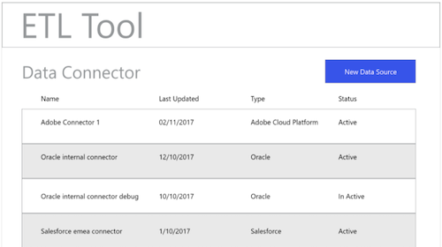
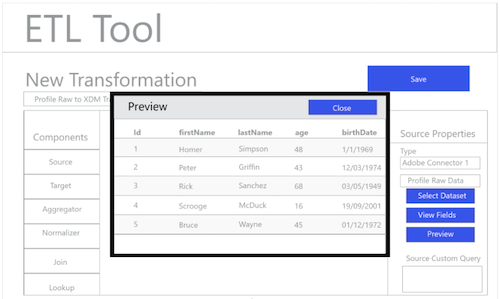

# ETL 워크플로우

다양한 추출, 변환 및 로드(ETL) 도구의 형식이 다를 수 있지만, 가장 유사한 기능을 통해 여러 데이터 소스의 결합을 지원할 수 있습니다.

## ETL 도구 예제

다음 다이어그램은 표준 상호 작용에 따라 일반적인 ETL 작업 및 일반 사용자 경험의 mock-up을 제공합니다. 이러한 이미지는 특정 ETL 사용자 경험에 쉽게 적용할 수 있습니다.

아래 표시된 작업은 내의 단계에 설명되어 있습니다 [ETL 통합 안내서](home.md). 일부 단계는 특정 &quot;그림&quot;을 참조하며, 다른 단계는 여기에 표시된 워크플로우와 유사한 작업을 설명합니다.

### 그림 1 - 새 Adobe Experience Platform 커넥터 구성:

### 그림 2 - [!DNL Experience Platform] 커넥터가 활성화됨:

### 그림 3 - ETL 변환 관리 UI:

### 그림 4 - 새 변형 UI, 선택 [!DNL Experience Platform] 연결:

### 그림 5 - 소스 찾아보기 [!DNL Experience Platform] 데이터 세트:

### 그림 6 - ETL UI의 데이터 집합에 있는 메타데이터 및 샘플 데이터:

### 그림 7 - 데이터 세트에서 필드 스키마 정보 보기:

### 그림 8 - 데이터 세트에서 데이터 미리 보기:

### 그림 9 - 변환 작업을 위한 데이터 동기화 매개변수 정의:

### 그림 10 - 정의 [!DNL Experience Data Model] (XDM) 대상 데이터 세트:

### 그림 11 - 매핑/변형을 지원하기 위해 XDM 계층 스키마 및 메타데이터 보기:

### 그림 12 - 변환 저장 및 실행/예약:

