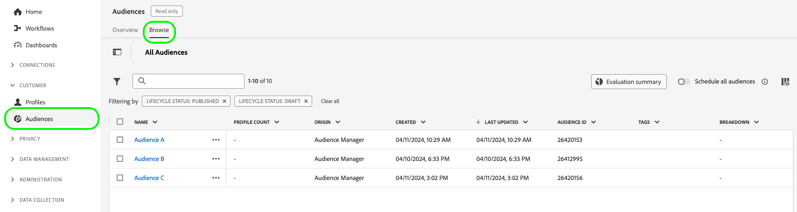

# Audience Manager 확장 활성화를 통해 대상자 활성화

이 페이지에서는 확장된 활성화에서 지원하는 대상 플랫폼에 대해 Audience Manager 대상을 활성화하기 위해 수행해야 하는 전체적인 워크플로에 대해 설명합니다.

## 시작하기에 앞서 {#before-you-begin}

이 안내서에 설명된 단계는 [확장된 활성화 개요 페이지](overview.md)를 읽고 대상 활성화를 위한 사전 요구 사항을 충족하는지 확인했다고 가정합니다.

>[!IMPORTANT]
>
>[!DNL Expanded Activation]을(를) 통해 대상자를 활성화하려면 Audience Manager 대상자가 **해시된 이메일 주소**&#x200B;를 기반으로 하는지 확인하십시오. 자세한 내용은 [필수 구성 요소](overview.md#prerequisites)를 참조하십시오.

## 1단계: Audience Manager 소스 연결 구성 {#configure-source}

[Audience Manager 원본 커넥터](../sources/connectors/adobe-applications/audience-manager.md)는 확장된 활성화에서 지원하는 대상 플랫폼에서 활성화하기 위해 Adobe Audience Manager에서 수집한 대상 데이터를 보냅니다.

[Audience Manager 원본 연결을 만드는 방법](../sources/tutorials/ui/create/adobe-applications/audience-manager.md)에 대한 안내서를 따라 원본 커넥터를 구성하십시오.

>[!TIP]
>
>Adobe Audience Manager 소스 커넥터는 확장된 활성화에서 사용할 수 있는 유일한 소스 커넥터입니다.
>
>추가 식별자를 기반으로 대상을 수집하려면 [Real-Time CDP](../rtcdp/overview.md) 버전을 구입해야 합니다. 자세한 내용은 Adobe 담당자에게 문의하십시오.

### 수집된 대상 보기 및 모니터링 {#view-audiences}

Audience Manager에서 확장된 활성화로 가져오는 대상은 **[!UICONTROL 대상]** 대시보드에서 볼 수 있습니다.

대상자를 보려면 **[!UICONTROL 고객]** -> **[!UICONTROL 대상자]** -> **[!UICONTROL 찾아보기]**(으)로 이동하십시오.

>[!IMPORTANT]
>
>* 대상자가 확장된 활성화에서 완전히 채워지는 데 최대 48시간이 걸릴 수 있습니다. 이는 기존 Audience Manager 대상에 대한 업데이트에도 적용됩니다.
>* 새로 만든 Audience Manager 대상은 확장된 정품 인증에 자동으로 표시되지 않습니다. 확장된 활성화에서 새 세그먼트를 수집하려면 Audience Manager 소스 커넥터를 통해 추가해야 합니다.

Audience Manager 원본 커넥터를 구성한 후 [단계 2](#create-destination-connection)(으)로 이동하십시오.

## 2단계: 새 대상 연결 만들기 {#create-destination-connection}

선택한 대상 플랫폼으로 Audience Manager 대상을 보내려면 먼저 대상 플랫폼에 대한 연결을 만들어야 합니다.

왼쪽 사이드바에서 **[!UICONTROL 연결]** -> **[!UICONTROL 대상]** -> **[!UICONTROL 카탈로그]**(으)로 이동합니다.

[!DNL Expanded Activation]에 사용할 수 있는 대상 범주는 [advertising](../destinations/catalog/advertising/overview.md) 및 [social](../destinations/catalog/social/overview.md)입니다.

대상 플랫폼에 대한 새 연결을 만들려면 [새 대상 연결을 만드는 방법](../destinations/ui/connect-destination.md)의 안내서를 따르십시오. 그런 다음 [3단계](#activate-audiences)(으)로 이동합니다.

## 3단계: 대상에 대한 대상자 활성화 {#activate-audiences}

[Audience Manager 대상을 수집](#configure-source)하고 [새 대상 연결을 생성](#create-destination-connection)하면 이제 대상을 선택한 대상 플랫폼에 활성화할 수 있습니다.

대상에 대해 대상을 활성화하려면 [스트리밍 대상에 대해 대상을 활성화하는 방법](../destinations/ui/activate-segment-streaming-destinations.md)에 대한 안내서를 따르십시오.

## 대상자 활성화 확인 {#verify}

대상에 대한 데이터 흐름을 모니터링하는 방법에 대한 자세한 내용은 [대상 모니터링 설명서](../dataflows/ui/monitor-destinations.md)를 참조하세요.
