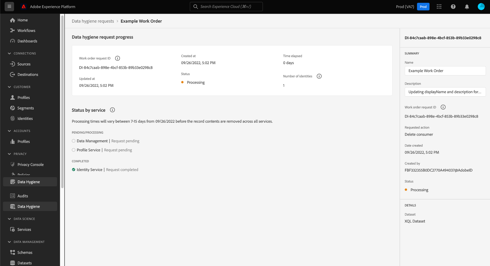

# 데이터 위생 작업 주문 찾아보기 {#browse-work-orders}

>[!CONTEXTUALHELP]
>id="platform_hygiene_workorders"
>title="작업 순서 ID"
>abstract="시스템에 데이터 위생 요청이 전송되면 요청된 작업을 실행하기 위한 작업 순서가 생성됩니다. 즉, 작업 순서는 현재 상태 및 기타 관련 세부 사항을 포함하는 특정 데이터 위생 프로세스를 나타냅니다. 각 작업 순서는 작성 시 자동으로 고유한 ID가 할당됩니다."
>text="See the data hygiene UI guide to learn more."

>[!IMPORTANT]
>
>Adobe Experience Platform의 데이터 위생 기능은 현재 Healthcare Shield를 구입한 조직에서만 사용할 수 있습니다.

시스템에 데이터 위생 요청이 전송되면 요청된 작업을 실행하기 위한 작업 순서가 생성됩니다. 작업 순서는 데이터 집합에 대한 TTL(Scheduled Time to Live)과 같은 특정 데이터 위생 프로세스를 나타내며, 현재 상태 및 기타 관련 세부 정보가 포함됩니다.

이 안내서에서는 Adobe Experience Platform UI에서 기존 작업 지시를 보고 관리하는 방법을 다룹니다.

## 기존 작업 지시 목록 및 필터링

처음 액세스할 때 **[!UICONTROL 데이터 위생]** 작업 공간 의 경우, 기존 작업 주문 목록이 기본 세부 정보와 함께 표시됩니다.

![이미지를 보여주는 이미지 [!UICONTROL 데이터 위생] 플랫폼 UI의 작업 영역](../images/ui/browse/work-order-list.png)

<!-- The list only shows work orders for one category at a time. Select **[!UICONTROL Consumer]** to view a list of consumer deletion tasks, and **[!UICONTROL Dataset]** to view a list of time-to-live (TTL) schedules for datasets.

![Image showing the [!UICONTROL Dataset] tab](../images/ui/browse/dataset-tab.png) -->

단계 아이콘( )을 선택합니다)을 클릭하여 표시된 작업 주문에 대한 필터 목록을 확인합니다.

| 필터 | 설명 |
| --- | --- |
| [!UICONTROL 상태] | 작업 순서의 현재 상태에 따라 필터링합니다.<ul><li>**[!UICONTROL 완료됨]**: 작업이 완료되었습니다.</li><li>**[!UICONTROL 보류 중]**: 작업이 생성되었지만 아직 실행되지 않았습니다. A [데이터 집합 TTL(time-to-live) 요청](./ttl.md) 은 예약된 삭제 날짜 이전에 이 상태를 가정합니다. 삭제 날짜가 되면 상태가 로 업데이트됩니다 [!UICONTROL 실행 중] 작업을 미리 취소하지 않는 한.</li><li>**[!UICONTROL 실행 중]**: 작업이 시작되었으며 현재 처리 중입니다.</li><li>**[!UICONTROL 취소됨]**: 수동 사용자 요청의 일부로 작업이 취소되었습니다.</li></ul> |
| [!UICONTROL 만든 날짜] | 작업 순서가 수행된 시기를 기준으로 필터링합니다. |
| [!UICONTROL 만료 날짜] | 해당 데이터 세트에 대한 예약된 삭제 날짜를 기반으로 TTL 요청을 필터링합니다. |
| [!UICONTROL 업데이트 날짜] | 작업 순서가 마지막으로 업데이트된 시기를 기준으로 TTL 요청을 필터링합니다. TTL 만들기 및 기간은 업데이트로 계산됩니다. |

{style=&quot;table-layout:auto&quot;}

## 작업 주문의 세부 정보 보기

나열된 작업 주문의 ID를 선택하여 해당 상세내역을 확인합니다.

<!-- Depending on the type of work order selected, different information and controls are provided. These are covered in the sections below.

### Consumer delete details

>[!CONTEXTUALHELP]
>id="platform_hygiene_responsemessages"
>title="Consumer delete response"
>abstract="When a consumer deletion process receives a response from the system, these messages are displayed under the **[!UICONTROL Result]** section. If a problem occurs while a work order is processing, any relevant error messages will appear in this section to help you troubleshoot the issue. To learn more, see the data hygiene UI guide."

The details of a consumer delete request are read-only, displaying its basic attributes such as its current status and the time elapsed since the request was made.

### Dataset TTL details -->

데이터 집합 TTL의 세부 정보 페이지에서는 삭제가 발생하기 전 남은 날짜의 예약된 만료 날짜를 포함하여 기본 속성에 대한 정보를 제공합니다. 오른쪽 레일에서 컨트롤을 사용하여 TTL을 편집하거나 취소할 수 있습니다.

## 다음 단계

이 안내서에서는 Platform UI에서 기존 데이터 위생 작업 순서를 보고 관리하는 방법을 다룹니다. 고유한 작업 주문 생성에 대한 자세한 내용은 [데이터 세트 TTL 예약](./ttl.md).
