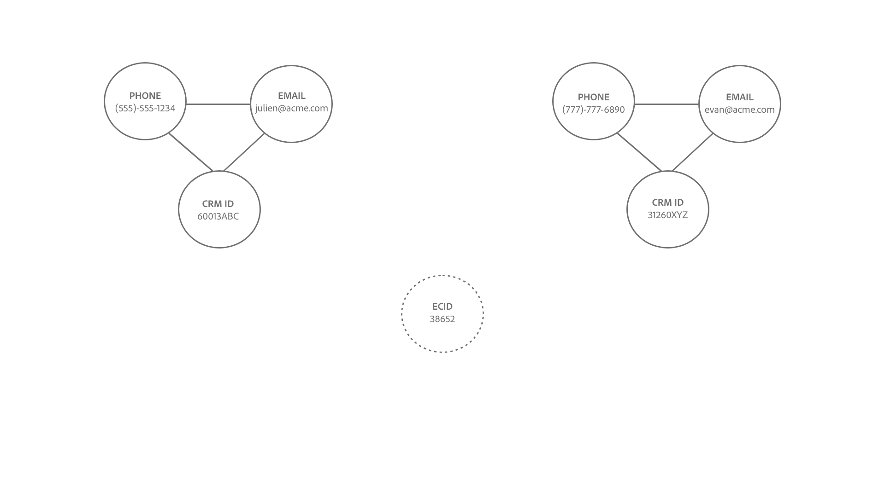

# ID 서비스 연결 논리 {#identity-service-linking-logic}

>[!CONTEXTUALHELP]
>id="platform_identities_simulatedgraph"
>title="시뮬레이션된 그래프"
>abstract="ID 네임스페이스와 ID 값이 일치하면 ID가 연결됩니다."

ID 네임스페이스와 ID 값이 일치하면 두 ID 간의 링크가 설정됩니다.

다음과 같이 연결되는 두 가지 유형의 ID가 있습니다.

* **프로필 레코드**: 이러한 ID는 일반적으로 CRM 시스템에서 가져옵니다.
* **경험 이벤트**: 이러한 ID는 일반적으로 WebSDK 구현 또는 Adobe Analytics 소스에서 가져옵니다.

## 링크 설정의 의미론적 의미

ID는 실제 엔티티를 나타냅니다. 두 ID 사이에 링크가 설정되어 있는 경우 이는 두 ID가 서로 연결되어 있음을 의미합니다. 다음은 이 개념을 설명하는 몇 가지 예입니다.

| 작업 | 링크 설정됨 | 의미 |
| --- | --- | --- |
| 최종 사용자는 컴퓨터를 사용하여 로그인합니다. | CRMID와 ECID는 함께 연결됩니다. | 개인(CRMID)은 브라우저(ECID)가 있는 장치를 소유합니다. |
| 최종 사용자는 iPhone 를 사용하여 익명으로 탐색합니다. | IDFA는 ECID와 연결되어 있습니다. | iPhone과 같은 Apple 하드웨어 장치(IDFA)는 브라우저(ECID)와 연결되어 있습니다. |
| 최종 사용자는 Google Chrome을 사용하여 로그인한 다음 Firefox를 사용하여 로그인합니다. | CRMID는 두 개의 다른 ECID에 연결됩니다. | 사용자(CRMID)가 2개의 웹 브라우저에 연결되어 있습니다(**참고**: 각 브라우저에는 고유한 ECID가 있음). |
| 데이터 엔지니어는 ID로 표시된 두 개의 필드(CRMID 및 이메일)가 포함된 CRM 레코드를 수집합니다. | CRMID와 이메일이 연결되어 있습니다. | 개인(CRMID)은 이메일 주소와 연결됩니다. |

## ID 서비스 연결 논리 이해

ID는 ID 네임스페이스와 ID 값으로 구성됩니다.

* ID 네임스페이스는 지정된 ID 값 의 컨텍스트입니다. ID 네임스페이스의 일반적인 예로는 CRMID, 이메일 및 전화 등이 있습니다.
* ID 값은 실제 엔티티를 나타내는 문자열입니다. 예를 들어 &quot;julien@acme.com&quot;은 이메일 네임스페이스에 대한 ID 값이고 555-555-1234는 전화 네임스페이스에 대한 해당 ID 값일 수 있습니다.

>[!TIP]
>
>ID 네임스페이스가 중요한 이유는 ID 값이 없으면 ID 값의 컨텍스트가 손실되어 ID를 일치시킬 충분한 정보가 없기 때문입니다.

ID 서비스 연결 로직의 작동 방식을 시각적으로 표현하려면 다음 다이어그램을 참조하십시오.

>[!BEGINTABS]

>[!TAB 기존 그래프]

세 개의 연결된 ID가 있는 기존 ID 그래프가 있다고 가정해 봅시다.

* 전화:(555)-555-1234
* 이메일:julien@acme.com
* CRMID:60013ABC

>[!TAB 들어오는 데이터]

ID 쌍이 그래프에 수집되고 이 쌍에는 다음이 포함됩니다.

* CRMID:60013ABC
* ECID:100066526

>[!TAB 업데이트된 그래프]

ID 서비스는 CRMID:60013ABC가 그래프 내에 이미 존재한다는 것을 인식하고 새 ECID만 연결합니다

>[!ENDTABS]

## 고객 시나리오

데이터 엔지니어이며 Experience Platform 대상으로 다음 CRM 데이터 세트(프로필 레코드)를 수집합니다.

| CRMID** | 전화* | 이메일* | 이름 | 성 |
| --- | --- | --- | --- | --- |
| 60013ABC | 555-555-1234 | julien@acme.com | 줄리엔 | Smith |
| 31260XYZ | 777-777-6890 | evan@acme.com | 에번 | Smith |

>[!NOTE]
>
>* `**` - 기본 ID로 표시된 필드를 나타냅니다.
>* `*` - 보조 ID로 표시된 필드를 나타냅니다.
>
>ID 서비스는 기본 ID와 보조 ID를 구분하지 않습니다. 필드가 ID로 표시되는 한 ID 서비스로 수집됩니다.

또한 WebSDK를 구현하고 다음 데이터 테이블로 WebSDK 데이터 세트 (경험 이벤트)를 수집했습니다.

| 타임스탬프 | 이벤트의 ID* | 이벤트 |
| --- | --- | --- |
| `t=1` | ECID:38652 | 홈 페이지 보기 |
| `t=2` | ECID:38652, CRMID:31260XYZ | 신발 검색 |
| `t=3` | ECID:44675 | 홈 페이지 보기 |
| `t=4` | ECID:44675, CRMID: 31260XYZ | 구매 내역 보기 |

각 이벤트에 대한 기본 ID는 [데이터 요소 유형을 구성하는 방법](../../tags/extensions/client/web-sdk/data-element-types.md)에 따라 결정됩니다.

>[!NOTE]
>
>* CRMID를 기본 ID로 선택하면 인증된 이벤트(ID 맵이 CRMID 및 ECID를 포함하는 이벤트)의 기본 ID가 CRMID입니다. 인증되지 않은 이벤트(ID 맵이 ECID만 포함된 이벤트)의 경우 ECID의 기본 ID가 있습니다. Adobe은 이 옵션을 권장합니다.
>
>* 인증 상태에 관계없이 ECID를 기본 ID로 선택하면 ECID가 기본 ID가 됩니다.

이 예제에서는

* `t=1`, 데스크톱 컴퓨터(ECID:38652)를 사용하고 홈 페이지를 보려면 익명으로 검색하십시오.
* `t=2`, 동일한 데스크톱 컴퓨터를 사용하여 (CRMID:31260XYZ)에 로그인한 다음 신발을 검색했습니다.
   * 사용자가 로그인하면 이 이벤트는 ECID와 CRMID를 모두 ID 서비스로 보냅니다.
* `t=3`, 랩톱 컴퓨터(ECID:44675)를 사용하고 익명으로 검색했습니다.
* `t=4`, 동일한 랩톱 컴퓨터를 사용하여 (CRMID: 31260XYZ)에 로그인한 다음 구매 내역을 열람했습니다.

>[!BEGINTABS]

>[!TAB 타임스탬프=0]

`timestamp=0`에 두 명의 다른 고객을 위한 ID 그래프가 두 개 있습니다. 두 사람은 모두 세 개의 연결된 ID로 표시됩니다.

| | CRMID | 이메일 | 휴대폰 |
| --- | --- | --- | --- |
| 고객 1 | 60013ABC | julien@acme.com | 555-555-1234 |
| 고객 2 | 31260XYZ | evan@acme.com | 777-777-6890 |

>[!TAB 타임스탬프=1]

`timestamp=1`에서 고객이 노트북을 사용하여 전자 상거래 웹 사이트를 방문하고 홈 페이지를 열람하며 익명으로 탐색합니다. 이 익명 브라우징 이벤트는 ECID:38652으로 식별됩니다. Identity Service는 두 개 이상의 ID가 있는 이벤트만 저장하므로 이 정보는 저장되지 않습니다.

>[!TAB 타임스탬프=2]

`timestamp=2`에서 고객이 동일한 노트북을 사용하여 전자 상거래 웹 사이트를 방문합니다. 사용자 이름과 암호 조합으로 로그인하여 신발을 찾습니다. ID 서비스는 CRMID: 31260XYZ에 해당하므로 로그인할 때 고객의 계정을 식별합니다. 또한 ID 서비스는 ECID:38562과 CRMID:31260XYZ를 관련시킵니다. 둘 다 동일한 디바이스에서 동일한 브라우저를 사용하기 때문입니다.

>[!TAB 타임스탬프=3]

`timestamp=3`에서 고객이 태블릿을 사용하여 전자 상거래 웹 사이트를 방문하고 익명으로 탐색합니다. 이 익명 브라우징 이벤트는 ECID:44675으로 식별됩니다. Identity Service는 두 개 이상의 ID가 있는 이벤트만 저장하므로 이 정보는 저장되지 않습니다.

>[!TAB 타임스탬프=4]

`timestamp=4`에서 고객은 동일한 태블릿을 사용하여 계정(CRMID:31260XYZ)에 로그인하고 구매 내역을 봅니다. 이 이벤트는 CRMID:31260XYZ를 익명 검색 활동에 할당된 쿠키 식별자 ECID:44675에 연결하고 ECID:44675을 고객 2의 ID 그래프에 연결합니다.

>[!ENDTABS]
