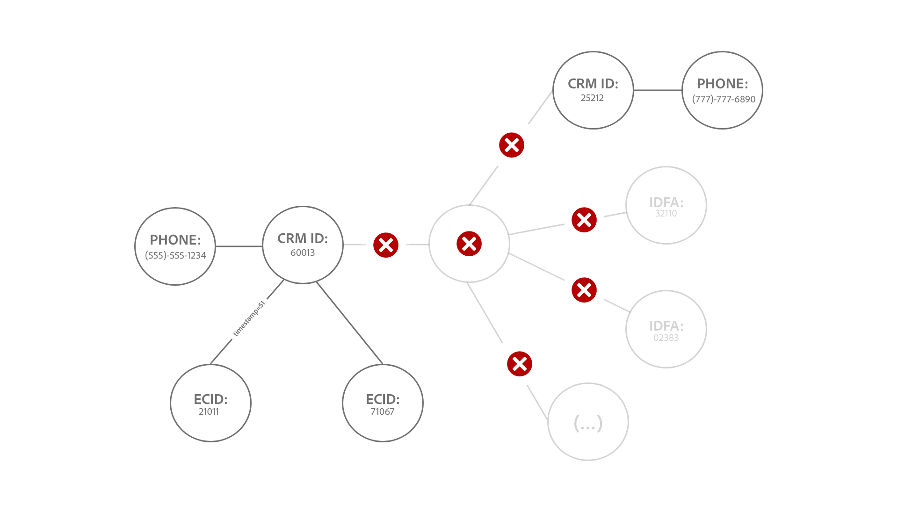

# [!DNL Identity Service] 데이터 보호 기능

이 문서에서는 ID 그래프 사용을 최적화하는 데 도움이 되도록 [!DNL Identity Service] 데이터의 사용 및 속도 제한에 대한 정보를 제공합니다. 다음 가드레일을 검토할 때 데이터를 올바르게 모델링했다고 가정합니다. 데이터 모델링 방법에 대한 질문이 있는 경우 고객 서비스 담당자에게 문의하십시오.

>[!IMPORTANT]
>
>이 보호 기능 페이지 외에 실제 사용 제한에 대해 판매 주문에서 라이선스 자격 및 해당 [제품 설명](https://helpx.adobe.com/kr/legal/product-descriptions.html)을(를) 확인하십시오.

## 시작하기

다음 Experience Platform 서비스는 ID 데이터 모델링과 관련되어 있습니다.

* [ID](home.md): Bridge ID가 Experience Platform에 수집될 때 서로 다른 데이터 소스의 ID입니다.
* [[!DNL Real-Time Customer Profile]](../profile/home.md): 여러 소스의 데이터를 사용하여 통합 소비자 프로필을 만듭니다.

## 데이터 모델 제한

아래 표는 정적 제한에 대한 보호 기능 및 ID 네임스페이스에 대해 고려해야 하는 유효성 검사 규칙에 대한 지침을 제공합니다.

### 정적 제한

다음 표에서는 ID 데이터에 적용되는 정적 제한에 대해 설명합니다.

| 가드레일 | 제한 | 참고 |
| --- | --- | --- |
| 그래프의 ID 수 | 50 | 50개의 연결된 ID가 있는 그래프가 업데이트되면 ID 서비스는 &quot;선입 선출&quot; 메커니즘을 적용하고 가장 오래된 ID를 삭제하여 이 그래프의 최신 ID를 위한 공간을 만듭니다(**참고**: 실시간 고객 프로필은 영향을 받지 않습니다). 삭제는 ID 유형 및 타임스탬프를 기반으로 합니다. 제한은 샌드박스 수준에서 적용됩니다. 자세한 내용은 [삭제 논리 이해](#deletion-logic)의 섹션을 참조하십시오. |
| 단일 배치 수집을 위한 ID 링크 수 | 50 | 단일 일괄 처리에는 원치 않는 그래프 병합을 유발하는 이례적인 ID가 포함될 수 있습니다. 이를 방지하기 위해 ID 서비스는 50개 이상의 ID에 이미 연결된 ID를 수집하지 않습니다. |
| XDM 레코드의 ID 수 | 20 | 필요한 최소 XDM 레코드 수는 2개입니다. |
| 사용자 정의 네임스페이스 수 | None | 만들 수 있는 사용자 정의 네임스페이스의 수에는 제한이 없습니다. |
| 네임스페이스 표시 이름 또는 ID 기호의 문자 수 | None | 네임스페이스 표시 이름 또는 ID 기호의 문자 수에는 제한이 없습니다. |

{style="table-layout:auto"}

### ID 값 유효성 검사

다음 표에서는 ID 값을 성공적으로 확인하기 위해 따라야 하는 기존 규칙에 대해 설명합니다.

| 네임스페이스 | 유효성 검사 규칙 | 규칙 위반 시 시스템 동작 |
| --- | --- | --- |
| ECID | <ul><li>ECID의 ID 값은 정확히 38자여야 합니다.</li><li>ECID의 ID 값은 숫자로만 구성되어야 합니다.</li></ul> | <ul><li>ECID의 ID 값이 정확히 38자가 아닌 경우 레코드를 건너뜁니다.</li><li>ECID의 ID 값에 숫자가 아닌 문자가 포함되어 있으면 레코드를 건너뜁니다.</li></ul> |
| 비 ECID | <ul><li>ID 값은 1024자를 초과할 수 없습니다.</li><li>ID 값은 &quot;null&quot;, &quot;anonymous&quot;, &quot;invalid&quot;이거나 빈 문자열일 수 없습니다(예: &quot; &quot;, &quot;&quot;, &quot;).</li></ul> | <ul><li>ID 값이 1,024자를 초과하는 경우 레코드를 건너뜁니다.</li><li>ID가 수집되지 않도록 차단됩니다.</li></ul> |

{style="table-layout:auto"}

### ID 네임스페이스 수집

2023년 3월 31일부터 Identity Service는 신규 고객에 대한 Adobe Analytics ID(AAID) 수집을 차단합니다. 이 ID는 일반적으로 [Adobe Analytics 소스](../sources/connectors/adobe-applications/analytics.md) 및 [Adobe Audience Manager 소스](../sources//connectors/adobe-applications/audience-manager.md)를 통해 수집되며 ECID가 동일한 웹 브라우저를 나타내므로 중복됩니다. 이 기본 구성을 변경하려면 Adobe 계정 팀에 문의하십시오.

## 성능 가드레일 {#performance-guardrails}

ID 서비스는 들어오는 데이터를 지속적으로 모니터링하여 규모에 맞게 높은 성능과 안정성을 보장합니다. 그러나 경험 이벤트 데이터가 짧은 기간에 유입되면 성능 저하 및 지연 시간이 발생할 수 있습니다. Adobe은 이러한 성능 저하에 대한 책임이 없습니다.

## 생산 능력의 ID 그래프가 업데이트될 때의 삭제 논리 이해 {#deletion-logic}

전체 ID 그래프가 업데이트되면 Identity Service는 최신 ID를 추가하기 전에 그래프에서 가장 오래된 ID를 삭제합니다. 이는 신원 데이터의 정확성과 관련성을 유지하기 위함이다. 이 삭제 프로세스는 다음 두 가지 기본 규칙을 따릅니다.

### 규칙 #1 삭제는 네임스페이스의 ID 유형에 따라 우선 순위가 지정됩니다

삭제 우선 순위는 다음과 같습니다.

1. 쿠키 ID
2. 디바이스 ID
3. 교차 장치 ID, 이메일 및 전화

### 규칙 #2 삭제는 ID에 저장된 타임스탬프를 기반으로 합니다

그래프에 연결된 각 ID에는 해당하는 자체 타임스탬프가 있습니다. 전체 그래프가 업데이트되면 Identity Service는 타임스탬프가 가장 오래된 ID를 삭제합니다.

전체 그래프가 새 ID로 업데이트되면 이 두 규칙이 함께 작동하여 삭제할 이전 ID를 지정합니다. ID 서비스는 먼저 가장 오래된 쿠키 ID를 삭제한 다음 가장 오래된 장치 ID를 삭제하고 마지막으로 가장 오래된 교차 장치 ID/이메일/전화를 삭제합니다.

>[!NOTE]
>
>삭제하도록 지정된 ID가 그래프의 여러 다른 ID에 연결되어 있는 경우 해당 ID를 연결하는 링크도 삭제됩니다.

### 구현에 대한 영향

다음 섹션에서는 ID 서비스, 실시간 고객 프로필 및 WebSDK에 대한 삭제 논리의 의미에 대해 간략히 설명합니다.

#### ID 서비스: 사용자 지정 네임스페이스 ID 유형 변경

프로덕션 샌드박스에 다음이 포함된 경우 Adobe 계정 팀에 문의하여 ID 유형 변경을 요청하십시오.

* 개인 식별자(예: CRMID)가 쿠키/장치 ID 유형으로 구성되는 사용자 정의 네임스페이스입니다.
* 쿠키/장치 식별자가 교차 장치 ID 유형으로 구성된 사용자 지정 네임스페이스입니다.

이 기능을 사용할 수 있게 되면 50개 ID의 제한을 초과하는 그래프는 최대 50개 ID로 줄어듭니다. Real-Time CDP B2C Edition의 경우, 이전에는 세분화 및 활성화에서 무시했던 프로필이므로 대상자에 적합한 프로필 수가 최소한으로 증가할 수 있습니다.

#### 실시간 고객 프로필: 대응 가능 대상에 미치는 영향

삭제는 ID 서비스의 데이터에만 발생하며 실시간 고객 프로필에는 발생하지 않습니다.

* ECID가 더 이상 ID 그래프의 일부가 아니기 때문에 이 동작은 결과적으로 단일 ECID로 더 많은 프로필을 만들 수 있습니다.
* 지정 가능한 대상 권한 번호를 계속 사용하려면 [익명 프로필 데이터 만료](../profile/pseudonymous-profiles.md)을(를) 활성화하여 이전 프로필을 삭제하는 것이 좋습니다.

#### 실시간 고객 프로필 및 WebSDK: 기본 ID 삭제

CRMID에 대해 인증된 이벤트를 유지하려면 기본 ID를 ECID에서 CRMID로 변경하는 것이 좋습니다. 이 변경 사항을 구현하는 방법에 대한 단계는 다음 문서를 참조하십시오.

* [Experience Platform 태그에 대한 ID 맵을 구성합니다](../tags/extensions/client/web-sdk/data-element-types.md#identity-map).
* [Experience Platform Web SDK의 ID 데이터](../web-sdk/identity/overview.md#using-identitymap)

### 예제 시나리오

#### 예 1: 전형적인 큰 그래프

*다이어그램 메모:*

* `t` = 타임스탬프.
* 타임스탬프 값은 지정된 ID의 최신성에 해당합니다. 예를 들어 `t1`은(는) 연결된 첫 번째 ID(가장 오래된)를 나타내고 `t51`은(는) 연결된 최신 ID를 나타냅니다.

이 예에서 왼쪽의 그래프를 새 ID로 업데이트하려면 먼저 ID 서비스에서 가장 오래된 타임스탬프가 있는 기존 ID를 삭제합니다. 그러나 가장 오래된 ID는 장치 ID이므로 ID 서비스는 삭제 우선 순위 목록에서 더 높은 유형의 네임스페이스에 도달할 때까지 해당 ID를 건너뜁니다. 이 경우 `ecid-3`입니다. 삭제 우선 순위 유형이 더 높은 가장 오래된 ID가 제거되면 그래프가 새 링크 `ecid-51`(으)로 업데이트됩니다.

* 드문 경우지만 동일한 타임스탬프와 ID 유형을 가진 두 개의 ID가 있는 경우 Identity Service는 [XID](./api/list-native-id.md)을(를) 기반으로 ID를 정렬하고 삭제합니다.

#### 예제 2: &quot;graph split&quot;

>[!BEGINTABS]

>[!TAB 들어오는 이벤트]

*다이어그램 메모:*

* 다음 다이어그램은 `timestamp=50`에 ID 그래프에 50개의 ID가 있다고 가정합니다.
* `(...)`은(는) 그래프 내에 이미 연결되어 있는 다른 ID를 나타냅니다.

이 예에서 ECID:32110은 수집되고 `timestamp=51`에 큰 그래프에 연결되어 50개의 ID 제한을 초과합니다.

>[!TAB 삭제 프로세스]

따라서 ID 서비스는 타임스탬프 및 ID 유형에 따라 가장 오래된 ID를 삭제합니다. 이 경우 ECID:35577은 ID 그래프에서만 삭제됩니다.

>[!TAB 그래프 출력]

ECID:35577을 삭제하면 CRMID:60013 및 CRMID:25212을 현재 삭제된 ECID:35577과 연결한 에지도 삭제됩니다. 이 삭제 프로세스를 수행하면 그래프가 두 개의 더 작은 그래프로 분할됩니다.

>[!ENDTABS]

#### 예제 3: &quot;hub-and-spoke&quot;

>[!BEGINTABS]

>[!TAB 들어오는 이벤트]

*다이어그램 메모:*

* 다음 다이어그램은 `timestamp=50`에 ID 그래프에 50개의 ID가 있다고 가정합니다.
* `(...)`은(는) 그래프 내에 이미 연결되어 있는 다른 ID를 나타냅니다.

삭제 논리로 인해 일부 &quot;허브&quot; ID도 삭제될 수 있습니다. 이러한 허브 ID는 연결되지 않은 여러 개별 ID에 연결된 노드를 나타냅니다.

아래 예에서 ECID:21011이 수집되고 `timestamp=51`에 그래프에 연결되므로 ID 제한이 50개를 초과합니다.

>[!TAB 삭제 프로세스]

따라서 ID 서비스는 ID 그래프에서 가장 오래된 ID만 삭제합니다(이 경우 ECID:35577). ECID:35577을 삭제하면 다음 항목도 삭제됩니다.

* CRMID:60013과 현재 삭제된 ECID:35577 간의 링크로 인해 그래프 분할 시나리오가 발생합니다.
* IDFA: 32110, IDFA: 02383 및 `(...)`(으)로 표시되는 나머지 ID입니다. 이러한 ID는 개별적으로 다른 ID와 연결되어 있지 않으므로 그래프로 표시할 수 없으므로 삭제됩니다.

>[!TAB 그래프 출력]

마지막으로 삭제 프로세스는 두 개의 더 작은 그래프를 생성합니다.

>[!ENDTABS]

## 다음 단계

[!DNL Identity Service]에 대한 자세한 내용은 다음 설명서를 참조하십시오.

* [[!DNL Identity Service] 개요](home.md)
* [ID 그래프 뷰어](features/identity-graph-viewer.md)

Real-Time CDP 제품 설명 문서의 기타 Experience Platform 서비스 보호, 종단 간 지연 정보 및 라이선스 정보에 대한 자세한 내용은 다음 설명서를 참조하십시오.

* [Real-Time CDP 보호 기능](/help/rtcdp/guardrails/overview.md)
* 다양한 Experience Platform 서비스에 대한 [전체 지연 다이어그램](https://experienceleague.adobe.com/docs/blueprints-learn/architecture/architecture-overview/deployment/guardrails.html?lang=ko#end-to-end-latency-diagrams).
* [Real-Time Customer Data Platform(B2C 에디션 - Prime 및 Ultimate 패키지)](https://helpx.adobe.com/kr/legal/product-descriptions/real-time-customer-data-platform-b2c-edition-prime-and-ultimate-packages.html)
* [Real-Time Customer Data Platform(B2P - Prime 및 Ultimate 패키지)](https://helpx.adobe.com/kr/legal/product-descriptions/real-time-customer-data-platform-b2p-edition-prime-and-ultimate-packages.html)
* [Real-Time Customer Data Platform(B2B - Prime 및 Ultimate 패키지)](https://helpx.adobe.com/kr/legal/product-descriptions/real-time-customer-data-platform-b2b-edition-prime-and-ultimate-packages.html)
