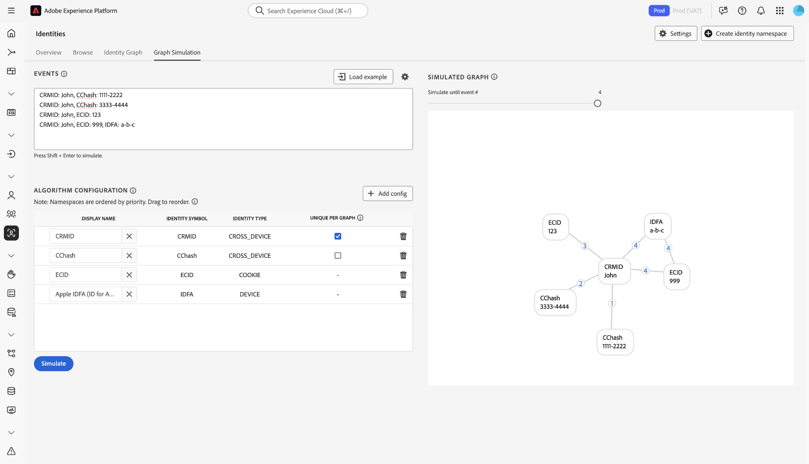
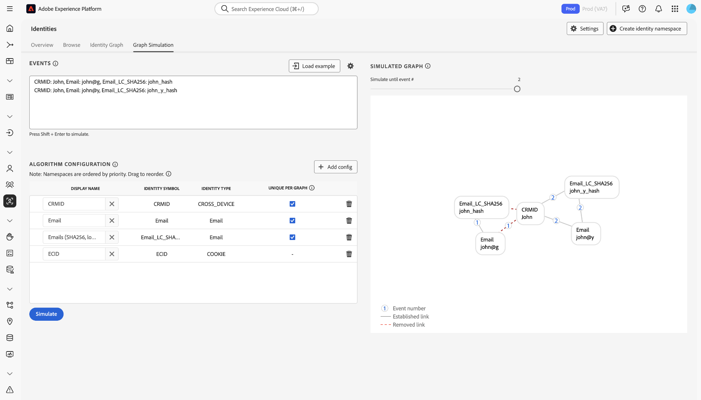

# [!DNL Identity Graph Linking Rules] 구성 안내서 {#configurations-guide}

>[!CONTEXTUALHELP]
>id="platform_identities_algorithmconfiguration"
>title="알고리즘 구성"
>abstract="수집한 ID에 맞게 고유한 네임스페이스와 네임스페이스 우선순위를 구성하십시오."

>[!NOTE]
>
>* &quot;CRMID&quot; 및 &quot;loginID&quot;는 사용자 정의 네임스페이스입니다. 이 문서에서 &quot;CRMID&quot;는 개인 식별자이고 &quot;loginID&quot;는 지정된 사용자와 연관된 로그인 식별자입니다.
>* 이 문서에 설명된 예제 그래프 시나리오를 시뮬레이션하려면 먼저 ID 기호가 &quot;CRMID&quot;인 네임스페이스와 ID 기호가 &quot;loginID&quot;인 네임스페이스를 두 개 사용자 정의 생성해야 합니다. ID 기호는 대/소문자를 구분합니다.

[!DNL Identity Graph Linking Rules]을(를) 사용하여 구성할 수 있는 다양한 구현 유형에 대해 알아보려면 이 문서를 참조하십시오.

고객 그래프 시나리오는 세 가지 다른 카테고리로 그룹화할 수 있습니다.

* **기본**: [기본 구현](#basic-implementations)에는 간단한 구현을 가장 많이 포함하는 그래프가 포함되어 있습니다. 이러한 구현은 단일 크로스 디바이스 네임스페이스(예: CRMID)를 중심으로 돌아가는 경향이 있습니다. 기본 구현은 매우 간단하지만 **공유 장치** 시나리오로 인해 그래프 축소가 발생할 수 있습니다.
* **중간**: [중간 구현](#intermediate-implementations)에는 **여러 장치 간 네임스페이스**, **고유하지 않은 ID** 및 **여러 고유 네임스페이스**&#x200B;와 같은 여러 변수가 포함되어 있습니다.
* **고급**: [고급 구현](#advanced-implementations)에는 복잡하고 여러 계층으로 구성된 그래프 시나리오가 포함됩니다. 고급 구현의 경우 적절한 링크가 제거되어 그래프 축소가 발생하지 않도록 하려면 올바른 네임스페이스 우선 순위 지정을 반드시 수행해야 합니다.

## 시작

다음 문서로 이동하기 전에 Identity Service 및 [!DNL Identity Graph Linking Rules]에 대한 몇 가지 중요한 개념을 숙지하십시오.

* [ID 서비스 개요](../home.md)
* [[!DNL Identity Graph Linking Rules] 개요](../identity-graph-linking-rules/namespace-priority.md)
* [네임스페이스 우선순위](namespace-priority.md)
* [고유한 네임스페이스](overview.md#unique-namespace)
* [그래프 시뮬레이션](graph-simulation.md)

## 기본 구현 {#basic-implementations}

[!DNL Identity Graph Linking Rules]의 기본 구현을 보려면 이 섹션을 읽어 보십시오.

### 사용 사례: 하나의 크로스 디바이스 네임스페이스를 사용하는 간단한 구현

일반적으로 Adobe 고객은 웹, 모바일 및 애플리케이션을 비롯한 모든 속성에서 사용되는 단일 크로스 디바이스 네임스페이스를 갖습니다. 소매, 통신 및 금융 서비스의 고객이 이러한 유형의 구현을 사용하므로 이 시스템은 업계 및 지리적으로 불가지론적입니다.

일반적으로 최종 사용자는 크로스 디바이스 네임스페이스(종종 CRMID)로 표시되므로 CRMID는 고유한 네임스페이스로 분류되어야 합니다. 컴퓨터와 [!DNL iPhone]을(를) 소유하고 장치를 공유하지 않는 최종 사용자는 다음과 같은 ID 그래프를 가질 수 있습니다.

전자 상거래 회사 **ACME**&#x200B;의 데이터 설계자라고 가정합니다. 존과 제인은 당신의 고객입니다. California의 San Jose에 함께 거주하는 최종 사용자입니다. 데스크톱 컴퓨터를 공유하고 이 컴퓨터를 사용하여 웹 사이트를 탐색합니다. 마찬가지로 John과 Jane도 [!DNL iPad]을(를) 공유하고 이 [!DNL iPad]을(를) 사용하여 웹 사이트를 비롯한 인터넷을 탐색합니다.

**텍스트 모드**

```json
CRMID: John, ECID: 123
CRMID: John, ECID: 999, IDFA: a-b-c
```

**알고리즘 구성(ID 설정)**

그래프를 시뮬레이션하기 전에 그래프 시뮬레이션 인터페이스에서 다음 설정을 구성합니다.

| 표시 이름 | ID 심볼 | ID 유형 | 그래프별로 고유 | 네임스페이스 우선순위 |
| --- | --- | --- | --- | --- |
| CRMID | CRMID | CROSS_DEVICE | ✔️ | 1 |
| ECID | ECID | 쿠키 | | 2 |
| IDFA | IDFA | 장치 | | 3 |

**시뮬레이션된 그래프**

+++시뮬레이션된 그래프를 보려면 선택

이 그래프에서 John(최종 사용자)은 CRMID로 표시됩니다. {ECID: 123}은(는) John이 전자 상거래 플랫폼을 방문하기 위해 개인 컴퓨터에서 사용한 웹 브라우저를 나타냅니다. {ECID: 999}은(는) [!DNL iPhone]에서 사용한 브라우저를 나타내고 {IDFA: a-b-c}은(는) [!DNL iPhone]을(를) 나타냅니다.


+++

### 운동

그래프 시뮬레이션에서 다음 구성을 시뮬레이션하십시오. 이벤트를 직접 만들거나 텍스트 모드를 사용하여 복사하여 붙여넣을 수 있습니다.

>[!BEGINTABS]

>[!TAB PC(공유 장치)]

**PC(공유 장치)**

**텍스트 모드:**

```json
CRMID: John, ECID: 111
CRMID: Jane, ECID: 111
```

**시뮬레이션된 그래프**

+++시뮬레이션된 그래프를 보려면 선택

이 그래프에서 John과 Jane은 각각 CRMID로 표시됩니다.

* {CRMID: John}
* {CRMID: Jane}

전자 상거래 플랫폼을 방문하는 데 사용하는 데스크톱 컴퓨터의 브라우저는 {ECID: 111}(으)로 표시됩니다. 이 그래프 시나리오에서 Jane은 마지막으로 인증된 최종 사용자이므로 {ECID: 111}과(와) {CRMID: John} 사이의 연결이 제거됩니다.


+++

>[!TAB 공유 장치(모바일)]

**공유 장치(모바일)**

**텍스트 모드:**

```json
CRMID: John, ECID: 111, IDFA: a-b-c
CRMID: Jane, ECID: 111, IDFA: a-b-c
```

**시뮬레이션된 그래프**

+++시뮬레이션된 그래프를 보려면 선택

이 그래프에서 John과 Jane은 모두 고유한 CRMID로 표시됩니다. 사용하는 브라우저는 {ECID: 111}(으)로 표시되고 공유하는 [!DNL iPad]은(는) {IDFA: a-b-c}(으)로 표시됩니다. 이 그래프 시나리오에서는 Jane이 마지막으로 인증된 최종 사용자이므로 {ECID: 111} 및 {IDFA: a-b-c}에서 {CRMID: John}까지의 링크가 제거됩니다.


+++

>[!ENDTABS]

## 중간 구현 {#intermediate-implementations}

[!DNL Identity Graph Linking Rules]의 중간 구현은 이 섹션을 참조하십시오.

### 사용 사례: 데이터에 고유하지 않은 ID가 포함됨

>[!TIP]
>
>* **고유하지 않은 ID**&#x200B;은(는) 고유하지 않은 네임스페이스와 연결된 ID입니다.
>
>* 아래 예에서 `CChash`은(는) 해시된 신용 카드 번호를 나타내는 사용자 지정 네임스페이스입니다.

당신은 신용카드를 발급하는 상업은행에 근무하고 있는 데이터 설계자입니다. 마케팅 팀이 프로필에 이전 신용 카드 거래 내역을 포함하기를 원한다고 표시했습니다. 이 ID 그래프는 다음과 같을 수 있습니다.

**텍스트 모드:**

```json
CRMID: John, CChash: 1111-2222 
CRMID: John, CChash: 3333-4444 
CRMID: John, ECID: 123 
CRMID: John, ECID: 999, IDFA: a-b-c
```

**알고리즘 구성(ID 설정)**

그래프를 시뮬레이션하기 전에 그래프 시뮬레이션 인터페이스에서 다음 설정을 구성합니다.

| 표시 이름 | ID 심볼 | ID 유형 | 그래프별로 고유 | 네임스페이스 우선순위 |
| --- | --- | --- | --- | --- |
| CRMID | CRMID | CROSS_DEVICE | ✔️ | 1 |
| 해시 | 해시 | CROSS_DEVICE | | 2 |
| ECID | ECID | 쿠키 | | 3 |
| IDFA | IDFA | 장치 | | 4 |

**시뮬레이션된 그래프**

+++시뮬레이션된 그래프를 보려면 선택



+++

이러한 신용 카드 번호 또는 고유하지 않은 다른 네임스페이스가 항상 단일 최종 사용자 한 명에게 연결된다는 보장은 없습니다. 두 명의 최종 사용자가 동일한 신용 카드에 등록할 수 있으며, 잘못 수집된 고유하지 않은 자리 표시자 값이 있을 수 있습니다. 간단히 말해, 고유하지 않은 네임스페이스로 인해 그래프가 축소되지 않는다는 보장이 없습니다.

이 문제를 해결하기 위해 ID 서비스는 가장 오래된 링크를 제거하고 가장 최근 링크를 유지합니다. 이렇게 하면 그래프에 CRMID가 하나만 있으므로 그래프 축소를 방지할 수 있습니다.

### 운동

그래프 시뮬레이션에서 다음 구성을 시뮬레이션하십시오. 이벤트를 직접 만들거나 텍스트 모드를 사용하여 복사하여 붙여넣을 수 있습니다.

>[!BEGINTABS]

>[!TAB 동일한 신용 카드를 가진 최종 사용자 두 명]

동일한 신용 카드로 전자 상거래 웹 사이트에 두 명의 다른 최종 사용자가 등록합니다. 마케팅 팀은 신용 카드가 하나의 프로필에만 연결되어 있는지 확인하여 그래프 축소를 방지하려고 합니다.

**텍스트 모드:**

```json
CRMID: John, CChash: 1111-2222
CRMID: Jane, CChash: 1111-2222
CRMID: John, ECID: 123
CRMID: Jane, ECID:456
```

**시뮬레이션된 그래프**

+++시뮬레이션된 그래프를 보려면 선택


+++

>[!TAB 잘못된 신용 카드 번호]

잘못된 데이터로 인해 잘못된 신용 카드 번호가 Experience Platform에 수집됩니다.

**텍스트 모드:**

```json
CRMID: John, CChash: undefined
CRMID: Jane, CChash: undefined
CRMID: Jack, CChash: undefined
CRMID: Jill, CChash: undefined
```

**시뮬레이션된 그래프**

+++시뮬레이션된 그래프를 보려면 선택


+++

>[!ENDTABS]

### 사용 사례: 데이터에 해시된 CRMID와 해시되지 않은 CRMID가 모두 포함됩니다

해시되지 않은(오프라인) CRMID와 해시된(온라인) CRMID를 모두 섭취하는 중입니다. 이들은 해시된 CRMID와 해시된 CRMID 간에 직접적인 관계를 기대한다. 최종 사용자가 인증된 계정을 사용하여 탐색할 때 해시된 CRMID가 장치 ID(ID 서비스에 ECID로 표시됨)와 함께 전송됩니다.

**알고리즘 구성(ID 설정)**

그래프를 시뮬레이션하기 전에 그래프 시뮬레이션 인터페이스에서 다음 설정을 구성합니다.

| 표시 이름 | ID 심볼 | ID 유형 | 그래프별로 고유 | 네임스페이스 우선순위 |
| --- | --- | --- | --- | --- | 
| CRMID | CRMID | CROSS_DEVICE | ✔️ | 1 |
| CRMIDhash | CRMIDhash | CROSS_DEVICE | ✔️ | 2 |
| ECID | ECID | 쿠키 | | 3 |


**연습**

그래프 시뮬레이션에서 다음 구성을 시뮬레이션하십시오. 이벤트를 직접 만들거나 텍스트 모드를 사용하여 복사하여 붙여넣을 수 있습니다.

>[!BEGINTABS]

>[!TAB 시나리오 1: 공유된 장치]

존과 제인은 장치를 공유합니다.

**텍스트 모드:**

```json
CRMID: John, CRMIDhash: John
CRMID: Jane, CRMIDhash: Jane
CRMIDhash: John, ECID: 111 
CRMIDhash: Jane, ECID: 111
```


>[!TAB 시나리오 2: 잘못된 데이터]

해시 프로세스의 오류로 인해 고유하지 않은 해시된 CRMID가 생성되어 ID 서비스로 전송됩니다.

**텍스트 모드:**

```json
CRMID: John, CRMIDhash: aaaa
CRMID: Jane, CRMIDhash: aaaa
```


>[!ENDTABS]
<!-- 
### Use case: You are using Real-Time CDP and Adobe Commerce

You have two types of end-users:

* **Members**: An end-user who is assigned a CRMID and has an email account registered to your system.
* **Guests**: An end-user who is not a member. They do not have an assigned CRMID and their email accounts are not registered to your system.

In this scenario, your customers are sending data from Adobe Commerce to Real-Time CDP.

**Exercise**

Simulate the following configurations in the graph simulation tool. You can either create your own events, or copy and paste using text mode.

>[!BEGINTABS]

>[!TAB Shared device between two members]

In this scenario, two members share the same device to browse an e-commerce website.

**Text mode**

```json
CRMID: John, Email: john@g
CRMID: Jane, Email: jane@g
CRMID: John, ECID: 111
CRMID: Jane, ECID: 111
```


>[!TAB Shared device between two guests]

In this scenario, two guests share the same device to browse an e-commerce website.

**Text mode**

```json
Email: john@g, ECID: 111
Email: jane@g, ECID: 111
```


>[!TAB Shared device between a member and a guest]

In this scenario, a member and a guest share the same device to browse an e-commerce website.

**Text mode**

```json
CRMID: John, Email: john@g
CRMID: John, ECID: 111
Email: jane@g, ECID: 111
```


>[!ENDTABS] -->

### 사용 사례: 데이터에는 세 개의 고유한 네임스페이스가 포함됩니다

고객은 다음과 같이 1인 엔티티를 정의합니다.

* CRMID가 할당된 최종 사용자.
* 해시된 전자 메일을 지원하는 대상으로 프로필을 활성화할 수 있도록 해시된 전자 메일 주소에 연결된 최종 사용자(예: [!DNL Facebook]).
* 지원 담당자가 해당 이메일 주소를 사용하여 Real-Time CDP에서 프로필을 조회할 수 있도록 이메일 주소와 연결된 최종 사용자입니다.

| 표시 이름 | ID 심볼 | ID 유형 | 그래프별로 고유 | 네임스페이스 우선순위 |
| --- | --- | --- | --- | --- |
| CRMID | CRMID | CROSS_DEVICE | ✔️ | 1 |
| 이메일 | 이메일 | 이메일 | ✔️ | 2 |
| Email_LC_SHA256 | Email_LC_SHA256 | 이메일 | ✔️ | 3 |
| ECID | ECID | 쿠키 | | 4 |

그래프 시뮬레이션 도구에서 다음 구성을 시뮬레이션합니다. 이벤트를 직접 만들거나 텍스트 모드를 사용하여 복사하여 붙여넣을 수 있습니다.

>[!BEGINTABS]

>[!TAB 두 명의 최종 사용자가 로그인함]

이 시나리오에서 John과 Jane은 둘 다 전자 상거래 웹 사이트에 로그인합니다.

**텍스트 모드**

```json
CRMID: John, Email: john@g, Email_LC_SHA256: john_hash 
CRMID: Jane, Email: jane@g, Email_LC_SHA256: jane_hash 
CRMID: John, ECID: 111 
CRMID: Jane, ECID: 111
```


>[!TAB 최종 사용자가 전자 메일을 변경합니다]

**텍스트 모드**

```json
CRMID: John, Email: john@g, Email_LC_SHA256: john_hash
CRMID: John, Email: john@y, Email_LC_SHA256: john_y_hash
```



>[!ENDTABS]

## 고급 구현 {#advanced-implementations}

고급 구현에는 복잡하고 여러 계층이 있는 그래프 시나리오가 포함됩니다. 이러한 구현 유형에는 그래프 축소를 방지하기 위해 제거해야 하는 올바른 링크를 식별하기 위한 **네임스페이스 우선 순위**&#x200B;의 사용이 포함됩니다.

**네임스페이스 우선 순위**&#x200B;은(는) 중요도별로 네임스페이스의 등급을 지정하는 메타데이터입니다. 그래프에 각각 다른 고유한 네임스페이스를 가진 두 개의 ID가 포함된 경우 ID 서비스는 네임스페이스 우선 순위를 사용하여 제거할 링크를 결정합니다. 자세한 내용은 네임스페이스 우선 순위에 대한 [설명서를 읽어보세요](../identity-graph-linking-rules/namespace-priority.md).

네임스페이스 우선 순위는 복잡한 그래프 시나리오에서 중요한 역할을 합니다. 그래프는 여러 계층을 가질 수 있습니다. 최종 사용자는 여러 로그인 ID와 연결될 수 있으며 이러한 로그인 ID는 해시될 수 있습니다. 또한 서로 다른 ECID를 서로 다른 로그인 ID에 연결할 수 있습니다. 올바른 링크를 제거하려면 오른쪽 레이어에서 네임스페이스 우선 순위 구성이 올바른지 확인해야 합니다.

[!DNL Identity Graph Linking Rules]의 고급 구현을 보려면 이 섹션을 읽어 보십시오.

### 사용 사례: 여러 비즈니스 라인에 대한 지원이 필요합니다.

최종 사용자에게는 개인 계정과 비즈니스 계정, 이렇게 두 개의 다른 계정이 있습니다. 각 계정은 다른 ID로 식별됩니다. 이 시나리오에서 일반적인 그래프는 다음과 같습니다.

**텍스트 모드***

```json
CRMID: John, loginID: JohnPersonal
CRMID: John, loginID: JohnBusiness
loginID: JohnPersonal, ECID: 111
loginID: JohnPersonal, ECID: 222
loginID: JohnBusiness, ECID: 222
```

**알고리즘 구성(ID 설정)**

그래프를 시뮬레이션하기 전에 그래프 시뮬레이션 인터페이스에서 다음 설정을 구성합니다.

| 표시 이름 | ID 심볼 | ID 유형 | 그래프별로 고유 | 네임스페이스 우선순위 |
| --- | --- | --- | --- | --- |
| CRMID | CRMID | CROSS_DEVICE | ✔️ | 1 |
| loginID | loginID | CROSS_DEVICE | | 2 |
| ECID | ECID | 쿠키 | | 3 |

**시뮬레이션된 그래프**

+++시뮬레이션된 그래프를 보려면 선택


+++


**연습**

그래프 시뮬레이션에서 다음 구성을 시뮬레이션하십시오. 이벤트를 직접 만들거나 텍스트 모드를 사용하여 복사하여 붙여넣을 수 있습니다.

>[!BEGINTABS]

>[!TAB 공유된 장치]

**텍스트 모드**

```json
CRMID: John, loginID: JohnPersonal
CRMID: John, loginID: JohnBusiness
CRMID: Jane, loginID: JanePersonal
CRMID: Jane, loginID: JaneBusiness
loginID: JohnPersonal, ECID: 111
loginID: JanePersonal, ECID: 111
```


>[!TAB 잘못된 데이터가 Real-Time CDP으로 전송됨]

```json
CRMID: John, loginID: JohnPersonal
CRMID: John, loginID: error
CRMID: Jane, loginID: JanePersonal
CRMID: Jane, loginID: error
loginID: JohnPersonal, ECID: 111
loginID: JanePersonal, ECID: 222
```


>[!ENDTABS]

### 사용 사례: 여러 네임스페이스가 필요한 복잡한 구현이 있습니다

미디어 및 엔터테인먼트 회사이며 최종 사용자에게는 다음과 같은 사항이 있습니다.
* CRMID
* 충성도 ID
또한 최종 사용자는 전자 상거래 웹 사이트에서 구매할 수 있으며 이 데이터는 이메일 주소에 연결되어 있습니다. 또한 사용자 데이터는 서드파티 데이터베이스 공급자에 의해 보강되어 Experience Platform으로 일괄적으로 전송됩니다.

**텍스트 모드**

```json
CRMID: John, loyaltyID: John, Email: john@g
Email: john@g, orderID: aaa
CRMID: John, thirdPartyID: xyz
CRMID: John, ECID: 111
```

**알고리즘 구성(ID 설정)**

그래프를 시뮬레이션하기 전에 그래프 시뮬레이션 인터페이스에서 다음 설정을 구성합니다.

| 표시 이름 | ID 심볼 | ID 유형 | 그래프별로 고유 | 네임스페이스 우선순위 |
| --- | --- | --- | --- | --- |
| CRMID | CRMID | CROSS_DEVICE | ✔️ | 1 |
| loyaltyID | loyaltyID | CROSS_DEVICE | | 2 |
| 이메일 | 이메일 | 이메일 | | 3 |
| 타사 ID | 타사 ID | CROSS_DEVICE | | 4 |
| orderID | orderID | CROSS_DEVICE | | 5 |
| ECID | ECID | 쿠키 | | 6 |

**연습**

그래프 시뮬레이션에서 다음 구성을 시뮬레이션하십시오. 이벤트를 직접 만들거나 텍스트 모드를 사용하여 복사하여 붙여넣을 수 있습니다.

>[!BEGINTABS]

>[!TAB 공유된 장치]

**텍스트 모드**

```json
CRMID: John, loyaltyID: John, Email: john@g
CRMID: Jane, loyaltyID: Jane, Email: jane@g
Email: john@g, orderID: aaa 
CRMID: John, thirdPartyID: xyz 
CRMID: John, ECID: 111
CRMID: Jane, ECID: 111
```


>[!TAB 최종 사용자가 전자 메일 주소를 변경합니다]

**텍스트 모드**

```json
CRMID: John, loyaltyID: John, Email: john@g
CRMID: John, loyaltyID: John, Email: john@y
```


>[!TAB thirdPartyID 연결 변경]

**텍스트 모드**

```json
CRMID: John, loyaltyID: John, Email: john@g
CRMID: Jane, loyaltyID: Jane, Email: jane@g
CRMID: John, thirdPartyID: xyz
CRMID: Jane, thirdPartyID: xyz
```


>[!TAB 고유하지 않은 orderID]

**텍스트 모드**

```json
CRMID: John, loyaltyID: John, Email: john@g
CRMID: Jane, loyaltyID: Jane, Email: jane@g
Email: john@g, orderID: aaa
Email: jane@g, orderID: aaa
```


>[!TAB 잘못된 loyaltyID]

**텍스트 모드**

```json
CRMID: John, loyaltyID: aaa, Email: john@g
CRMID: Jane, loyaltyID: aaa, Email: jane@g
```


>[!ENDTABS]

## 다음 단계

[!DNL Identity Graph Linking Rules]에 대한 자세한 내용은 다음 설명서를 참조하십시오.

* [[!DNL Identity Graph Linking Rules] 개요](./overview.md)
* [ID 최적화 알고리즘](./identity-optimization-algorithm.md)
* [구현 안내서](./implementation-guide.md)
* [문제 해결 및 FAQ](./troubleshooting.md)
* [네임스페이스 우선순위](./namespace-priority.md)
* [그래프 시뮬레이션 UI](./graph-simulation.md)
* [ID 설정 UI](./identity-settings-ui.md)