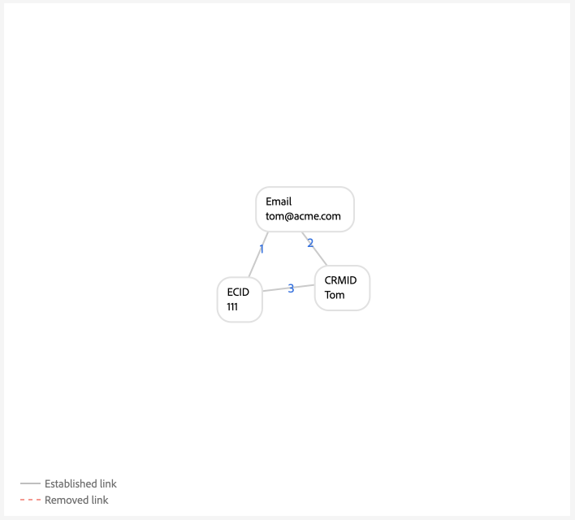

# 그래프 구성의 예 {#examples-of-graph-configurations}

>[!CONTEXTUALHELP]
>id="platform_identities_algorithmconfiguration"
>title="알고리즘 구성"
>abstract="수집한 ID에 맞게 고유한 네임스페이스와 네임스페이스 우선순위를 구성하십시오."

>[!NOTE]
>
>* &quot;CRMID&quot; 및 &quot;loginID&quot;는 사용자 정의 네임스페이스입니다. 이 문서에서 &quot;CRMID&quot;는 개인 식별자이고 &quot;loginID&quot;는 지정된 사용자와 연관된 로그인 식별자입니다.
>* 이 문서에 설명된 예제 그래프 시나리오를 시뮬레이션하려면 먼저 ID 기호가 &quot;CRMID&quot;인 네임스페이스와 ID 기호가 &quot;loginID&quot;인 네임스페이스를 두 개 사용자 정의 생성해야 합니다. ID 기호는 대/소문자를 구분합니다.

이 문서에서는 [!DNL Identity Graph Linking Rules] 및 ID 데이터로 작업할 때 발생할 수 있는 일반적인 시나리오의 그래프 구성 예제에 대해 간략히 설명합니다.

## CRMID만

이는 온라인 이벤트(CRMID 및 ECID)가 수집되고 오프라인 이벤트(프로필 레코드)가 CRMID에 대해서만 저장되는 간단한 구현 시나리오의 예입니다.

**구현:**

| 사용된 네임스페이스 | 웹 동작 수집 방법 |
| --- | --- |
| CRMID, ECID | Web SDK |

**이벤트:**

다음 이벤트를 텍스트 모드에 복사하여 그래프 시뮬레이션에서 이 시나리오를 생성할 수 있습니다.

```shell
CRMID: Tom, ECID: 111
```

**알고리즘 구성:**

알고리즘 구성에 대해 다음 설정을 구성하여 그래프 시뮬레이션에서 이 시나리오를 생성할 수 있습니다.

| 우선 순위 | 표시 이름 | ID 유형 | 그래프별로 고유 |
| ---| --- | --- | --- |
| 1 | CRMID | CROSS_DEVICE | 예 |
| 2 | ECID | 쿠키 | 아니요 |

**실시간 고객 프로필에 대한 기본 ID 선택:**

이 구성의 컨텍스트 내에서 기본 ID는 다음과 같이 정의됩니다.

| 인증 상태 | 이벤트의 네임스페이스 | 기본 ID |
| --- | --- | --- |
| Authenticated | CRMID, ECID | CRMID |
| 인증되지 않음 | ECID | ECID |

**그래프 예**

>[!BEGINTABS]

>[!TAB 이상적인 1인 그래프]

다음은 CRMID가 고유하고 우선 순위가 가장 높은 이상적인 1인 그래프의 예입니다.


>[!TAB 여러 사용자 그래프]

다음은 다인용 그래프의 예입니다. 이 예에서는 &quot;공유 장치&quot; 시나리오를 표시합니다. 여기서 두 개의 CRMID가 있고 이전 링크가 설정된 CRMID가 제거됩니다.


**그래프 시뮬레이션 이벤트 입력**

```shell
CRMID: Tom, ECID: 111
CRMID: Summer, ECID: 111
```

>[!ENDTABS]

## 해시된 이메일이 포함된 CRMID

이 시나리오에서 CRMID는 수집되며 온라인(경험 이벤트) 및 오프라인(프로필 레코드) 데이터를 모두 나타냅니다. 이 시나리오에는 CRMID와 함께 CRM 레코드 데이터 세트에서 전송된 다른 네임스페이스를 나타내는 해시된 이메일의 수집도 포함됩니다.

>[!IMPORTANT]
>
>**모든 사용자에 대해 CRMID가 항상 전송되어야 합니다**. 이렇게 하지 않으면 단일 개인 엔티티가 다른 사용자와 디바이스를 공유하는 것으로 간주되는 &quot;댕글링&quot; 로그인 ID 시나리오가 발생할 수 있습니다.

**구현:**

| 사용된 네임스페이스 | 웹 동작 수집 방법 |
| --- | --- |
| CRMID, Email_LC_SHA256, ECID | Web SDK |

**이벤트:**

다음 이벤트를 텍스트 모드에 복사하여 그래프 시뮬레이션에서 이 시나리오를 생성할 수 있습니다.

```shell
CRMID: Tom, Email_LC_SHA256: tom<span>@acme.com
CRMID: Tom, ECID: 111
CRMID: Summer, Email_LC_SHA256: summer<span>@acme.com
CRMID: Summer, ECID: 222
```

**알고리즘 구성:**

알고리즘 구성에 대해 다음 설정을 구성하여 그래프 시뮬레이션에서 이 시나리오를 생성할 수 있습니다.

| 우선 순위 | 표시 이름 | ID 유형 | 그래프별로 고유 |
| ---| --- | --- | --- |
| 1 | CRMID | CROSS_DEVICE | 예 |
| 2 | 이메일(SHA256, 소문자) | 이메일 | 아니요 |
| 3 | ECID | 쿠키 | 아니요 |

**프로필에 대한 기본 ID 선택:**

이 구성의 컨텍스트 내에서 기본 ID는 다음과 같이 정의됩니다.

| 인증 상태 | 이벤트의 네임스페이스 | 기본 ID |
| --- | --- | --- |
| Authenticated | CRMID, ECID | CRMID |
| 인증되지 않음 | ECID | ECID |

**그래프 예**

>[!BEGINTABS]

>[!TAB 이상적인 1인 그래프]

다음은 각 CRMID가 해시된 이메일 네임스페이스 및 ECID와 연결된 이상적인 1인 그래프 쌍의 예입니다.


>[!TAB 여러 사용자 그래프: 공유된 장치]

다음은 두 사람이 디바이스를 공유하는 여러 사용자 그래프 시나리오의 예입니다.


**그래프 시뮬레이션 이벤트 입력**

```shell
CRMID: Tom, Email_LC_SHA256: aabbcc
CRMID: Tom, ECID: 111
CRMID: Summer, Email_LC_SHA256: ddeeff
CRMID: Summer, ECID: 222
CRMID: Summer, ECID: 111
```

>[!TAB 여러 사용자 그래프: 고유하지 않은 전자 메일]

다음은 이메일이 고유하지 않고 두 개의 다른 CRMID와 연결된 다인 그래프 시나리오의 예입니다.


**그래프 시뮬레이션 이벤트 입력**

```shell
CRMID: Tom, Email_LC_SHA256: aabbcc
CRMID: Tom, ECID: 111
CRMID: Summer, Email_LC_SHA256: ddeeff
CRMID: Summer, ECID: 222
CRMID: Summer, Email_LC_SHA256: aabbcc
```

>[!ENDTABS]

## 해시된 이메일, 해시된 휴대폰, GAID 및 IDFA가 포함된 CRMID

이 시나리오는 이전 시나리오와 유사합니다. 그러나 이 시나리오에서는 해시된 이메일과 전화기가 [[!DNL Segment Match]](../../segmentation/ui/segment-match/overview.md)에서 사용할 ID로 표시됩니다.

>[!IMPORTANT]
>
>**모든 사용자에 대해 CRMID가 항상 전송되어야 합니다**. 이렇게 하지 않으면 단일 개인 엔티티가 다른 사용자와 디바이스를 공유하는 것으로 간주되는 &quot;댕글링&quot; 로그인 ID 시나리오가 발생할 수 있습니다.

**구현:**

| 사용된 네임스페이스 | 웹 동작 수집 방법 |
| --- | --- |
| CRMID, Email_LC_SHA256, Phone_SHA256, GAID, IDFA, ECID | Web SDK |

**이벤트:**

다음 이벤트를 텍스트 모드에 복사하여 그래프 시뮬레이션에서 이 시나리오를 생성할 수 있습니다.

```shell
CRMID: Tom, Email_LC_SHA256: aabbcc, Phone_SHA256: 123-4567
CRMID: Tom, ECID: 111
CRMID: Tom, ECID: 222, IDFA: A-A-A
CRMID: Summer, Email_LC_SHA256: ddeeff, Phone_SHA256: 765-4321
CRMID: Summer, ECID: 333
CRMID: Summer, ECID: 444, GAID:B-B-B
```

**알고리즘 구성:**

알고리즘 구성에 대해 다음 설정을 구성하여 그래프 시뮬레이션에서 이 시나리오를 생성할 수 있습니다.

| 우선 순위 | 표시 이름 | ID 유형 | 그래프별로 고유 |
| ---| --- | --- | --- |
| 1 | CRMID | CROSS_DEVICE | 예 |
| 2 | 이메일(SHA256, 소문자) | 이메일 | 아니요 |
| 3 | 휴대폰 (SHA256) | 휴대폰 | 아니요 |
| 4 | Google 광고 ID (GAID) | 장치 | 아니요 |
| 5 | Apple IDFA (Apple의 ID) | 장치 | 아니요 |
| 6 | ECID | 쿠키 | 아니요 |

**프로필에 대한 기본 ID 선택:**

이 구성의 컨텍스트 내에서 기본 ID는 다음과 같이 정의됩니다.

| 인증 상태 | 이벤트의 네임스페이스 | 기본 ID |
| --- | --- | --- |
| Authenticated | CRMID, IDFA, ECID | CRMID |
| Authenticated | CRMID, GAID, ECID | CRMID |
| Authenticated | CRMID, ECID | CRMID |
| 인증되지 않음 | GAID, ECID | GAID |
| 인증되지 않음 | IDFA, ECID | IDFA |
| 인증되지 않음 | ECID | ECID |

**그래프 예**

>[!BEGINTABS]

>[!TAB 이상적인 1인 그래프]

다음은 해시된 전자 메일과 해시된 전화기가 [!DNL Segment Match]에서 사용할 ID로 표시되는 이상적인 1인 그래프 시나리오입니다. 이 시나리오에서는 그래프가 두 개로 나뉘어 서로 다른 개인 엔티티를 나타냅니다.


>[!TAB 여러 사용자 그래프: 공유 장치, 공유 컴퓨터]

다음은 장치(컴퓨터)를 두 사람이 공유하는 여러 사람 그래프 시나리오입니다. 이 시나리오에서 공유 컴퓨터는 `{ECID: 111}`(으)로 표시되며 `{CRMID: Summer}`에 연결됩니다. 해당 링크는 가장 최근에 설정된 링크이기 때문입니다. `{CRMID: Tom}`과(와) `{ECID: 111}` 사이의 연결이 오래되었으며 CRMID가 이 구성에서 지정된 고유 네임스페이스이므로 `{CRMID: Tom}`이(가) 제거되었습니다.


**그래프 시뮬레이션 이벤트 입력**

```shell
CRMID: Tom, Email_LC_SHA256: aabbcc, Phone_SHA256: 123-4567
CRMID: Tom, ECID: 111
CRMID: Tom, ECID: 222, IDFA: A-A-A
CRMID: Summer, Email_LC_SHA256: ddeeff, Phone_SHA256: 765-4321
CRMID: Summer, ECID: 333
CRMID: Summer, ECID: 444, GAID:B-B-B
CRMID: Summer, ECID: 111
```

>[!TAB 여러 사용자 그래프: 공유 장치, android 모바일 장치]

다음은 Android 장치를 두 사람이 공유하는 다인 그래프 시나리오입니다. 이 시나리오에서는 CRMID가 고유한 네임스페이스로 구성되므로 `{CRMID: Tom, GAID: B-B-B, ECID:444}`의 최신 링크가 이전 `{CRMID: Summer, GAID: B-B-B, ECID:444}`보다 우선합니다.


**그래프 시뮬레이션 이벤트 입력**

```shell
CRMID: Tom, Email_LC_SHA256: aabbcc, Phone_SHA256: 123-4567
CRMID: Tom, ECID: 111
CRMID: Tom, ECID: 222, IDFA: A-A-A
CRMID: Summer, Email_LC_SHA256: ddeeff, Phone_SHA256: 765-4321
CRMID: Summer, ECID: 333
CRMID: Summer, ECID: 444, GAID: B-B-B
CRMID: Tom, ECID: 444, GAID: B-B-B
```

>[!TAB 여러 사용자 그래프: 공유 장치, apple 모바일 장치, ECID 재설정 안 함]

다음은 두 사람이 Apple 장치를 공유하는 여러 사람 그래프 시나리오입니다. 이 시나리오에서는 IDFA가 공유되지만 ECID는 재설정되지 않습니다.


**그래프 시뮬레이션 이벤트 입력**

```shell
CRMID: Tom, Email_LC_SHA256: aabbcc, Phone_SHA256: 123-4567
CRMID: Tom, ECID: 111
CRMID: Tom, ECID: 222, IDFA: A-A-A
CRMID: Summer, Email_LC_SHA256: ddeeff, Phone_SHA256: 765-4321
CRMID: Summer, ECID: 333
CRMID: Summer, ECID: 444, GAID: B-B-B
CRMID: Summer, ECID: 222, IDFA: A-A-A
```

>[!TAB 여러 사용자 그래프: 공유 장치, apple, ECID 재설정]

다음은 두 사람이 Apple 장치를 공유하는 여러 사람 그래프 시나리오입니다. 이 시나리오에서는 ECID가 재설정되지만 IDFA는 동일하게 유지됩니다.


**그래프 시뮬레이션 이벤트 입력**

```shell
CRMID: Tom, Email_LC_SHA256: aabbcc, Phone_SHA256: 123-4567
CRMID: Tom, ECID: 111
CRMID: Tom, ECID: 222, IDFA: A-A-A
CRMID: Summer, Email_LC_SHA256: ddeeff, Phone_SHA256: 765-4321
CRMID: Summer, ECID: 333
CRMID: Summer, ECID: 444, GAID: B-B-B
CRMID: Summer, ECID: 555, IDFA: A-A-A
```

>[!TAB 여러 사용자 그래프: 고유하지 않은 전화]

다음은 두 사람이 동일한 전화 번호를 공유하는 여러 사람 그래프 시나리오입니다.


**그래프 시뮬레이션 이벤트 입력**

```shell
CRMID: Tom, Email_LC_SHA256: aabbcc, Phone_SHA256: 123-4567
CRMID: Tom, ECID: 111
CRMID: Tom, ECID: 222, IDFA: A-A-A
CRMID: Summer, Email_LC_SHA256: ddeeff, Phone_SHA256: 765-4321
CRMID: Summer, ECID: 333
CRMID: Summer, ECID: 444, GAID: B-B-B
CRMID: Summer, Phone_SHA256: 123-4567
```

이 예제에서 `{Phone_SHA256}`은(는) 고유한 네임스페이스로 표시됩니다. 따라서 그래프는 `{Phone_SHA256}` 네임스페이스를 가진 ID를 두 개 이상 가질 수 없습니다. 이 시나리오에서는 `{Phone_SHA256: 765-4321}`이(가) 이전 링크이므로 `{CRMID: Summer}` 및 `{Email_LC_SHA256: ddeeff}`에서 연결 해제됩니다.


>[!TAB 여러 사용자 그래프: 고유하지 않은 전자 메일]

다음은 두 사람이 이메일을 공유하는 여러 사용자 그래프 시나리오입니다.


**그래프 시뮬레이션 이벤트 입력**

```shell
CRMID: Tom, Email_LC_SHA256: aabbcc, Phone_SHA256: 123-4567
CRMID: Tom, ECID: 111
CRMID: Tom, ECID: 222, IDFA: A-A-A
CRMID: Summer, Email_LC_SHA256: ddeeff, Phone_SHA256: 765-4321
CRMID: Summer, ECID: 333
CRMID: Summer, ECID: 444, GAID: B-B-B
CRMID: Summer, Email_LC_SHA256: aabbcc
```

>[!ENDTABS]

## 여러 로그인 ID가 있는 단일 CRMID(단순 버전)

이 시나리오에는 개인 엔티티를 나타내는 단일 CRMID가 있습니다. 단, 개인 엔티티에는 여러 로그인 식별자가 있을 수 있습니다.

* 지정된 개인 엔티티는 서로 다른 계정 유형(개인 및 비즈니스, 주별 계정, 브랜드별 계정 등)을 가질 수 있습니다.
* 특정 개인 엔티티는 계정 수에 관계없이 다른 이메일 주소를 사용할 수 있습니다.

>[!IMPORTANT]
>
>**모든 사용자에 대해 CRMID가 항상 전송되어야 합니다**. 이렇게 하지 않으면 단일 개인 엔티티가 다른 사용자와 디바이스를 공유하는 것으로 간주되는 &quot;댕글링&quot; 로그인 ID 시나리오가 발생할 수 있습니다.

**구현:**

| 사용된 네임스페이스 | 웹 동작 수집 방법 |
| --- | --- |
| CRMID, loginID, ECID | Web SDK |

**이벤트:**

다음 이벤트를 텍스트 모드에 복사하여 그래프 시뮬레이션에서 이 시나리오를 생성할 수 있습니다.

```shell
CRMID: Tom, loginID: ID_A
CRMID: Tom, loginID: ID_B
loginID: ID_A, ECID: 111
CRMID: Summer, loginID: ID_C
CRMID: Summer, loginID: ID_D
loginID: ID_C, ECID: 222
```

**알고리즘 구성:**

알고리즘 구성에 대해 다음 설정을 구성하여 그래프 시뮬레이션에서 이 시나리오를 생성할 수 있습니다.

| 우선 순위 | 표시 이름 | ID 유형 | 그래프별로 고유 |
| ---| --- | --- | --- |
| 1 | CRMID | CROSS_DEVICE | 예 |
| 2 | loginID | CROSS_DEVICE | 아니요 |
| 3 | ECID | 쿠키 | 아니요 |

**프로필에 대한 기본 ID 선택:**

이 구성의 컨텍스트 내에서 기본 ID는 다음과 같이 정의됩니다.

| 인증 상태 | 이벤트의 네임스페이스 | 기본 ID |
| --- | --- | --- |
| Authenticated | loginID, ECID | loginID |
| Authenticated | loginID, ECID | loginID |
| Authenticated | CRMID, loginID, ECID | CRMID |
| Authenticated | CRMID, ECID | CRMID |
| 인증되지 않음 | ECID | ECID |

**그래프 예**

>[!BEGINTABS]

>[!TAB 이상적인 1인 시나리오]

다음은 단일 CRMID와 여러 로그인 ID를 사용하는 1인 그래프 시나리오입니다.


>[!TAB 여러 사용자 그래프 시나리오: 공유 장치]

다음은 두 사람이 디바이스를 공유하는 여러 사용자 그래프 시나리오입니다. 이 시나리오에서 `{ECID:111}`은(는) `{loginID:ID_A}` 및 `{loginID:ID_C}`과(와) 모두 연결되어 있으며 `{ECID:111, loginID:ID_A}`의 이전 설정된 링크가 제거됩니다.


**그래프 시뮬레이션 이벤트 입력**

```shell
CRMID: Tom, loginID: ID_A
CRMID: Tom, loginID: ID_B
loginID: ID_A, ECID: 111
CRMID: Summer, loginID: ID_C
CRMID: Summer, loginID: ID_D
loginID: ID_C, ECID: 222
loginID: ID_C, ECID: 111
```

>[!TAB 여러 사용자 그래프 시나리오: 잘못된 데이터]

다음은 잘못된 데이터를 포함하는 여러 사용자 그래프 시나리오입니다. 이 시나리오에서는 `{loginID:ID_D}`이(가) 서로 다른 두 사용자에게 잘못 연결되어 있으며, 더 최근에 설정된 링크를 위해 이전 타임스탬프가 있는 링크가 삭제됩니다.


**그래프 시뮬레이션 이벤트 입력**

```shell
CRMID: Tom, loginID: ID_A
CRMID: Tom, loginID: ID_B
loginID: ID_A, ECID: 111
CRMID: Summer, loginID: ID_C
CRMID: Summer, loginID: ID_D
loginID: ID_C, ECID: 222
CRMID: Tom, loginID: ID_D
```

>[!TAB &#39;Dangling&#39; loginID]

다음 그래프는 &quot;댕글링&quot; loginID 시나리오를 시뮬레이션합니다. 이 예에서는 두 개의 서로 다른 loginID가 동일한 ECID에 바인딩됩니다. 그러나 `{loginID:ID_C}`은(는) CRMID에 연결되어 있지 않습니다. 따라서 Identity Service에서는 이 두 로그인 ID가 서로 다른 두 엔티티를 나타내는지 감지할 수 없습니다.


**그래프 시뮬레이션 이벤트 입력**

```shell
CRMID: Tom, loginID: ID_A
CRMID: Tom, loginID: ID_B
loginID: ID_A, ECID: 111
loginID: ID_C, ECID: 111
```

>[!ENDTABS]

## 여러 로그인 ID가 있는 단일 CRMID(복잡한 버전)

이 시나리오에는 개인 엔티티를 나타내는 단일 CRMID가 있습니다. 단, 개인 엔티티에는 여러 로그인 식별자가 있을 수 있습니다.

* 지정된 개인 엔티티는 서로 다른 계정 유형(개인 및 비즈니스, 주별 계정, 브랜드별 계정 등)을 가질 수 있습니다.
* 특정 개인 엔티티는 계정 수에 관계없이 다른 이메일 주소를 사용할 수 있습니다.

>[!IMPORTANT]
>
>**모든 사용자에 대해 CRMID가 항상 전송되어야 합니다**. 이렇게 하지 않으면 단일 개인 엔티티가 다른 사용자와 디바이스를 공유하는 것으로 간주되는 &quot;댕글링&quot; 로그인 ID 시나리오가 발생할 수 있습니다.

**구현:**

| 사용된 네임스페이스 | 웹 동작 수집 방법 |
| --- | --- |
| CRMID, Email_LC_SHA256, Phone_SHA256, loginID, ECID | Adobe Analytics 소스 커넥터. <br> **참고:** 기본적으로 AAID는 ID 서비스에서 차단되므로 Analytics 원본을 사용할 때 ECID에 AAID보다 우선 순위를 높여야 합니다. 자세한 내용은 [구현 가이드](./implementation-guide.md#ingest-your-data)를 참조하십시오.</br> |

**이벤트:**

다음 이벤트를 텍스트 모드에 복사하여 그래프 시뮬레이션에서 이 시나리오를 생성할 수 있습니다.

```shell
CRMID: Tom, Email_LC_SHA256: aabbcc, Phone_SHA256: 123-4567
CRMID: Tom, loginID: ID_A
CRMID: Tom, loginID: ID_B
loginID: ID_A, ECID: 111
CRMID: Summer, Email_LC_SHA256: ddeeff, Phone_SHA256: 765-4321
CRMID: Summer, loginID: ID_C
CRMID: Summer, loginID: ID_D
loginID: ID_C, ECID: 222
```

**알고리즘 구성:**

알고리즘 구성에 대해 다음 설정을 구성하여 그래프 시뮬레이션에서 이 시나리오를 생성할 수 있습니다.

| 우선 순위 | 표시 이름 | ID 유형 | 그래프별로 고유 |
| ---| --- | --- | --- | 
| 1 | CRMID | CROSS_DEVICE | 예 |
| 2 | Email_LC_SHA256 | 이메일 | 아니요 |
| 3 | Phone_SHA256 | 휴대폰 | 아니요 |
| 4 | loginID | CROSS_DEVICE | 아니요 |
| 5 | ECID | 쿠키 | 아니요 |
| 6 | AAID | 쿠키 | 아니요 |

**프로필에 대한 기본 ID 선택:**

이 구성의 컨텍스트 내에서 기본 ID는 다음과 같이 정의됩니다.

| 인증 상태 | 이벤트의 네임스페이스 | 기본 ID |
| --- | --- | --- |
| Authenticated | loginID, ECID | loginID |
| Authenticated | loginID, ECID | loginID |
| Authenticated | CRMID, loginID, ECID | CRMID |
| Authenticated | CRMID, ECID | CRMID |
| 인증되지 않음 | ECID | ECID |

**그래프 예**

>[!BEGINTABS]

>[!TAB 이상적인 1인 그래프]

다음은 각각 CRMID와 여러 로그인 ID가 있는 두 개의 1인 그래프의 예입니다.


>[!TAB 여러 사용자 그래프: 공유 장치 1]

다음은 `{ECID:111}`이(가) `{loginID:ID_A}`과(와) `{loginID:ID_C}`에 모두 연결되어 있는 다중 사용자 공유 장치 시나리오입니다. 이 경우, 이전에 설정된 링크는 최근에 설정된 링크를 위해 제거됩니다.


**그래프 시뮬레이션 이벤트 입력**

```shell
CRMID: Tom, Email_LC_SHA256: aabbcc, Phone_SHA256: 123-4567
CRMID: Tom, loginID: ID_A
CRMID: Tom, loginID: ID_B
loginID: ID_A, ECID: 111
CRMID: Summer, Email_LC_SHA256: ddeeff, Phone_SHA256: 765-4321
CRMID: Summer, loginID: ID_C
CRMID: Summer, loginID: ID_D
loginID: ID_C, ECID: 222
loginID: ID_C, ECID: 111
```

>[!TAB 여러 사용자 그래프: 공유 장치 2]

이 시나리오에서는 loginID만 보내는 대신 loginID와 CRMID가 모두 경험 이벤트로 전송됩니다.


**그래프 시뮬레이션 이벤트 입력**

```shell
CRMID: Tom, Email_LC_SHA256: aabbcc, Phone_SHA256: 123-4567
CRMID: Tom, loginID: ID_A
CRMID: Tom, loginID: ID_B
loginID: ID_A, ECID: 111
CRMID: Summer, Email_LC_SHA256: ddeeff, Phone_SHA256: 765-4321
CRMID: Summer, loginID: ID_C
CRMID: Summer, loginID: ID_D
loginID: ID_C, ECID: 222
CRMID: Summer, loginID: ID_C, ECID: 111
loginID: ID_A, ECID: 111
```

>[!TAB 여러 사용자 그래프: 잘못된 loginID 데이터]

이 시나리오에서 `{loginID:ID_C}`은(는) `{CRMID:Tom}` 및 `{CRMID:Summer}`에 모두 연결되어 있으므로 이상적인 그래프 시나리오가 동일한 loginID를 서로 다른 두 사용자에게 연결해서는 안 되므로 잘못된 데이터입니다. 이 경우, 이전에 설정된 링크는 최근에 설정된 링크를 위해 제거됩니다.


**그래프 시뮬레이션 이벤트 입력**

```shell
CRMID: Tom, Email_LC_SHA256: aabbcc, Phone_SHA256: 123-4567
CRMID: Tom, loginID: ID_A
CRMID: Tom, loginID: ID_B
loginID: ID_A, ECID: 111
CRMID: Summer, Email_LC_SHA256: ddeeff, Phone_SHA256: 765-4321
CRMID: Summer, loginID: ID_C
CRMID: Summer, loginID: ID_D
loginID: ID_C, ECID: 222
CRMID: Tom, loginID: ID_C
```

>[!TAB 여러 사용자 그래프: 고유하지 않은 전자 메일]

이 시나리오에서 고유하지 않은 이메일이 두 개의 다른 CRMID와 연결되어 있으므로 보다 최근에 설정된 링크를 위해 이전에 설정된 링크가 제거됩니다.


**그래프 시뮬레이션 이벤트 입력**

```shell
CRMID: Tom, Email_LC_SHA256: aabbcc, Phone_SHA256: 123-4567
CRMID: Tom, loginID: ID_A
CRMID: Tom, loginID: ID_B
loginID: ID_A, ECID: 111
CRMID: Summer, Email_LC_SHA256: ddeeff, Phone_SHA256: 765-4321
CRMID: Summer, loginID: ID_C
CRMID: Summer, loginID: ID_D
loginID: ID_C, ECID: 222
CRMID: Summer, Email_LC_SHA256: aabbcc
```

>[!TAB 여러 사용자 그래프: 고유하지 않은 전화]

이 시나리오에서 고유하지 않은 전화 번호가 두 개의 다른 CRMID와 연결되고 있으므로, 보다 최근에 설정된 링크를 위해 이전에 설정된 링크가 제거됩니다.


**그래프 시뮬레이션 이벤트 입력**

```shell
CRMID: Tom, Email_LC_SHA256: aabbcc, Phone_SHA256: 123-4567
CRMID: Tom, loginID: ID_A
CRMID: Tom, loginID: ID_B
loginID: ID_A, ECID: 111
CRMID: Summer, Email_LC_SHA256: ddeeff, Phone_SHA256: 765-4321
CRMID: Summer, loginID: ID_C
CRMID: Summer, loginID: ID_D
loginID: ID_C, ECID: 222
CRMID: Tom, Phone_SHA256: 111-1111
CRMID: Summer, Phone_SHA256: 111-1111
```

>[!ENDTABS]

## 다른 Adobe Commerce에서의 사용

이 섹션의 그래프 구성 예는 Adobe Commerce의 사용 사례를 요약합니다. 아래 예제는 두 가지 사용자 유형을 사용하는 소매 고객을 대상으로 합니다.

* 등록된 사용자(계정을 만든 사용자)
* 게스트 사용자(이메일 주소만 있는 사용자)

>[!IMPORTANT]
>
>**모든 사용자에 대해 CRMID가 항상 전송되어야 합니다**. 이렇게 하지 않으면 단일 개인 엔티티가 다른 사용자와 디바이스를 공유하는 것으로 간주되는 &quot;댕글링&quot; 로그인 ID 시나리오가 발생할 수 있습니다.

**구현:**

| 사용된 네임스페이스 | 웹 동작 수집 방법 |
| --- | --- |
| CRMID, 이메일, ECID | Web SDK |

**이벤트:**

다음 이벤트를 텍스트 모드에 복사하여 그래프 시뮬레이션에서 이 시나리오를 생성할 수 있습니다.

```shell
CRMID: Tom, Email: tom@acme.com
CRMID: Tom, ECID: 111
```

**알고리즘 구성:**

알고리즘 구성에 대해 다음 설정을 구성하여 그래프 시뮬레이션에서 이 시나리오를 생성할 수 있습니다.

| 우선 순위 | 표시 이름 | ID 유형 | 그래프별로 고유 |
| ---| --- | --- | --- | 
| 1 | CRMID | CROSS_DEVICE | 예 |
| 2 | 이메일 | 이메일 | 예 |
| 5 | ECID | 쿠키 | 아니요 |

**프로필에 대한 기본 ID 선택:**

이 구성의 컨텍스트 내에서 기본 ID는 다음과 같이 정의됩니다.

| 사용자 활동 | 이벤트의 네임스페이스 | 기본 ID |
| --- | --- | --- |
| 인증된 브라우징 | CRMID, ECID | CRMID |
| 게스트 체크아웃 | 이메일, ECID | 이메일 |
| 인증되지 않은 검색 | ECID | ECID |

>[!WARNING]
>
>등록된 사용자는 다음 그래프 시나리오가 작동하려면 프로필에 CRMID와 이메일을 모두 입력해야 합니다.

**그래프 예**

>[!BEGINTABS]

>[!TAB 이상적인 1인 그래프]

다음은 이상적인 1인 그래프의 예입니다.


>[!TAB 여러 사용자 그래프]

다음은 두 명의 등록된 사용자가 동일한 디바이스를 사용하여 탐색하는 다인 그래프의 예입니다.


**그래프 시뮬레이션 이벤트 입력**

```shell
CRMID: Tom, Email: tom@acme.com
CRMID: Summer, Email: summer@acme.com
CRMID: Tom, ECID: 111
CRMID: Summer, ECID: 111
```

이 시나리오에서는 등록된 사용자와 게스트 사용자가 동일한 장치를 공유합니다.


**그래프 시뮬레이션 이벤트 입력**

```shell
CRMID: Tom, Email: tom@acme.com
CRMID: Tom, ECID: 111
Email: summer@acme.com, ECID: 111
```

이 시나리오에서는 등록된 사용자와 게스트 사용자가 장치를 공유합니다. 그러나 CRMID에 해당 이메일 네임스페이스가 포함되어 있지 않아 구현 오류가 발생합니다. 이 시나리오에서는 Tom이 등록 사용자이고 Summer가 게스트 사용자입니다. 앞의 시나리오와 달리 두 개인 엔티티에는 공통 이메일 네임스페이스가 없으므로 두 엔티티가 병합됩니다.


**그래프 시뮬레이션 이벤트 입력**

```shell
CRMID: Tom, ECID: 111
Email: summer@acme.com, ECID: 111
```

이 시나리오에서는 두 명의 게스트 사용자가 동일한 디바이스를 공유합니다.


**그래프 시뮬레이션 이벤트 입력**

```shell
Email: tom@acme.com, ECID: 111
Email: summer@acme.com, ECID: 111
```

이 시나리오에서는 게스트 사용자가 항목을 체크아웃한 다음 동일한 장치를 사용하여 등록합니다.



**그래프 시뮬레이션 이벤트 입력**

```shell
Email: tom@acme.com, ECID: 111
Email: tom@acme.com, CRMID: Tom
CRMID: Tom, ECID: 111
```

>[!ENDTABS]

## 다음 단계

[!DNL Identity Graph Linking Rules]에 대한 자세한 내용은 다음 설명서를 참조하십시오.

* [[!DNL Identity Graph Linking Rules] 개요](./overview.md)
* [ID 최적화 알고리즘](./identity-optimization-algorithm.md)
* [구현 안내서](./implementation-guide.md)
* [문제 해결 및 FAQ](./troubleshooting.md)
* [네임스페이스 우선순위](./namespace-priority.md)
* [그래프 시뮬레이션 UI](./graph-simulation.md)
* [ID 설정 UI](./identity-settings-ui.md)