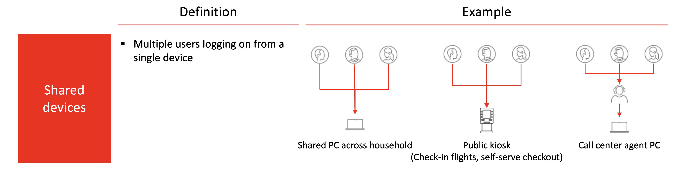
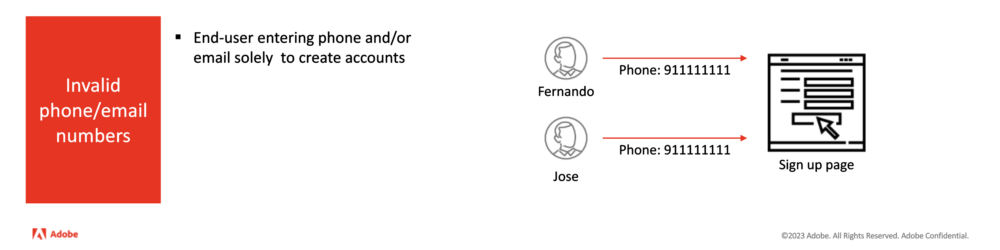

# ID 그래프 연결 규칙을 구성하기 위한 예제 시나리오

>[!IMPORTANT]
>
>ID 그래프 연결 규칙이 현재 Alpha 중입니다. 기능 및 설명서는 변경될 수 있습니다.

이 문서에서는 ID 그래프 연결 규칙을 구성할 때 고려할 수 있는 예제 시나리오를 간략하게 설명합니다.

## 공유 장치

단일 디바이스에서 여러 로그인이 발생할 수 있는 인스턴스가 있습니다.

| 공유 장치 | 설명 |
| --- | --- |
| 패밀리 컴퓨터 및 태블릿 | 남편과 아내 모두 각자의 은행 계좌에 로그인합니다. |
| 공용 키오스크 | 공항 여행객이 수하물을 체크인하고 탑승권을 인쇄하는 데 고객 충성도 ID를 사용하여 로그온합니다. |
| 콜 센터 | 콜센터 직원은 고객 지원 센터에 문의하는 고객을 대신하여 단일 디바이스에 로그인하여 문제를 해결합니다. |

이러한 경우 그래프 측면에서 제한이 활성화되지 않은 경우 단일 ECID가 여러 CRM ID에 연결됩니다.

ID 그래프 연결 규칙을 사용하여 다음을 수행할 수 있습니다.

* 로그인에 사용되는 ID를 고유 식별자로 구성합니다. 예를 들어 CRM ID 네임스페이스로 하나의 ID만 저장하도록 그래프를 제한하여 해당 CRM ID를 공유 장치의 고유 식별자로 정의할 수 있습니다.
   * 이렇게 하면 CRM ID가 ECID에 의해 병합되지 않도록 할 수 있습니다.

## 잘못된 이메일/전화 시나리오

등록할 때 전화번호 및/또는 이메일 주소로 가짜 값을 제공하는 사용자의 경우도 있습니다. 이러한 경우 제한이 활성화되지 않으면 전화/이메일 관련 ID가 서로 다른 여러 CRM ID에 연결됩니다.

ID 그래프 연결 규칙을 사용하여 다음을 수행할 수 있습니다.

* CRM ID, 전화 번호 또는 이메일 주소를 고유 식별자로 구성하여 한 사람을 계정과 연결된 하나의 CRM ID, 전화 번호 및/또는 이메일 주소로 제한합니다.

## 잘못되거나 잘못된 ID 값

네임스페이스에 관계없이 시스템에 고유하지 않고 잘못된 ID 값이 수집되는 경우가 있습니다. 해당 예는 다음과 같습니다.

* ID 값이 &quot;user_null&quot;인 IDFA 네임스페이스.
   * IDFA ID 값에는 36자(영숫자 32자, 하이픈 4개)가 있어야 합니다.
* ID 값이 &quot;지정되지 않음&quot;인 전화번호 네임스페이스.
   * 전화번호에는 알파벳 문자가 없어야 합니다.

이러한 ID를 사용하면 다음과 같은 그래프가 생성되어 여러 CRM ID가 &#39;잘못된&#39; ID와 병합됩니다.

ID 그래프 연결 규칙을 사용하면 이러한 유형의 데이터로 인해 원하지 않는 프로필이 축소되는 것을 방지하기 위해 CRM ID를 고유 식별자로 구성할 수 있습니다.

## 다음 단계

ID 그래프 연결 규칙에 대한 자세한 내용은 다음 설명서를 참조하십시오.

* [ID 그래프 연결 규칙 개요](./overview.md)
* [ID 서비스 및 실시간 고객 프로필](identity-and-profile.md)
* [ID 연결 논리](./identity-linking-logic.md)
