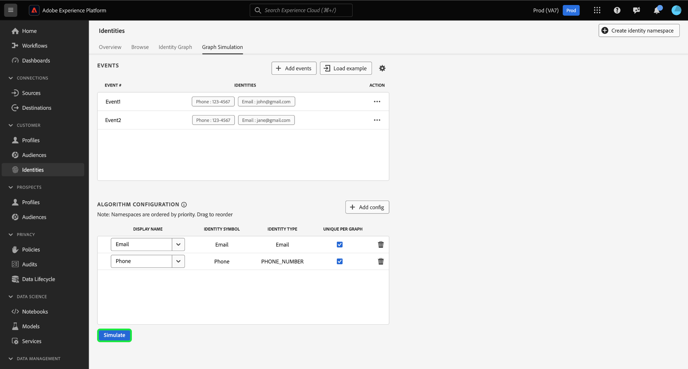
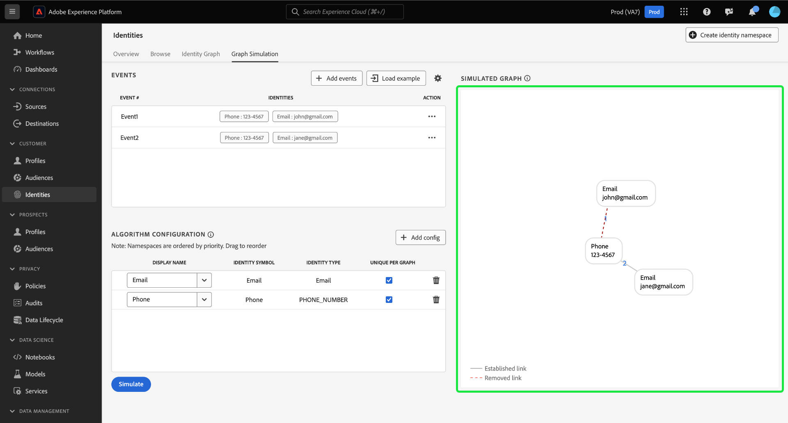

# [!DNL Graph Simulation] UI 안내서 {#graph-simulation}

>[!CONTEXTUALHELP]
>id="platform_identities_graphsimulation"
>title="그래프 시뮬레이션"
>abstract="그래프를 시뮬레이션하여 ID 서비스가 ID를 연결하는 방식과 ID 최적화 알고리즘이 작동하는 방식을 파악하십시오."

>[!AVAILABILITY]
>
>* ID 그래프 연결 규칙은 현재 제한적 가용성입니다. 개발 샌드박스의 기능에 액세스하는 방법에 대한 자세한 내용은 Adobe 계정 팀에 문의하십시오.
>
>* [!DNL Graph Simulation] 도구에 액세스하려면 **ID 그래프 보기** 권한으로 계정을 프로비저닝해야 합니다. 자세한 내용은 특성 기반 액세스 제어의 사용 권한에 대한 [안내서](../../access-control/abac/ui/permissions.md)를 참조하십시오.

[!DNL Graph Simulation]은(는) 특정 조합의 ID가 지정된 ID에서 ID 그래프가 작동하는 방식과 [ID 최적화 알고리즘](./identity-optimization-algorithm.md)을 구성하는 방법을 시뮬레이션하는 데 사용할 수 있는 ID 서비스 UI의 도구입니다.

ID 서비스 UI 작업 영역에서 [!DNL Graph Simulation] 인터페이스를 사용하는 방법에 대한 자세한 내용은 다음 비디오를 시청하십시오.

>[!VIDEO](https://video.tv.adobe.com/v/3444032/?learn=on&enablevpops)

ID 그래프 동작 및 그래프 알고리즘의 작동 방식을 더 잘 이해하기 위해 [!DNL Graph Simulation]을(를) 사용하는 방법에 대해 알아보려면 이 문서를 참조하십시오.

## [!DNL Graph Simulation] 인터페이스 알아보기 {#interface}

Adobe Experience Platform UI에서 [!DNL Graph Simulation]에 액세스할 수 있습니다. 왼쪽 탐색에서 **[!UICONTROL ID]**&#x200B;를 선택한 다음 상단 헤더에서 **[!UICONTROL 그래프 시뮬레이션]**&#x200B;을 선택합니다.

[!DNL Graph Simulation] 인터페이스는 다음 세 섹션으로 나눌 수 있습니다.

>[!BEGINTABS]

>[!TAB 이벤트]

이벤트: **[!UICONTROL 이벤트]** 패널을 사용하여 그래프를 시뮬레이션할 ID를 추가합니다. 정규화된 ID에는 ID 네임스페이스 및 해당 ID 값이 있어야 합니다. 그래프를 시뮬레이션하려면 적어도 두 개의 ID를 추가해야 합니다. **[!UICONTROL 예제 로드]**&#x200B;를 선택하여 사전 구성된 이벤트 및 알고리즘 설정을 입력할 수도 있습니다.

>[!TAB 알고리즘 구성]

알고리즘 구성: **[!UICONTROL 알고리즘 구성]** 패널을 사용하여 네임스페이스에 대한 최적화 알고리즘을 추가하고 구성합니다. 네임스페이스를 드래그 앤 드롭하여 해당 우선 순위 순위를 수정할 수 있습니다. **[!UICONTROL 그래프당 고유]**&#x200B;을(를) 선택하여 네임스페이스가 고유한지 확인할 수도 있습니다.

>[!TAB 시뮬레이션된 그래프 뷰어]

시뮬레이션된 그래프 뷰어: 시뮬레이션된 그래프 뷰어는 사용자가 추가한 이벤트와 사용자가 구성한 알고리즘을 기반으로 결과 그래프를 표시합니다. 두 ID 사이의 직선은 링크가 성립함을 의미한다. 점선은 링크가 제거되었음을 나타냅니다.

>[!ENDTABS]

## 이벤트 추가 {#add-events}

시작하려면 **[!UICONTROL 이벤트 추가]**&#x200B;를 선택하세요.

[!UICONTROL 이벤트 #1]에 대한 팝업 창이 나타납니다. 여기에서 ID 네임스페이스 및 ID 값 조합을 입력합니다. 드롭다운 메뉴를 사용하여 ID 네임스페이스를 선택할 수 있습니다. 또는 네임스페이스의 처음 몇 글자를 입력한 다음 드롭다운 메뉴에 제공된 옵션을 선택할 수 있습니다. 네임스페이스를 선택하면 네임스페이스에 해당하는 ID 값을 제공합니다.

>[!TIP]
>
>[!DNL Graph Simulation] 연습 중에 입력한 ID 값은 실제 ID 값일 필요가 없으며 단순 자리 표시자일 수 있습니다.

첫 번째 ID가 완료되면 추가 아이콘(**`+`**)을 선택하여 두 번째 ID를 추가합니다.

그런 다음 동일한 단계를 반복하고 두 번째 ID를 추가합니다. ID 그래프를 생성하려면 2개의 정규화된 ID가 필요합니다. 아래 예에서는 ECID가 네임스페이스로 추가되고 값 `111`이(가) 제공됩니다. 완료되면 **[!UICONTROL 저장]**&#x200B;을 선택합니다.

[!UICONTROL 이벤트] 인터페이스가 업데이트되어 첫 번째 이벤트가 표시됩니다. 이 경우 `{Email: tom@acme.com, ECID: 111}`입니다.

)

그런 다음 동일한 단계를 반복하여 두 번째 이벤트를 추가합니다. 이벤트 #2의 경우 `{Email: summer@acme.com}`을(를) 첫 번째 ID로 추가한 다음 같은 `{ECID: 111}`을(를) 두 번째 ID로 추가하여 `{Email: summer@acme.com}, {ECID: 111}`의 두 번째 이벤트를 만듭니다. 완료되면 `{Email: tom@acme.com, ECID: 111}`에 대한 이벤트와 `{Email: summer@acme.com}, {ECID: 111}`에 대한 이벤트가 두 개 있어야 합니다.

### 예제 로드 {#load-example}

미리 설정된 알고리즘과 이벤트 구성을 사용하여 예제 그래프를 설정하려면 **[!UICONTROL 예제 로드]**&#x200B;를 선택하십시오.

다음 중에서 선택할 수 있는 그래프 시나리오를 제공하는 팝업 창이 나타납니다.

| 예제 그래프 | 설명 | 예 |
| --- | --- | --- |
| 공유 디바이스 | 공유 장치는 두 명의 서로 다른 사용자가 동일한 단일 장치에 로그인하는 시나리오를 의미합니다. | 남편과 아내는 인터넷 검색과 전자 상거래를 위해 iPad을 공유합니다. |
| 잘못된(고유하지 않은) 전화 | 잘못되거나 고유하지 않은 전화는 서로 다른 두 사용자가 동일한 전화번호를 사용하여 계정을 만드는 시나리오를 말합니다. | 엄마와 딸은 전자 상거래 계정에 등록하기 위해 공유된 집 전화 번호를 사용합니다. |
| “불량” ID 값 | 잘못된 ID 값은 잘못된 구현으로 인해 Identity Service가 고유하지 않은 IDFA를 생성하는 시나리오를 의미합니다. | 코드 구현 문제로 인해 WebSDK에서 모든 이벤트에 대해 `user_null` 값을 잘못 보냈습니다. |

미리 구성된 이벤트 및 알고리즘으로 [!DNL Graph Simulation]을(를) 로드할 옵션을 선택하십시오. 미리 로드된 그래프 시나리오 예제에 대해 추가 구성을 수행할 수도 있습니다.

완료되면 **[!UICONTROL 시뮬레이션]**&#x200B;을 선택합니다.

### 텍스트 버전 사용 {#use-text-version}

텍스트 모드를 사용하여 이벤트를 구성할 수도 있습니다. 텍스트 모드를 사용하려면 설정 아이콘을 선택한 다음 **[!UICONTROL 텍스트(고급 사용자)]**&#x200B;를 선택합니다.

텍스트 모드로 ID를 수동으로 입력할 수 있습니다. 입력한 네임스페이스와 일치하는 ID 값을 구분하려면 콜론(`:`)을 사용하고, ID를 구분하려면 쉼표(`,`)를 사용하십시오. 서로 다른 이벤트를 구분하려면 각 이벤트에 새 줄을 사용하십시오.

### 이벤트 편집 {#edit-event}

이벤트를 편집하려면 지정된 이벤트 옆의 생략 부호(`...`)를 선택한 다음 **[!UICONTROL 편집]**&#x200B;을 선택합니다.

### 이벤트 삭제 {#delete-event}

이벤트를 삭제하려면 지정된 이벤트 옆의 생략 부호(`...`)를 선택한 다음 **[!UICONTROL 삭제]**&#x200B;를 선택합니다.

## 알고리즘 구성 {#configure-algorithm}

>[!IMPORTANT]
>
>사용자가 구성하는 알고리즘은 ID 서비스에서 이벤트에 입력한 네임스페이스를 처리하는 방법을 나타냅니다. [!DNL Graph Simulation UI]에서 구성한 모든 구성은 ID 설정에 저장되지 않습니다.

이벤트를 추가한 후에는 그래프를 시뮬레이션하는 데 사용할 알고리즘을 구성할 수 있습니다. 시작하려면 **[!UICONTROL 구성 추가]**&#x200B;를 선택하십시오.

빈 구성 행이 나타납니다. 먼저 이벤트에 사용한 것과 동일한 네임스페이스를 입력합니다. 이 경우 이메일 입력부터 시작합니다. 네임스페이스를 입력하면 [!UICONTROL ID 기호] 및 [!UICONTROL ID 유형]의 열이 자동으로 채워집니다.

그런 다음 동일한 단계를 반복하고 두 번째 네임스페이스를 추가합니다(이 경우 ECID). 모든 네임스페이스를 입력하면 우선 순위와 고유성을 구성할 수 있습니다.

* **네임스페이스 우선 순위**: 네임스페이스의 우선 순위는 특정 ID 그래프의 다른 네임스페이스와 비교하여 상대적 중요도를 결정합니다. 예를 들어 ID 그래프에 CRMID, ECID, 이메일 및 Apple IDFA의 4가지 네임스페이스가 있는 경우 우선순위를 구성하여 4가지 네임스페이스에 대한 중요도 순서를 결정할 수 있습니다.
* **고유 네임스페이스**: 네임스페이스가 고유 네임스페이스로 지정된 경우 Identity Service는 지정된 고유 네임스페이스를 가진 하나의 ID만 존재할 수 있다는 경고가 있는 그래프를 생성합니다. 예를 들어 이메일 네임스페이스가 고유 네임스페이스로 지정된 경우 그래프는 이메일을 사용하여 하나의 ID만 가질 수 있습니다. 이메일 네임스페이스가 있는 ID가 두 개 이상 있는 경우 가장 오래된 링크가 제거됩니다.

네임스페이스 우선 순위를 구성하려면 네임스페이스 행을 선택하고 원하는 우선 순위 순서로 드래그합니다. 맨 위 행은 더 높은 우선 순위를 나타내고 맨 아래 행은 더 낮은 우선 순위를 나타냅니다. 네임스페이스를 고유하게 지정하려면 **[!UICONTROL 그래프당 고유]** 확인란을 선택하십시오.

완료되면 **[!UICONTROL 시뮬레이션]**&#x200B;을 선택합니다.

## 시뮬레이션된 그래프 보기

[!UICONTROL 시뮬레이션된 그래프] 섹션에는 추가한 이벤트와 구성한 알고리즘을 기반으로 생성된 ID 그래프가 표시됩니다.

| 그래프 아이콘 | 설명 |
| --- | --- |
| 실선 | 실선은 두 ID 간에 설정된 링크를 나타냅니다. |
| 점선 | 점선은 두 ID 간의 제거된 링크를 나타냅니다. |
| 줄 번호 | 줄의 숫자는 해당 링크가 생성된 시간의 타임스탬프를 나타냅니다. 가장 낮은 숫자 (1)은 가장 먼저 설정된 링크를 나타냅니다. |

아래 예제 그래프에서 점선이 `{Email: tom@acme.com}`과(와) `{ECID: 111}` 사이에 있는 이유는 다음과 같습니다.

* 알고리즘 구성 단계에서 이메일이 고유한 것으로 지정되었습니다. 따라서 그래프에는 이메일 네임스페이스가 있는 ID가 하나만 있을 수 있습니다.
* `{Email: tom@acme.com}`과(와) `{ECID: 111}` 사이의 연결이 처음 설정된 ID(이벤트 #1)입니다. 이 링크는 가장 오래된 링크이므로 제거됩니다.

## 다음 단계

이 문서를 읽으면 이제 [!DNL Graph Simulation] 도구를 사용하여 특정 규칙 및 구성 집합이 있는 경우 ID 데이터가 처리되는 방식을 더 잘 이해할 수 있습니다. 자세한 내용은 다음 문서를 참조하십시오.

* [ID 그래프 연결 규칙 개요](./overview.md)
* [ID 최적화 알고리즘](./identity-optimization-algorithm.md)
* [구현 안내서](./implementation-guide.md)
* [문제 해결 및 FAQ](./troubleshooting.md)
* [그래프 구성의 예](./example-configurations.md)
* [네임스페이스 우선순위](./namespace-priority.md)
* [ID 설정 UI](./identity-settings-ui.md)
