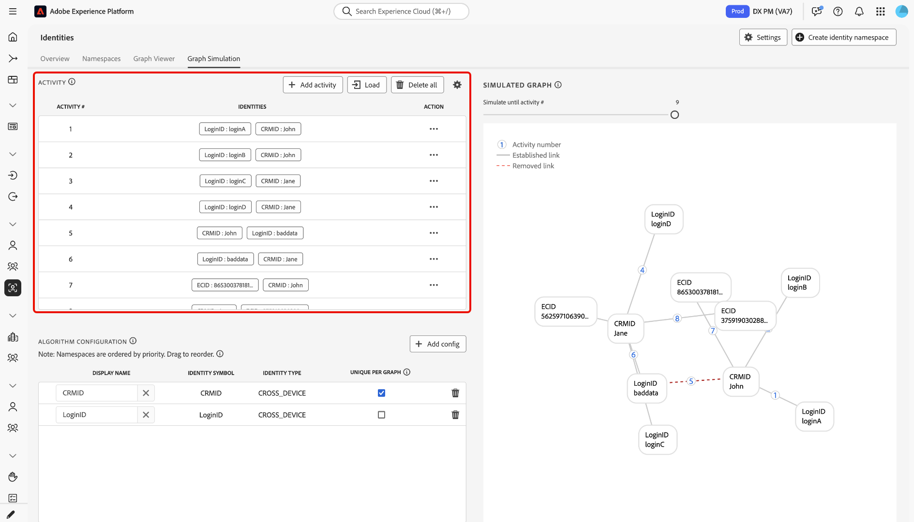
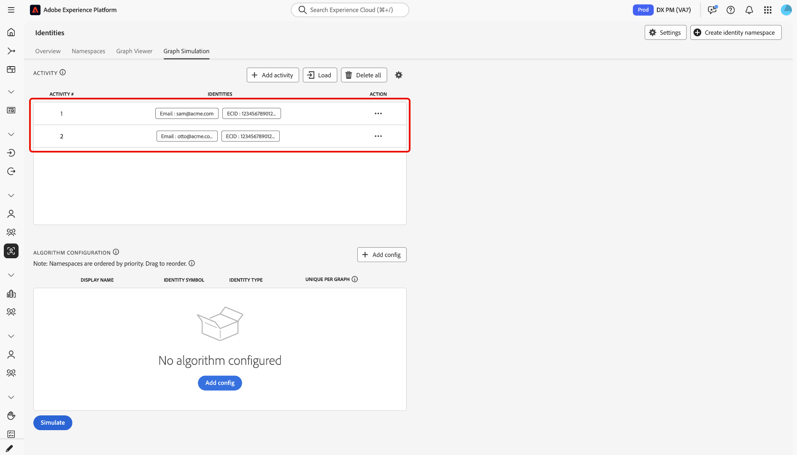
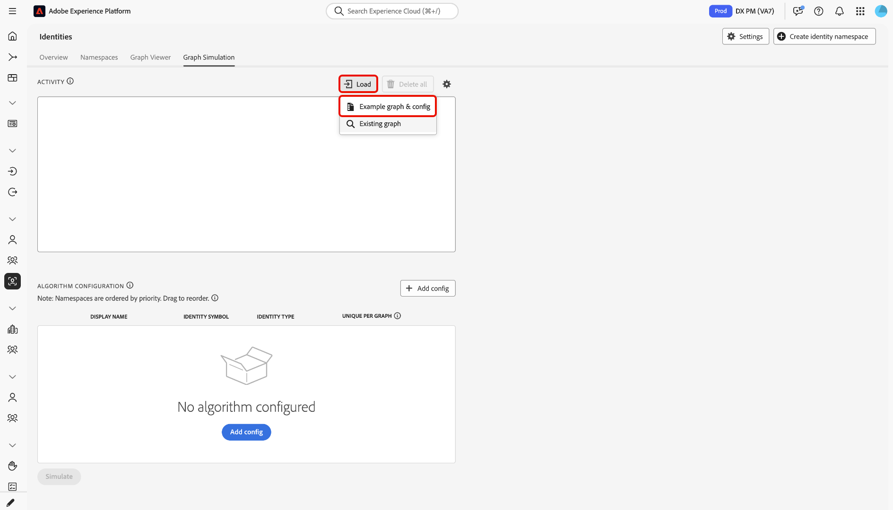
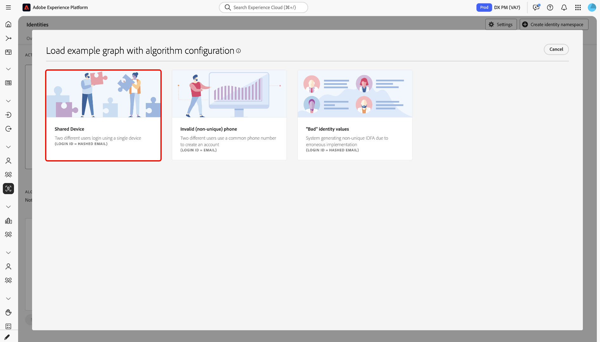
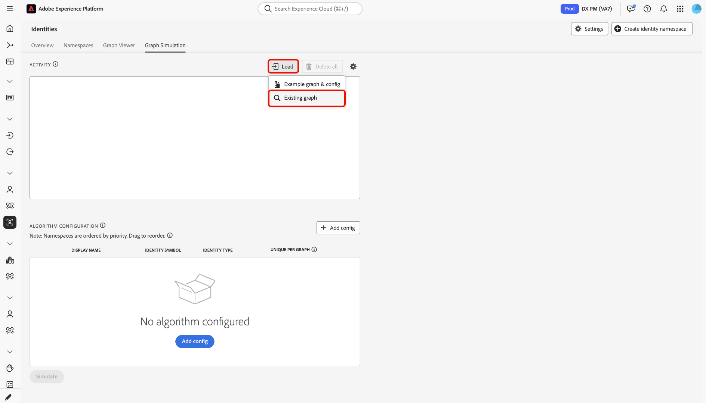

# [!DNL Graph Simulation] UI 안내서 {#graph-simulation}

>[!CONTEXTUALHELP]
>id="platform_identities_graphsimulation"
>title="그래프 시뮬레이션"
>abstract="그래프를 시뮬레이션하여 ID 서비스가 ID를 연결하는 방식과 ID 최적화 알고리즘이 작동하는 방식을 파악하십시오."

[!DNL Graph Simulation]은(는) ID 서비스 UI의 도구로서 사용자가 제공한 ID를 기반으로 ID 그래프가 작동하는 방식과 [ID 최적화 알고리즘](./identity-optimization-algorithm.md)을 구성하는 방법을 시뮬레이션할 수 있습니다.

프로덕션 데이터에 [!DNL Identity Graph Linking Rules]을(를) 적용하기 전에 그래프 동작을 안전하게 테스트하는 데 사용합니다. 예제 이벤트를 정의하고 네임스페이스 우선 순위 및 &quot;그래프당 고유&quot; 설정을 포함하여 ID 최적화 알고리즘을 구성하면 ID가 하나의 그래프로 병합되는지 또는 별도로 유지되는지 여부를 확인한 다음 필요에 따라 구성을 조정할 수 있습니다. 이 기능을 사용하여 다음을 수행할 수 있습니다.

* 그래프 축소 방지(예: 여러 사람이 장치 또는 전화 번호를 공유하는 경우)
* 네임스페이스 우선 순위 조정(예: EMAIL 또는 CRM_ID가 우세해야 하는지 여부)
* 품질이 낮거나 재사용된 식별자가 환경의 결합에 어떤 영향을 미칠 수 있는지 평가합니다.

또한 구성 변경 사항을 미리 보고 다운스트림 애플리케이션에 나타나는 ID 문제를 디버깅할 수 있습니다. 예를 들어 대상 크기 또는 병합된 프로필이 잘못된 경우 [!DNL Graph Simulation]에서 관련 이벤트를 다시 빌드하여 현재 규칙이 그래프를 어떻게 형성하는지 확인하고 보다 안전한 대안을 시도할 수 있습니다.

기본 제공 예제 시나리오는 ID 동작 및 그래프 축소 위험을 이해 당사자에게 설명하고 데이터 품질 및 ID 거버넌스를 위한 추가 기능을 지원하는 데 도움이 됩니다.

## [!DNL Graph Simulation] 인터페이스 이해

[!DNL Graph Simulation]에 액세스하려면 Adobe Experience Platform 사용자 인터페이스에서 ID 서비스 작업 영역으로 이동한 다음 **[!UICONTROL Graph Simulation]**&#x200B;을(를) 선택하십시오.

인터페이스는 다음 세 가지 기본 섹션으로 구성됩니다.

>[!BEGINTABS]

>[!TAB 활동]

**[!UICONTROL Activity]** 패널을 사용하여 그래프를 시뮬레이션할 ID를 추가합니다. 각 ID에는 네임스페이스와 값이 필요합니다. 시뮬레이션을 실행하려면 두 개 이상의 ID를 추가해야 합니다. **[!UICONTROL Load]**&#x200B;을(를) 선택하여 사전 구성된 이벤트 및 알고리즘 설정을 가져오거나 기존 그래프를 열 수도 있습니다.

>[!TAB 알고리즘 구성]

**[!UICONTROL Algorithm configuration]** 패널을 사용하여 네임스페이스에 대한 최적화 알고리즘을 추가하고 구성합니다. 네임스페이스 행을 끌어서 놓아 우선 순위 순서를 변경합니다. **[!UICONTROL Unique Per Graph]**&#x200B;을(를) 선택하여 그래프 내에서 네임스페이스가 고유해야 하는지 여부를 표시할 수도 있습니다.

>[!TAB 시뮬레이션된 그래프]

**[!UICONTROL Simulated graph]** 표시를 사용하여 활동 및 알고리즘 설정에서 생성된 그래프를 검토하십시오. 두 ID 사이의 실선은 링크가 유지됨을 의미하며, 점선은 해당 링크가 제거된 알고리즘을 의미합니다.

>[!ENDTABS]

## [!DNL Graph Simulation] 워크플로

### 활동 추가

ID 그래프 시뮬레이션을 시작하려면 **[!UICONTROL Add Activity]**&#x200B;을(를) 선택하십시오.

새 ID 이벤트에 대한 대화 상자를 열기 위해 [활동 추가]가 강조 표시된 

[!UICONTROL Activity #1]에 대한 팝업 창이 나타나면 ID 네임스페이스를 선택하고 해당 값을 입력하십시오. 드롭다운에서 네임스페이스를 선택하거나 몇 개의 문자를 입력하여 목록을 필터링할 수 있습니다. 네임스페이스를 선택한 후 일치하는 ID 값을 입력합니다.

>[!TIP]
>
>[!DNL Graph Simulation]을(를) 사용할 때는 실제 ID 값을 사용할 필요가 없습니다.

[!UICONTROL Activity] 인터페이스가 업데이트되어 첫 번째 활동이 표시됩니다.

**[!UICONTROL Add Activity]**&#x200B;을(를) 다시 선택하고 두 번째 활동을 완료합니다. 그래프를 생성하려면 적어도 2개의 정규화된 ID(네임스페이스 + 값)가 필요합니다.

### 알고리즘 구성

>[!IMPORTANT]
>
>사용자가 구성하는 알고리즘은 Identity Service가 활동에서 네임스페이스를 처리하는 방법을 제어합니다. [!DNL Graph Simulation UI]에서 설정한 항목이 ID 서비스 ID 설정에 저장되지 않았습니다.

활동이 준비되면 시뮬레이션에 대한 알고리즘을 구성합니다. **[!UICONTROL Add config]**&#x200B;를 선택합니다.

알고리즘에서 고려할 각 네임스페이스를 추가합니다. 드롭다운을 사용하여 검색하거나 처음 몇 글자를 입력하여 목록의 범위를 좁힙니다.

* **네임스페이스 우선 순위**: ID 그래프 내의 각 네임스페이스에 대한 중요도 순서를 제어합니다. 예를 들어 그래프에서 CRMID, ECID, 이메일 및 Apple IDFA를 사용하는 경우 ID를 연결할 때 먼저 고려해야 하는 사항을 반영하도록 우선 순위를 설정할 수 있습니다. 목록의 맨 위에 있는 네임스페이스가 가장 높은 우선 순위를 갖습니다.
* **고유 네임스페이스**: 네임스페이스가 고유 네임스페이스로 표시되면 ID 서비스는 해당 네임스페이스를 가진 하나의 ID만 그래프에 나타나도록 합니다. 예를 들어 이메일을 고유하게 설정하면 각 그래프에 하나의 이메일 ID만 포함됩니다. 동일한 이메일을 가진 여러 ID가 있는 경우 고유성을 유지하기 위해 가장 오래된 연결이 제거됩니다.

네임스페이스 행을 우선순위 순서로 드래그합니다. 상단 행은 우선순위가 가장 높고 하단 행은 가장 낮습니다. 네임스페이스를 그래프 내에서 고유한 것으로 처리하려면 해당 **[!UICONTROL Unique Per Graph]** 확인란을 선택하십시오.

준비가 되면 **[!UICONTROL Simulate]**&#x200B;을(를) 선택합니다.

![우선 순위를 위해 네임스페이스가 재정렬되고, 필요에 따라 [그래프당 고유] 확인란이 설정되며, 시뮬레이션을 실행하는 데 사용할 수 있는 알고리즘입니다.](../images/graph-simulation/add-namespaces.png)

### 시뮬레이션된 그래프 보기

[!UICONTROL Simulated Graph] 섹션은 활동 및 알고리즘 구성에서 생성된 그래프 또는 그래프를 보여 줍니다.

| 그래프 아이콘 | 설명 |
| --- | --- |
| 실선 | 실선은 두 ID 간에 설정된 링크를 나타냅니다. |
| 점선 | 점선은 두 ID 간의 제거된 링크를 나타냅니다. |
| 줄 번호 | 줄의 숫자는 해당 링크가 다른 링크를 기준으로 형성된 시간을 나타냅니다. 가장 낮은 숫자 (1)이 가장 이른 링크입니다. |

## 추가 기능

활동을 편집 또는 삭제하거나, 텍스트 모드에서 활동을 입력하거나, 샘플 시나리오를 로드하거나, ID 서비스에서 기존 그래프를 가져올 수도 있습니다.

### 활동 편집 {#edit-activity}

활동을 편집하려면 지정된 활동 옆의 생략 부호(`...`)를 선택한 다음 **[!UICONTROL Edit]**&#x200B;을(를) 선택합니다.

### 활동 삭제 {#delete-activity}

활동을 삭제하려면 지정된 활동 옆의 생략 부호(`...`)를 선택한 다음 **[!UICONTROL Delete]**&#x200B;을(를) 선택합니다.

![시뮬레이션에서 해당 활동을 제거하기 위해 [삭제]를 선택한 상태로 활동 옆에 행 작업 메뉴가 열립니다.](../images/graph-simulation/delete.png)

### 텍스트 모드 사용 {#use-text-mode}

텍스트 모드를 사용하여 활동을 구성할 수 있습니다. 텍스트 모드를 사용하려면 설정 아이콘을 선택한 다음 **[!UICONTROL Text (Advanced users)]**&#x200B;을(를) 선택합니다.

텍스트 모드에서 각 ID를 `namespace:value`(으)로 입력하십시오. 동일한 이벤트에서 여러 ID를 쉼표(`,`)로 구분하십시오. 각 이벤트에 대한 새 줄을 시작합니다.

### 예제 로드 {#load-example}

**[!UICONTROL Load example]**&#x200B;을(를) 선택하여 사전 설정 활동 및 알고리즘 설정을 포함한 준비된 그래프를 로드합니다.

대화 상자에 열 수 있는 시나리오가 나열됩니다.

| 예제 그래프 | 설명 | 예 |
| --- | --- | --- |
| 공유 디바이스 | 두 명의 다른 사용자가 동일한 장치에 로그인합니다. | 남편과 아내는 탐색과 전자 상거래를 위해 iPad을 공유합니다. |
| 잘못된(고유하지 않은) 전화 | 두 명의 다른 사용자가 동일한 전화 번호로 등록합니다. | 엄마와 딸이 공유된 집 전화번호를 사용해 전자상거래 계정에 가입한다. |
| “불량” ID 값 | 구현 오류가 중복 또는 자리 표시자 ID(예: 많은 사용자의 경우 동일한 IDFA)를 보냅니다. | 코드 결함으로 인해 웹 SDK에서 모든 활동에 대해 `user_null` 값을 보냅니다. |

일치하는 활동 및 알고리즘 설정으로 [!DNL Graph Simulation]을(를) 로드할 시나리오를 선택하십시오. 다른 시뮬레이션과 마찬가지로 결과를 편집할 수 있습니다.

### 기존 그래프 로드 {#load-existing-graph}

[!DNL Graph Simulation]을(를) 사용하여 기존 그래프를 로드하고 해당 활동, 알고리즘 구성 및 그래프를 볼 수 있습니다.

**[!UICONTROL Load]**&#x200B;을(를) 선택한 다음 **[!UICONTROL Existing graph]**&#x200B;을(를) 선택합니다.

대화 상자에서 검사할 그래프에 속하는 네임스페이스와 ID 값을 입력합니다.

로드가 성공하면 [!DNL Graph Simulation]에 해당 ID가 포함된 그래프가 표시됩니다.

>[!TIP]
>
>처음 [ID 설정](./identity-settings-ui.md) 화면에서 설정을 구성한 후 **기존 그래프 로드** 옵션을 사용하여 정확한 설정을 기반으로 그래프를 시뮬레이션할 수 있습니다. 시뮬레이션은 사용자가 정의한 구성을 사용합니다.

## 다음 단계

프로덕션 설정을 변경하기 전에 [!DNL Graph Simulation]을(를) 사용하여 Identity Service가 다른 규칙에 따라 ID를 연결하는 방법을 확인할 수 있습니다. 자세한 내용은 다음 설명서를 참조하십시오.

* [[!DNL Identity Graph Linking Rules] 개요](./overview.md)
* [ID 최적화 알고리즘](./identity-optimization-algorithm.md)
* [구현 안내서](./implementation-guide.md)
* [문제 해결 및 FAQ](./troubleshooting.md)
* [그래프 구성의 예](./example-configurations.md)
* [네임스페이스 우선순위](./namespace-priority.md)
* [ID 설정 UI](./identity-settings-ui.md)
