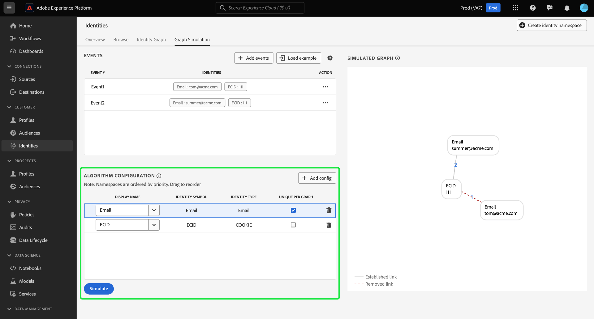

# 그래프 시뮬레이션

그래프 시뮬레이션은 특정 조합의 ID가 제공되면 ID 그래프가 작동하는 방식과 을 구성하는 방법을 시뮬레이션하는 데 사용할 수 있는 ID 서비스 UI의 도구입니다. [id 최적화 알고리즘](./identity-optimization-algorithm.md).

그래프 시뮬레이션을 사용하여 ID 그래프 동작과 그래프 알고리즘의 작동 방식을 더 잘 이해할 수 있는 방법에 대해 알아보려면 이 문서를 참조하십시오.

## 그래프 시뮬레이션 인터페이스 알아보기

Adobe Experience Platform UI에서 그래프 시뮬레이션에 액세스할 수 있습니다. 선택 **[!UICONTROL ID]** 왼쪽 탐색에서 을(를) 선택한 다음 **[!UICONTROL 그래프 시뮬레이션]** 맨 위 머리글에서

그래프 시뮬레이션 인터페이스는 다음 세 가지 섹션으로 나눌 수 있습니다.

* 이벤트: **[!UICONTROL 이벤트]** 패널을 추가하여 그래프를 시뮬레이션할 수 있습니다. 정규화된 ID에는 ID 네임스페이스 및 해당 ID 값이 있어야 합니다. 그래프를 시뮬레이션하려면 적어도 두 개의 ID를 추가해야 합니다. 다음을 선택할 수도 있습니다. **[!UICONTROL 로드 예]** 사전 구성된 이벤트 및 알고리즘 설정을 입력합니다.

* 알고리즘 구성: **[!UICONTROL 알고리즘 구성]** 패널 - 네임스페이스에 대한 최적화 알고리즘을 추가하고 구성합니다. 네임스페이스를 드래그 앤 드롭하여 해당 우선 순위 순위를 수정할 수 있습니다. 다음을 선택할 수도 있습니다. **[!UICONTROL 그래프당 고유]** 네임스페이스가 고유한지 확인할 수 있습니다.

* 시뮬레이션된 그래프 뷰어: 시뮬레이션된 그래프 뷰어는 사용자가 추가한 이벤트와 사용자가 구성한 알고리즘을 기반으로 결과 그래프를 표시합니다. 두 노드 사이의 직선은 링크가 성립함을 의미합니다. 점선은 링크가 제거되었음을 나타냅니다.

## 이벤트 추가

시작하려면 다음을 선택합니다. **[!UICONTROL 이벤트 추가]**.

다음에 대한 팝업 창이 나타납니다. [!UICONTROL 이벤트 #1]. 여기에서 ID 네임스페이스 및 ID 값 조합을 입력합니다. 드롭다운 메뉴를 사용하여 ID 네임스페이스를 선택할 수 있습니다. 또는 네임스페이스의 처음 몇 글자를 입력한 다음 드롭다운 메뉴에 제공된 옵션을 선택할 수 있습니다. 네임스페이스를 선택하면 네임스페이스에 해당하는 ID 값을 제공합니다.

>[!TIP]
>
>그래프 시뮬레이션 연습 중에 입력하는 ID 값은 실제 ID 값일 필요가 없으며 단순 자리 표시자일 수 있습니다.

첫 번째 ID가 완료되면 추가 아이콘(**`+`**)을 클릭하여 두 번째 ID를 추가합니다.

그런 다음 동일한 단계를 반복하고 두 번째 ID를 추가합니다. ID 그래프를 생성하려면 2개의 정규화된 ID가 필요합니다. 아래 예에서는 ECID가 네임스페이스로 추가되고 다음 값이 제공됩니다. `111`. 완료되면 다음을 선택합니다. **[!UICONTROL 저장]**.

다음 [!UICONTROL 이벤트] 인터페이스가 업데이트되어 첫 번째 이벤트가 표시됩니다. 이 경우 다음과 같습니다. `{Email: tom@acme.com, ECID: 111}`.

그런 다음 동일한 단계를 반복하여 두 번째 이벤트를 추가합니다. Event Builder의 경우 #2를 추가합니다. `{Email: summer@acme.com}` 을(를) 첫 번째 id로 추가한 다음 동일한 을(를) 추가합니다 `{ECID: 111}` 를 두 번째 ID로 하여 다음의 두 번째 이벤트를 생성합니다. `{Email: summer@acme.com}, {ECID: 111}`. 완료되면 두 개의 이벤트가 있어야 합니다. `{Email: tom@acme.com, ECID: 111}` 다음에 대한 1개 `{Email: summer@acme.com}, {ECID: 111}`.

### 예제 로드

+++사전 로드된 그래프 예를 사용하는 방법에 대한 단계를 보려면 선택

미리 구성된 알고리즘으로 예제 그래프를 설정하려면 다음을 선택합니다. **[!UICONTROL 로드 예]**. 다음 중에서 선택할 수 있는 그래프 시나리오를 제공하는 팝업 창이 나타납니다.

| 예제 그래프 | 설명 | 예 |
| --- | --- | --- |
| 공유 디바이스 | 공유 장치는 두 명의 서로 다른 사용자가 동일한 단일 장치에 로그인하는 시나리오를 의미합니다. | 남편과 아내는 인터넷 검색과 전자 상거래를 위해 iPad을 공유합니다. |
| 잘못된(고유하지 않은) 전화 | 잘못되거나 고유하지 않은 전화는 서로 다른 두 사용자가 동일한 전화번호를 사용하여 계정을 만드는 시나리오를 말합니다. | 엄마와 딸은 전자 상거래 계정에 등록하기 위해 공유된 집 전화 번호를 사용합니다. |
| “불량” ID 값 | 잘못된 ID 값은 잘못된 구현으로 인해 Identity Service가 고유하지 않은 IDFA를 생성하는 시나리오를 의미합니다. | WebSDK가 `user_null` 코드 구현 문제로 인한 모든 이벤트 값입니다. |

미리 구성된 이벤트 및 알고리즘으로 그래프 시뮬레이션을 로드하는 옵션을 선택합니다. 미리 로드된 그래프 시나리오 예제에 대해 추가 구성을 수행할 수도 있습니다.

완료되면 다음을 선택합니다. **[!UICONTROL 시뮬레이트]**.

+++

### 텍스트 버전 사용

+++텍스트 버전 사용 방법에 대한 단계를 보려면 선택

텍스트 모드를 사용하여 이벤트를 구성할 수도 있습니다. 텍스트 모드를 사용하려면 톱니바퀴(?)를 선택합니다 아이콘을 클릭한 다음 **[!UICONTROL 텍스트(고급 사용자)]**.

텍스트 모드로 ID를 수동으로 입력할 수 있습니다. 콜론(`:`)를 클릭하여 입력한 네임스페이스와 일치하는 id 값을 구분한 다음 쉼표( )를 사용합니다`,`)을 클릭하여 id를 구분합니다. 서로 다른 이벤트를 구분하려면 각 이벤트에 새 줄을 사용하십시오.

+++

### 이벤트 편집

이벤트를 편집하려면 줄임표(`...`)을 클릭하여 제품에서 사용할 수 있도록 설정할 수 있습니다 **[!UICONTROL 편집]**.

### 이벤트 삭제

이벤트를 삭제하려면 생략 부호(`...`)을 클릭하여 제품에서 사용할 수 있도록 설정할 수 있습니다 **[!UICONTROL 삭제]**.

## 알고리즘 구성

사용자가 구성하는 알고리즘은 Identity 서비스에서 이벤트에 입력한 네임스페이스를 처리하는 방법을 나타냅니다. 그래프 시뮬레이션 UI에서 구성하는 모든 구성은 ID 설정에 저장되지 않습니다.

시작하려면 추가(`+`)을 클릭하여 제품에서 사용할 수 있습니다.

빈 구성 행이 나타납니다. 먼저 이벤트에 사용한 것과 동일한 네임스페이스를 입력합니다. 이 경우 먼저 CRM ID를 입력합니다. 네임스페이스를 입력하면 [!UICONTROL ID 기호] 및 [!UICONTROL ID 유형] 자동으로 채워집니다.

그런 다음 동일한 단계를 반복하고 두 번째 네임스페이스를 추가합니다(이 경우 ECID). 모든 네임스페이스를 입력하면 우선 순위와 고유성을 구성할 수 있습니다.

* **네임스페이스 우선 순위**: 네임스페이스의 우선 순위는 주어진 ID 그래프에서 다른 네임스페이스와 비교하여 상대적 중요도를 결정합니다. 예를 들어 ID 그래프에 CRM ID, ECID, 이메일 및 Apple IDFA의 4가지 네임스페이스가 있는 경우 우선순위를 구성하여 4가지 네임스페이스에 대한 중요도 순서를 결정할 수 있습니다. (이유 추가)
* **고유 네임스페이스**: 네임스페이스가 고유으로 지정된 경우 ID 서비스는 주어진 고유 네임스페이스를 가진 하나의 ID만 존재할 수 있다는 경고가 있는 그래프를 생성합니다. 예를 들어 CRM ID가 고유 네임스페이스로 지정된 경우 그래프는 CRM ID를 가진 하나의 ID만 가질 수 있습니다. CRM ID 네임스페이스를 가진 ID가 두 개 이상 있는 경우 가장 오래된 링크가 제거됩니다.

네임스페이스 우선 순위를 구성하려면 네임스페이스 행을 선택하고 원하는 우선 순위 순서로 드래그합니다. 맨 위 행은 더 높은 우선 순위를 나타내고 맨 아래 행은 더 낮은 우선 순위를 나타냅니다. 네임스페이스를 고유하게 지정하려면 **[!UICONTROL 그래프당 고유]** 확인란.

완료되면 다음을 선택합니다. **[!UICONTROL 시뮬레이트]**.

## 시뮬레이션된 그래프 보기

다음 [!UICONTROL 시뮬레이션된 그래프] 섹션에는 추가한 이벤트 및 구성한 알고리즘을 기반으로 생성된 id 그래프가 표시됩니다.

| 그래프 아이콘 | 설명 |
| --- | --- |
| 실선 | 실선은 두 ID 간에 설정된 링크를 나타냅니다. |
| 점선 | 점선은 두 ID 간의 제거된 링크를 나타냅니다. |
| 줄 번호 | 줄의 숫자는 해당 링크가 생성된 시간의 타임스탬프를 나타냅니다. 가장 낮은 숫자 (1)은 가장 먼저 설정된 링크를 나타냅니다. |

아래 예제 그래프에서는 사이에 점선이 있습니다 `{CRM ID: Tom}` 및 `{ECID: 111}` 다음 이유로 인해:

* 알고리즘 구성 단계에서 CRM ID가 고유으로 지정되었습니다. 따라서, CRM ID 네임스페이스를 갖는 하나의 ID만이 그래프에 존재할 수 있다.
* 다음 사이의 링크: `{CRM ID: Tom}` 및 `{ECID: 111}` 는 첫 번째로 설정된 id(이벤트 #1)입니다. 이 링크는 가장 오래된 링크이므로 제거됩니다.

## 그래프 시나리오 예

>[!NOTE]
>
>&quot;CRM ID&quot;는 사용자 지정 네임스페이스입니다. 따라서 아래 예제에서는 표시 이름과 ID 기호가 &quot;CRM ID&quot;인 사용자 지정 네임스페이스를 만들어야 합니다.

다음 섹션에서는 그래프 시뮬레이션에서 발생할 수 있는 그래프 시나리오에 대해 설명합니다.

### CRM ID만

이벤트:

* CRM ID: Tom, ECID: 111

알고리즘 구성:

| 우선 순위 | 표시 이름 | ID 심볼 | ID 유형 | 그래프별로 고유 |
| ---| --- | --- | --- | --- |
| 1 | CRM ID | CRM ID | CROSS_DEVICE | 예 |
| 2 | ECID | ECID | 쿠키 | 아니요 |

+++시뮬레이션된 그래프를 보려면 선택

+++

### 해시된 이메일이 있는 CRM ID

이 시나리오에서 CRM ID는 수집되며 온라인(경험 이벤트) 및 오프라인(프로필 레코드) 데이터를 모두 나타냅니다. 이 시나리오에는 CRM ID와 함께 CRM 레코드 데이터 세트에서 전송된 다른 네임스페이스를 나타내는 해시된 이메일의 수집도 포함됩니다.

이벤트:

* CRM ID: Tom, Email_LC_SHA256: tom@acme.com
* CRM ID: Tom, ECID: 111
* CRM ID: Summer, Email_LC_SHA256: summer@acme.com
* CRM ID: Summer, ECID: 222

알고리즘 구성:

| 우선 순위 | 표시 이름 | ID 심볼 | ID 유형 | 그래프별로 고유 |
| ---| --- | --- | --- | --- |
| 1 | CRM ID | CRM ID | CROSS_DEVICE | 예 |
| 2 | 이메일(SHA256, 소문자) | Email_LC_SHA256 | 이메일 | 아니요 |
| 3 | ECID | ECID | 쿠키 | 아니요 |

+++시뮬레이션된 그래프를 보려면 선택

+++

### 해시된 이메일, 해시된 휴대폰, GAID 및 IDFA가 있는 CRM ID

이벤트:

* CRM ID: Tom, Email_LC_SHA256: aabbcc, Phone_SHA256: 123-4567
* CRM ID: Tom, ECID: 111
* CRM ID: Tom, ECID: 222, IDFA: A-A-A
* CRM ID: Summer, Email_LC_SHA256: ddeeff, Phone_SHA256: 765-4321
* CRM ID: Summer, ECID: 333
* CRM ID: Summer, ECID: 444, GAID:B-B-B

알고리즘 구성:

| 우선 순위 | 표시 이름 | ID 심볼 | ID 유형 | 그래프별로 고유 |
| ---| --- | --- | --- | --- |
| 1 | CRM ID | CRM ID | CROSS_DEVICE | 예 |
| 2 | 이메일(SHA256, 소문자) | Email_LC_SHA256 | 이메일 | 아니요 |
| 3 | 휴대폰 (SHA256) | Phone_SHA256 | 휴대폰 | 아니요 |
| 4 | Google 광고 ID (GAID) | GAID | 장치 | 아니요 |
| 5 | Apple IDFA (Apple의 ID) | IDFA | 장치 | 아니요 |
| 6 | ECID | ECID | 쿠키 | 아니요 |

+++시뮬레이션된 그래프를 보려면 선택

+++