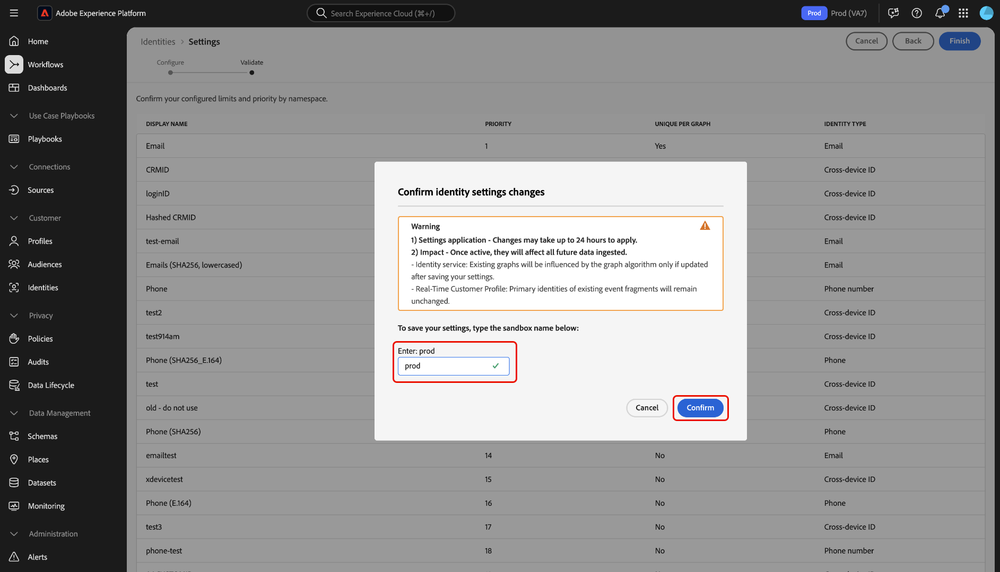

# ID 설정 UI

>[!AVAILABILITY]
>
>* ID 그래프 연결 규칙은 현재 제한적 가용성입니다. 개발 샌드박스의 기능에 액세스하는 방법에 대한 자세한 내용은 Adobe 계정 팀에 문의하십시오.
>
>* UI의 ID 설정에 액세스하려면 계정에 **ID 그래프 보기** 권한이 있어야 합니다. 자세한 내용은 특성 기반 액세스 제어의 사용 권한에 대한 [안내서](../../access-control/abac/ui/permissions.md)를 참조하십시오.

ID 설정은 고유한 네임스페이스를 지정하고 네임스페이스 우선 순위를 구성하는 데 사용할 수 있는 Adobe Experience Platform ID 서비스 UI의 기능입니다.

UI에서 ID 설정을 구성하는 방법을 배우려면 이 안내서를 참조하십시오.

## 전제 조건

ID 설정 작업을 시작하기 전에 다음 문서를 참조하십시오.

* [ID 그래프 연결 규칙](./overview.md)
* [ID 최적화 알고리즘](./identity-optimization-algorithm.md)
* [구현 안내서](./implementation-guide.md)
* [그래프 구성의 예](./example-configurations.md)
* [네임스페이스 우선순위](./namespace-priority.md)
* [그래프 시뮬레이션](./graph-simulation.md)

## ID 설정 구성

ID 설정에 액세스하려면 Adobe Experience Platform UI에서 ID 서비스 작업 영역으로 이동한 다음 **[!UICONTROL 설정]**&#x200B;을 선택하십시오.

ID 설정 페이지는 [!UICONTROL 개인 네임스페이스] 및 [!UICONTROL 장치 또는 쿠키 네임스페이스]의 두 섹션으로 나뉩니다. 개인 네임스페이스는 단일 개인에 대한 식별자입니다. 장치 간 ID, 이메일 주소 및 전화 번호일 수 있습니다. 디바이스 또는 쿠키 네임스페이스는 디바이스 및 웹 브라우저에 대한 식별자이며 개인 네임스페이스보다 높은 우선 순위를 부여할 수 없습니다. 장치 또는 쿠키 네임스페이스를 고유한 네임스페이스로 지정할 수도 없습니다.

### 네임스페이스 우선 순위 구성

네임스페이스 우선 순위를 구성하려면 ID 설정 메뉴에서 네임스페이스를 선택한 다음 해당 네임스페이스를 원하는 순서로 드래그 앤 드롭합니다. 높은 우선 순위를 부여하려면 네임스페이스를 목록에 높게 배치하고, 낮은 우선 순위를 부여하려면 네임스페이스를 목록에 낮게 배치하십시오. 우선 순위가 가장 높은 네임스페이스도 고유한 네임스페이스로 지정해야 합니다.

### 고유한 네임스페이스 지정

고유한 네임스페이스를 지정하려면 해당 네임스페이스에 해당하는 [!UICONTROL 그래프당 고유] 확인란을 선택하십시오. ID 설정 구성에 대해 **최대 3개의 고유한 네임스페이스**&#x200B;를 선택할 수 있습니다.

고유한 네임스페이스가 설정되면 그래프에서 더 이상 고유한 네임스페이스를 포함하는 여러 ID를 가질 수 없습니다. 예를 들어 CRMID를 고유 네임스페이스로 지정한 경우 그래프는 CRMID 네임스페이스와 함께 하나의 ID만 가질 수 있습니다. 자세한 내용은 [ID 최적화 알고리즘 개요](./identity-optimization-algorithm.md#unique-namespace)를 참조하십시오.

구성을 마쳤으면 **[!UICONTROL 다음]**&#x200B;을(를) 선택하여 계속 진행하십시오.

여기에서 마지막 단계로 진행하기 전에 다음 사항을 확인해야 합니다.

1. 선택한 고유한 네임스페이스입니다.
2. 알려진 각 프로필에서 우선 순위가 가장 높은 고유 네임스페이스를 가진 ID의 존재
3. 네임스페이스 우선 순위.

마지막 단계는 설정을 저장한 후 그래프가 업데이트되는 경우에만 그래프 알고리즘 **의 영향을 받는 기존 그래프와 네임스페이스 우선 순위를 변경한 후에도 실시간 고객 프로필에 있는 이벤트 조각의 기본 ID가 업데이트되지 않는다는 다른 확인 메시지입니다.** 또한 새 설정 또는 업데이트된 설정이 적용되는 데 최대 **6시간**&#x200B;이 소요된다는 알림을 받습니다. 확인하려면 샌드박스 이름을 입력한 다음 **[!UICONTROL 확인]**&#x200B;을 선택하세요.

## 다음 단계

ID 그래프 연결 규칙에 대한 자세한 내용은 다음 설명서를 참조하십시오.

* [ID 그래프 연결 규칙 개요](./overview.md)
* [ID 최적화 알고리즘](./identity-optimization-algorithm.md)
* [구현 안내서](./implementation-guide.md)
* [그래프 구성의 예](./example-configurations.md)
* [문제 해결 및 FAQ](./troubleshooting.md)
* [네임스페이스 우선순위](./namespace-priority.md)
* [그래프 시뮬레이션 UI](./graph-simulation.md)