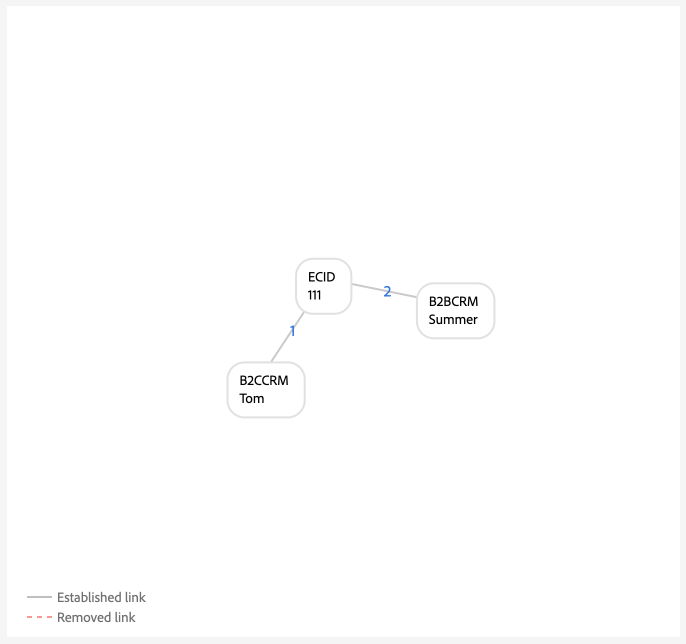

# ID 그래프 연결 규칙에 대한 구현 안내서

>[!AVAILABILITY]
>
>ID 그래프 연결 규칙은 현재 제한된 가용성에 있으며 개발 샌드박스에서 모든 고객이 액세스할 수 있습니다.
>
>* **활성화 요구 사항**: 이 기능은 [!DNL Identity Settings]을(를) 구성하고 저장할 때까지 비활성 상태로 유지됩니다. 이 구성이 없으면 시스템이 동작을 변경하지 않고 계속 정상적으로 작동합니다.
>* **중요 정보**: 이 제한된 가용성 단계에서 Edge 세그먼테이션을 수행하면 예기치 않은 세그먼트 멤버십 결과가 발생할 수 있습니다. 하지만 스트리밍 및 배치 세분화는 예상대로 작동합니다.
>* **다음 단계**: 프로덕션 샌드박스에서 이 기능을 활성화하는 방법에 대한 자세한 내용은 Adobe 계정 팀에 문의하십시오.

>[!IMPORTANT]
>
>이 문서에서는 데이터 없이 새 샌드박스에서 구현을 시작한다고 가정합니다.

Adobe Experience Platform ID 서비스를 사용하여 데이터를 구현할 때 참조할 수 있는 단계별 안내서는 이 문서를 참조하십시오.

단계별 개요:

1. [구현을 위한 전체 사전 요구 사항](#prerequisites-for-implementation)
2. [필요한 ID 네임스페이스 만들기](#namespace)
3. [그래프 시뮬레이션 도구를 사용하여 ID 최적화 알고리즘을 숙지하십시오](#graph-simulation)
4. [ID 설정 UI를 사용하여 고유한 네임스페이스를 지정하고 네임스페이스에 대한 우선 순위 등급을 구성합니다](#identity-settings)
5. [XDM(경험 데이터 모델) 스키마 만들기](#schema)
6. [데이터 세트 만들기](#dataset)
7. [Experience Platform에 데이터 수집](#ingest)

## 구현을 위한 사전 요구 사항 {#prerequisites-for-implementation}

이 단원에서는 데이터에 [!DNL Identity Graph Linking Rules]을(를) 구현하기 전에 완료해야 하는 필수 조건 단계를 간략하게 설명합니다.

### 고유한 네임스페이스

#### 단일 사용자 네임스페이스 요구 사항 {#single-person-namespace-requirement}

모든 프로필에 우선 순위가 가장 높은 고유한 네임스페이스가 항상 있는지 확인해야 합니다. 이렇게 하면 Identity Service가 주어진 그래프에서 적절한 개인 식별자를 감지할 수 있습니다.

+++단일 개인 식별자 네임스페이스가 없는 그래프의 예를 보려면 선택

개인 식별자를 보여 주는 고유한 네임스페이스가 없으면 동일한 ECID에 서로 다른 개인 식별자에 연결되는 그래프가 표시될 수 있습니다. 이 예에서, B2BCRM 및 B2CCRM 둘 다는 동시에 동일한 ECID에 연결된다. 이 그래프는 Tom이 B2C 로그인 계정을 사용하여 Summer와 B2B 로그인 계정을 사용하여 장치를 공유했음을 나타냅니다. 그러나 시스템에서는 하나의 프로필임을 인식합니다(그래프 축소).



+++

+++단일 개인 식별자 네임스페이스가 있는 그래프의 예를 보려면 선택

고유한 네임스페이스(이 경우 서로 다른 두 네임스페이스 대신 CRMID)가 주어지면 Identity Service는 ECID와 마지막으로 연결된 개인 식별자를 식별할 수 있습니다. 이 예에서 고유한 CRMID가 존재하므로 ID 서비스는 두 엔티티가 동일한 디바이스를 공유하는 &quot;공유 디바이스&quot; 시나리오를 인식할 수 있습니다.


+++

### 네임스페이스 우선 순위 구성

[Adobe Analytics 소스 커넥터](../../sources/tutorials/ui/create/adobe-applications/analytics.md)를 사용하여 데이터를 수집하는 경우 ID 서비스에서 AAID를 차단하므로 ECID에 AAID(Adobe Analytics ID)보다 높은 우선 순위를 지정해야 합니다. ECID 우선 순위를 지정하여 실시간 고객 프로필에서 인증되지 않은 이벤트를 AAID 대신 ECID에 저장하도록 지시할 수 있습니다.

### XDM 경험 이벤트 {#xdm-experience-events}

>[!CONTEXTUALHELP]
>id="platform_identities_linkingrules_xdm"
>title="단일 개인 식별자가 있는지 확인"
>abstract="구현 전 프로세스 동안, 시스템이 Experience Platform으로 전송하는 인증된 이벤트에 항상 CRMID와 같은 **단일** 개인 식별자가 포함되어 있는지 확인해야 합니다."

구현 전 프로세스 동안, 시스템이 Experience Platform으로 전송하는 인증된 이벤트에 항상 CRMID와 같은 **단일** 개인 식별자가 포함되어 있는지 확인해야 합니다.

* (권장) 한 개의 고유 개인 ID가 있는 인증된 이벤트입니다.
* (권장되지 않음) 두 개의 고유한 개인 식별자가 있는 인증된 이벤트입니다. 고유 개인 식별자가 두 개 이상 있는 경우 원하지 않는 그래프 축소가 발생할 수 있습니다.
* (권장되지 않음) 고유한 개인 식별자가 없는 인증된 이벤트입니다. 고유한 개인 식별자가 없는 경우 인증되지 않은 이벤트와 인증된 이벤트가 ECID에 대해 저장됩니다.

>[!BEGINTABS]

>[!TAB 한 명의 개인 ID가 있는 인증된 이벤트]

```json
{
  "_id": "test_id",
  "identityMap": {
      "ECID": [
          {
              "id": "62486695051193343923965772747993477018",
              "primary": false
          }
      ],
      "CRMID": [
          {
              "id": "John",
              "primary": true
          }
      ]
  },
  "timestamp": "2024-09-24T15:02:32+00:00",
  "web": {
      "webPageDetails": {
          "URL": "https://business.adobe.com/",
          "name": "Adobe Business"
      }
  }
}
```

>[!TAB 개인 식별자가 두 개인 인 인증된 이벤트]

시스템에서 2명의 개인 식별자를 전송하는 경우 구현이 1명의 개인 네임스페이스 요구 사항에 실패할 수 있습니다. 예를 들어 웹 SDK 구현의 identityMap에 CRMID, customerID 및 ECID 네임스페이스가 포함되어 있으면 모든 단일 이벤트에 CRMID와 customerID가 모두 포함될 수 있습니다.

다음과 같이 페이로드를 **보내지 않음**&#x200B;해야 합니다.

```json
{
  "_id": "test_id",
  "identityMap": {
      "ECID": [
          {
              "id": "62486695051193343923965772747993477018",
              "primary": false
          }
      ],
      "CRMID": [
          {
              "id": "John",
              "primary": true
          }
      ],
      "customerID": [
          {
            "id": "Jane",
            "primary": false
          }
      ],
  },
  "timestamp": "2024-09-24T15:02:32+00:00",
  "web": {
      "webPageDetails": {
          "URL": "https://business.adobe.com/",
          "name": "Adobe Business"
      }
  }
}
```

단, 2명의 개인 식별자를 보낼 수 있지만 구현이나 데이터 오류로 인해 원하지 않는 그래프 붕괴가 방지될 수는 없습니다. 다음 시나리오를 고려하십시오.

* `timestamp1` = John이 로그인하면 -> 시스템에서 `CRMID: John, ECID: 111`을(를) 캡처합니다. 그러나 이 이벤트 페이로드에는 `customerID: John`이(가) 없습니다.
* `timestamp2` = Jane 로그인 -> 시스템이 `customerID: Jane, ECID: 111`을(를) 캡처합니다. 그러나 이 이벤트 페이로드에는 `CRMID: Jane`이(가) 없습니다.

따라서 인증된 이벤트가 있는 한 명의 개인 식별자만 보내는 것이 좋습니다.

그래프 시뮬레이션에서 이 수집은 다음과 같을 수 있습니다.


>[!TAB 개인 식별자가 없는 인증된 이벤트]

이 예에서는 John(최종 사용자)이 인증된 상태에서 웹 사이트를 검색하는 동안 다음 이벤트가 Experience Platform으로 전송되었다고 가정할 수 있습니다. 하지만 인증되었음에도 불구하고 Experience Platform은 이벤트에 개인 식별자가 없어 John을 식별할 수 없습니다. 따라서 이 이벤트는 John과 관련된 온라인 활동으로 인식하지 않고, Adobe 비즈니스 웹 사이트를 탐색하는 익명의 사용자로 해석됩니다.

```json
{
    "_id": "test_id",
    "identityMap": {
        "ECID": [
            {
                "id": "62486695051193343923965772747993477018",
                "primary": false
            }
        ]
    },
    "timestamp": "2024-09-24T15:02:32+00:00",
    "web": {
        "webPageDetails": {
            "URL": "https://business.adobe.com/",
            "name": "Adobe Business"
        }
    }
}
```

>[!ENDTABS]

## 권한 설정 {#set-permissions}

ID 서비스 구현 프로세스의 첫 번째 단계는 Experience Platform 계정이 필요한 권한으로 프로비저닝된 역할에 추가되도록 하는 것입니다. 관리자는 Adobe Experience Cloud의 권한 UI로 이동하여 계정에 대한 권한을 구성할 수 있습니다. 여기에서 계정은 다음 권한이 있는 역할에 추가되어야 합니다.

* [!UICONTROL ID 설정 보기]: ID 네임스페이스 찾아보기 페이지에서 고유한 네임스페이스 및 네임스페이스 우선 순위를 볼 수 있도록 이 권한을 적용합니다.
* [!UICONTROL ID 설정 편집]: ID 설정을 편집하고 저장하려면 이 권한을 적용하세요.

사용 권한에 대한 자세한 내용은 [사용 권한 안내서](../../access-control/abac/ui/permissions.md)를 참조하세요.

## ID 네임스페이스 만들기 {#namespace}

데이터에 필요한 경우 먼저 조직에 적합한 네임스페이스를 만들어야 합니다. 사용자 지정 네임스페이스를 만드는 방법에 대한 단계는 [UI에서 사용자 지정 네임스페이스 만들기](../features/namespaces.md#create-custom-namespaces)에 대한 안내서를 참조하십시오.

## 그래프 시뮬레이션 도구 사용 {#graph-simulation}

그런 다음 Identity Service UI 작업 영역에서 [그래프 시뮬레이션 도구](./graph-simulation.md)로 이동합니다. 그래프 시뮬레이션 도구를 사용하여 다양한 고유한 네임스페이스 및 네임스페이스 우선 순위 구성으로 구축된 ID 그래프를 시뮬레이션할 수 있습니다.

다양한 구성을 만들어 그래프 시뮬레이션 도구를 사용하여 ID 최적화 알고리즘 및 특정 구성이 그래프의 동작 방식에 어떻게 영향을 줄 수 있는지 배우고 더 잘 이해할 수 있습니다.

## ID 설정 구성 {#identity-settings}

그래프의 동작 방식을 보다 잘 이해했으면 Identity Service UI 작업 영역에서 [ID 설정 UI](./identity-settings-ui.md)로 이동합니다. ID 설정 UI에 액세스하려면 왼쪽 탐색에서 **[!UICONTROL ID]**&#x200B;를 선택한 다음 **[!UICONTROL 설정]**&#x200B;을 선택하십시오.


ID 설정 UI를 사용하여 고유한 네임스페이스를 지정하고 우선 순위별로 네임스페이스를 구성합니다. 설정 적용이 끝나면 새 설정이 ID 서비스에 반영되기까지 최소 6시간이 걸리기 때문에 데이터 수집을 진행하려면 최소 6시간 이상 기다려야 합니다.

자세한 내용은 [ID 설정 UI 안내서](./identity-settings-ui.md)를 참조하십시오.

## XDM 스키마 만들기 {#schema}

고유한 네임스페이스 및 네임스페이스 우선 순위가 설정되면 이제 데이터를 수집하기 위해 필요한 설정으로 진행할 수 있습니다. 먼저 XDM 스키마를 만들어야 합니다. 데이터에 따라 XDM 개인 프로필과 XDM ExperienceEvent 모두에 대한 스키마를 만들어야 할 수 있습니다.

실시간 고객 프로필로 데이터를 수집하려면 스키마에 기본 ID로 지정된 필드가 하나 이상 포함되어 있는지 확인해야 합니다. 기본 ID를 설정하여 프로필 수집에 주어진 스키마를 활성화할 수 있습니다.

스키마를 만드는 방법에 대한 지침은 [UI에서 XDM 스키마 만들기](../../xdm/tutorials/create-schema-ui.md)에 대한 안내서를 참조하십시오.

## 데이터 세트 만들기 {#dataset}

그런 다음 데이터 세트를 만들어 수집할 데이터의 구조를 제공합니다. 데이터 세트는 스키마(열) 및 필드(행)를 포함하는 데이터 수집을 위한 저장소 및 관리 구조입니다. 데이터 세트는 스키마와 함께 작동하며 데이터를 실시간 고객 프로필로 수집하려면 프로필 수집에 대해 데이터 세트를 활성화해야 합니다. 프로필에 대해 데이터 세트를 활성화하려면 프로필 수집에 대해 활성화된 스키마를 참조해야 합니다.

데이터 집합을 만드는 방법에 대한 지침은 [데이터 집합 UI 안내서](../../catalog/datasets/user-guide.md)를 참조하세요.

## 데이터 수집 {#ingest}

이 시점에는 다음 항목이 있어야 합니다.

* ID 서비스 기능에 액세스하는 데 필요한 권한입니다.
* 데이터를 위한 네임스페이스.
* 네임스페이스에 대해 지정된 고유한 네임스페이스와 구성된 우선 순위
* 하나 이상의 XDM 스키마. (데이터와 특정 사용 사례에 따라 프로필과 경험 이벤트 스키마를 모두 만들어야 할 수 있습니다.)
* 스키마를 기반으로 하는 데이터 세트입니다.

위에 나열된 모든 항목이 있으면 Experience Platform으로 데이터 수집을 시작할 수 있습니다. 여러 가지 다양한 방법을 통해 데이터 수집을 수행할 수 있습니다. 다음 서비스를 사용하여 데이터를 Experience Platform으로 가져올 수 있습니다.

* [일괄 처리 및 스트리밍 수집](../../ingestion/home.md)
* [Experience Platform에서의 데이터 수집](../../collection/home.md)
* [Experience Platform 소스](../../sources/home.md)

>[!TIP]
>
>데이터가 수집되면 XDM 원시 데이터 페이로드는 변경되지 않습니다. UI에 기본 ID 구성이 계속 표시될 수 있습니다. 그러나 이러한 구성은 ID 설정에 의해 재정의됩니다.

피드백에 대해서는 Identity Service UI 작업 영역에서 **[!UICONTROL Beta 피드백]** 옵션을 사용하십시오.

## 그래프 유효성 검사 {#validate}

전체 ID 수 및 그래프 수 트렌드, 네임스페이스별 ID 수 및 그래프 크기별 그래프 수 등 ID 그래프의 상태에 대한 통찰력을 얻으려면 ID 대시보드를 사용하십시오. ID 대시보드를 사용하여 둘 이상의 ID가 있는 그래프의 트렌드를 네임스페이스별로 정리하여 볼 수도 있습니다.

자세한 정보를 확인하고 축소된 그래프가 없는지 확인하려면 줄임표(`...`)를 선택한 다음 **[!UICONTROL 자세히 보기]**&#x200B;를 선택하십시오.


축소된 그래프에 대한 정보를 보려면 나타나는 창을 사용합니다. 이 예에서는 이메일과 전화기가 모두 고유 네임스페이스로 표시되므로 샌드박스에 축소된 그래프가 없습니다.


## 부록 {#appendix}

ID 설정 및 고유한 네임스페이스를 구현할 때 참조할 수 있는 추가 정보는 이 섹션 을 참조하십시오.

### Dangling loginID 시나리오 {#dangling-loginid-scenario}

다음 그래프는 &quot;댕글링&quot; loginID 시나리오를 시뮬레이션합니다. 이 예에서는 두 개의 서로 다른 loginID가 동일한 ECID에 바인딩됩니다. 그러나 `{loginID: ID_C}`은(는) CRMID에 연결되어 있지 않습니다. 따라서 Identity Service에서는 이 두 로그인 ID가 서로 다른 두 엔티티를 나타내는지 감지할 수 없습니다.

>[!BEGINTABS]

>[!TAB 모호한 로그인 ID]

이 예제에서 `{loginID: ID_C}`은(는) CRMID에 매달려 있고 연결되어 있지 않습니다. 따라서 이 loginID와 연결해야 하는 개인 엔티티가 모호하게 유지됩니다.


>[!TAB loginID가 CRMID에 연결되어 있습니다]

이 예제에서는 `{loginID: ID_C}`이(가) `{CRMID: Tom}`에 연결되어 있습니다. 따라서 시스템이 이 loginID가 Tom과 연결되어 있는지 식별할 수 있습니다.


>[!TAB loginID가 다른 CRMID에 연결되어 있습니다]

이 예제에서는 `{loginID: ID_C}`이(가) `{CRMID: Summer}`에 연결되어 있습니다. 따라서 시스템은 이 loginID가 다른 개인 엔티티(이 경우 Summer)와 연관되어 있음을 식별할 수 있습니다.

이 예는 Tom과 Summer가 `{ECID: 111}`(으)로 표현되는 장치를 공유하는 개별 엔터티를 구별하는 것을 보여 줍니다.


>[!ENDTABS]

## 다음 단계

[!DNL Identity Graph Linking Rules]에 대한 자세한 내용은 다음 설명서를 참조하십시오.

* [[!DNL Identity Graph Linking Rules] 개요](./overview.md)
* [ID 최적화 알고리즘](./identity-optimization-algorithm.md)
* [그래프 구성의 예](./example-configurations.md)
* [문제 해결 및 FAQ](./troubleshooting.md)
* [네임스페이스 우선순위](./namespace-priority.md)
* [그래프 시뮬레이션 UI](./graph-simulation.md)
* [ID 설정 UI](./identity-settings-ui.md)
