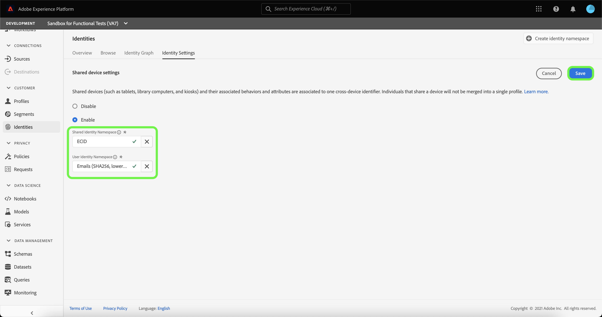

# 공유 장치 감지 개요(Beta)

>[!IMPORTANT]
>
>[!DNL Shared Device Detection] 기능이 Beta 버전입니다. 기능 및 설명서는 변경될 수 있습니다.

Adobe Experience Platform [!DNL Identity Service]을(를) 사용하면 디바이스와 시스템 간에 id를 연결하여 고객 및 고객 행동에 대한 더 나은 보기를 얻을 수 있으므로 효과적인 개인 디지털 경험을 실시간으로 제공할 수 있습니다.

[!DNL Shared Device]은(는) 둘 이상의 개인이 사용하는 장치를 나타냅니다. 공유 장치의 예로는 태블릿, 라이브러리 컴퓨터 및 키오스크가 있습니다. [!DNL Shared Device Detection] 기능을 통해 동일한 장치의 다른 사용자가 단일 ID로 병합되는 것을 방지할 수 있으므로 개인을 보다 정확하게 표현할 수 있습니다.

[!DNL Shared Device Detection]을(를) 사용하여 다음을 수행할 수 있습니다.

* 동일한 장치의 여러 사용자에 대해 별도의 ID 그래프를 만듭니다.
* 동일한 장치를 사용하여 서로 다른 개인의 데이터가 혼합되는 것을 방지합니다.
* 고객을 보다 깨끗하고 정확하게 파악할 수 있도록 합니다.

>[!TIP]
>
>[!DNL Identity Service]에서 그래프가 생성되면 더 이상 설정을 수정할 수 없으므로 데이터 집합에 대해 프로필을 활성화하기 전에 [!DNL Shared Device Detection]에 대한 구성을 완료해야 합니다.

## [!DNL Shared Device Detection] 시작하기

[!DNL Shared Device Detection]을(를) 사용하여 작업하려면 관련된 다양한 플랫폼 서비스를 이해해야 합니다. [!DNL Shared Device Detection](으)로 작업을 시작하기 전에 다음 서비스에 대한 설명서를 검토하십시오.

* [[!DNL Identity Service]](./home.md): 장치 및 시스템 간에 ID를 연결하여 개별 고객 및 개별 고객의 행동을 더 잘 볼 수 있습니다.
   * [ID 그래프 뷰어](./features/identity-graph-viewer.md): ID 그래프 뷰어를 시각화하고 상호 작용하여 고객 ID를 결합하는 방법과 그 방법을 더 잘 이해합니다.
   * [ID 네임스페이스](./features/namespaces.md): 정규화된 ID의 구성 요소를 확인하고 ID 네임스페이스를 통해 ID의 컨텍스트와 유형을 구별하는 방법을 확인하십시오.

## [!DNL Shared Device Detection] 이해 

를 사용할 때는 다음 용어를 이해하는 것이 중요합니다
[!DNL Shared Device Detection]. [!DNL Shared Device Detection]을(를) 이해하는 데 필요한 용어 목록은 아래 표를 참조하십시오.

### 용어

| 용어 | 정의 |
| --- | --- |
| 공유 장치 | 공유 장치는 두 명 이상의 개인이 사용하는 장치입니다. 공유 장치의 예로는 태블릿, 라이브러리 컴퓨터 및 키오스크가 있습니다. |
| [!DNL Shared Device Detection] | [!DNL Shared Device Detection]은(는) 동일한 장치의 다른 사용자의 데이터를 서로 분리할 수 있는 구성 설정을 나타냅니다. |
| 공유 ID 네임스페이스 | 공유 ID 네임스페이스는 여러 사용자가 사용할 수 있는 장치를 나타냅니다. 공유 ID 네임스페이스는 일반적으로 ECID이지만 다른 장치 ID로 설정할 수 있습니다. |
| 사용자 ID 네임스페이스 | 사용자 ID 네임스페이스는 공유 장치의 인증된(로그인된) 사용자를 나타냅니다. |
| 마지막으로 인증된 사용자 | 마지막 인증된 사용자는 장치가 여러 계정에 의해 로그온되어 있는 경우 장치에 마지막으로 로그인한 사용자를 나타냅니다. |

{style="table-layout:auto"}

[!DNL Shared Device Detection]은(는) **공유 ID 네임스페이스**&#x200B;와(과) **사용자 ID 네임스페이스**&#x200B;의 두 네임스페이스를 설정하여 작동합니다.

* 공유 ID 네임스페이스는 여러 사용자가 사용할 수 있는 장치를 나타냅니다. Adobe은 고객이 ECID를 공유 장치 식별자로 사용할 것을 권장합니다.
* 사용자 ID 네임스페이스는 사용자의 로그인 ID에 해당하는 ID 네임스페이스에 매핑되며, 사용자의 CRM ID, 이메일 주소, 해시된 이메일 또는 전화번호일 수 있습니다.

태블릿과 같은 공유 장치에는 단일 **공유 ID 네임스페이스**&#x200B;가 있습니다. 반면에 공유 장치의 각 사용자에게는 해당 로그인 ID에 해당하는 고유한 지정된 **사용자 ID 네임스페이스**&#x200B;가 있습니다. 예를 들어, Kevin과 Nora가 전자 상거래를 위해 공유하는 태블릿의 자체 ECID는 `1234`인 반면 Kevin은 `kevin@email.com` 계정에 매핑된 자체 사용자 ID 네임스페이스를 가지고 Nora는 `nora@email.com` 계정에 매핑된 자체 사용자 ID 네임스페이스를 가지고 있습니다.

[!DNL Shared Device Detection]은(는) 공유 id 네임스페이스(예: )를 연결하여 동일한 장치의 여러 사용자를 구분할 수 있습니다. ECID)를 마지막으로 인증된 사용자의 사용자 ID 네임스페이스(로그인 ID)와 함께 사용할 수 있습니다.

### ID 데이터를 ID 그래프로 보내는 방법

[!DNL Shared Device Detection]의 작동 방식을 이해하려면 다음 예를 고려하십시오.

>[!NOTE]
>
>이 다이어그램에서 공유 ID 네임스페이스는 ECID로 구성되고 사용자 ID 네임스페이스는 CRM ID로 구성됩니다.

* Kevin과 Nora는 전자상거래 웹사이트를 방문하는 태블릿을 공유한다. 그러나, 그들 둘 다 그들이 온라인으로 검색하고 쇼핑하기 위해 각각 사용하는 그들 자신의 독립적인 계정을 가지고 있습니다.
   * 공유 디바이스인 태블릿에는 태블릿의 웹 브라우저 쿠키 ID를 나타내는 해당 ECID가 있습니다.
* Kevin이 태블릿을 사용하고 전자 상거래 계정에 **로그인**&#x200B;하여 헤드폰을 검색한다고 가정할 때 Kevin의 CRM ID(**사용자 ID 네임스페이스**)가 이제 태블릿의 ECID(**공유 ID 네임스페이스**)와 연결되어 있음을 의미합니다. 태블릿의 브라우징 데이터가 이제 케빈의 신분 그래프에 통합되었습니다.
   * Kevin **로그아웃**&#x200B;하고 Nora가 태블릿을 사용하고 자신의 계정에 **로그인**&#x200B;하고 카메라를 구입하면 이제 CRM ID가 태블릿의 ECID에 연결됩니다. 따라서, 태블릿의 브라우징 데이터는 이제 노라의 신원 그래프와 통합된다.
   * Nora **로그아웃하지 않고** Kevin이 태블릿을 사용하지만 **로그인하지 않는**&#x200B;인 경우, 태블릿의 검색 데이터는 여전히 Nora와 통합되어 있습니다. 왜냐하면 Nora는 인증된 사용자로 남아 있고 CRM ID는 여전히 태블릿의 ECID에 연결되어 있기 때문입니다.
   * Nora **로그아웃하지 않음**&#x200B;과(와) Kevin이 태블릿을 사용하지만 **로그인하지 않음**&#x200B;인 경우 **마지막으로 인증된 사용자**&#x200B;로서 태블릿의 CRM ID는 태블릿의 ECID와 연결된 상태로 유지되므로 태블릿의 검색 데이터는 여전히 Nora의 ID 그래프와 통합되어 있습니다.
   * Kevin **다시 로그인**&#x200B;하면 이제 Kevin의 CRM ID가 태블릿의 ECID에 연결됩니다. Kevin은 이제 마지막으로 인증된 사용자이고 태블릿의 검색 데이터가 이제 ID 그래프와 통합되기 때문입니다.

### [!DNL Profile Service]에서 [!DNL Shared Device Detection]이(가) 활성화된 프로필 조각을 병합하는 방법

[!DNL Profile Service]은(는) 프로필 조각과 병합된 프로필을 기록합니다. 각 개별 고객 프로필은 해당 고객에 대한 단일 보기를 형성하기 위해 병합된 여러 프로필 조각으로 구성됩니다. 예를 들어 고객이 여러 채널에서 브랜드와 상호 작용하는 경우 조직에는 여러 데이터 세트에 표시되는 단일 고객과 관련된 여러 프로필 조각이 있습니다. 이러한 조각을 Platform에 수집하면 해당 고객을 위한 단일 프로필을 만들기 위해 함께 병합됩니다.

[!DNL Shared Device Detection]이(가) 활성화되면 [!DNL Profile]은(는) 경험 이벤트가 인증되었는지 인증되지 않았는지 여부를 기준으로 프로필 조각의 기본 ID를 정의합니다

**인증된 경험 이벤트**&#x200B;은(는) 장치에 로그인하는 동안 사용자가 완료한 작업입니다. 인증된 경험 이벤트의 경우 기본 ID는 **사용자 ID 네임스페이스**(로그인 ID)입니다. **인증되지 않은 경험 이벤트**&#x200B;은(는) 장치에 로그인하지 않은 사용자가 완료한 작업입니다. 인증되지 않은 경험 이벤트의 경우 기본 ID는 **공유 ID 네임스페이스**(ECID)입니다.

자세한 내용은 [[!DNL Real-Time Customer Profile] 개요](../profile/home.md)를 참조하세요.

## 공유 장치 UI

Platform UI의 왼쪽 탐색에서 **[!UICONTROL ID]**&#x200B;를 선택한 다음 **[!UICONTROL ID 설정]**&#x200B;을 선택합니다.

데이터에 대한 공유 장치 설정을 구성할 수 있는 인터페이스를 제공하는 [!UICONTROL 공유 장치 설정] 페이지가 나타납니다. 공유 장치 설정은 기본적으로 비활성화되어 있습니다.

활성화된 경우 공유 장치 설정을 사용하면 동일한 장치의 다른 사용자의 데이터를 서로 분리할 수 있습니다. 이 구성 설정을 사용하면 동일한 장치의 사용자 ID가 함께 결합되지 않는 ID 그래프를 보다 깨끗하고 정확하게 표시할 수 있습니다.

공유 장치 설정 수정을 시작하려면 **[!UICONTROL 사용]**&#x200B;을 선택하세요.

[!UICONTROL 공유 ID 네임스페이스] 및 [!UICONTROL 사용자 ID 네임스페이스] 구성 옵션이 표시되어 사용하려는 ID 네임스페이스를 수정할 수 있습니다.

[!UICONTROL 공유 ID 네임스페이스]는 여러 다른 사용자가 사용하는 단일 장치를 나타냅니다. 모든 Platform 사용자가 웹 브라우저 식별자로 **[!UICONTROL ECID]**&#x200B;을(를) 사용하므로 이 네임스페이스는 항상 **[!UICONTROL ECID]**(으)로 설정됩니다.

[!UICONTROL 사용자 ID 네임스페이스]를 사용하면 동일한 장치의 다른 사용자를 식별하고 데이터가 동일한 ID 그래프로 결합되지 않도록 할 수 있습니다.

**[!UICONTROL 사용자 ID 네임스페이스]** 검색 창을 선택하고 ID 네임스페이스를 입력하거나 드롭다운 메뉴에서 ID 네임스페이스를 선택하십시오.

>[!TIP]
>
>[!UICONTROL 사용자 ID 네임스페이스]을(를) 최종 사용자의 로그인 ID에 해당하는 ID 네임스페이스에 매핑해야 합니다. 옵션에는 고객 ID, 이메일 및 해시된 이메일이 포함됩니다.

[!UICONTROL 공유 장치 설정]을 구성했으면 **[!UICONTROL 저장]**&#x200B;을 선택합니다.

선택 내용을 확인하는 팝업 창이 나타납니다. 구성 설정을 완료하려면 **[!UICONTROL 예]**&#x200B;를 선택하십시오.

