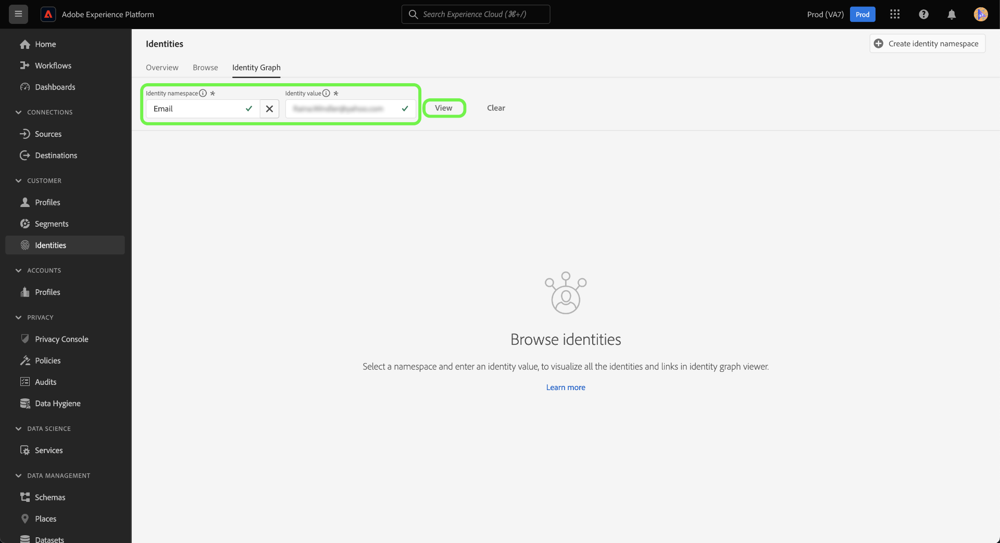
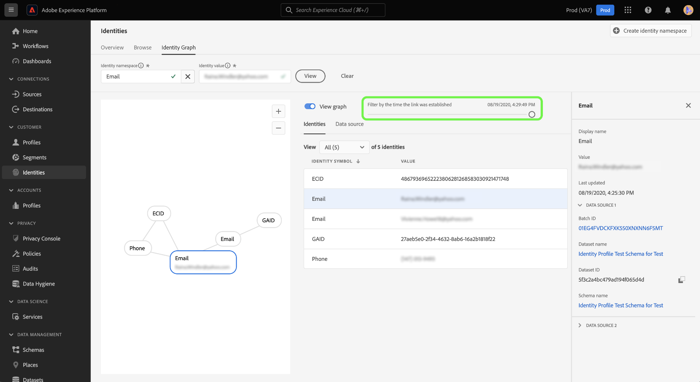

# ID 그래프 뷰어

ID 그래프는 특정 고객에 대해 서로 다른 ID 간의 관계 맵으로서, 고객이 다른 채널에서 브랜드와 상호 작용하는 방법을 시각적으로 보여줍니다. 모든 고객 ID 그래프는 고객 활동에 대한 응답으로 거의 실시간으로 Adobe Experience Platform Identity Service에서 통합 관리 및 업데이트됩니다.

Platform 사용자 인터페이스의 ID 그래프 뷰어를 사용하면 함께 결합되는 고객 ID와 대상을 시각화하고 더 잘 이해할 수 있습니다. 뷰어를 사용하면 그래프의 다른 부분과 드래그 및 상호 작용할 수 있으므로 복잡한 ID 관계를 살펴보고 보다 효율적으로 디버깅할 수 있으며 정보 활용 방식의 투명성 증대를 얻을 수 있습니다.

다음 문서에서는 Platform UI에서 ID 그래프 뷰어에 액세스하고 사용하는 방법에 대해 설명합니다.

## 튜토리얼 비디오

다음 비디오는 ID 그래프 뷰어에 대한 이해를 지원하기 위한 것입니다.

>[!VIDEO](https://video.tv.adobe.com/v/331030/?quality=12&learn=on)

## 시작하기

ID 그래프 뷰어로 작업하려면 관련된 다양한 Adobe Experience Platform 서비스를 이해해야 합니다. ID 그래프 뷰어로 작업하기 전에 다음 서비스에 대한 설명서를 검토하십시오.

- [[!DNL Identity Service]](../home.md): 여러 장치와 시스템에서 ID를 브리징하여 개별 고객과 고객의 행동을 더 잘 파악할 수 있습니다.
- [실시간 고객 프로필](../../profile/home.md): ID 그래프는 실시간 고객 프로필에서 고객 속성 및 행동의 종합적이고 단일 보기를 만드는 데 활용됩니다.

### 용어

- **ID(노드):** ID 또는 노드는 일반적으로 한 엔티티에 고유한 데이터입니다. ID는 ID 네임스페이스와 ID 값으로 구성됩니다. 예를 들어 정규화된 ID는 **이메일**, 의 id 값과 결합됩니다. **로빈@email.com**.
- **링크(에지):** 링크 또는 에지는 ID 간의 연결을 나타냅니다. ID 링크에는 처음 설정된 타임스탬프 및 마지막으로 업데이트된 타임스탬프와 같은 속성이 포함됩니다. 처음 설정된 타임스탬프는 새 ID가 기존 ID에 연결된 날짜 및 시간을 정의합니다. 마지막으로 업데이트된 타임스탬프는 기존 ID 링크가 마지막으로 업데이트된 날짜와 시간을 정의합니다.
- **그래프(클러스터):** 그래프 또는 클러스터는 개인을 나타내는 ID 및 링크의 그룹입니다.

## ID 그래프 뷰어에 액세스 {#access-identity-graph-viewer}

플랫폼 UI에서 **[!UICONTROL ID]** 왼쪽 탐색에서 를 선택하고 을 선택합니다. **[!UICONTROL ID 그래프]** 를 클릭합니다.

ID 그래프를 보려면 ID 네임스페이스와 해당 값을 제공한 다음 을(를) 선택합니다 **[!UICONTROL 보기]**.

>[!TIP]
>
>표 아이콘을 선택합니다  사용 가능한 모든 ID 네임스페이스 목록이 포함된 패널을 보려면 다음을 수행하십시오. 유효한 ID 값이 연결되어 있는 한 모든 ID 네임스페이스를 사용할 수 있습니다. 자세한 내용은 [identity namespace 안내서](../namespaces.md).

## ID 그래프 뷰어 인터페이스 이해

ID 그래프 뷰어 인터페이스는 ID 데이터와 상호 작용하고 더 잘 이해하는 데 사용할 수 있는 여러 요소로 구성되어 있습니다.

ID 그래프는 입력한 ID 네임스페이스와 값 조합에 연결된 모든 ID를 표시합니다. 각 노드는 ID 네임스페이스와 해당 값으로 구성됩니다. 그래프와 상호 작용할 노드를 선택, 보류 및 드래그할 수 있습니다. 또는 노드 위로 마우스를 가져가면 해당 ID 값에 대한 정보를 볼 수 있습니다. 선택 **[!UICONTROL 그래프 보기]** 그래프를 숨기거나 표시하려면 다음을 수행하십시오.

>[!IMPORTANT]
>
>ID 그래프에는 연결된 ID가 최소 2개 이상 생성되어야 하며 유효한 ID 네임스페이스와 값 조합이 필요합니다. 그래프 뷰어에서 표시할 수 있는 최대 ID 수는 150개입니다. 자세한 내용은 [부록](#appendix) 자세한 내용은 아래 섹션을 참조하십시오.

그래프 내에서 링크를 선택하여 해당 링크에 기여하는 데이터 세트와 배치 ID를 확인합니다. 링크를 선택하면 오른쪽 레일이 업데이트되어 데이터 소스 세부 사항에 대한 자세한 정보와 처음 설정된 타임스탬프 및 마지막으로 업데이트된 타임스탬프와 같은 속성이 제공됩니다.

다음 [!UICONTROL ID] 표는 id 데이터에 대한 다른 보기를 제공하여 id 네임스페이스와 id 값 조합을 테이블 형식으로 나열합니다. 그래프에서 노드를 선택하면 [!UICONTROL ID] 테이블.

드롭다운 메뉴를 사용하여 그래프 데이터를 정렬하고 특정 ID 네임스페이스에 대한 정보를 강조 표시합니다. 예를 들어, **[!UICONTROL 이메일]** 메뉴에서 전자 메일 id 네임스페이스와 관련된 데이터를 볼 수 있습니다.

오른쪽 레일에는 마지막으로 업데이트된 타임스탬프를 포함하여 선택한 ID에 대한 정보가 표시됩니다. 오른쪽 레일에는 선택한 ID에 해당하는 데이터 소스(예: 해당 배치 ID, 데이터 세트 이름, 데이터 세트 ID 및 스키마 이름)에 대한 정보도 표시됩니다.

다음 표는 오른쪽 레일에 표시되는 데이터 소스 속성에 대한 추가 정보를 제공합니다.

| 데이터 소스 | 설명 |
| --- | --- | 
| 일괄 처리 ID | 배치 데이터에 해당하는 자동 생성 식별자입니다. |
| 데이터 세트 ID | 데이터 세트에 해당하는 자동 생성된 식별자입니다. |
| 데이터 세트 이름 | 일괄 처리 데이터가 포함된 데이터 세트의 이름입니다. |
| 스키마 이름 | 스키마의 이름입니다. 스키마에서는 데이터의 구조 및 형식을 나타내고 유효성을 검사하는 규칙 세트를 제공합니다. |

를 사용할 수도 있습니다 *[!UICONTROL 데이터 소스]* 를 클릭하여 ID에 기여하는 데이터 소스 목록을 확인합니다. 선택 [!UICONTROL 데이터 소스] 데이터 세트 및 배치 ID를 표 형식으로 볼 수 있습니다.

슬라이더를 사용하여 ID가 처음 설정된 시간까지 그래프 데이터를 필터링합니다. 기본적으로 ID 그래프 뷰어는 그래프 내에 연결된 모든 ID를 표시합니다. 슬라이더를 길게 끌어서 새 ID가 그래프에 연결된 마지막 타임스탬프로 시간을 조정합니다. 아래 예에서는 그래프에 가장 최근 ID 링크(GAID)가 **[!UICONTROL 08/19/2020, 4:29:오후 29]**.

슬라이더를 조정하여 다른 ID 링크(이메일)가 설정되어 있는지 확인합니다 **[!UICONTROL 08/19/2020, 4:25:오후 30시]**.

슬라이더를 조정하여 그래프의 가장 빠른 이터레이션을 볼 수도 있습니다. 아래 예에서는 ID 그래프 뷰어에 그래프가 처음 생성되었음을 표시합니다 **[!UICONTROL 08/19/2020, 4:11:오후 49]**, ECID, Email 및 Phone으로 연결되는 첫 번째 링크가 있습니다.

## 부록

다음 섹션에서는 ID 그래프 뷰어 작업을 위한 추가 정보를 제공합니다.

### 오류 메시지 이해

ID 그래프 뷰어에 액세스할 때 오류가 발생할 수 있습니다. 다음은 ID 그래프 뷰어로 작업할 때 기억해야 할 사전 요구 사항 및 제한 사항 목록입니다.

- ID 값이 선택한 네임스페이스에 있어야 합니다.
- ID 그래프 뷰어에는 생성된 연결된 ID가 최소 2개 필요합니다. ID 값이 하나만 있고 연결된 ID가 없을 수 있으며 이 경우 값은 에만 존재할 수 있습니다 [!DNL Profile] 뷰어입니다.
- ID 그래프 뷰어는 최대 150개의 ID를 초과할 수 없습니다.

### 데이터 세트에서 ID 그래프 뷰어에 액세스

데이터 세트 인터페이스를 사용하여 ID 그래프 뷰어에 액세스할 수도 있습니다. 데이터 세트에서 [!UICONTROL 찾아보기] 페이지에서 상호 작용할 데이터 세트를 선택한 다음 을 선택합니다 **[!UICONTROL 데이터 세트 미리 보기]**

미리 보기 창에서 지문 아이콘을 선택하여 ID 그래프 뷰어를 통해 표시되는 ID를 확인합니다.

>[!TIP]
>
>지문 아이콘은 데이터 세트에 두 개 이상의 ID가 있는 경우에만 나타납니다.

## 다음 단계

이 문서를 읽은 후에는 플랫폼 UI에서 고객의 ID 그래프를 살펴보는 방법을 알아보았습니다. 플랫폼의 ID에 대한 자세한 내용은 [ID 서비스 개요](../home.md)

## 창로그

| 날짜 | 작업 |
| ---- | ------ |
| 2021-01 | <ul><li>수집된 스트리밍 데이터 및 비프로덕션 샌드박스에 대한 지원이 추가되었습니다.</li><li>사소한 버그가 수정되었습니다.</li></ul> |
| 2021-02 | <ul><li>ID 그래프 뷰어는 데이터 집합 미리 보기를 통해 액세스할 수 있습니다.</li><li>사소한 버그가 수정되었습니다.</li><li>ID 그래프 뷰어는 일반적으로 사용할 수 있게 됩니다.</li></ul> |
| 2023-01 | <ul><li>UI 업데이트.</li></ul> |
