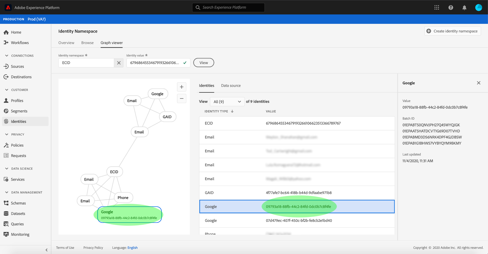

# (베타) ID 그래프 뷰어

>[!NOTE]
>
>ID 그래프 뷰어는 현재 베타 버전입니다. 이 기능은 변경될 수 있습니다.

ID 그래프는 특정 고객에 대해 서로 다른 ID 간의 관계를 보여주는 지도로, 다양한 채널에서 고객이 브랜드와 상호 작용하는 방식을 시각적으로 보여줍니다. 모든 고객 ID 그래프는 고객 활동에 대한 대응으로 Adobe Experience Platform ID 서비스가 거의 실시간으로 종합적으로 관리하고 업데이트합니다.

플랫폼 유저 인터페이스의 ID 그래프 뷰어를 사용하면 어떤 고객 ID가 함께 결합되어 있는지, 어떤 방식으로 결합되어 있는지 시각화하고 더 잘 이해할 수 있습니다. 뷰어를 사용하면 그래프의 다른 부분과 드래그 앤 인터랙션할 수 있으므로 복잡한 ID 관계를 살펴보고 보다 효율적으로 디버깅할 수 있으며 정보 활용 방법을 통해 투명도를 높일 수 있습니다.

## 시작하기

ID 그래프 뷰어를 사용하여 작업하려면 관련된 다양한 Adobe Experience Platform 서비스를 이해해야 합니다. ID 그래프 뷰어로 작업하기 전에 다음 서비스에 대한 설명서를 검토하십시오.

- [[!DNL Identity Service]](../home.md):다양한 디바이스와 시스템에 ID를 연결하여 개별 고객 및 고객의 행동을 명확하게 파악할 수 있습니다.

### 용어

- **ID(노드):** ID 또는 노드는 일반적으로 개인, 엔티티에 고유한 데이터입니다. ID는 네임스페이스 및 ID 값으로 구성됩니다.
- **링크(에지):** 링크 또는 가장자리는 ID 간의 연결을 나타냅니다.
- **그래프(클러스터):** 그래프 또는 클러스터는 개인을 나타내는 ID 및 링크 그룹입니다.

## ID 그래프 뷰어에 액세스

UI에서 ID 그래프 뷰어를 사용하려면 왼쪽 탐색 **[!UICONTROL 에서 ID를]** 선택한 다음 **[!UICONTROL ID 그래프]** 탭을 선택합니다. ID **[!UICONTROL 네임스페이스]** 화면에서 ID 네임스페이스 **[!UICONTROL 선택]** 아이콘을 클릭하여 사용할 네임스페이스를 검색합니다.

ID 네임스페이스 **[!UICONTROL 선택]** 패널이 나타납니다. 이 화면은 네임스페이스의 표시 이름 **[!UICONTROL ,]** ID 기호 **[!UICONTROL , 소유자]**, 업데이트된 마지막 **[!UICONTROL 날짜, 업데이트된 마지막]**&#x200B;날짜, FacebookDescription **[!UICONTROL 에 대한 정보 등 조직에서 사용할 수 있는 네임스페이스 목록을]** ****&#x200B;포함합니다. 유효한 ID 값이 연결되어 있는 한 제공된 모든 네임스페이스를 사용할 수 있습니다.

사용할 네임스페이스를 선택하고 선택을 클릭하여 **[!UICONTROL 계속 진행합니다]** .

네임스페이스를 선택하고 나면 ID 값 **[!UICONTROL 텍스트 상자에 특정 고객에 대한 해당 값을]** 입력하고 보기를 **[!UICONTROL 선택합니다]**.

ID 그래프 뷰어가 나타납니다. 화면의 왼쪽에는 선택한 네임스페이스에 연결된 모든 ID와 입력한 ID 값이 표시된 ID 그래프가 있습니다. 각 ID 노드는 네임스페이스와 해당 ID 값으로 구성됩니다. ID를 선택하고 유지하여 그래프를 드래그하여 상호 작용할 수 있습니다. 또는 ID 위로 마우스를 가져가면 ID 값에 대한 정보를 볼 수 있습니다. 그래프 출력은 화면 중앙에 토프 목록으로 표시됩니다.

>[!IMPORTANT]
>
>ID 그래프에는 두 개의 연결된 ID뿐만 아니라 유효한 네임스페이스 및 ID 쌍도 생성해야 합니다. 그래프 뷰어에서 표시할 수 있는 최대 ID 수는 400개입니다. 자세한 내용은 아래 [부록](#appendix) 섹션을 참조하십시오.

ID 테이블에서 강조 표시된 행을 **[!UICONTROL 업데이트하고 ID의 값]** , **[!UICONTROL 일괄 처리 ID]**&#x200B;및 마지막 업데이트 **[!UICONTROL 날짜를 포함하는 오른쪽 레일에 제공된 정보를 업데이트하려면 ID]**&#x200B;테이블에서 **[!UICONTROL 강조 표시된 행을]** 선택하고해당 레일에 제공된 정보를 업데이트합니다.

그래프를 통해 필터링하고 ID 테이블 위에 있는 정렬 옵션을 사용하여 특정 네임스페이스를 분리할 **[!UICONTROL 수]** 있습니다. 드롭다운 메뉴에서 강조 표시할 네임스페이스를 선택합니다.

그래프 뷰어가 반환되고 선택한 네임스페이스를 강조 표시합니다. 필터 옵션은 선택한 네임스페이스에 대한 **[!UICONTROL 정보만 반환하도록]** ID 테이블을 업데이트합니다.

그래프 뷰어 상자의 오른쪽 상단에는 배율 옵션이 포함되어 있습니다. 그래프를 확대하려면 **(+)** 아이콘 **을** 선택하거나 축소하려면(-)아이콘을 선택합니다.

헤더에서 **[!UICONTROL 데이터 소스를]** 선택하여 배치에 대한 자세한 정보를 볼 수 있습니다. 데이터 **[!UICONTROL 소스]** 테이블에는 그래프와 연결된 **[!UICONTROL 배치]** ID **[!UICONTROL 목록과 해당]**&#x200B;연결된 ID, 소스 스키마 및 통합 날짜가 표시됩니다.

ID 그래프 내의 링크를 선택하여 링크에 기여한 모든 소스 배치를 볼 수 있습니다.

또는 일괄 처리를 선택하여 이 일괄 처리에 기여한 모든 링크를 볼 수 있습니다.

ID가 더 큰 클러스터를 사용하는 ID 그래프도 ID 그래프 뷰어를 통해 액세스할 수 있습니다.

## 부록

다음 섹션에서는 ID 그래프 뷰어로 작업하기 위한 추가 정보를 제공합니다.

### 오류 메시지 이해

ID 그래프 뷰어에 액세스할 때 오류가 발생할 수 있습니다. 다음은 ID 그래프 뷰어로 작업할 때 주의해야 할 사전 요구 사항 및 제한 사항의 목록입니다.

- 선택한 네임스페이스에 ID 값이 있어야 합니다.
- ID 그래프 뷰어에서는 생성하려면 최소 두 개의 연결된 ID가 필요합니다.
- ID 그래프 뷰어는 최대 400ID를 초과할 수 없습니다.
- ID 그래프 뷰어는 현재 비프로덕션 샌드박스에서 액세스할 수 없습니다.
- ID 그래프 뷰어는 현재 일괄적으로 인제스트된 데이터만 지원하며 스트리밍 소스를 사용하여 인제스트된 데이터는 표시하지 않습니다.

## 다음 단계

이 문서를 통해 플랫폼 UI에서 고객의 ID 그래프를 살펴보는 방법을 살펴보았습니다. 플랫폼의 ID에 대한 자세한 내용은 ID [서비스 개요를 참조하십시오.](../home.md)