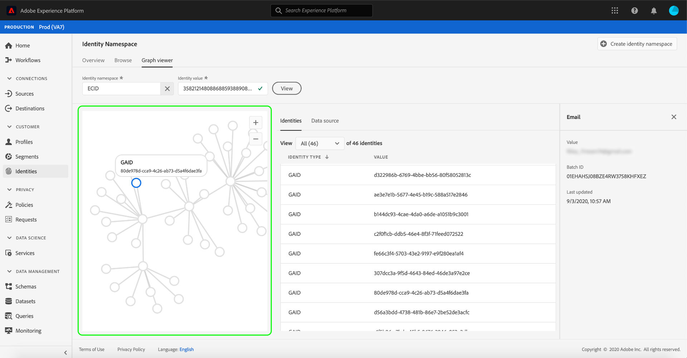

# ID 그래프 뷰어 개요

ID 그래프는 특정 고객에 대해 서로 다른 ID 간의 관계 맵으로서, 고객이 다른 채널에서 브랜드와 상호 작용하는 방법을 시각적으로 보여줍니다. 모든 고객 ID 그래프는 고객 활동에 대한 응답으로 거의 실시간으로 Adobe Experience Platform Identity Service에서 통합 관리 및 업데이트됩니다.

Platform 사용자 인터페이스의 ID 그래프 뷰어를 사용하면 함께 결합되는 고객 ID와 대상을 시각화하고 더 잘 이해할 수 있습니다. 뷰어를 사용하면 그래프의 다른 부분과 드래그 및 상호 작용할 수 있으므로 복잡한 ID 관계를 살펴보고 보다 효율적으로 디버깅할 수 있으며 정보 활용 방식의 투명성 증대를 얻을 수 있습니다.

## 튜토리얼 비디오

다음 비디오는 ID 그래프 뷰어에 대한 이해를 지원하기 위한 것입니다.

>[!VIDEO](https://video.tv.adobe.com/v/331030/?quality=12&learn=on)

## 시작하기

ID 그래프 뷰어로 작업하려면 관련된 다양한 Adobe Experience Platform 서비스를 이해해야 합니다. ID 그래프 뷰어로 작업하기 전에 다음 서비스에 대한 설명서를 검토하십시오.

- [[!DNL Identity Service]](../home.md): 여러 장치와 시스템에서 ID를 브리징하여 개별 고객과 고객의 행동을 더 잘 파악할 수 있습니다.

### 용어

- **ID(노드):** ID 또는 노드는 일반적으로 한 엔티티에 고유한 데이터입니다. ID는 네임스페이스와 ID 값으로 구성됩니다.
- **링크(에지):** 링크 또는 에지는 ID 간의 연결을 나타냅니다.
- **그래프(클러스터):** 그래프 또는 클러스터는 개인을 나타내는 ID 및 링크의 그룹입니다.

## ID 그래프 뷰어에 액세스 {#access-identity-graph-viewer}

UI에서 ID 그래프 뷰어를 사용하려면 **[!UICONTROL ID]** 왼쪽 탐색에서 를 선택하고 **[!UICONTROL ID 그래프]** 탭. 에서 **[!UICONTROL ID 네임스페이스]** 화면에서 **[!UICONTROL ID 네임스페이스 선택]** 아이콘을 사용하여 사용할 네임스페이스를 검색합니다.

다음 **[!UICONTROL ID 네임스페이스 선택]** 패널이 나타납니다. 이 화면에는 네임스페이스에 대한 정보를 포함하여 조직에서 사용할 수 있는 네임스페이스 목록이 포함되어 있습니다 **[!UICONTROL 표시 이름]**, **[!UICONTROL ID 기호]**, **[!UICONTROL 소유자]**, **[!UICONTROL 마지막 업데이트 날짜]** 날짜 및 **[!UICONTROL 설명]**. 유효한 ID 값이 연결되어 있는 한 제공된 네임스페이스를 사용할 수 있습니다.

사용할 네임스페이스를 선택하고 을(를) 클릭합니다 **[!UICONTROL 선택]** 계속 진행합니다.

네임스페이스를 선택하면 **[!UICONTROL ID 값]** 텍스트 상자 및 선택 **[!UICONTROL 보기]**.

### 데이터 세트에서 ID 그래프 뷰어에 액세스

데이터 세트 인터페이스를 사용하여 ID 그래프 뷰어에 액세스할 수도 있습니다. 데이터 세트에서 [!UICONTROL 찾아보기] 페이지에서 상호 작용할 데이터 세트를 선택한 다음 을 선택합니다 **[!UICONTROL 데이터 세트 미리 보기]**

미리 보기 창에서 지문 아이콘을 선택하여 ID 그래프 뷰어를 통해 표시되는 ID를 확인합니다.

>[!TIP]
>
>지문 아이콘은 데이터 세트에 두 개 이상의 ID가 있는 경우에만 나타납니다.

ID 그래프 뷰어가 나타납니다. 화면의 왼쪽에 선택한 네임스페이스에 연결된 모든 ID와 입력한 ID 값이 표시되는 ID 그래프가 있습니다. 각 ID 노드는 네임스페이스와 해당 ID 값으로 구성됩니다. ID를 선택하고 보유하여 그래프를 드래그 및 상호 작용할 수 있습니다. 또는 ID 위로 마우스를 가져가면 ID 값에 대한 정보를 볼 수 있습니다. 그래프 출력은 또한 화면 중앙에 토프 목록으로 표시됩니다.

>[!IMPORTANT]
>
>ID 그래프에는 생성된 연결된 ID와 유효한 네임스페이스 및 ID 쌍이 최소 2개 필요합니다. 그래프 뷰어에서 표시할 수 있는 최대 ID 수는 150개입니다. 자세한 내용은 [부록](#appendix) 자세한 내용은 아래 섹션을 참조하십시오.

ID를 선택하여 **[!UICONTROL ID]** 표 및 id의 가 포함된 오른쪽 레일에 제공된 정보를 업데이트하는 방법 **[!UICONTROL 값]**, **[!UICONTROL 배치 ID]**, 및 **[!UICONTROL 마지막 업데이트 날짜]** 날짜.

그래프를 통해 필터링하고 **[!UICONTROL ID]** 테이블. 드롭다운 메뉴에서 강조 표시할 네임스페이스를 선택합니다.

그래프 뷰어가 반환되고 선택한 네임스페이스를 강조 표시합니다. 필터 옵션은 **[!UICONTROL ID]** 선택한 네임스페이스에 대한 정보만 반환하는 테이블입니다.

그래프 뷰어 상자의 오른쪽 상단에는 확대 옵션을 포함합니다. 을(를) 선택합니다 **(+)** 아이콘을 클릭하여 그래프 또는 **(-)** 아이콘을 클릭하여 축소합니다.

을(를) 선택하여 배치에 대한 자세한 정보를 볼 수 있습니다 **[!UICONTROL 데이터 소스]** 헤더. 다음 **[!UICONTROL 데이터 소스]** 테이블에는 다음 목록 표시 **[!UICONTROL 배치 ID]** 그래프뿐만 아니라 그래프에도 연결됩니다. **[!UICONTROL 연결된 ID]**, 소스 스키마 및 섭취 날짜.

ID 그래프 내에서 링크를 선택하여 링크에 기여한 모든 소스 배치를 볼 수 있습니다.

또는 한 배치를 선택하여 이 배치에 기여한 모든 링크를 볼 수 있습니다.

ID 클러스터가 큰 ID 그래프도 ID 그래프 뷰어를 통해 액세스할 수 있습니다.

## 부록

다음 섹션에서는 ID 그래프 뷰어 작업을 위한 추가 정보를 제공합니다.

### 오류 메시지 이해

ID 그래프 뷰어에 액세스할 때 오류가 발생할 수 있습니다. 다음은 ID 그래프 뷰어로 작업할 때 기억해야 할 사전 요구 사항 및 제한 사항 목록입니다.

- ID 값이 선택한 네임스페이스에 있어야 합니다.
- ID 그래프 뷰어에는 생성된 연결된 ID가 최소 2개 필요합니다. ID 값이 하나만 있고 연결된 ID가 없을 수 있으며 이 경우 값은 에만 존재할 수 있습니다 [!DNL Profile] 뷰어입니다.
- ID 그래프 뷰어는 최대 150개의 ID를 초과할 수 없습니다.

## 다음 단계

이 문서를 읽은 후에는 플랫폼 UI에서 고객의 ID 그래프를 살펴보는 방법을 알아보았습니다. 플랫폼의 ID에 대한 자세한 내용은 [ID 서비스 개요](../home.md)

## 창로그

| 날짜 | 작업 |
| ---- | ------ |
| 2021-01 | <ul><li>수집된 스트리밍 데이터 및 비프로덕션 샌드박스에 대한 지원이 추가되었습니다.</li><li>사소한 버그가 수정되었습니다.</li></ul> |
| 2021-02 | <ul><li>ID 그래프 뷰어는 데이터 집합 미리 보기를 통해 액세스할 수 있습니다.</li><li>사소한 버그가 수정되었습니다.</li><li>ID 그래프 뷰어는 일반적으로 사용할 수 있게 됩니다.</li></ul> |
