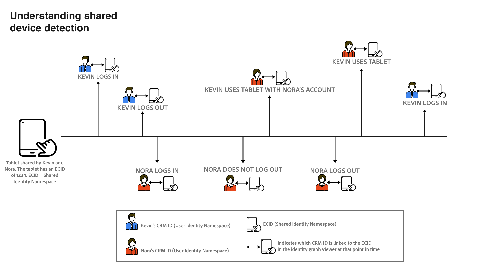

# 공유 장치 탐지 개요(베타)

>[!IMPORTANT]
>
>다음 [!DNL Shared Device Detection] 기능은 베타에 있습니다. 해당 기능과 설명서는 변경될 수 있습니다.

Adobe Experience Platform [!DNL Identity Service] 은 장치 및 시스템 전반에서 ID를 브리징하여 고객 및 고객의 행동을 더 잘 파악할 수 있도록 지원하고 효과적이고 개인화된 디지털 경험을 실시간으로 제공할 수 있도록 합니다.

[!DNL Shared Device] 는 두 개 이상의 개인이 사용하는 장치를 나타냅니다. 공유 장치의 예로는 태블릿, 라이브러리 컴퓨터 및 키오스크가 있습니다. 사용 [!DNL Shared Device Detection] 이와 같이, 동일한 장치의 서로 다른 사용자가 하나의 ID로 병합되는 것을 방지하여 보다 정확한 개인 표현을 할 수 있다.

사용 [!DNL Shared Device Detection] 다음을 수행할 수 있습니다.

* 동일한 장치의 다른 사용자에 대해 별도의 ID 그래프를 만듭니다.
* 동일한 장치를 사용하는 서로 다른 개인으로부터 데이터가 혼합되지 않도록 합니다.
* 고객에 대한 보다 정확하고 깨끗한 뷰를 생성합니다.

>[!TIP]
>
>에 대한 구성 [!DNL Shared Device Detection] 에서 그래프를 생성한 후에는 설정을 더 이상 수정할 수 없으므로 데이터 집합에 대한 프로필 을 활성화하기 전에 완료해야 합니다 [!DNL Identity Service].

## 시작하기 [!DNL Shared Device Detection]

작업 [!DNL Shared Device Detection] 는 관련된 다양한 플랫폼 서비스를 이해해야 합니다. 시작하기 전에 [!DNL Shared Device Detection]다음 서비스에 대한 설명서를 검토하십시오.

* [[!DNL Identity Service]](../home.md): 여러 장치와 시스템에서 ID를 브리징하여 개별 고객과 고객의 행동을 더 잘 파악할 수 있습니다.
   * [ID 그래프 뷰어](./identity-graph-viewer.md): ID 그래프 뷰어를 시각화하고 상호 작용하여 고객 ID가 어떻게 서로 결합되는지, 그리고 어떤 방식으로 결합되는지 더 잘 이해할 수 있습니다.
   * [ID 네임스페이스](../namespaces.md): 정규화된 ID의 구성 요소 및 ID 네임스페이스를 통해 ID의 컨텍스트와 유형을 구별하는 방법을 참조하십시오.

## [!DNL Shared Device Detection] 이해 

를 사용할 때는 다음 용어를 이해하는 것이 중요합니다
[!DNL Shared Device Detection]. 이해하는 데 필요한 용어 목록은 아래 표를 참조하십시오 [!DNL Shared Device Detection].

### 용어

| 용어 | 정의 |
| --- | --- |
| 공유 장치 | 공유 장치는 둘 이상의 개인이 사용하는 모든 장치입니다. 공유 장치의 예로는 태블릿, 라이브러리 컴퓨터 및 키오스크가 있습니다. |
| [!DNL Shared Device Detection] | [!DNL Shared Device Detection] 는 동일한 장치의 다른 사용자의 데이터를 서로 분리할 수 있도록 하는 구성 설정을 나타냅니다. |
| 공유 ID 네임스페이스 | 공유 ID 네임스페이스는 여러 사용자가 사용할 수 있는 장치를 나타냅니다. 공유 ID 네임스페이스는 일반적으로 ECID이지만 다른 장치 ID로 설정할 수 있습니다. |
| 사용자 ID 네임스페이스 | 사용자 ID 네임스페이스는 공유 장치의 인증된(로그인된) 사용자를 나타냅니다. |
| 마지막으로 인증된 사용자 | 마지막으로 인증된 사용자는 장치가 여러 계정에 의해 로그온되어 있는 경우 장치에 마지막으로 로그인한 사용자를 나타냅니다. |

{style=&quot;table-layout:auto&quot;}

[!DNL Shared Device Detection] 두 네임스페이스를 설정하여 작동합니다. a **공유 ID 네임스페이스** 그리고 **사용자 ID 네임스페이스**.

* 공유 ID 네임스페이스는 여러 사용자가 사용할 수 있는 장치를 나타냅니다. Adobe은 고객이 ECID를 공유 장치 식별자로 사용할 것을 권장합니다.
* 사용자 ID 네임스페이스는 사용자의 로그인 ID에 해당하는 ID 네임스페이스에 매핑되며 사용자의 CRM ID, 이메일 주소, 해시된 이메일 또는 전화 번호일 수 있습니다.

태블릿과 같은 공유 장치에는 단일 장치가 있습니다 **공유 ID 네임스페이스**. 반면, 공유 장치의 각 사용자는 자신이 지정되었습니다 **사용자 ID 네임스페이스** 각 로그인 ID에 해당합니다. 예를 들어, 케빈과 노라가 전자 상거래 사용을 위해 공유하는 태블릿은 자체 ECID가 있습니다 `1234`과 동시에 Kevin은 자신의 사용자 ID 네임스페이스와 `kevin@email.com` 계정 및 Nora에는 고유한 사용자 ID 네임스페이스가 이 네임스페이스에 매핑되어 있습니다 `nora@email.com` 계정이 필요합니다.

[!DNL Shared Device Detection] 는 공유 id 네임스페이스를 연결하여 동일한 장치의 여러 사용자 간을 구별할 수 있습니다(예: 마지막으로 인증된 사용자의 사용자 ID 네임스페이스(로그인 ID)가 포함된 ECID.

### ID 데이터를 ID 그래프로 보내는 방법

다음 예를 활용하여 방법을 이해할 수 있습니다. [!DNL Shared Device Detection] 작업:

>[!NOTE]
>
>이 다이어그램에서 공유 ID 네임스페이스는 ECID로 구성되고 사용자 ID 네임스페이스가 CRM ID로 구성됩니다.

* 케빈과 노라는 전자 상거래 웹사이트를 방문하기 위해 타블렛을 공유합니다. 그러나, 그들은 각각 온라인에서 탐색하고 쇼핑하기 위해 사용하는 그들 자신의 독자적인 계정을 가지고 있습니다.
   * 공유 장치로서 태블릿에는 태블릿의 웹 브라우저 쿠키 ID를 나타내는 해당 ECID가 있습니다.
* 케빈이 태블릿을 사용한다고 가정해 **로그인** 헤드폰을 찾기 위해 전자 상거래 계정으로, 이것은 케빈의 CRM ID(**사용자 ID 네임스페이스**) 이제 태블릿의 ECID( )에 연결됩니다&#x200B;**공유 ID 네임스페이스**). 태블릿의 브라우징 데이터는 이제 케빈의 아이디 그래프와 함께 통합된다.
   * 케빈이 **로그아웃** 노라는 테블릿과 **로그인** 자신의 계정으로 전환해 카메라를 구입한 다음 태블릿의 ECID에 연결된 CRM ID를 사용하면 됩니다. 따라서, 태블릿의 브라우징 데이터는 이제 노라의 아이디 그래프와 함께 통합된다.
   * 만약 노라 **로그아웃하지 않음** 케빈이 태블릿을 사용하지만 **로그인하지 않음**&#x200B;그리고 나서 태블릿의 브라우징 데이터는 여전히 Nora와 함께 통합되는데, 왜냐하면 그녀는 인증된 사용자로 남아있고 그녀의 CRM ID는 여전히 태블릿의 ECID에 연결되어 있기 때문이다.
   * 만약 노라 **로그아웃** 케빈이 태블릿을 사용하지만 **로그인하지 않음**&#x200B;그리고 태블릿의 브라우징 데이터는 여전히 노라의 아이디 그래프에 포함되어 있습니다 왜냐하면 **마지막으로 인증된 사용자**&#x200B;의 CRM ID는 태블릿의 ECID와 계속 연결됩니다.
   * 케빈이 **로그인** 다시 한 번, 이 태블릿의 CRM ID가 이제 마지막 인증된 사용자이고 태블릿의 검색 데이터가 이제 이 id 그래프와 통합되었으므로 이 ID가 태블릿의 ECID에 연결됩니다.

### 방법 [!DNL Profile Service] 프로필 조각 병합 [!DNL Shared Device Detection] 활성화됨

[!DNL Profile Service] 프로필 조각과 병합된 프로필을 확인합니다. 각 개별 고객 프로필은 병합되어 해당 고객의 단일 보기를 구성하는 여러 프로필 조각으로 구성됩니다. 예를 들어 고객이 여러 채널에서 브랜드와 상호 작용하는 경우 조직에는 여러 데이터 세트에 표시되는 해당 단일 고객과 관련된 여러 프로필 조각이 있습니다. 이러한 조각을 Platform에 수집하면 병합되어 해당 고객에 대한 단일 프로필을 만듭니다.

When [!DNL Shared Device Detection] 이 활성화되어 있고, [!DNL Profile] 경험 이벤트가 인증되었는지 또는 인증되지 않았는지 여부에 따라 프로필 조각의 기본 ID를 정의합니다

An **인증된 경험 이벤트** 는 장치에 로그인하는 동안 사용자가 완료한 작업입니다. 인증된 경험 이벤트의 경우 기본 ID는 **사용자 ID 네임스페이스** (로그인 ID). An **인증되지 않은 경험 이벤트** 는 장치에 로그인하지 않은 사용자가 완료한 작업입니다. 인증되지 않은 경험 이벤트의 경우 기본 ID는 **공유 ID 네임스페이스** (ECID).

자세한 내용은  [[!DNL Real-time Customer Profile] 개요](../../profile/home.md).

## 공유 장치 UI

플랫폼 UI에서 **[!UICONTROL ID]** 왼쪽 탐색에서 를 선택한 다음 **[!UICONTROL ID 설정]**.

다음 [!UICONTROL 공유 장치 설정] 데이터에 대한 공유 장치 설정을 구성할 수 있는 인터페이스를 제공하는 페이지가 나타납니다. 공유 장치 설정은 기본적으로 비활성화됩니다.

공유 장치 설정을 사용하면 동일한 장치의 다른 사용자의 데이터를 서로 분리할 수 있습니다. 이 구성 설정을 사용하면 동일한 장치의 사용자 ID가 함께 결합되지 않는 ID 그래프를 보다 정확하고 깨끗하게 표현할 수 있습니다.

선택 **[!UICONTROL 활성화]** 공유 장치 설정 수정을 시작하려면 다음을 수행하십시오.

다음 [!UICONTROL 공유 ID 네임스페이스] 및 [!UICONTROL 사용자 ID 네임스페이스] 구성 옵션이 표시되어 사용할 ID 네임스페이스를 수정할 수 있습니다.

[!UICONTROL 공유 ID 네임스페이스] 여러 다른 사용자가 사용하는 단일 장치를 나타냅니다. 이 네임스페이스는 항상 **[!UICONTROL ECID]** 모든 플랫폼 사용자가 **[!UICONTROL ECID]** 를 웹 브라우저 식별자로 사용하십시오.

다음 [!UICONTROL 사용자 ID 네임스페이스] 에서는 동일한 장치의 다른 사용자를 식별하고 데이터가 동일한 id 그래프에 결합되지 않도록 합니다.

을(를) 선택합니다 **[!UICONTROL 사용자 ID 네임스페이스]** 검색 창에서 id 네임스페이스를 입력하거나 드롭다운 메뉴에서 id 네임스페이스를 선택합니다.

>[!TIP]
>
>다음 [!UICONTROL 사용자 ID 네임스페이스] 최종 사용자의 로그인 ID에 해당하는 id 네임스페이스에 매핑해야 합니다. 옵션에는 고객 ID, 이메일 및 해시된 이메일이 있습니다.

을 구성했으면 [!UICONTROL 공유 장치 설정], 선택 **[!UICONTROL 저장]**.

선택 내용을 확인하라는 팝업 창이 나타납니다. 선택 **[!UICONTROL 예]** 구성 설정을 완료하려면

