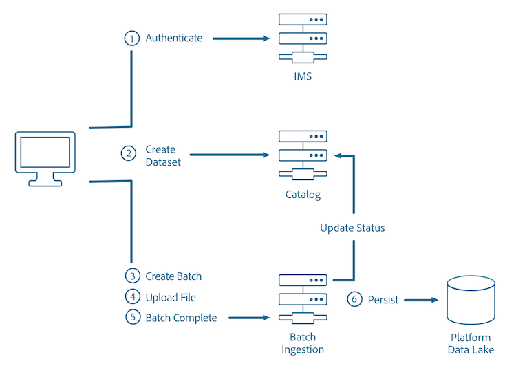

# 일괄 처리 수집 API 개요

Adobe Experience Platform 일괄 처리 수집 API 를 사용하면 데이터를 플랫폼에 일괄 처리 파일로 수집할 수 있습니다. 수집되는 데이터는 플랫 파일(예: Parquet 파일)의 프로필 데이터이거나 [!DNL Experience Data Model](XDM) 레지스트리의 알려진 스키마를 준수하는 데이터일 수 있습니다.

[일괄 처리 수집 API 참조](https://developer.adobe.com/experience-platform-apis/references/batch-ingestion/)에서 이러한 API 호출에 대한 추가 정보를 제공합니다.

다음 다이어그램은 일괄 처리 수집 프로세스를 간략하게 설명합니다.



## 시작하기

이 안내서에 사용된 API 끝점은 [일괄 처리 수집 API](https://developer.adobe.com/experience-platform-apis/references/batch-ingestion/)의 일부입니다. 계속하기 전에 [시작 안내서](getting-started.md)를 검토하여 관련 문서에 대한 링크, 이 문서의 샘플 API 호출 읽기 지침 및 Experience Platform API를 성공적으로 호출하는 데 필요한 필수 헤더에 대한 중요 정보를 확인하십시오.

### [!DNL Data Ingestion]개 필수 구성 요소

- 업로드할 데이터는 Parquet 또는 JSON 형식이어야 합니다.
- [[!DNL Catalog services]](../../catalog/home.md)에서 만들어진 데이터 세트입니다.
- Parquet 파일의 콘텐츠는 업로드할 데이터 세트 스키마의 하위 집합과 일치해야 합니다.
- 인증 후에는 고유한 액세스 토큰을 보유하십시오.

### 일괄 처리 수집 모범 사례

- 권장되는 배치 크기는 256MB에서 100GB 사이입니다.
- 각 배치에는 최대 1,500개의 파일이 포함되어야 합니다.

### 일괄 처리 수집 제한

일괄 데이터 수집에는 몇 가지 제한 사항이 있습니다.

- 배치당 최대 파일 수: 1500
- 최대 배치 크기: 100GB
- 행당 최대 속성 또는 필드 수: 10000
- 분당 데이터 레이크의 사용자당 최대 배치 수: 2000

>[!NOTE]
>
>512MB가 넘는 파일을 업로드하려면 파일을 더 작은 청크로 분할해야 합니다. 대용량 파일 업로드 지침은 이 문서의 [대용량 파일 업로드 섹션](#large-file-upload---create-file)에서 찾을 수 있습니다.

### 유형

데이터를 수집할 때 [!DNL Experience Data Model](XDM) 스키마가 작동하는 방식을 이해하는 것이 중요합니다. XDM 필드 유형이 다른 형식으로 매핑되는 방법에 대한 자세한 내용은 [스키마 레지스트리 개발자 안내서](../../xdm/api/getting-started.md)를 참조하십시오.

데이터 수집 시 약간의 유연성이 있습니다. 유형이 대상 스키마의 유형과 일치하지 않으면 데이터는 표현된 대상 유형으로 변환됩니다. 그렇지 않으면 `TypeCompatibilityException`(으)로 일괄 처리가 실패합니다.

예를 들어 JSON과 CSV에 `date` 또는 `date-time` 유형이 없습니다. 그 결과, 이러한 값은 [ISO 8601 형식의 문자열](https://www.iso.org/iso-8601-date-and-time-format.html)(&quot;2018-07-10T15:05:59.000-08:00&quot;) 또는 밀리초 형식의 Unix 시간(1531263959000)을 사용하여 표현되며 수집 시 대상 XDM 유형으로 변환됩니다.

아래 표는 데이터 수집 시 지원되는 전환을 보여 줍니다.

| 인바운드(행)와 대상(열) | 문자열 | 바이트 | 짧음 | 정수 | Long | 더블 | 날짜 | 날짜-시간 | 오브젝트 | 맵 |
|:---:|:---:|:---:|:---:|:---:|:---:|:---:|:---:|:---:|:---:|:---:|
| 문자열 | X | X | X | X | X | X | X | X |   |   |
| 바이트 | X | X | X | X | X | X |   |   |   |   |
| 짧음 | X | X | X | X | X | X |   |   |   |   |
| 정수 | X | X | X | X | X | X |   |   |   |   |
| Long | X | X | X | X | X | X | X | X |   |   |
| 더블 | X | X | X | X | X | X |   |   |   |   |
| 날짜 |   |   |   |   |   |   | X |   |   |   |
| 날짜-시간 |   |   |   |   |   |   |   | X |   |   |
| 오브젝트 |   |   |   |   |   |   |   |   | X | X |
| 맵 |   |   |   |   |   |   |   |   | X | X |

>[!NOTE]
>
>부울 및 배열은 다른 형식으로 변환할 수 없습니다.

## API 사용

[!DNL Data Ingestion] API를 사용하면 다음 세 가지 기본 단계를 통해 데이터를 [!DNL Experience Platform]에 배치(단일 단위로 수집할 하나 이상의 파일로 구성된 데이터 단위)로 수집할 수 있습니다.

1. 새 배치를 만듭니다.
2. 데이터의 XDM 스키마와 일치하는 지정된 데이터 세트에 파일을 업로드합니다.
3. 일괄 처리 종료를 알립니다.

## 일괄 처리 만들기

데이터를 데이터 세트에 추가하려면 먼저 일괄 처리에 연결해야 하며, 나중에 지정된 데이터 세트에 업로드됩니다.

```http
POST /batches
```

**요청**

```shell
curl -X POST "https://platform.adobe.io/data/foundation/import/batches" \
  -H "Content-Type: application/json" \
  -H "x-gw-ims-org-id: {ORG_ID}" \
  -H "x-sandbox-name: {SANDBOX_NAME}" \
  -H "Authorization: Bearer {ACCESS_TOKEN}" \
  -H "x-api-key: {API_KEY}"
  -d '{ 
          "datasetId": "{DATASET_ID}" 
      }'
```

| 속성 | 설명 |
| -------- | ----------- |
| `datasetId` | 파일을 업로드할 데이터 세트의 ID입니다. |

**응답**

```JSON
{
    "id": "{BATCH_ID}",
    "imsOrg": "{ORG_ID}",
    "updated": 0,
    "status": "loading",
    "created": 0,
    "relatedObjects": [
        {
            "type": "dataSet",
            "id": "{DATASET_ID}"
        }
    ],
    "version": "1.0.0",
    "tags": {},
    "createdUser": "{USER_ID}",
    "updatedUser": "{USER_ID}"
}
```

| 속성 | 설명 |
| -------- | ----------- |
| `id` | 방금 생성된(후속 요청에 사용된) 배치의 ID입니다. |
| `relatedObjects.id` | 파일을 업로드할 데이터 세트의 ID입니다. |

## 파일 업로드

업로드할 새 배치를 생성하면 파일을 특정 데이터 세트에 업로드할 수 있습니다.

Small File Upload API를 사용하여 파일을 업로드할 수 있습니다. 그러나 파일이 너무 크고 게이트웨이 제한이 초과된 경우(예: 확장 시간 초과, 본문 크기 요청 초과 및 기타 제한) 대용량 파일 업로드 API로 전환할 수 있습니다. 이 API는 파일을 청크 단위로 업로드하며, 큰 파일 업로드 완료 API 호출을 사용하여 데이터를 함께 결합합니다.

>[!NOTE]
>
>일괄 처리 수집을 사용하여 프로필 스토어에서 데이터를 증분적으로 업데이트할 수 있습니다. 자세한 내용은 [일괄 처리 수집 개발자 안내서](api-overview.md)의 [일괄 처리 업데이트](#patch-a-batch)에 대한 섹션을 참조하십시오.

>[!INFO]
>
>아래 예제에서는 [Apache Parquet](https://parquet.apache.org/docs/) 파일 형식을 사용합니다. JSON 파일 형식을 사용하는 예는 [일괄 처리 수집 개발자 안내서](api-overview.md)에서 확인할 수 있습니다.

### 작은 파일 업로드

일괄 처리가 생성되면 기존 데이터 세트에 데이터를 업로드할 수 있습니다.  업로드 중인 파일은 참조된 XDM 스키마와 일치해야 합니다.

```http
PUT /batches/{BATCH_ID}/datasets/{DATASET_ID}/files/{FILE_NAME}
```

| 속성 | 설명 |
| -------- | ----------- |
| `{BATCH_ID}` | 배치의 ID입니다. |
| `{DATASET_ID}` | 파일을 업로드할 데이터 세트의 ID입니다. |
| `{FILE_NAME}` | 데이터 세트에 표시되는 파일 이름입니다. |

**요청**

```SHELL
curl -X PUT "https://platform.adobe.io/data/foundation/import/batches/{BATCH_ID}/datasets/{DATASET_ID}/files/{FILE_NAME}.parquet" \
  -H "content-type: application/octet-stream" \
  -H "x-gw-ims-org-id: {ORG_ID}" \
  -H "x-sandbox-name: {SANDBOX_NAME}" \
  -H "Authorization: Bearer {ACCESS_TOKEN}" \
  -H "x-api-key: {API_KEY}" \
  --data-binary "@{FILE_PATH_AND_NAME}.parquet"
```

| 속성 | 설명 |
| -------- | ----------- |
| `{FILE_PATH_AND_NAME}` | 데이터 집합에 업로드할 파일의 경로 및 파일 이름입니다. |

**응답**

```JSON
#Status 200 OK, with empty response body
```

### 대용량 파일 업로드 - 파일 만들기

큰 파일을 업로드하려면 파일을 더 작은 청크로 분할하여 한 번에 하나씩 업로드해야 합니다.

```http
POST /batches/{BATCH_ID}/datasets/{DATASET_ID}/files/{FILE_NAME}?action=initialize
```

| 속성 | 설명 |
| -------- | ----------- |
| `{BATCH_ID}` | 배치의 ID입니다. |
| `{DATASET_ID}` | 파일을 수집하는 데이터 세트의 ID입니다. |
| `{FILE_NAME}` | 데이터 세트에 표시되는 파일 이름입니다. |

**요청**

```SHELL
curl -X POST "https://platform.adobe.io/data/foundation/import/batches/{BATCH_ID}/datasets/{DATASET_ID}/files/part1=a/part2=b/{FILE_NAME}.parquet?action=initialize" \
  -H "x-gw-ims-org-id: {ORG_ID}" \
  -H "x-sandbox-name: {SANDBOX_NAME}" \
  -H "Authorization: Bearer {ACCESS_TOKEN}" \
  -H "x-api-key: {API_KEY}"
```

**응답**

```JSON
#Status 201 CREATED, with empty response body
```

### 대용량 파일 업로드 - 후속 부분 업로드

파일이 만들어지면 파일의 각 섹션에 대해 하나씩 반복된 PATCH 요청을 수행하여 모든 후속 청크를 업로드할 수 있습니다.

```http
PATCH /batches/{BATCH_ID}/datasets/{DATASET_ID}/files/{FILE_NAME}
```

| 속성 | 설명 |
| -------- | ----------- |
| `{BATCH_ID}` | 배치의 ID입니다. |
| `{DATASET_ID}` | 파일을 업로드할 데이터 세트의 ID입니다. |
| `{FILE_NAME}` | 데이터 세트에 표시되는 파일 이름입니다. |

**요청**

```SHELL
curl -X PATCH "https://platform.adobe.io/data/foundation/import/batches/{BATCH_ID}/datasets/{DATASET_ID}/files/part1=a/part2=b/{FILE_NAME}.parquet" \
  -H "content-type: application/octet-stream" \
  -H "x-gw-ims-org-id: {ORG_ID}" \
  -H "x-sandbox-name: {SANDBOX_NAME}" \
  -H "Authorization: Bearer {ACCESS_TOKEN}" \
  -H "x-api-key: {API_KEY}" \
  -H "Content-Range: bytes {CONTENT_RANGE}" \
  --data-binary "@{FILE_PATH_AND_NAME}.parquet"
```

| 속성 | 설명 |
| -------- | ----------- |
| `{FILE_PATH_AND_NAME}` | 데이터 집합에 업로드할 파일의 경로 및 파일 이름입니다. |

**응답**

```JSON
#Status 200 OK, with empty response
```

## 신호 일괄 처리 완료

모든 파일이 배치에 업로드되면 배치를 완료하라는 신호를 보낼 수 있습니다. 이렇게 하면 완료된 파일에 대해 [!DNL Catalog] DataSetFile 항목이 생성되고 위에서 생성된 배치와 연결됩니다. 그런 다음 [!DNL Catalog] 배치가 성공으로 표시되어 사용 가능한 데이터를 수집하도록 다운스트림 흐름을 트리거합니다.

**요청**

```http
POST /batches/{BATCH_ID}?action=COMPLETE
```

| 속성 | 설명 |
| -------- | ----------- |
| `{BATCH_ID}` | 데이터 세트에 업로드할 배치의 ID입니다. |

```SHELL
curl -X POST "https://platform.adobe.io/data/foundation/import/batches/{BATCH_ID}?action=COMPLETE" \
-H "x-gw-ims-org-id: {ORG_ID}" \
-H "x-sandbox-name: {SANDBOX_NAME}" \
-H "Authorization: Bearer {ACCESS_TOKEN}" \
-H "x-api-key: {API_KEY}"
```

**응답**

```JSON
#Status 200 OK, with empty response
```

## 배치 상태 확인

파일이 배치에 업로드되기를 기다리는 동안 배치 상태를 확인하여 진행 상황을 확인할 수 있습니다.

**API 형식**

```http
GET /batch/{BATCH_ID}
```

| 속성 | 설명 |
| -------- | ----------- |
| `{BATCH_ID}` | 확인 중인 일괄 처리의 ID입니다. |

**요청**

```shell
curl GET "https://platform.adobe.io/data/foundation/catalog/batch/{BATCH_ID}" \
  -H "Authorization: Bearer {ACCESS_TOKEN}" \
  -H "x-gw-ims-org-id: {ORG_ID}" \
  -H "x-sandbox-name: {SANDBOX_NAME}" \
  -H "x-api-key: {API_KEY}"
```

**응답**

```JSON
{
    "{BATCH_ID}": {
        "imsOrg": "{ORG_ID}",
        "created": 1494349962314,
        "createdClient": "MCDPCatalogService",
        "createdUser": "{USER_ID}",
        "updatedUser": "{USER_ID}",
        "updated": 1494349963467,
        "externalId": "{EXTERNAL_ID}",
        "status": "success",
        "errors": [
            {
                "code": "err-1494349963436"
            }
        ],
        "version": "1.0.3",
        "availableDates": {
            "startDate": 1337,
            "endDate": 4000
        },
        "relatedObjects": [
            {
                "type": "batch",
                "id": "foo_batch"
            },
            {
                "type": "connection",
                "id": "foo_connection"
            },
            {
                "type": "connector",
                "id": "foo_connector"
            },
            {
                "type": "dataSet",
                "id": "foo_dataSet"
            },
            {
                "type": "dataSetView",
                "id": "foo_dataSetView"
            },
            {
                "type": "dataSetFile",
                "id": "foo_dataSetFile"
            },
            {
                "type": "expressionBlock",
                "id": "foo_expressionBlock"
            },
            {
                "type": "service",
                "id": "foo_service"
            },
            {
                "type": "serviceDefinition",
                "id": "foo_serviceDefinition"
            }
        ],
        "metrics": {
            "foo": 1337
        },
        "tags": {
            "foo_bar": [
                "stuff"
            ],
            "bar_foo": [
                "woo",
                "baz"
            ],
            "foo/bar/foo-bar": [
                "weehaw",
                "wee:haw"
            ]
        },
        "inputFormat": {
            "format": "parquet",
            "delimiter": ".",
            "quote": "`",
            "escape": "\\",
            "nullMarker": "",
            "header": "true",
            "charset": "UTF-8"
        }
    }
}
```

| 속성 | 설명 |
| -------- | ----------- |
| `{USER_ID}` | 배치를 만들거나 업데이트한 사용자의 ID입니다. |

`"status"` 필드는 요청된 배치의 현재 상태를 보여 줍니다. 배치는 다음 상태 중 하나를 가질 수 있습니다.

## 일괄 처리 수집 상태

| 상태 | 설명 |
| ------ | ----------- |
| 포기 | 예상 일정에 일괄 처리가 완료되지 않았습니다. |
| 중단됨 | 중단 작업이 지정된 일괄 처리에 대해 일괄 처리 수집 API를 통해 **명시적으로**&#x200B;을(를) 호출했습니다. 배치가 &quot;로드됨&quot; 상태가 되면 중단할 수 없습니다. |
| 활성 | 배치가 정상적으로 홍보되었으며 다운스트림 소비에 사용할 수 있습니다. 이 상태는 &quot;성공&quot;과 상호 교환하여 사용할 수 있습니다. |
| 삭제됨 | 배치에 대한 데이터가 완전히 제거되었습니다. |
| 실패 | 잘못된 구성 및/또는 잘못된 데이터로 인한 터미널 상태입니다. 실패한 일괄 처리에 대한 데이터가 **표시되지** 않습니다. 이 상태는 &quot;실패&quot;와 상호 교환하여 사용할 수 있습니다. |
| 비활성 | 배치가 정상적으로 홍보되었지만, 되돌리거나 만료되었습니다. 다운스트림 소비에 더 이상 배치를 사용할 수 없습니다. |
| 로드됨 | 배치 데이터가 완료되었으며 배치가 승격될 준비가 되었습니다. |
| 로드 중 | 이 배치에 대한 데이터를 업로드하고 있으며 현재 **승격할 준비가 되지 않았습니다**. |
| 재시도 | 이 배치에 대한 데이터를 처리 중입니다. 그러나 시스템 또는 일시적인 오류로 인해 일괄 처리가 실패했습니다. 그 결과 이 일괄 처리가 다시 시도되고 있습니다. |
| 스테이징됨 | 배치에 대한 프로모션 프로세스의 스테이징 단계가 완료되고 수집 작업이 실행되었습니다. |
| 스테이징 | 배치에 대한 데이터를 처리 중입니다. |
| 정지됨 | 배치에 대한 데이터가 처리 중입니다. 그러나 여러 번 다시 시도한 후 배치 상태 올리기가 중단되었습니다. |
