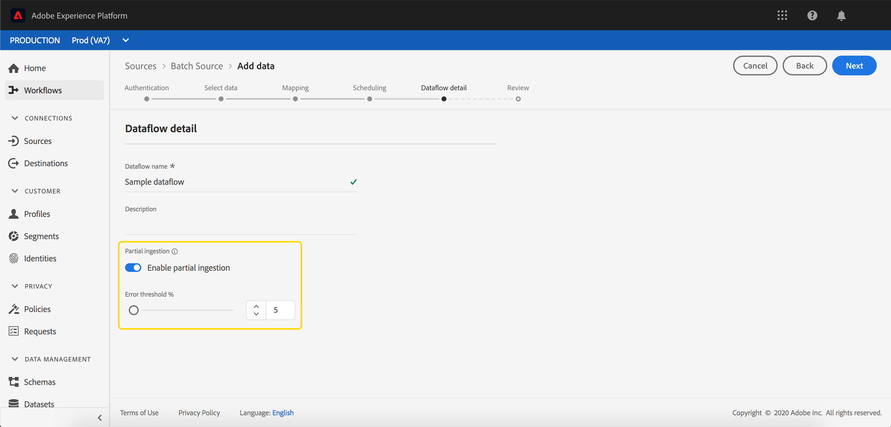

# 부분 일괄 처리 수집

부분 일괄 처리 수집은 특정 임계값까지 오류가 포함된 데이터를 수집하는 기능입니다. 이 기능을 사용하면 잘못된 데이터가 있는 이유와 함께, 모든 잘못된 데이터가 따로 일괄 처리되는 동안 모든 올바른 데이터를 Adobe Experience Platform에 성공적으로 수집할 수 있습니다.

이 문서에서는 부분 일괄 처리 수집 관리에 대한 자습서를 제공합니다.

## 시작하기

이 자습서에서는 부분 일괄 처리 수집과 관련된 다양한 Adobe Experience Platform 서비스에 대한 작업 지식이 필요합니다. 이 자습서를 시작하기 전에 다음 서비스에 대한 설명서를 검토하십시오.

- [일괄 처리 수집](./overview.md): 다음의 메소드 [!DNL Platform] csv 및 Parquet와 같은 데이터 파일에서 데이터를 수집하고 저장합니다.
- [[!DNL Experience Data Model (XDM)]](../../xdm/home.md): 표준화된 프레임워크 [!DNL Platform] 고객 경험 데이터를 구성합니다.

다음 섹션에서는 을 성공적으로 호출하기 위해 알아야 하는 추가 정보를 제공합니다 [!DNL Platform] API.

### 샘플 API 호출 읽기

이 안내서에서는 요청 형식을 지정하는 방법을 보여 주는 예제 API 호출을 제공합니다. 여기에는 경로, 필수 헤더 및 적절한 포맷의 요청 페이로드가 포함됩니다. API 응답에서 반환되는 샘플 JSON도 제공됩니다. 샘플 API 호출에 대한 설명서에 사용되는 규칙에 대한 자세한 내용은 의 섹션을 참조하십시오. [예제 API 호출을 읽는 방법](../../landing/troubleshooting.md#how-do-i-format-an-api-request) 다음에서 [!DNL Experience Platform] 문제 해결 가이드.

### 필수 헤더에 대한 값 수집

을 호출하기 위해 [!DNL Platform] API, 먼저 다음을 완료해야 합니다. [인증 자습서](https://www.adobe.com/go/platform-api-authentication-en). 인증 자습서를 완료하면 모든 항목에서 필요한 각 헤더에 대한 값이 제공됩니다 [!DNL Experience Platform] 아래와 같이 API 호출:

- 인증: 전달자 `{ACCESS_TOKEN}`
- x-api-key: `{API_KEY}`
- x-gw-ims-org-id: `{ORG_ID}`

의 모든 리소스 [!DNL Experience Platform] 특정 가상 샌드박스로 격리됩니다. 에 대한 모든 요청 [!DNL Platform] API에는 작업이 수행될 샌드박스의 이름을 지정하는 헤더가 필요합니다.

- x-sandbox-name: `{SANDBOX_NAME}`

>[!NOTE]
>
>의 샌드박스에 대한 자세한 내용 [!DNL Platform], 다음을 참조하십시오. [샌드박스 개요 설명서](../../sandboxes/home.md).

## API에서 부분 일괄 처리 수집에 대한 일괄 처리 활성화 {#enable-api}

>[!NOTE]
>
>이 섹션에서는 API를 사용하여 부분 일괄 처리 수집에 대한 일괄 처리를 활성화하는 방법에 대해 설명합니다. UI 사용에 대한 지침은 [ui에서 부분 일괄 처리 수집에 대한 일괄 처리 활성화](#enable-ui) 단계.

부분 수집이 활성화된 새 배치를 생성할 수 있습니다.

새 배치를 만들려면 [일괄 처리 수집 개발자 안내서](./api-overview.md). 다음 위치에 도달하면 **[!UICONTROL 일괄 처리 만들기]** 단계에서는 요청 본문에 다음 필드를 추가합니다.

```json
{
    "enableErrorDiagnostics": true,
    "partialIngestionPercent": 5
}
```

| 속성 | 설명 |
| -------- | ----------- |
| `enableErrorDiagnostics` | 을 허용하는 플래그 [!DNL Platform] 일괄 처리에 대한 자세한 오류 메시지를 생성합니다. |
| `partialIngestionPercent` | 전체 일괄 처리 전에 허용되는 오류의 백분율입니다. 따라서 이 예에서 최대 5%의 배치가 오류일 수 있지만 실패하게 됩니다. |


## UI에서 부분 일괄 처리 수집에 대한 일괄 처리 활성화 {#enable-ui}

>[!NOTE]
>
>이 섹션에서는 UI를 사용하여 부분 일괄 처리 수집에 대한 일괄 처리를 활성화하는 방법에 대해 설명합니다. API를 사용하여 부분 일괄 처리 수집에 대한 일괄 처리를 이미 활성화한 경우 다음 섹션으로 건너뛸 수 있습니다.

다음을 통해 부분 수집에 대한 일괄 처리를 활성화하려면 [!DNL Platform] UI에서는 소스 연결을 통해 새 배치를 만들거나 기존 데이터 세트에서 새 배치를 만들거나 &quot;[!UICONTROL CSV에서 XDM 플로우로 매핑]&quot;.

### 새 소스 연결 만들기 {#new-source}

새 소스 연결을 만들려면 [소스 개요](../../sources/home.md). 다음 위치에 도달하면 **[!UICONTROL 데이터 흐름 세부 정보]** 단계, 다음을 참고하십시오. **[!UICONTROL 부분 수집]** 및 **[!UICONTROL 오류 진단]** 필드.


다음 **[!UICONTROL 부분 수집]** 토글을 사용하면 부분 일괄 처리 수집의 사용을 활성화하거나 비활성화할 수 있습니다.

다음 **[!UICONTROL 오류 진단]** 토글 은 **[!UICONTROL 부분 수집]** 토글이 꺼집니다. 이 기능을 통해 다음과 같은 작업을 수행할 수 있습니다. [!DNL Platform] 수집된 배치에 대한 자세한 오류 메시지를 생성합니다. 다음과 같은 경우 **[!UICONTROL 부분 수집]** 토글이 켜지면 향상된 오류 진단이 자동으로 적용됩니다.



다음 **[!UICONTROL 오류 임계값]** 전체 일괄 처리가 실패하기 전에 허용되는 오류의 백분율을 설정할 수 있습니다. 기본적으로 이 값은 5%로 설정됩니다.

### 기존 데이터 세트 사용 {#existing-dataset}

기존 데이터 세트를 사용하려면 데이터 세트를 선택하여 시작합니다. 오른쪽의 사이드바는 데이터 세트에 대한 정보로 채워집니다.


다음 **[!UICONTROL 부분 수집]** 토글을 사용하면 부분 일괄 처리 수집의 사용을 활성화하거나 비활성화할 수 있습니다.

다음 **[!UICONTROL 오류 진단]** 토글 은 **[!UICONTROL 부분 수집]** 토글이 꺼집니다. 이 기능을 통해 다음과 같은 작업을 수행할 수 있습니다. [!DNL Platform] 수집된 배치에 대한 자세한 오류 메시지를 생성합니다. 다음과 같은 경우 **[!UICONTROL 부분 수집]** 토글이 켜지면 향상된 오류 진단이 자동으로 적용됩니다.


다음 **[!UICONTROL 오류 임계값]** 전체 일괄 처리가 실패하기 전에 허용되는 오류의 백분율을 설정할 수 있습니다. 기본적으로 이 값은 5%로 설정됩니다.

이제 를 사용하여 데이터를 업로드할 수 있습니다. **데이터 추가** 단추를 클릭하면 부분 수집을 사용하여 수집됩니다.

### 사용[!UICONTROL CSV를 XDM 스키마에 매핑]&quot; 흐름 {#map-flow}

을(를) 사용하려면[!UICONTROL CSV를 XDM 스키마에 매핑]&quot;흐름, 의 나열된 단계를 따릅니다. [CSV 파일 매핑 자습서](../tutorials/map-csv/overview.md). 다음 위치에 도달하면 **[!UICONTROL 데이터 추가]** 단계, 다음을 참고하십시오. **[!UICONTROL 부분 수집]** 및 **[!UICONTROL 오류 진단]** 필드.


다음 **[!UICONTROL 부분 수집]** 토글을 사용하면 부분 일괄 처리 수집의 사용을 활성화하거나 비활성화할 수 있습니다.

다음 **[!UICONTROL 오류 진단]** 토글 은 **[!UICONTROL 부분 수집]** 토글이 꺼집니다. 이 기능을 통해 다음과 같은 작업을 수행할 수 있습니다. [!DNL Platform] 수집된 배치에 대한 자세한 오류 메시지를 생성합니다. 다음과 같은 경우 **[!UICONTROL 부분 수집]** 토글이 켜지면 향상된 오류 진단이 자동으로 적용됩니다.


**[!UICONTROL 오류 임계값]** 전체 일괄 처리가 실패하기 전에 허용되는 오류의 백분율을 설정할 수 있습니다. 기본적으로 이 값은 5%로 설정됩니다.

## 다음 단계 {#next-steps}

이 튜토리얼에서는 부분 일괄 처리 수집을 활성화하기 위해 데이터 세트를 만들거나 수정하는 방법을 다룹니다. 일괄 처리에 대한 자세한 내용은 [일괄 처리 수집 개발자 안내서](./api-overview.md).

부분 수집 오류 모니터링에 대한 자세한 내용은 [일괄 처리 수집 오류 진단 안내서](../quality/error-diagnostics.md).
