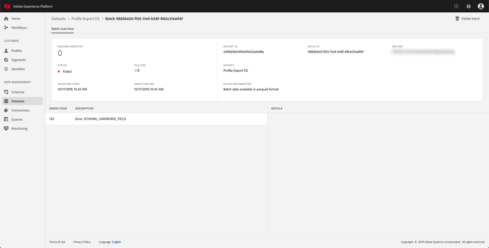

# 데이터 수집 모니터링

데이터 수집을 사용하면 데이터를 Adobe Experience Platform에 수집할 수 있습니다. 다양한 파일 유형(예: CSV)을 사용하여 데이터를 삽입할 수 있는 일괄 처리 수집이나 데이터를 수집할 수 있는 스트리밍 수집을 사용할 수 있습니다. [!DNL Platform] 실시간으로 스트리밍 엔드포인트 사용.

이 사용 안내서는 Adobe Experience Platform 사용자 인터페이스 내에서 데이터를 모니터링하는 방법에 대한 단계를 제공합니다. 이 안내서를 사용하려면 Adobe ID이 있어야 하며 Adobe Experience Platform에 액세스할 수 있어야 합니다.

## 스트리밍 통합 데이터 수집 모니터링 {#monitor-streaming-end-to-end-data-ingestion}

>[!CONTEXTUALHELP]
>id="platform_ingestion_streaming_ingestionrate"
>title="수집 속도"
>abstract="초당 정상적으로 처리된 이벤트 수입니다."
>text="Learn more in the documentation"
>additional-url="http://www.adobe.com/go/monitor-dataflows_kr" text="UI에서 소스의 데이터 흐름 모니터링"

>[!TIP]
>
>특정 날짜의 총 이벤트를 계산하려면 다음 식을 사용합니다. `total events / day = ingestion rate * 60 * 60 * 24`.

다음에서 [EXPERIENCE PLATFORM UI](https://platform.adobe.com), 선택 **[!UICONTROL 모니터링]** 왼쪽 탐색 메뉴에서 **[!UICONTROL 전체 스트리밍]**.

다음 **[!UICONTROL 전체 스트리밍]** 모니터링 페이지가 나타납니다. 이 작업 영역은에서 수신하는 스트리밍된 이벤트의 비율을 표시하는 그래프를 제공합니다 [!DNL Platform]에 의해 성공적으로 처리된 스트리밍된 이벤트의 비율을 표시하는 그래프 [[!DNL Real-Time Customer Profile]](../../profile/home.md): 수신 데이터의 세부 목록이 표시됩니다.

기본적으로 위쪽 그래프는 지난 7일 동안의 수집 비율을 보여 줍니다. 이 날짜 범위는 강조 표시된 버튼을 선택하여 다양한 기간을 표시하도록 조정할 수 있습니다.

아래 그래프는 성공적으로 처리된 스트리밍된 이벤트의 비율( )을 [!DNL Profile] 지난 7일 동안 이 날짜 범위는 강조 표시된 버튼을 선택하여 다양한 기간을 표시하도록 조정할 수 있습니다.

>[!NOTE]
>
>이 그래프에 데이터를 표시하려면 데이터가 다음과 같아야 합니다. **명백하게** 다음에 대해 활성화됨 [!DNL Profile]. 다음에 대한 스트리밍 데이터를 활성화하는 방법을 알아보려면 [!DNL Profile], 다음을 읽습니다 [데이터 세트 사용 안내서](../../catalog/datasets/user-guide.md#enable-a-dataset-for-real-time-customer-profile).

그래프 아래에는 위에 표시된 날짜 범위에 해당하는 모든 스트리밍 수집 레코드 목록이 있습니다. 나열된 각 배치에는 마지막으로 업데이트한 경우 해당 ID, 데이터 세트 이름, 배치의 레코드 수 및 오류 수(있는 경우)가 표시됩니다. 레코드에 대한 자세한 내용을 보려면 레코드를 선택할 수 있습니다.

### 스트리밍 레코드 보기

성공적으로 스트리밍된 레코드의 세부 정보를 볼 때 수집된 레코드 수, 파일 크기, 수집 시작 및 종료 시간 등의 정보가 표시됩니다.

실패한 스트리밍 레코드의 세부 사항에 성공한 레코드와 동일한 정보가 표시됩니다.

또한 실패한 레코드는 일괄 처리를 처리하는 동안 발생한 오류에 대한 세부 정보를 제공합니다. 아래 예에서는 데이터를 전환하거나 확인하는 도중 구문 분석 오류가 발생했습니다.

>[!NOTE]
>
>수집된 행에 오류가 있는 경우 이러한 행은 **아님** 결과 메시지로 인해 잘못된 XDM이 발생하지 않는 한 삭제합니다.

## 일괄 처리 전체 데이터 수집 모니터링

다음에서 [[!DNL Experience Platform UI]](https://platform.adobe.com), 선택 **[!UICONTROL 모니터링]** 왼쪽 탐색 메뉴에서 을 클릭합니다.

다음 **[!UICONTROL 엔드투엔드 일괄 처리]** 이전에 수집된 배치 목록이 표시된 모니터링 페이지가 나타납니다. 해당 레코드에 대한 자세한 내용을 보려면 배치를 선택할 수 있습니다.

### 배치 보기

성공적인 배치의 세부 정보를 볼 때 수집된 레코드 수, 파일 크기, 수집 시작 및 종료 시간 등의 정보가 표시됩니다.

실패한 배치의 상세내역은 실패한 배치 수와 동일한 정보를 표시하며 실패한 레코드 수를 추가합니다.

또한 실패한 배치는 배치를 처리하는 동안 발생한 오류에 대한 세부 정보를 제공합니다. 아래 예에는 개인의 최대 ID 수가 있으므로 수집된 배치에 오류가 있습니다.

>[!NOTE]
>
>수집된 행에 오류가 있는 경우 이러한 행은 **아님** 결과 메시지로 인해 잘못된 XDM이 발생하지 않는 한 삭제합니다.

