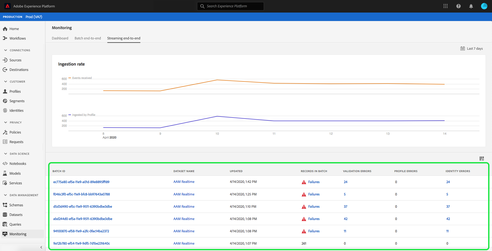
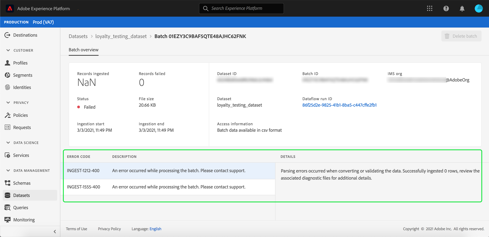

# 데이터 수집 모니터링

데이터 수집은 데이터를 Adobe Experience Platform에 인제스트할 수 있도록 해줍니다. 일괄 처리를 사용하여 다양한 파일 유형(예: CSV)을 사용하여 데이터를 삽입할 수 있도록 하거나 스트리밍 통합 기능을 사용하여 실시간으로 스트리밍 끝점을 사용하여 데이터를 [!DNL Platform]에 인제스트할 수 있습니다.

이 사용자 안내서에서는 Adobe Experience Platform 사용자 인터페이스 내에서 데이터를 모니터하는 방법에 대한 단계를 제공합니다. 이 가이드를 사용하려면 Adobe ID을 보유하고 Adobe Experience Platform에 액세스해야 합니다.

## 스트리밍 엔드 투 엔드 데이터 통합 모니터링

[Experience Platform UI](https://platform.adobe.com)의 왼쪽 탐색 메뉴에서 **[!UICONTROL Monitoring]**&#x200B;을 선택하고 **[!UICONTROL Streaming end-to-end]**&#x200B;을 선택합니다.

**[!UICONTROL Streaming end-to-end]** 모니터링 페이지가 나타납니다. 이 작업 공간은 [!DNL Platform]이(가) 수신한 스트리밍 이벤트 수, [[!DNL Real-time Customer Profile]](../../profile/home.md)에서 성공적으로 처리된 스트리밍 이벤트 수와 수신 데이터의 세부 목록을 표시하는 그래프 그래프를 제공합니다.

기본적으로 상위 그래프는 지난 7일 동안의 섭취 비율을 보여줍니다. 강조 표시된 단추를 선택하여 다양한 기간을 표시하도록 이 날짜 범위를 조정할 수 있습니다.

아래 그래프는 지난 7일 동안 [!DNL Profile]이(가) 성공적으로 스트리밍한 이벤트의 비율을 보여줍니다. 강조 표시된 단추를 선택하여 다양한 기간을 표시하도록 이 날짜 범위를 조정할 수 있습니다.

>[!NOTE]
>
>데이터가 이 그래프에 표시되려면 데이터가 [!DNL Profile]에 대해 **명시적으로**&#x200B;이(가) 활성화되어 있어야 합니다. [!DNL Profile]에 대한 스트리밍 데이터를 활성화하는 방법에 대해 알아보려면 [데이터 세트 사용자 안내서](../../catalog/datasets/user-guide.md#enable-a-dataset-for-real-time-customer-profile)를 읽어 보십시오.

그래프 아래에는 위에 표시된 날짜 범위와 일치하는 모든 스트리밍 통합 레코드 목록이 있습니다. 나열된 각 일괄 처리에는 해당 ID, 데이터 세트 이름, 마지막으로 업데이트된 시간, 일괄 처리에 있는 레코드 수 및 오류 수(있는 경우)가 표시됩니다. 해당 레코드에 대한 자세한 정보를 보려면 레코드를 선택할 수 있습니다.

### 스트리밍 레코드 보기

성공적으로 스트리밍된 레코드의 세부 정보를 볼 때 인제스트된 레코드 수, 파일 크기, 통합 시작 및 종료 시간 등의 정보가 표시됩니다.

실패한 스트리밍 레코드의 세부 정보는 성공한 레코드와 동일한 정보를 표시합니다.

또한 실패한 레코드는 배치를 처리하는 동안 발생한 오류에 대한 세부 정보를 제공합니다. 아래 예에서 데이터를 변환하거나 유효성을 검사하는 동안 구문 분석 오류가 발생했습니다.

## 일괄적으로 엔드 투 엔드 데이터 통합 모니터링

[[!DNL Experience Platform UI]](https://platform.adobe.com)의 왼쪽 탐색 메뉴에서 **[!UICONTROL Monitoring]**&#x200B;를 선택합니다.

이전에 인제스트한 일괄 처리 목록을 표시하는 **[!UICONTROL Batch end-to-end]** 모니터링 페이지가 나타납니다. 해당 레코드에 대한 자세한 정보를 위해 임의의 배치를 선택할 수 있습니다.

### 배치 보기

성공적인 일괄 처리에 대한 세부 사항을 볼 때 인제스트된 레코드 수, 파일 크기, 통합 시작 및 종료 시간 등의 정보가 표시됩니다.

실패한 배치의 세부 사항에는 실패한 레코드 수가 추가되는 것과 같이 성공적인 배치와 동일한 정보가 표시됩니다.

또한 실패한 배치에서는 배치를 처리하는 동안 발생한 오류에 대한 세부 정보를 제공합니다. 아래 예에서 인제스트된 일괄 처리에 오류가 발생했습니다. 인제스트한 사람의 최대 ID 수가 있습니다.

