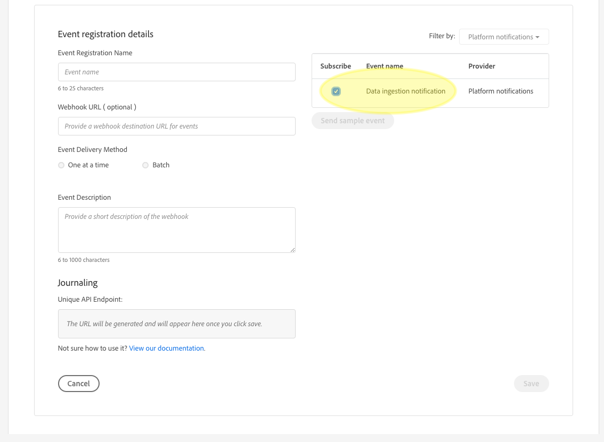

# 데이터 통합 알림

데이터를 Adobe Experience Platform으로 인제스트하는 프로세스는 여러 단계로 구성됩니다. 인제스트해야 하는 데이터 파일을 플랫폼에 식별하면 처리 프로세스가 시작되고 데이터가 성공적으로 인제스트되거나 실패할 때까지 각 단계가 연속적으로 수행됩니다. 통합 프로세스는 Adobe Experience Platform 데이터 통합 [API를](https://www.adobe.io/apis/experienceplatform/home/api-reference.html#!acpdr/swagger-specs/ingest-api.yaml) 사용하거나 Experience Platform 사용자 인터페이스를 사용하여 시작할 수 있습니다.

Data Lake 또는 실시간 고객 프로필 데이터 저장소에 도달하려면 플랫폼에 로드된 데이터가 여러 단계를 거쳐야 합니다. 각 단계에는 데이터를 처리하고 데이터를 확인한 다음 다음 다음 단계로 전달하기 전에 데이터를 저장하는 작업이 포함됩니다. 인제스트되는 데이터의 양에 따라 시간이 많이 소요될 수 있으며 유효성 검사, 의미론 또는 처리 오류로 인해 프로세스가 실패할 가능성이 있습니다. 오류가 발생하는 경우 데이터 문제를 해결해야 하며 수정된 데이터 파일을 사용하여 전체 통합 프로세스를 다시 시작해야 합니다.

통합 프로세스 모니터링을 지원하기 위해 Adobe Experience Platform을 사용하면 프로세스의 각 단계에서 게시되는 이벤트 세트에 가입할 수 있으므로 인제스트된 데이터의 상태 및 발생 가능성을 알려줍니다.

## 사용 가능한 상태 알림 이벤트

다음은 가입할 수 있는 데이터 통합 상태 알림의 목록입니다.

>[!NOTE] 모든 데이터 통합 알림에 대해 제공된 이벤트 토픽은 하나만 있습니다. 다른 상태를 구분하기 위해 이벤트 코드를 사용할 수 있습니다.

| 플랫폼 서비스 | 상태 | 이벤트 설명 | 이벤트 코드 |
| ---------------- | ------ | ----------------- | ---------- |
| 데이터 랜딩 | 성공 | 통합 - 일괄 처리 성공 | ing_load_success |
| 데이터 랜딩 | 실패 | 통합 - 일괄 처리 실패 | ing_load_failure |
| 실시간 고객 프로필 | 성공 | 프로필 서비스 - 데이터 로드 일괄 처리 성공 | ps_load_success |
| 실시간 고객 프로필 | 실패 | 프로필 서비스 - 데이터 로드 일괄 처리 실패 | ps_load_failure |
| Identity Graph | 성공 | ID 그래프 - 데이터 로드 일괄 처리 성공 | ig_load_success |
| Identity Graph | 실패 | ID 그래프 - 데이터 로드 일괄 처리 실패 | ig_load_failure |

## 알림 페이로드 스키마

데이터 통합 알림 이벤트 스키마는 인제스트되는 데이터의 상태와 관련된 세부 정보를 제공하는 필드 및 값을 포함하는 XDM(Experience Data Model) 스키마입니다. 최신 [알림 페이로드 스키마를](https://github.com/adobe/xdm/blob/master/schemas/common/notifications/ingestion.schema.json)보려면 공개 XDM GitHub 보고서를 방문하십시오.

## 데이터 통합 상태 알림 구독

Adobe [I/O Events를](https://www.adobe.io/apis/experienceplatform/events.html)통해 웹 후크를 사용하여 여러 알림 유형에 가입할 수 있습니다. 웹후크에 대한 자세한 내용과 웹후크를 사용하여 Adobe I/O 이벤트를 구독하는 방법에 대한 자세한 내용은 Adobe I/O 이벤트 웹후크 [소개 안내서를 참조하십시오](https://www.adobe.io/apis/experienceplatform/events/docs.html#!adobedocs/adobeio-events/master/intro/webhook_docs_intro.md) .

### Adobe I/O 콘솔을 사용하여 새로운 통합 만들기

Adobe I/ [O 콘솔에](https://console.adobe.io/home) 로그인하고 통합 *탭을* 클릭하거나 빠른 **시작** 아래에서 통합만들기를클릭합니다. 통합 *화면이* 나타나면 새 통합을 **** 클릭하여 새 통합을 만듭니다.


새 *통합* 만들기 화면이 나타납니다. 거의 **실시간 이벤트**&#x200B;수신을 선택한 다음 계속을 **클릭합니다**.


다음 화면에서는 구독, 권한 및 권한에 따라 조직에서 사용할 수 있는 다양한 이벤트, 제품 및 서비스와의 통합을 만들 수 있는 옵션을 제공합니다. 이 통합의 경우 Experience Platform( **플랫폼** 알림)에서 Platform(플랫폼) 알림을 **선택한 다음 Continue(계속)를**&#x200B;클릭합니다.


통합 *세부 사항* 양식이 나타나므로 통합에 대한 이름 및 설명과 공개 키 인증서를 제공해야 합니다.

공용 인증서가 없는 경우 다음 명령을 사용하여 터미널에서 인증서를 생성할 수 있습니다.

```shell
openssl req -x509 -sha256 -nodes -days 365 -newkey rsa:2048 -keyout private.key -out certificate_pub
```

인증서를 생성한 후 파일을 공개 키 인증서 **상자로 드래그하여 놓거나 파일 선택을** 클릭하여 **** 파일 디렉토리를 찾아 인증서를 직접 선택합니다.

인증서를 추가하면 [이벤트 *등록* ] 옵션이 나타납니다. [이벤트 **등록 추가]를 클릭합니다**.


이벤트 *등록 세부 사항* 대화 상자가 확장되어 추가 컨트롤을 표시합니다. 여기에서 원하는 이벤트 유형을 선택하고 웹 후크를 등록할 수 있습니다. 이벤트 등록 이름, 웹 후크 URL(선택 사항) **&#x200B;및 간단한 설명을 입력합니다. 마지막으로 가입하려는 이벤트 유형(데이터 통합 알림)을 선택한 다음 저장을 **클릭합니다**.



## 다음 단계

I/O 통합을 만들었으면 해당 통합에 대해 수신된 알림을 볼 수 있습니다. 이벤트 추적 [방법에 대한 자세한 내용은 Adobe](https://www.adobe.io/apis/experienceplatform/events/docs.html#!adobedocs/adobeio-events/master/support/tracing.md) I/O 이벤트 추적 안내서를 참조하십시오.
