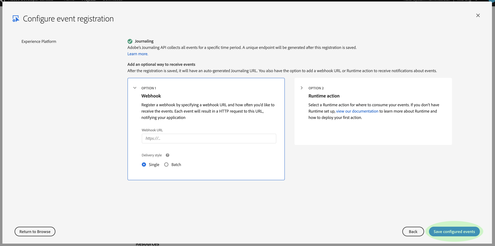

# 데이터 수집 알림

Adobe Experience Platform에 데이터를 수집하는 프로세스는 여러 단계로 구성됩니다. 인제스트해야 하는 데이터 파일을 플랫폼에 식별하면 수집 프로세스가 시작되고 데이터가 성공적으로 인제스트되거나 실패할 때까지 각 단계가 연속적으로 수행됩니다. 통합 프로세스는 [Adobe Experience Platform 데이터 통합 API를](https://www.adobe.io/apis/experienceplatform/home/api-reference.html#!acpdr/swagger-specs/ingest-api.yaml) 사용하거나 Experience Platform 사용자 인터페이스를 사용하여 시작할 수 있습니다.

Data Lake 또는 실시간 고객 프로필 데이터 저장소에 도달하려면 플랫폼에 로드된 데이터가 여러 단계를 거쳐야 합니다. 각 단계에는 데이터를 처리하고, 데이터의 유효성을 검사한 다음 다음 다음 단계로 전달하기 전에 데이터를 저장하는 작업이 포함됩니다. 수집되는 데이터의 양에 따라 시간이 많이 소요되기 때문에 유효성 검사, 의미 체계 또는 처리 오류로 인해 프로세스가 실패할 가능성이 항상 있습니다. 오류가 발생한 경우 데이터 문제를 해결해야 하며 수정된 데이터 파일을 사용하여 전체 처리 과정을 다시 시작해야 합니다.

통합 프로세스 모니터링을 지원하기 위해 Experience Platform을 사용하면 인제스트된 데이터의 상태 및 발생 가능한 실패를 통보하여 프로세스의 각 단계에 의해 게시된 이벤트 세트에 가입할 수 있습니다.

## 사용 가능한 상태 알림 이벤트

다음은 가입할 수 있는 데이터 수집 상태 알림 목록입니다.

>[!NOTE] 모든 데이터 수집 알림에 대해 제공된 이벤트 주제는 하나만 있습니다. 다른 상태를 구분하기 위해 이벤트 코드를 사용할 수 있습니다.

| 플랫폼 서비스 | 상태 | 이벤트 설명 | 이벤트 코드 |
| ---------------- | ------ | ----------------- | ---------- |
| 데이터 랜딩 | 성공 | 통합 - 일괄 처리 성공 | ing_load_success |
| 데이터 랜딩 | 실패 | 통합 - 일괄 처리 실패 | ing_load_failure |
| 실시간 고객 프로필 | 성공 | 프로필 서비스 - 데이터 로드 배치 성공 | ps_load_success |
| 실시간 고객 프로필 | 실패 | 프로필 서비스 - 데이터 로드 일괄 처리 실패 | ps_load_failure |
| ID 그래프 | 성공 | ID 그래프 - 데이터 로드 일괄 성공 | ig_load_success |
| ID 그래프 | 실패 | ID 그래프 - 데이터 로드 일괄 처리 실패 | ig_load_failure |

## 알림 페이로드 스키마

데이터 통합 알림 이벤트 스키마는 인제스트되는 데이터의 상태와 관련된 세부 사항을 제공하는 필드 및 값을 포함하는 XDM(Experience Data Model) 스키마입니다. 최신 [알림 페이로드 스키마를 보려면 공개 XDM GitHub 보고서를 방문하십시오](https://github.com/adobe/xdm/blob/master/schemas/common/notifications/ingestion.schema.json).

## 데이터 수집 상태 알림 구독

Adobe [I/O 이벤트를](https://www.adobe.io/apis/experienceplatform/events.html)통해 웹 후크를 사용하여 여러 알림 유형을 구독할 수 있습니다. 아래 섹션에서는 Adobe 개발자 콘솔을 사용하여 데이터 통합 이벤트에 대한 플랫폼 알림 가입 절차에 대해 간략하게 설명합니다.

### Adobe 개발자 콘솔에서 새 프로젝트 만들기

Adobe [Developer Console에서](https://www.adobe.com/go/devs_console_ui) Adobe ID로 로그인합니다. 그런 다음 Adobe 개발자 콘솔 문서에서 빈 프로젝트 [를 만드는 방법에 대한 자습서에 나와](https://www.adobe.io/apis/experienceplatform/console/docs.html#!AdobeDocs/adobeio-console/master/projects-empty.md) 있는 단계를 따릅니다.

### 프로젝트에 경험 플랫폼 이벤트 추가

새 프로젝트를 만들었으면 해당 프로젝트의 개요 화면으로 이동합니다. 여기에서 이벤트 **[!UICONTROL 추가를 클릭합니다]**.

이벤트 _[!UICONTROL 추가]_대화 상자가 나타납니다. 사용 가능한 옵션 목록을**[!UICONTROL &#x200B;필터링하려면 경험 플랫폼&#x200B;]**을 클릭한 다음**[!UICONTROL &#x200B;다음&#x200B;]**을 클릭하여**[!UICONTROL &#x200B;플랫폼 알림을&#x200B;]**클릭합니다.

다음 화면에는 가입할 이벤트 유형 목록이 표시됩니다. 데이터 **[!UICONTROL 통합 알림을]**&#x200B;선택한 다음 **[!UICONTROL 다음을 클릭합니다]**.

다음 화면에 JWT(JSON 웹 토큰)를 만들라는 메시지가 표시됩니다. 키 쌍을 자동으로 생성하거나 터미널에서 생성된 자신의 공개 키를 업로드할 수 있는 옵션이 제공됩니다.

이 튜토리얼의 목적을 위해 첫 번째 옵션이 따릅니다. 키 쌍 **[!UICONTROL 생성 옵션 상자]**&#x200B;를 클릭한 다음 오른쪽 아래 모서리에서 키 쌍 **[!UICONTROL 생성]** 버튼을 클릭합니다.

키 쌍이 생성되면 브라우저에 의해 자동으로 다운로드됩니다. 이 파일은 개발자 콘솔에서 지속되지 않으므로 직접 저장해야 합니다.

다음 화면에서는 새로 생성된 키 쌍의 세부 사항을 검토할 수 있습니다. 계속하려면 **[!UICONTROL 다음]**&#x200B;을 클릭하십시오.

다음 화면에서 이벤트 등록에 대한 이름과 설명을 입력합니다. 가장 좋은 방법은 이 이벤트 등록을 동일한 프로젝트의 다른 사용자와 구별할 수 있는 고유한 이름을 만드는 것입니다.

동일한 화면에서 추가로, 이벤트를 수신하는 방법을 선택적으로 구성할 수 있습니다. **[!UICONTROL Webhook]** 를 사용하면 이벤트를 수신할 사용자 정의 웹 후크 주소를 제공할 수 있지만, **[!UICONTROL 런타임 작업을]** 사용하면 [Adobe I/O 런타임](https://www.adobe.io/apis/experienceplatform/runtime/docs.html)을 사용하여 동일한 작업을 수행할 수 있습니다.

이 자습서는 이 선택적 구성 단계를 건너뜁니다. 완료되면 구성된 이벤트 **[!UICONTROL 저장을 클릭하여 이벤트]** 등록을 완료합니다.

새로 만든 이벤트 등록에 대한 세부 정보 페이지가 나타납니다. 여기에서 수신한 이벤트를 검토하고 디버그 추적을 수행하며 구성을 편집할 수 있습니다.

## 다음 단계

프로젝트에 플랫폼 알림을 등록하면 프로젝트 대시보드에서 수신된 이벤트를 볼 수 있습니다. 이벤트 추적 [에 대한 자세한 내용은 Adobe I/O 이벤트](https://www.adobe.io/apis/experienceplatform/events/docs.html#!adobedocs/adobeio-events/master/support/tracing.md) 추적 안내서를 참조하십시오.
