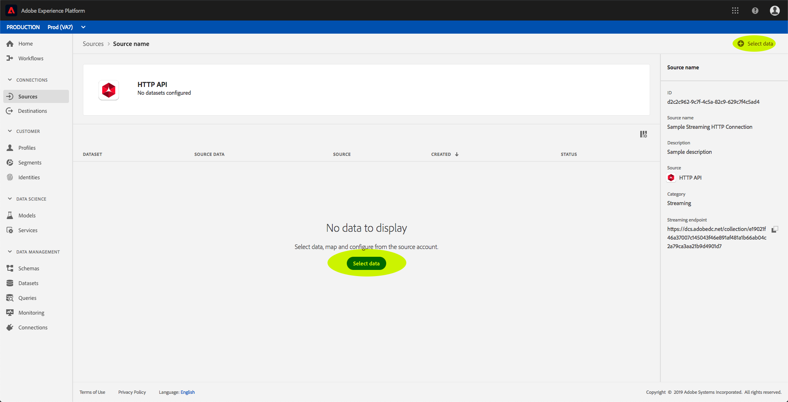
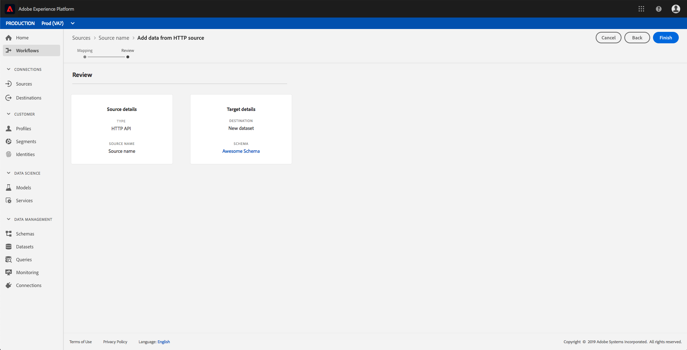

# UI를 사용하여 스트리밍 연결 만들기

이 UI 가이드는 Adobe Experience Platform을 사용하여 스트리밍 연결을 만드는 데 도움이 됩니다.

## 시작하기

스트리밍 데이터를 다음으로 시작하려면 먼저 스트리밍 HTTP 연결을 만들어야 [!DNL Experience Platform]합니다. 스트리밍 연결을 만들 때는 스트리밍 데이터의 소스, 신뢰할 수 있는(인증된) 소스 또는 신뢰할 수 없는(인증되지 않은) 소스에서 데이터를 전송할지 여부와 같은 주요 세부 정보를 제공해야 합니다.

스트리밍 연결을 등록하면 데이터를 스트리밍하는 데 사용할 수 있는 고유한 URL이 있게 됩니다 [!DNL Platform].

이 가이드를 완료하려면 Adobe Experience Platform에 액세스해야 합니다. 액세스할 수 없는 경우 [!DNL Platform]계속하기 전에 시스템 관리자에게 문의하십시오.

## 스트리밍 연결 만들기

UI에 로그인한 후 [!DNL Experience Platform] 소스 **[!UICONTROL 를 클릭하여]** 카탈로그 **[!UICONTROL 탭을 엽니다]** . 이 페이지에는 사용 가능한 소스 유형이 개별 카드로 표시됩니다. 이 카드에는 스트리밍 연결에서 데이터 세트로 생성된 데이터 흐름 수가 표시되는 버블이 들어 있습니다.

[ **[!UICONTROL 소스]** ] 페이지에서 **[!UICONTROL HTTP API]**&#x200B;를 클릭한 다음 **[!UICONTROL Connect 소스를 클릭합니다]**.

HTTP **[!UICONTROL 에 연결]** 화면이 나타납니다. 서비스 세부 **[!UICONTROL 정보에서]**&#x200B;새로운 스트리밍 연결에 대한 이름과 설명을 모두 입력합니다.

계정 **[!UICONTROL 인증]**&#x200B;아래에서 스트리밍 연결에 대해 다음 구성 속성을 선택합니다.

- **[!UICONTROL 인증]:** 스트리밍 연결에 인증이 필요한지 여부입니다. 인증은 신뢰할 수 있는 소스에서 데이터를 수집합니다. PII(개인 식별 정보)를 처리하는 경우 이 기능이 켜지는 것이 좋습니다.
- **[!UICONTROL XDM 스키마 호환성]:** 이 스트리밍 연결이 XDM 스키마와 호환되는 이벤트를 전송할지 여부. 기본적으로 이 속성은 **켜집니다**.

구성 속성 선택이 끝나면 **[!UICONTROL Connect를 클릭합니다]**. 이제 스트리밍 HTTP 연결이 만들어지고 이제 소스 작업 영역의 **[!UICONTROL 찾아보기]** 탭 아래에서 **[!UICONTROL 볼 수]** 있습니다.

[ **[!UICONTROL 찾아보기]** ] 탭에서 새로 만든 스트리밍 HTTP 연결을 클릭하고 해당 연결의 세부 사항을 볼 수 있습니다.

연결 이름의 하이퍼링크를 클릭하면 연결된 데이터 세트를 구성하여 표시할 데이터 **[!UICONTROL 를 선택할 수 있습니다]**.

새 데이터 세트 [를](#create-a-new-dataset) 만들거나 기존 데이터 세트를 [사용할 수 있습니다](#use-an-existing-dataset).

### 새 데이터 집합 만들기

새 데이터 세트를 만들려면 데이터 세트에 대한 대상 스키마와 이름, 설명을 입력합니다.

모든 세부 사항을 삽입하고 **[!UICONTROL 다음을]**&#x200B;클릭하면 **** , 마침을 클릭하기 전에 제공된 세부 사항을 검토하여 데이터 세트를 스트리밍 HTTP 연결에 연결할 수 있습니다.

### 기존 데이터 세트 사용

기존 데이터 세트를 사용하려면 **[!UICONTROL 출력 데이터 세트 이름을 선택합니다]**.

다음 **[!UICONTROL 을]**&#x200B;클릭한 후 마침을 **** 클릭하여 선택한 데이터 세트를 스트리밍 HTTP 연결에 연결할 수 있습니다.

## 다음 단계

이 튜토리얼을 따라 스트리밍 HTTP 연결을 만들어 스트리밍 끝점을 사용하여 다양한 [!DNL Data Ingestion] API에 액세스할 수 있습니다. API에서 스트리밍 연결을 만들기 위한 지침은 스트리밍 연결 [만들기 자습서를 참조하십시오](../tutorials/create-streaming-connection.md).
