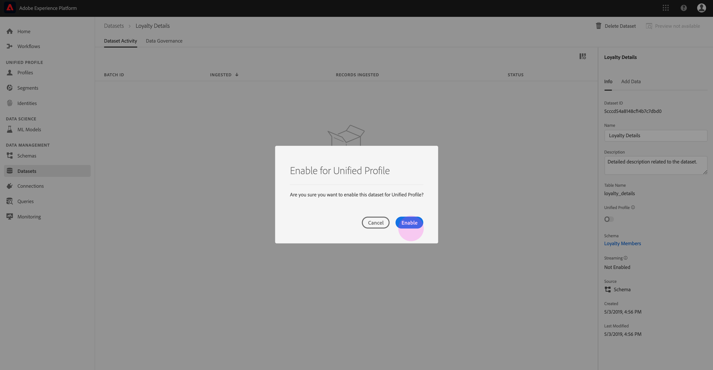

# Adobe Experience Platform으로 데이터 인제스트

Adobe Experience Platform을 사용하면 데이터를 Platform에 일괄 파일로 손쉽게 가져올 수 있습니다. 인제스트할 데이터의 예로는 CRM 시스템의 플랫 파일에서 프로파일 데이터(예: 쪽모이 세공 파일)나 스키마 레지스트리에서 알려진 XDM(Experience Data Model) 스키마를 따르는 데이터가 포함될 수 있습니다.

## 시작하기

이 튜토리얼을 완료하려면 Experience Platform에 액세스할 수 있어야 합니다. Experience Platform에서 IMS 조직에 액세스할 수 없는 경우 시스템 관리자에게 문의하십시오.

데이터 통합 API를 사용하여 데이터를 인제스트하려면 먼저 배치 인제스트 개발자 안내서를 [읽어 보십시오](../batch-ingestion/api-overview.md).

## 데이터 집합 작업 영역

경험 플랫폼 내의 데이터 집합 작업 영역을 사용하면 IMS 조직에서 만든 모든 데이터 집합을 보고 관리하고 새 데이터 집합을 만들 수 있습니다.

왼쪽 탐색에서 데이터 **세트를** 클릭하여 데이터 집합 작업 영역을 봅니다. 이름, _만들어진_&#x200B;날짜 및 시간, _만들어진_ 날짜 _,_&#x200B;데이터 세트, _소스_, 데이터 집합, ____&#x200B;스키마 및 데이터 집합 작업 공간, 마지막 일괄 처리 상태 등을 보여주는 열 목록과 데이터 집합이 마지막으로 업데이트되는 날짜 및 시간 등이 포함됩니다.

>[!NOTE] 검색 막대 옆에 있는 필터 아이콘을 클릭하여 필터링 기능을 사용하여 프로필에 대해 활성화된 데이터 집합만 표시합니다.

## 데이터 세트 만들기

데이터 세트를 만들려면 데이터 집합 **작업 영역의 오른쪽** 맨 위에 있는 데이터 집합 만들기를 클릭합니다.

데이터 **집합 만들기** 화면에서 &quot;스키마에서 데이터 집합 만들기&quot; 또는 &quot;CSV 파일에서 데이터 집합 만들기&quot;를 선택합니다.

이 자습서의 경우 스키마는 데이터 집합을 만드는 데 사용됩니다. 스키마에서 **데이터 집합** 만들기를 클릭하여 계속합니다.

## 데이터 집합 스키마 선택

스키마 **선택** 화면에서 사용할 스키마 옆의 라디오 단추를 클릭하여 스키마를 선택합니다. 이 자습서의 경우 데이터 세트는 충성도 멤버 스키마를 사용하여 만들어집니다. 검색 막대를 사용하여 스키마를 필터링하는 것은 원하는 정확한 스키마를 찾는 데 유용한 방법입니다.

사용하려는 스키마 옆에 있는 라디오 단추를 선택한 후 다음을 **클릭합니다**.

## 데이터 세트 구성

데이터 **세트 구성** 화면에서 데이터 세트에 이름을 지정해야 **하며** 데이터 세트에 대한 **설명도** 제공할 수 있습니다.

**데이터 집합 이름에 대한 참고 사항:**

- 데이터 세트 이름은 짧고 설명적이어야 나중에 라이브러리에서 데이터 세트를 쉽게 찾을 수 있습니다.
- 데이터 집합 이름은 고유해야 합니다. 즉, 나중에 다시 사용할 수 없도록 지정해야 합니다.
- 설명 필드를 사용하여 데이터 세트에 대한 추가 정보를 제공하는 것이 좋습니다. 다른 사용자가 차후에 데이터 세트를 구별할 수 있도록 도울 수 있습니다.

데이터 세트에 이름과 설명이 있으면 마침을 **클릭합니다**.

## 데이터 집합 활동

이제 빈 데이터 집합이 생성되었으며 데이터 집합 작업 **영역의 데이터** 집합 활동 탭으로 돌아갑니다. 작업 영역의 왼쪽 위 모서리에 &quot;추가된 배치가 없습니다.&quot;라는 알림과 함께 데이터 세트 이름이 표시됩니다. 이 데이터 세트에 아직 배치를 추가하지 않았으므로 이 작업이 필요합니다.

데이터 세트의 오른쪽에는 **데이터 세트 ID와 같은** 새 데이터 세트 ID _와_&#x200B;관련된 정보 _탭 정보가_&#x200B;표시됩니다. _데이터 세트 ID, 데이터 세트 이름_, 설명 _CNAME_, CNAME, CNAME, CNAME ______, Schema Streaming Streaming SourceHandSource가 들어 있습니다. 또한 정보 탭에는 데이터 세트를 만든 시기 _및_ 마지막 수정 _날짜에 대한 정보도 포함되어_ 있습니다.

또한 정보 탭에서는 _데이터_ 세트를 실시간 고객 프로필과 함께 사용할 수 있도록 설정하는 데 사용되는 프로필 토글입니다. 이 전환 및 실시간 고객 프로필의 사용에 대해서는 다음 섹션에서 자세히 설명합니다.

## 실시간 고객 프로파일에 대한 데이터 세트 활성화

데이터 세트는 데이터를 Experience Platform으로 인제스트하는 데 사용되며, 이러한 데이터는 궁극적으로 개인을 식별하고 여러 소스에서 생성된 정보를 연결하는 데 사용됩니다. 이러한 정보를 결합하는 것을 실시간 고객 프로필이라고 합니다. 플랫폼이 실시간 프로필에 포함해야 하는 정보를 알 수 있도록 데이터 세트를 프로필 전환을 사용하여 포함할 수 **있습니다** .

기본적으로 이 전환은 꺼져 있습니다. 프로필을 켜기로 선택하면 데이터 세트에 인제스트된 모든 데이터가 개별 데이터를 식별하고 해당 실시간 프로필을 연결하는 데 사용됩니다.

실시간 고객 프로필과 ID를 사용한 작업에 대한 자세한 내용은 ID 서비스 [설명서를](../../identity-service/home.md) 참조하십시오.

실시간 고객 프로필에 대한 데이터 세트를 활성화하려면 정보 **탭에서** 프로필 토글을 **클릭합니다** .

실시간 고객 프로필에 대한 데이터 세트를 활성화할지 여부를 확인하는 대화 상자가 나타납니다.

[ **활성화** ]를 클릭하면 토글이 파란색으로 바뀝니다.

## 데이터 세트에 데이터 추가

다양한 방법으로 데이터를 데이터 세트에 추가할 수 있습니다. 데이터 통합 API 또는 Unifi 또는 Informatica와 같은 ETL 파트너를 사용하도록 선택할 수 있습니다. 이 자습서의 경우 UI 내의 데이터 추가 **탭을 사용하여** 데이터가 데이터 세트에 추가됩니다.

데이터 세트에 데이터를 추가하려면 데이터 추가 **탭을 클릭합니다** . 이제 파일을 드래그 앤 드롭하거나 컴퓨터에서 추가할 파일을 검색할 수 있습니다.

>[!NOTE] 플랫폼은 데이터 수집, 쪽모이 세공, JSON을 위한 두 가지 파일 유형을 지원합니다. 한 번에 최대 5개의 파일을 추가할 수 있으며 각 파일의 최대 파일 크기는 10GB입니다.

## 파일 업로드

업로드하려는 쪽모이 세공 마루 또는 JSON 파일을 드래그 앤 드롭하거나 찾아보고 선택하면 플랫폼이 즉시 파일 처리를 시작합니다. **그러면** 파일 업로드 진행 상황을 보여주는 **데이터 추가** 탭에 업로드대화 상자가 나타납니다.

## 데이터 세트 지표

파일 업로드가 완료되면 데이터 집합 **활동** 탭에 더 이상 &quot;추가된 배치 없음&quot;이 표시되지 않습니다. 대신 이제 데이터 집합 활동 탭에 데이터 집합 지표가 표시됩니다. 배치가 아직 로드되지 않았으므로 모든 지표가 이 단계에서 &quot;0&quot;을 표시합니다.

탭 아래쪽에는 &quot;데이터 세트에 데이터 추가&quot; _프로세스를 통해_ 방금 인제스트된 데이터의 배치 ID가  표시된 목록이 있습니다. 인제스트된 날짜, 인제스트된 _레코드_ 수, 현재 _배치_&#x200B;상태 등 배치와 관련된 정보가 포함되어 _있습니다_.

## 배치 세부 사항

배치 ID _를_ 클릭하여 배치 개요를 **보고**&#x200B;배치와 관련된 추가 세부 사항을 표시합니다. 배치 로드가 완료되면, 배치에 대한 정보가 업데이트되어 인제스트된 레코드 수와 _파일_ 크기를 _표시합니다_. 상태는 _&quot;성공_ &quot; 또는 &quot;실패&quot;로 변경됩니다. 일괄 처리에 실패할 경우 오류 _코드_ 섹션에는 통합 중 오류에 대한 세부 사항이 포함됩니다.

일괄 처리에 대한 자세한 내용 및 FAQ는 일괄 처리 문제 [해결 안내서를](../batch-ingestion/troubleshooting.md)참조하십시오.

데이터 집합 활동 **화면으로 돌아가려면** 탐색 경로에서 데이터 집합 이름(_충성도 세부_&#x200B;사항)을 클릭합니다.

## 데이터 세트 미리 보기

데이터 세트가 준비되면 데이터 세트 **활동** 탭 상단에 데이터 세트 미리 보기 옵션이 **나타납니다** .

데이터 **집합** 미리 보기를 클릭하여 데이터 집합 내에서 샘플 데이터를 표시하는 대화 상자를 엽니다. 스키마를 사용하여 데이터 집합을 만든 경우 데이터 집합 스키마에 대한 세부 사항이 미리 보기의 왼쪽에 표시됩니다. 화살표를 사용하여 스키마를 확장하여 스키마 구조를 볼 수 있습니다. 미리 보기 데이터의 각 열 헤더는 데이터 세트에 있는 필드를 나타냅니다.

## 다음 단계

이제 데이터 세트를 만들고 데이터를 성공적으로 인제스트한 다음 이 단계를 반복하여 새 데이터 세트를 만들거나 기존 데이터 세트에 더 많은 데이터를 인제스트할 수 있습니다.

일괄 처리에 대한 자세한 내용은 일괄 처리 통합 [개요를](../batch-ingestion/overview.md)참조하십시오.
