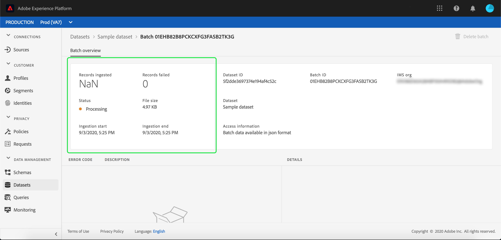

# Adobe Experience Platform에 데이터 수집

Adobe Experience Platform에서 데이터를 로 쉽게 가져올 수 있습니다. [!DNL Platform] 를 배치 파일로 추가할 수 있습니다. 수집할 데이터의 예로는 CRM 시스템의 플랫 파일에서 프로필 데이터(예: Parquet 파일)나 알려진 내용을 준수하는 데이터가 포함될 수 있습니다 [!DNL Experience Data Model] 스키마 레지스트리에서 (XDM) 스키마.

## 시작하기

이 자습서를 완료하려면 [!DNL Experience Platform]. 에서 IMS 조직에 액세스할 수 없는 경우 [!DNL Experience Platform]을(를) 계속하기 전에 시스템 관리자에게 문의하십시오.

데이터 수집 API를 사용하여 데이터를 수집하려면 [배치 수집 개발자 안내서](../batch-ingestion/api-overview.md).

## 데이터 세트 작업 공간

내의 데이터 세트 작업 공간 [!DNL Experience Platform] 에서는 IMS 조직이 수행한 모든 데이터 세트를 보고 관리할 수 있을 뿐만 아니라 새 데이터 세트를 만들 수 있습니다.

을 클릭하여 데이터 세트 작업 공간 보기 **[!UICONTROL 데이터 세트]** 을 클릭합니다. 데이터 세트 작업 공간에는 이름, 생성(날짜 및 시간), 소스, 스키마 및 마지막 배치 상태를 표시하는 열, 데이터 세트가 마지막으로 업데이트된 날짜 및 시간을 비롯한 데이터 세트 목록이 포함되어 있습니다.

>[!NOTE]
>
>검색 창 옆의 필터 아이콘을 클릭하면 필터링 기능이 사용하여에 활성화된 데이터 세트만 볼 수 있습니다 [!DNL Profile].

## 데이터 집합 만들기

데이터 세트를 만들려면 **[!UICONTROL 데이터 집합 만들기]** 데이터 세트 작업 공간의 오른쪽 상단 모서리에 있습니다.

설정 **[!UICONTROL 데이터 집합 만들기]** 화면에서 &quot;[!UICONTROL 스키마에서 데이터 집합 만들기]&quot; 또는 &quot;[!UICONTROL CSV 파일에서 데이터 세트 만들기]&quot;.

이 자습서의 경우 스키마가 데이터 세트를 만드는 데 사용됩니다. 클릭 **[!UICONTROL 스키마에서 데이터 집합 만들기]** 계속하십시오.

## 데이터 집합 스키마 선택

설정 **[!UICONTROL 스키마 선택]** 화면에서 사용할 스키마 옆에 있는 라디오 단추를 클릭하여 스키마를 선택합니다. 이 자습서의 경우 충성도 멤버 스키마를 사용하여 데이터 세트가 수행됩니다. 검색 창을 사용하여 스키마를 필터링하면 찾고 있는 정확한 스키마를 찾을 수 있는 유용한 방법입니다.

사용하려는 스키마 옆에 있는 라디오 단추를 선택한 후 **[!UICONTROL 다음]**.

## 데이터 세트 구성

설정 **[!UICONTROL 데이터 집합 구성]** 화면에서 데이터 세트에 이름을 지정해야 하고 데이터 세트에 대한 설명도 제공할 수 있습니다.

**데이터 집합 이름에 대한 참고:**

- 데이터 세트 이름은 나중에 라이브러리에서 데이터 세트를 쉽게 찾을 수 있도록 짧고 설명적이어야 합니다.
- 데이터 집합 이름은 고유해야 합니다. 즉, 나중에 다시 사용할 수 없도록 충분히 구체적이어야 합니다.
- 설명 필드를 사용하여 데이터 세트에 대한 추가 정보를 제공하는 것이 가장 좋습니다. 이렇게 하면 다른 사용자가 나중에 데이터 세트를 구분할 수 있기 때문입니다.

데이터 세트에 이름과 설명이 있으면 **[!UICONTROL 완료]**.

## 데이터 집합 활동

이제 빈 데이터 세트가 만들어졌고 이(가) **[!UICONTROL 데이터 집합 활동]** 탭 을 추가합니다. 작업 공간의 왼쪽 위 모서리에 &quot;일괄 처리가 추가되지 않음&quot;이라는 알림과 함께 데이터 세트 이름이 표시됩니다. 이 데이터 세트에 일괄 처리를 아직 추가하지 않았기 때문에 발생할 수 있습니다.

데이터 세트 작업 공간 오른쪽에는 **[!UICONTROL 정보]** 데이터 세트 ID, 이름, 설명, 테이블 이름, 스키마, 스트리밍 및 소스와 같은 새로운 데이터 세트에 대한 정보가 포함된 탭입니다. 정보 탭에는 데이터 세트를 만든 시기 및 마지막으로 수정한 날짜에 대한 정보도 포함되어 있습니다.

또한 정보 탭에는  **[!UICONTROL 프로필]** 에서 사용할 데이터 세트를 활성화하는 데 사용되는 전환 [!DNL Real-Time Customer Profile]. 이 토글 사용 및 [!DNL Real-Time Customer Profile]에서는 다음에 나오는 섹션에 더 자세히 설명되어 있습니다.

## 데이터 집합 활성화 [!DNL Real-Time Customer Profile]

데이터 세트는 데이터를에 수집하는 데 사용됩니다 [!DNL Experience Platform]그리고 이러한 데이터는 궁극적으로 개인을 식별하고 여러 소스에서 오는 정보를 함께 연결하는 데 사용됩니다. 이렇게 결합된 정보를 [!DNL Real-Time Customer Profile]. 대상 [!DNL Platform] 에 포함해야 하는 정보를 [!DNL Real-Time Profile], 데이터 세트는 을 사용하여 포함할 수 있도록 표시할 수 있습니다 **[!UICONTROL 프로필]** 토글.

기본적으로 이 토글은 꺼져 있습니다. 켜기로 선택한 경우 [!DNL Profile]를 지정하는 경우 데이터 집합에 수집된 모든 데이터는 개인을 식별하고 함께 결합하는 데 사용됩니다 [!DNL Real-Time Profile].

에 대해 자세히 알아보려면 [!DNL Real-Time Customer Profile] ID를 사용하여 작업하는 경우 [ID 서비스](../../identity-service/home.md) 설명서.

데이터 세트를 사용하려면 [!DNL Real-Time Customer Profile]를 클릭하고 **[!UICONTROL 프로필]** 에서 전환 **[!UICONTROL 정보]** 탭.

데이터 세트를 활성화할지 확인하는 대화 상자가 나타납니다 [!DNL Real-Time Customer Profile].

클릭 **[!UICONTROL 활성화]** 그러면 토글이 파란색으로 바뀝니다. 켜져 있음을 나타냅니다.

## 데이터 세트에 데이터 추가

데이터는 다양한 방법으로 데이터 세트에 추가할 수 있습니다. 사용할 수 있습니다 [!DNL Data Ingestion] API 또는 와 같은 ETL 파트너 [!DNL Unifi] 또는 [!DNL Informatica]. 이 자습서의 경우 데이터가 **[!UICONTROL 데이터 추가]** 탭 을 클릭하여 제품에서 사용할 수 있습니다.

데이터 집합에 데이터 추가를 시작하려면 **[!UICONTROL 데이터 추가]** 탭. 이제 파일을 끌어다 놓거나 컴퓨터에 추가할 파일을 찾을 수 있습니다.

>[!NOTE]
>
>플랫폼은 데이터 수집용, Parquet 또는 JSON 두 개의 파일 유형을 지원합니다. 한 번에 최대 5개의 파일을 추가할 수 있으며 각 파일의 최대 파일 크기는 1GB입니다.

## 파일 업로드

업로드하려는 Parquet 또는 JSON 파일을 끌어다 놓고(또는 탐색하여 선택) [!DNL Platform] 즉시 파일 및 **[!UICONTROL 업로드]** 대화 상자가 **[!UICONTROL 데이터 추가]** 파일 업로드의 진행 상황을 보여주는 탭입니다.

## 데이터 집합 지표

파일 업로드를 마치면 **[!UICONTROL 데이터 집합 활동]** 탭이 더 이상 &quot;일괄 처리가 추가되지 않았습니다&quot;를 표시하지 않습니다. 대신, **[!UICONTROL 데이터 집합 활동]** 이제 탭에 데이터 세트 지표가 표시됩니다. 일괄 처리가 아직 로드되지 않았으므로 모든 지표가 이 단계에서 &quot;0&quot;을 표시합니다.

탭 하단에 **[!UICONTROL 배치 ID]** 방금 수집된 데이터 [&quot;데이터 세트에 데이터 추가&quot;](#add-data-to-dataset) 프로세스. 또한 수집된 날짜, 수집된 레코드 수 및 현재 배치 상태를 포함하여 배치와 관련된 정보가 포함되어 있습니다.

## 배치 세부 정보

을(를) 클릭합니다. **[!UICONTROL 배치 ID]** 를 보려면 **[!UICONTROL 배치 개요]**, 배치에 대한 추가 세부 정보를 표시합니다. 배치 로드가 완료되면 배치에 대한 정보가 업데이트되어 수집된 레코드 수와 파일 크기를 표시합니다. 상태는 &quot;성공&quot; 또는 &quot;실패&quot;로도 변경됩니다. 배치에 실패하면 **[!UICONTROL 오류 코드]** 섹션에는 수집 중 발생한 오류에 대한 세부 정보가 포함됩니다.

일괄 처리에 대한 자세한 내용 및 FAQ는 [배치 수집 문제 해결 안내서](../batch-ingestion/troubleshooting.md).

로 돌아가려면 **[!UICONTROL 데이터 집합 활동]** 화면에서 데이터 세트 이름(**[!UICONTROL 충성도 세부 사항]**) 내의 아무 곳에나 삽입할 수 있습니다.

## 데이터 세트 미리 보기

데이터 세트가 준비되면 다음 옵션을 사용할 수 있습니다 **[!UICONTROL 데이터 집합 미리 보기]** 이 **[!UICONTROL 데이터 집합 활동]** 탭.

클릭 **[!UICONTROL 데이터 집합 미리 보기]** 데이터 세트 내에서 샘플 데이터를 보여주는 대화 상자를 엽니다. 스키마를 사용하여 데이터 세트를 만든 경우 데이터 세트 스키마에 대한 세부 정보가 미리 보기 왼쪽에 표시됩니다. 화살표를 사용하여 스키마를 확장하여 스키마 구조를 볼 수 있습니다. 미리 보기 데이터의 각 열 헤더는 데이터 세트의 필드를 나타냅니다.

## 다음 단계 및 추가 리소스

이제 데이터 세트를 만들고 데이터를 성공적으로 [!DNL Experience Platform]이러한 단계를 반복하여 새 데이터 세트를 만들거나 기존 데이터 세트에 더 많은 데이터를 수집할 수 있습니다.

일괄 처리에 대한 자세한 내용은 [배치 수집 개요](../batch-ingestion/overview.md) 그리고 아래 비디오를 보면서 여러분의 학습을 보완하세요.

>[!WARNING]
>
>다음 [!DNL Platform] 다음 비디오에 표시된 UI가 오래되었습니다. 최신 UI 스크린샷 및 기능은 위의 설명서를 참조하십시오.

>[!VIDEO](https://video.tv.adobe.com/v/27269?quality=12&learn=on)
