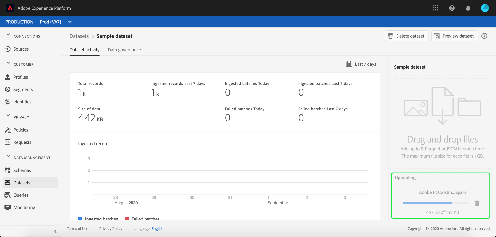

# 데이터를 Adobe Experience Platform으로 수집

Adobe Experience Platform을 사용하면 데이터를 로 쉽게 가져올 수 있습니다. [!DNL Platform] 배치 파일로. 수집될 데이터의 예들은 CRM 시스템 내의 플랫 파일(Parquet 파일 등)로부터의 프로필 데이터 또는 공지된 것에 부합하는 데이터를 포함할 수 있다 [!DNL Experience Data Model] 스키마 레지스트리의 (XDM) 스키마.

## 시작하기

이 자습서를 완료하려면 다음에 대한 액세스 권한이 있어야 합니다. [!DNL Experience Platform]. 에서 조직에 대한 액세스 권한이 없는 경우 [!DNL Experience Platform]을(를) 계속하려면 시스템 관리자에게 문의하십시오.

데이터 수집 API를 사용하여 데이터를 수집하려면 를 읽는 것부터 시작하십시오. [일괄 처리 수집 개발자 안내서](../batch-ingestion/api-overview.md).

## 데이터 세트 작업 공간

내의 데이터 세트 작업 영역 [!DNL Experience Platform] 를 사용하면 조직에서 만든 모든 데이터 세트를 보고 관리할 수 있을 뿐만 아니라 새 데이터 세트를 만들 수 있습니다.

다음을 클릭하여 데이터 세트 작업 영역 보기 **[!UICONTROL 데이터 세트]** 왼쪽 탐색에서. 데이터 세트 작업 공간에는 이름, 생성됨(날짜 및 시간), 소스, 스키마 및 마지막 배치 상태를 표시하는 열과 데이터 세트가 마지막으로 업데이트된 날짜 및 시간을 포함하는 데이터 세트 목록이 포함되어 있습니다.

>[!NOTE]
>
>필터링 기능을 사용하여 다음에 대해 활성화된 데이터 세트만 보려면 검색 창 옆에 있는 필터 아이콘을 클릭하십시오. [!DNL Profile].

## 데이터 세트 만들기

데이터 세트를 만들려면 다음을 클릭하십시오. **[!UICONTROL 데이터 세트 만들기]** 데이터 세트 작업 공간의 오른쪽 상단 모서리에서 을 참조하십시오.

다음에서 **[!UICONTROL 데이터 세트 만들기]** 화면에서 다음을 수행할지 선택합니다.[!UICONTROL 스키마에서 데이터 세트 만들기]&quot; 또는 &quot;[!UICONTROL CSV 파일에서 데이터 세트 만들기]&quot;.

이 자습서의 경우 데이터 세트를 만드는 데 스키마가 사용됩니다. 클릭 **[!UICONTROL 스키마에서 데이터 세트 만들기]** 계속합니다.

## 데이터 세트 스키마 선택

다음에서 **[!UICONTROL 스키마 선택]** 화면에서 사용하려는 스키마 옆의 라디오 단추를 클릭하여 스키마를 선택합니다. 이 자습서의 경우 충성도 멤버 스키마를 사용하여 데이터 세트를 만듭니다. 검색 창을 사용하여 스키마를 필터링하면 원하는 스키마를 정확하게 찾을 수 있습니다.

사용하려는 스키마 옆에 있는 라디오 단추를 선택한 후 **[!UICONTROL 다음]**.

## 데이터 세트 구성

다음에서 **[!UICONTROL 데이터 세트 구성]** 화면에서 데이터 세트의 이름을 지정해야 하며 데이터 세트에 대한 설명도 제공할 수 있습니다.

**데이터 세트 이름에 대한 참고 사항:**

- 데이터 세트 이름은 짧고 설명적이어야 나중에 라이브러리에서 데이터 세트를 쉽게 찾을 수 있습니다.
- 데이터 세트 이름은 고유해야 합니다. 즉, 향후 재사용되지 않을 만큼 구체적이어야 합니다.
- 향후 다른 사용자가 데이터 세트를 구분하는 데 도움이 될 수 있으므로 설명 필드를 사용하여 데이터 세트에 대한 추가 정보를 제공하는 것이 좋습니다.

데이터 세트에 이름과 설명이 있으면 **[!UICONTROL 완료]**.

## 데이터 세트 활동

이제 빈 데이터 세트가 만들어졌으며으로 돌아갔습니다. **[!UICONTROL 데이터 세트 활동]** 탭입니다. 작업 영역의 왼쪽 상단 모서리에 &quot;추가된 일괄 처리가 없습니다.&quot;라는 알림과 함께 데이터 세트 이름이 표시됩니다. 이 데이터 세트에 아직 배치를 추가하지 않았기 때문에 이는 예상되었습니다.

데이터 세트 작업 영역 오른쪽에는 **[!UICONTROL 정보]** 데이터 세트 ID, 이름, 설명, 테이블 이름, 스키마, 스트리밍 및 소스와 같은 새 데이터 세트와 관련된 정보가 들어 있는 탭입니다. 정보 탭에는 데이터 세트가 만들어진 시간과 마지막 수정 날짜에 대한 정보도 포함됩니다.

또한 정보 탭에는  **[!UICONTROL 프로필]** 에서 사용할 데이터 세트를 활성화하는 데 사용되는 전환 [!DNL Real-Time Customer Profile]. 이 토글 사용 및 [!DNL Real-Time Customer Profile]에 대해서는 다음 섹션에서 보다 자세히 설명합니다.

## 데이터 세트 활성화 [!DNL Real-Time Customer Profile]

데이터 세트는 로 데이터를 수집하는 데 사용됩니다. [!DNL Experience Platform], 그리고 이 데이터는 궁극적으로 개인을 식별하고 여러 소스에서 가져온 정보를 결합하는 데 사용됩니다. 결합된 정보를 라고 합니다. [!DNL Real-Time Customer Profile]. 주문 [!DNL Platform] 에 포함해야 하는 정보를 알기 위해 [!DNL Real-Time Profile], 데이터 세트를 다음을 사용하여 포함하도록 표시할 수 있습니다. **[!UICONTROL 프로필]** 토글.

기본적으로 이 토글은 꺼져 있습니다. 켜기/끄기를 선택하는 경우 [!DNL Profile], 데이터 세트에 수집된 모든 데이터는 개인을 식별하고 해당 개인을 결합하는 데 사용됩니다 [!DNL Real-Time Profile].

에 대해 자세히 알아보기 [!DNL Real-Time Customer Profile] id를 사용하여 작업하는 경우 다음을 검토하십시오. [ID 서비스](../../identity-service/home.md) 설명서를 참조하십시오.

다음에 대한 데이터 세트를 활성화하려면 [!DNL Real-Time Customer Profile]를 클릭하고 **[!UICONTROL 프로필]** 에서 전환 **[!UICONTROL 정보]** 탭.

다음에 대한 데이터 세트를 활성화할 것인지 확인하는 대화 상자가 나타납니다. [!DNL Real-Time Customer Profile].

클릭 **[!UICONTROL 사용]** 그리고 토글이 파란색으로 바뀌어 켜져 있음을 나타냅니다.

## 데이터 세트에 데이터 추가

데이터는 다양한 방법으로 데이터 세트에 추가할 수 있습니다. 다음을 사용하도록 선택할 수 있습니다. [!DNL Data Ingestion] API 또는 ETL 파트너 [!DNL Unifi] 또는 [!DNL Informatica]. 이 자습서의 경우, 데이터는 **[!UICONTROL 데이터 추가]** UI 내의 탭입니다.

데이터 세트에 데이터를 추가하려면 **[!UICONTROL 데이터 추가]** 탭. 이제 파일을 드래그 앤 드롭하거나 추가할 파일을 컴퓨터에서 검색할 수 있습니다.

>[!NOTE]
>
>Platform은 데이터 수집에 Parquet 또는 JSON의 두 가지 파일 유형을 지원합니다. 한 번에 최대 5개의 파일을 추가할 수 있으며, 각 파일의 최대 파일 크기는 1GB입니다.

## 파일 업로드

업로드하려는 Parquet 또는 JSON 파일을 드래그 앤 드롭(또는 검색 및 선택)하면 [!DNL Platform] 은(는) 즉시 파일 및 의 처리를 시작합니다. **[!UICONTROL 업로드 중]** 대화 상자가 나타납니다. **[!UICONTROL 데이터 추가]** 파일 업로드 진행 상황을 보여 주는 탭입니다.

## 데이터 세트 지표

파일 업로드가 완료되면 **[!UICONTROL 데이터 세트 활동]** 탭에 더 이상 &quot;추가된 일괄 처리가 없습니다.&quot;라는 메시지가 표시되지 않습니다. 대신, **[!UICONTROL 데이터 세트 활동]** 이제 탭에 데이터 세트 지표가 표시됩니다. 배치가 아직 로드되지 않았으므로 모든 지표는 이 단계에서 &quot;0&quot;을 표시합니다.

탭 하단에 목록이 표시됨 **[!UICONTROL 일괄 처리 ID]** 을 통해 방금 수집된 데이터 [&quot;데이터 세트에 데이터 추가&quot;](#add-data-to-dataset) 프로세스. 또한 수집된 날짜, 수집된 레코드 수 및 현재 배치 상태 등 배치와 관련된 정보도 포함됩니다.

## 일괄 처리 세부 정보

을(를) 클릭합니다 **[!UICONTROL 일괄 처리 ID]** 을(를) 보려면 **[!UICONTROL 일괄 처리 개요]**&#x200B;을 눌러 배치에 대한 추가 세부 정보를 표시합니다. 배치 로드가 완료되면 배치에 대한 정보가 업데이트되어 수집된 레코드 수와 파일 크기가 표시됩니다. 상태도 &quot;성공&quot; 또는 &quot;실패&quot;로 변경됩니다. 배치가 실패하면 **[!UICONTROL 오류 코드]** 섹션에는 수집 중 발생한 오류에 대한 세부 사항이 포함됩니다.

일괄 처리 수집에 대한 자세한 내용 및 FAQ는 [일괄 처리 수집 문제 해결 안내서](../batch-ingestion/troubleshooting.md).

로 돌아가려면 **[!UICONTROL 데이터 세트 활동]** 화면에서 데이터 세트 이름(**[!UICONTROL 고객 충성도 세부 정보]**)을 클릭하여 제품에서 사용할 수 있습니다.

## 데이터 세트 미리 보기

데이터 세트가 준비되면 다음을 위한 옵션 **[!UICONTROL 데이터 세트 미리 보기]** 의 맨 위에 나타납니다. **[!UICONTROL 데이터 세트 활동]** 탭.

클릭 **[!UICONTROL 데이터 세트 미리 보기]** 데이터 세트 내의 샘플 데이터를 표시하는 대화 상자를 엽니다. 스키마를 사용하여 데이터 세트를 만든 경우 데이터 세트 스키마에 대한 세부 사항이 미리보기의 왼쪽에 나타납니다. 화살표를 사용하여 스키마를 확장하면 스키마 구조를 볼 수 있습니다. 미리보기 데이터의 각 열 헤더는 데이터 세트의 필드를 나타냅니다.

## 다음 단계 및 추가 리소스

데이터 세트를 만들고 데이터를에 성공적으로 수집했으므로 [!DNL Experience Platform], 이 단계를 반복하여 새 데이터 세트를 만들거나 기존 데이터 세트에 더 많은 데이터를 수집할 수 있습니다.

일괄 처리에 대한 자세한 내용은 [일괄 처리 수집 개요](../batch-ingestion/overview.md) 그리고 아래 동영상을 보고 학습을 보충합니다.

>[!WARNING]
>
>다음 [!DNL Platform] 다음 비디오에 표시된 UI가 최신 상태가 아닙니다. 최신 UI 스크린샷 및 기능은 위의 설명서를 참조하십시오.

>[!VIDEO](https://video.tv.adobe.com/v/27269?quality=12&learn=on)
