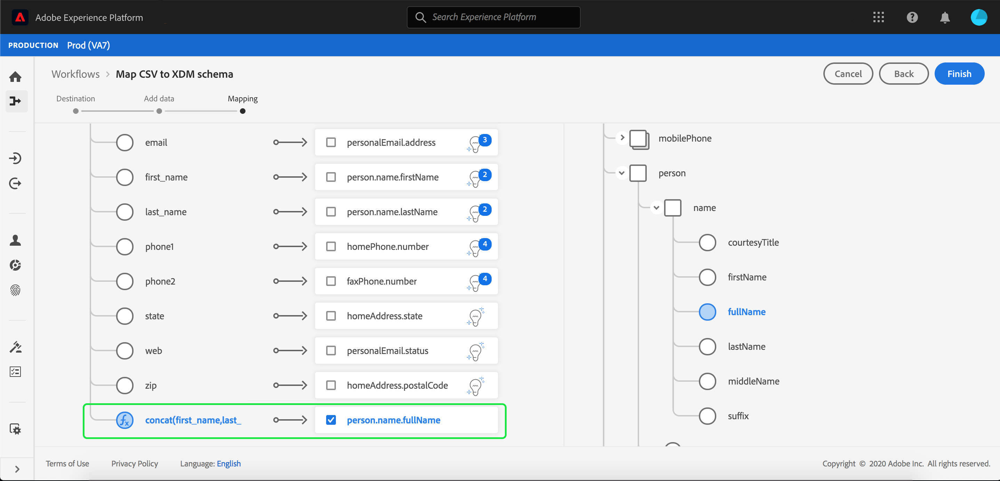

# 기존 XDM 스키마에 CSV 파일 매핑

>[!NOTE]
>
>이 문서에서는 CSV 파일을 기존 XDM 스키마에 매핑하는 방법을 다룹니다. AI가 생성한 스키마 추천 도구(현재 베타 버전)를 사용하는 방법에 대한 자세한 내용은 [머신 러닝 추천을 사용하여 CSV 파일 매핑](./recommendations.md)에 대한 문서를 참조하십시오.

CSV 데이터를 [!DNL Adobe Experience Platform]&#x200B;(으)로 수집하려면 데이터를 [!DNL Experience Data Model]&#x200B;(XDM) 스키마에 매핑해야 합니다. 이 자습서에서는 [!DNL Experience Platform] 사용자 인터페이스를 사용하여 CSV 파일을 XDM 스키마에 매핑하는 방법을 다룹니다.

## 시작하기

이 자습서에서는 [!DNL Experience Platform]의 다음 구성 요소를 이해하고 있어야 합니다.

- [[!DNL Experience Data Model (XDM System)]](../../../xdm/home.md): [!DNL Experience Platform]에서 고객 경험 데이터를 구성하는 표준화된 프레임워크입니다.
- [일괄 처리 수집](../../batch-ingestion/overview.md): [!DNL Experience Platform]이(가) 사용자 제공 데이터 파일에서 데이터를 수집하는 방법입니다.
- [Adobe Experience Platform 데이터 준비](../../batch-ingestion/overview.md): 수집된 데이터를 XDM 스키마에 맞게 매핑하고 변형할 수 있는 기능 모음입니다. [데이터 준비 기능](../../../data-prep/functions.md)에 대한 설명서는 스키마 매핑과 특히 관련이 있습니다.

또한 이 자습서에서는 CSV 데이터를으로 수집하기 위한 데이터 세트를 이미 만들었어야 합니다. UI에서 데이터 집합을 만드는 단계는 [데이터 수집 자습서](../ingest-batch-data.md)를 참조하십시오.

## 대상 선택

[[!DNL Adobe Experience Platform]](https://platform.adobe.com)에 로그인한 다음 왼쪽 탐색 막대에서 **[!UICONTROL 워크플로]**&#x200B;를 선택하여 **[!UICONTROL 워크플로]** 작업 영역에 액세스합니다.

**[!UICONTROL 워크플로]** 화면에서 **[!UICONTROL 데이터 수집]** 섹션 아래의 **[!UICONTROL XDM 스키마에 CSV 매핑]**&#x200B;을 선택한 다음 **[!UICONTROL 시작]**&#x200B;을 선택합니다.

**[!UICONTROL 대상]** 단계부터 **[!UICONTROL CSV를 XDM 스키마에 매핑]** 워크플로가 나타납니다. 수집할 인바운드 데이터에 대한 데이터 세트를 선택합니다. 기존 데이터 세트를 사용하거나 새 데이터 세트를 만들 수 있습니다.

**기존 데이터 세트 사용**

CSV 데이터를 기존 데이터 세트로 수집하려면 **[!UICONTROL 기존 데이터 세트 사용]**&#x200B;을 선택하십시오. 검색 기능을 사용하거나 패널에서 기존 데이터 세트 목록을 스크롤하여 기존 데이터 세트를 검색할 수 있습니다.

CSV 데이터를 새 데이터 세트로 수집하려면 **[!UICONTROL 새 데이터 세트 만들기]**&#x200B;를 선택하고 제공된 필드에 데이터 세트의 이름과 설명을 입력합니다. 검색 기능을 사용하거나 제공된 스키마 목록을 스크롤하여 스키마를 선택합니다. 계속하려면 **[!UICONTROL 다음]**&#x200B;을(를) 선택하십시오.

## 데이터 추가

**[!UICONTROL 데이터 추가]** 단계가 나타납니다. CSV 파일을 제공된 공간으로 드래그 앤 드롭하거나 **[!UICONTROL 파일 선택]**&#x200B;을 선택하여 CSV 파일을 수동으로 입력합니다.

파일이 업로드되면 **[!UICONTROL 샘플 데이터]** 섹션이 나타나고 처음 10개의 데이터 행이 표시됩니다. 데이터가 예상대로 업로드되었는지 확인한 후 **[!UICONTROL 다음]**&#x200B;을(를) 선택하십시오.

## CSV 필드를 XDM 스키마 필드에 매핑

**[!UICONTROL 매핑]** 단계가 나타납니다. CSV 파일의 열은 **[!UICONTROL Source 필드]** 아래에 나열되며 해당 XDM 스키마 필드는 **[!UICONTROL 대상 필드]** 아래에 나열됩니다.

[!DNL Experience Platform]은(는) 선택한 대상 스키마 또는 데이터 집합을 기반으로 자동 매핑된 필드에 대한 지능형 권장 사항을 자동으로 제공합니다. 사용 사례에 맞게 매핑 규칙을 수동으로 조정할 수 있습니다.

모든 자동 생성 매핑 값을 수락하려면 &quot;[!UICONTROL 모든 대상 필드 수락]&quot; 확인란을 선택하십시오.

소스 스키마에 대해 두 개 이상의 권장 사항을 사용할 수 있는 경우가 있습니다. 이런 경우 매핑 카드에 가장 눈에 띄는 권장 사항이 표시되며, 그 뒤에는 사용 가능한 추가 권장 사항 수가 포함된 파란색 원이 표시됩니다. 전구 아이콘을 선택하면 추가 권장 사항 목록이 표시됩니다. 대신 매핑할 권장 사항 옆에 있는 확인란을 선택하여 대체 권장 사항 중 하나를 선택할 수 있습니다.

또는 소스 스키마를 타겟 스키마에 수동으로 매핑하도록 선택할 수 있습니다. 매핑할 소스 스키마를 마우스로 가리킨 다음 더하기 아이콘을 선택합니다.

**[!UICONTROL 원본과 대상 필드 매핑]** 팝오버가 나타납니다. 매핑할 필드를 선택한 다음 **[!UICONTROL 저장]**&#x200B;을 선택하여 새 매핑을 추가할 수 있습니다.

매핑 중 하나를 제거하려면 해당 매핑 위로 마우스를 가져간 다음 빼기 아이콘을 선택합니다.

### 계산된 필드 추가 {#add-calculated-field}

계산된 필드를 사용하면 입력 스키마의 속성을 기반으로 값을 만들 수 있습니다. 그런 다음 대상 스키마의 속성에 이러한 값을 할당하고 더 쉽게 참조할 수 있도록 이름과 설명을 제공할 수 있습니다.

계속하려면 **[!UICONTROL 계산된 필드 추가]** 단추를 선택하십시오.

**[!UICONTROL 계산된 필드 만들기]** 패널이 나타납니다. 왼쪽 대화 상자에는 계산된 필드에서 지원되는 필드, 함수 및 연산자가 포함되어 있습니다. 탭 중 하나를 선택하여 표현식 편집기에 함수, 필드 또는 연산자를 추가합니다.

| 탭 | 설명 |
| --------- | ----------- |
| 필드 | 필드 탭에는 소스 스키마에서 사용할 수 있는 필드와 특성이 나열됩니다. |
| 함수 | 함수 탭에는 데이터를 변환하는 데 사용할 수 있는 함수가 나열되어 있습니다. 계산된 필드 내에서 사용할 수 있는 함수에 대한 자세한 내용은 [데이터 준비(매퍼) 함수 사용](../../../data-prep/functions.md)에 대한 안내서를 참조하십시오. |
| 연산자 | 연산자 탭에는 데이터를 변환하는 데 사용할 수 있는 연산자가 나열됩니다. |

중앙에 표현식 편집기를 사용하여 필드, 함수 및 연산자를 수동으로 추가할 수 있습니다. 편집기를 선택하여 표현식 만들기를 시작합니다.

계속하려면 **[!UICONTROL 저장]**&#x200B;을 선택하세요.

매핑 화면이 새로 생성된 소스 필드와 함께 다시 나타납니다. 적절한 대상 필드를 적용하고 **[!UICONTROL 완료]**&#x200B;를 선택하여 매핑을 완료합니다.

## 데이터 수집 모니터링

CSV 파일이 매핑되고 만들어지면 이 파일을 통해 수집되는 데이터를 모니터링할 수 있습니다. 데이터 수집 모니터링에 대한 자세한 내용은 [데이터 수집 모니터링](../../../ingestion/quality/monitor-data-ingestion.md)에 대한 자습서를 참조하십시오.

## 다음 단계

이 자습서에 따라 플랫 CSV 파일을 XDM 스키마에 매핑하고 [!DNL Experience Platform]에 수집했습니다. 이제 [!DNL Real-Time Customer Profile]과(와) 같은 다운스트림 [!DNL Experience Platform] 서비스에서 이 데이터를 사용할 수 있습니다. 자세한 내용은 [[!DNL Real-Time Customer Profile]](../../../profile/home.md)에 대한 개요를 참조하십시오.

>[!TIP]
>
>ML(기계 학습) 알고리즘을 사용하여 스키마 작업 영역의 **샘플 데이터에서 스키마를 생성**&#x200B;할 수도 있습니다. 이 워크플로우는 파일의 구조 및 콘텐츠를 기반으로 새 스키마를 자동으로 만들어 스키마가 데이터의 형식과 일치하도록 합니다. 이를 통해 복잡한 대규모 데이터 세트의 구조, 필드 및 데이터 유형을 정의할 때 시간을 절약하고 정확도를 높일 수 있습니다. 이 워크플로에 대한 자세한 내용은 [ML 지원 스키마 만들기 안내서](../../../xdm/ui/ml-assisted-schema-creation.md)를 참조하십시오.
