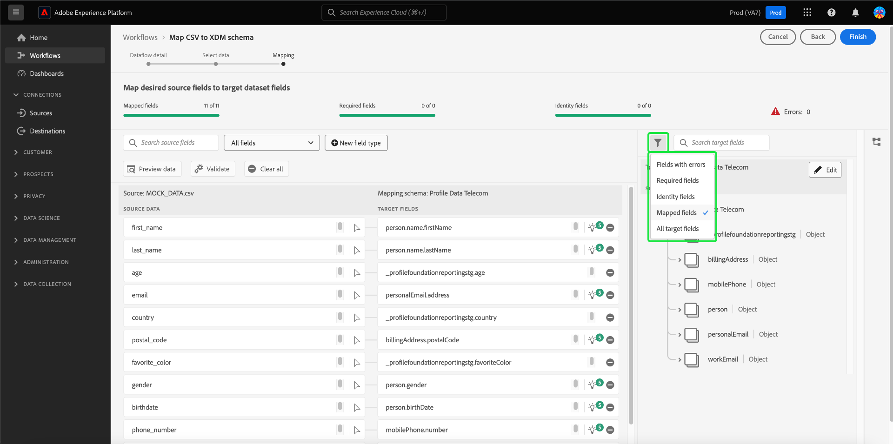

# AI가 생성한 권장 사항을 사용하여 XDM 스키마에 CSV 파일 매핑

>[!NOTE]
>
>Experience Platform에서 일반적으로 사용할 수 있는 CSV 매핑 기능에 대한 자세한 내용은 [기존 스키마에 CSV 파일 매핑](./existing-schema.md)에 대한 문서를 참조하십시오.

CSV 데이터를 [!DNL Adobe Experience Platform]&#x200B;(으)로 수집하려면 데이터를 [!DNL Experience Data Model]&#x200B;(XDM) 스키마에 매핑해야 합니다. [기존 스키마](./existing-schema.md)에 매핑하도록 선택할 수 있지만 사용할 스키마나 스키마 구성 방법을 정확히 모를 경우 대신 Experience Platform UI 내의 ML(기계 학습) 모델을 기반으로 한 동적 권장 사항을 사용할 수 있습니다.

## 시작하기

이 자습서에서는 [!DNL Experience Platform]의 다음 구성 요소를 이해하고 있어야 합니다.

* [[!DNL Experience Data Model (XDM System)]](../../../xdm/home.md): [!DNL Experience Platform]에서 고객 경험 데이터를 구성하는 표준화된 프레임워크입니다.
   * 최소한 XDM[&#128279;](../../../xdm/home.md#data-behaviors)의 동작 개념을 이해해야 하므로 데이터를 [!UICONTROL Profile] 클래스(레코드 동작)에 매핑할지 [!UICONTROL ExperienceEvent] 클래스(시계열 동작)에 매핑할지 여부를 결정할 수 있습니다.
* [일괄 처리 수집](../../batch-ingestion/overview.md): [!DNL Experience Platform]이(가) 사용자 제공 데이터 파일에서 데이터를 수집하는 방법입니다.
* [Adobe Experience Platform 데이터 준비](../../batch-ingestion/overview.md): 수집된 데이터를 XDM 스키마에 맞게 매핑하고 변형할 수 있는 기능 모음입니다. [데이터 준비 기능](../../../data-prep/functions.md)에 대한 설명서는 스키마 매핑과 관련이 있습니다.

## 데이터 흐름 세부 정보 제공

Experience Platform UI의 왼쪽 탐색에서 **[!UICONTROL 소스]**&#x200B;를 선택합니다. **[!UICONTROL 카탈로그]** 보기에서 **[!UICONTROL 로컬 시스템]** 범주로 이동합니다. **[!UICONTROL 로컬 파일 업로드]**&#x200B;에서 **[!UICONTROL 데이터 추가]**&#x200B;를 선택합니다.

![Experience Platform UI의 [!UICONTROL 소스] 카탈로그입니다. [!UICONTROL 로컬 파일 업로드] 아래에 [!UICONTROL 데이터 추가]가 선택되어 있습니다.](../../images/tutorials/map-csv-recommendations/local-file-upload.png)

**[!UICONTROL 데이터 흐름 세부 정보]** 단계에서 시작하여 **[!UICONTROL CSV XDM 스키마 매핑]** 워크플로가 나타납니다.

**[!UICONTROL ML 권장 사항을 사용하여 새 스키마 만들기]**&#x200B;를 선택하여 새 컨트롤을 표시합니다. 매핑할 CSV 데이터에 적절한 클래스를 선택하십시오([!UICONTROL Profile] 또는 [!UICONTROL ExperienceEvent]). 드롭다운 메뉴를 사용하여 비즈니스에 대한 관련 산업을 선택하거나 제공된 범주가 적용되지 않는 경우 비워 둘 수 있습니다(선택 사항). 조직이 [B2B(business-to-business)](../../../xdm/tutorials/relationship-b2b.md) 모델로 운영되는 경우 **[!UICONTROL B2B 데이터]** 확인란을 선택하십시오.

![ML 권장 사항 옵션을 선택한 상태에서 [!UICONTROL 데이터 흐름 세부 정보] 단계. 클래스에 대해 [!UICONTROL 프로필]이(가) 선택되었고 업계에 대해 [!UICONTROL 통신]이(가) 선택되었습니다](../../images/tutorials/map-csv-recommendations/select-class-and-industry.png)

여기에서 CSV 데이터에서 생성할 스키마의 이름과 해당 스키마에서 수집된 데이터를 포함할 출력 데이터 세트의 이름을 입력합니다.

계속하기 전에 데이터 흐름에 대해 다음 추가 기능을 선택적으로 구성할 수 있습니다.

| 입력 이름 | 설명 |
| --- | --- |
| [!UICONTROL 설명] | 데이터 흐름에 대한 설명입니다. |
| [!UICONTROL 오류 진단] | 활성화되면 새로 수집된 배치에 대한 오류 메시지가 생성되며, 이는 [API](../../batch-ingestion/api-overview.md)에서 해당 배치를 가져올 때 볼 수 있습니다. |
| [!UICONTROL 부분 수집] | 활성화되면 지정된 오류 임계값 내에서 새 일괄 처리 데이터에 대한 유효한 레코드가 수집됩니다. 이 임계값을 사용하여 전체 일괄 처리가 실패하기 전에 허용되는 오류의 백분율을 구성할 수 있습니다. |
| [!UICONTROL 데이터 흐름 세부 정보] | CSV 데이터를 Experience Platform으로 가져올 데이터 흐름의 이름과 선택적 설명을 입력합니다. 이 워크플로우를 시작하면 데이터 흐름에 기본 이름이 자동으로 할당됩니다. 이름 변경은 선택 사항입니다. |
| [!UICONTROL 경고] | 데이터 흐름이 시작된 후 데이터 흐름의 상태와 관련하여 수신할 [제품 내 경고](../../../observability/alerts/overview.md) 목록에서 선택하십시오. |

{style="table-layout:auto"}

데이터 흐름 구성을 마치면 **[!UICONTROL 다음]**&#x200B;을(를) 선택합니다.

![데이터 흐름 세부 정보] 섹션이 완료되었습니다.(../../images/tutorials/map-csv-recommendations/dataflow-detail-complete.png)

## 데이터 선택

**[!UICONTROL 데이터 선택]** 단계에서 왼쪽 열을 사용하여 CSV 파일을 업로드하십시오. **[!UICONTROL 파일 선택]**&#x200B;을 선택하여 파일을 선택할 수 있는 파일 탐색기 대화 상자를 열거나 파일을 열로 직접 끌어다 놓을 수 있습니다.

![파일 선택] 단추와 끌어서 놓기 영역이 [!UICONTROL 데이터 선택] 단계에서 강조 표시됩니다.(../../images/tutorials/map-csv-recommendations/upload-files.png)

파일을 업로드한 후 수신된 데이터가 올바르게 업로드되었는지 확인할 수 있도록 데이터의 처음 10개 행을 보여 주는 샘플 데이터 섹션이 나타납니다. 계속하려면 **[!UICONTROL 다음]**&#x200B;을 선택합니다.

## 스키마 매핑 구성

ML 모델이 실행되어 데이터 흐름 구성 및 업로드된 CSV 파일을 기반으로 새 스키마를 생성합니다. 프로세스가 완료되면 [!UICONTROL 매핑] 단계가 채워져 생성된 스키마 구조를 완전히 탐색할 수 있는 보기와 함께 각 개별 필드에 대한 매핑을 표시합니다.

![UI의 [!UICONTROL 매핑] 단계에서 매핑된 모든 CSV 필드와 결과 스키마 구조를 표시합니다.](../../images/tutorials/map-csv-recommendations/schema-generated.png)

>[!NOTE]
>
>소스-타겟 필드 매핑 워크플로우 동안 다양한 기준을 기반으로 스키마의 모든 필드를 필터링할 수 있습니다. 기본 동작은 매핑된 필드를 모두 표시하는 것입니다. 표시된 필드를 변경하려면 검색 입력 필드 옆에 있는 필터 아이콘을 선택하고 드롭다운 옵션에서 선택합니다.  {width="100" zoomable="yes"}

필요에 따라 여기에서 [필드 매핑을 편집](#edit-mappings)하거나 [연결된 필드 그룹을 변경](#edit-schema)할 수 있습니다. 만족하면 **[!UICONTROL 완료]**&#x200B;를 선택하여 매핑을 완료하고 이전에 구성한 데이터 흐름을 시작합니다. CSV 데이터는 시스템에 수집되고 다운스트림 Experience Platform 서비스에서 사용할 수 있도록 생성된 스키마 구조를 기반으로 데이터 세트를 채웁니다.

![[!UICONTROL 완료] 단추를 선택하여 CSV 매핑 프로세스를 완료합니다.](../../images/tutorials/map-csv-recommendations/finish-mapping.png)

### 필드 매핑 편집 {#edit-mappings}

필드 매핑 미리보기를 사용하여 기존 매핑을 편집하거나 완전히 제거합니다. UI에서 매핑 집합을 관리하는 방법에 대한 자세한 내용은 [데이터 준비 매핑에 대한 UI 안내서](../../../data-prep/ui/mapping.md#mapping-interface)를 참조하십시오.

### 필드 그룹 편집 {#edit-field-groups}

CSV 필드는 ML 모델을 사용하여 기존 XDM 필드 그룹에 자동으로 매핑됩니다. 특정 CSV 필드의 필드 그룹을 변경하려면 스키마 트리 옆에 있는 **[!UICONTROL 편집]**&#x200B;을 선택합니다.

![스키마 트리 옆에 있는 [!UICONTROL 편집] 단추가 선택되어 있습니다.](../../images/tutorials/map-csv-recommendations/edit-schema-structure.png)

매핑의 모든 필드에 대한 표시 이름, 데이터 유형 및 필드 그룹을 편집할 수 있는 대화 상자가 나타납니다. **[!UICONTROL 적용]**&#x200B;을 선택하기 전에 소스 필드 옆에 있는 편집 아이콘()을 선택하여 오른쪽 열에서 세부 정보를 편집합니다.

소스 필드에 대한 스키마 권장 사항을 모두 조정했으면 **[!UICONTROL 저장]**&#x200B;을 선택하여 변경 내용을 적용합니다.

## 다음 단계

이 안내서에서는 AI가 생성한 권장 사항을 사용하여 XDM 스키마에 CSV 파일을 매핑하여 일괄 수집을 통해 해당 데이터를 Experience Platform으로 가져오는 방법에 대해 설명합니다.

기존 스키마에 CSV 파일 매핑에 대한 단계는 [기존 스키마 매핑 워크플로](./existing-schema.md)를 참조하십시오. 미리 빌드된 소스 연결을 통해 실시간으로 Experience Platform으로 데이터를 스트리밍하는 방법에 대한 자세한 내용은 [소스 개요](../../../sources/home.md)를 참조하십시오.

ML(기계 학습) 알고리즘을 사용하여 **샘플 CSV 데이터에서 스키마를 생성**&#x200B;할 수도 있습니다. 이 워크플로우는 CSV 파일의 구조 및 콘텐츠를 기반으로 새 스키마를 자동으로 만듭니다. 새로 만든 이 스키마는 데이터의 형식과 일치하여 시간을 절약하고 복잡한 대규모 데이터 세트의 구조, 필드 및 데이터 유형을 정의할 때 정확도를 높입니다. 이 워크플로에 대한 자세한 내용은 [ML 지원 스키마 만들기 안내서](../../../xdm/ui/ml-assisted-schema-creation.md)를 참조하십시오.
