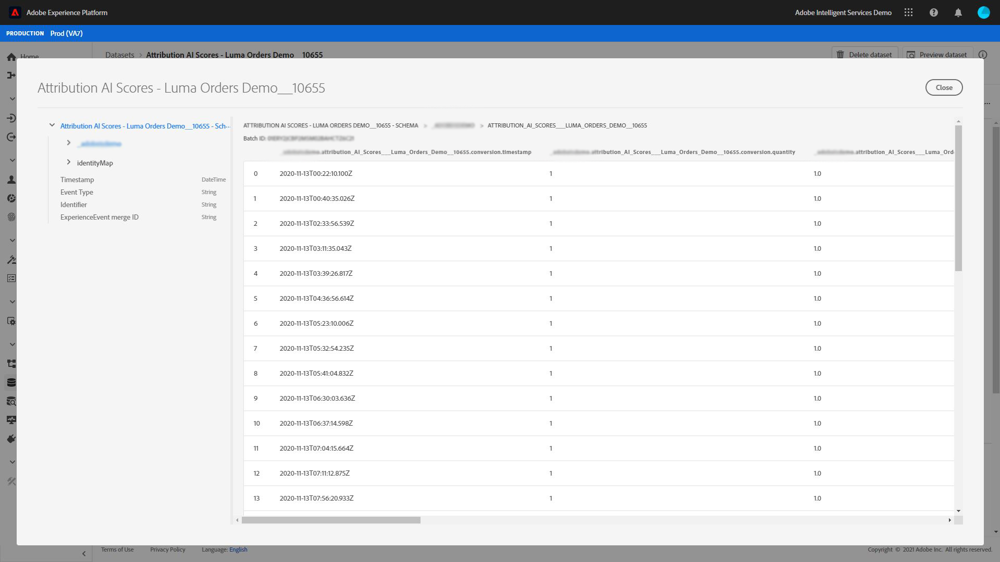

# 쿼리 서비스를 사용하여 속성 점수 분석

데이터의 각 행은 전환을 나타내며 이 변환은 관련 접점에 대한 정보가 `touchpointsDetail` 열 아래에 있는 구조의 배열로 저장됩니다.

| 터치포인트 정보 | 열 |
| ---------------------- | ------ |
| 터치포인트 이름 | `touchpointsDetail. touchpointName` |
| 터치포인트 채널 | `touchpointsDetail.touchPoint.mediaChannel` |
| 터치포인트 Attribution AI 알고리즘 점수 | <li>`touchpointsDetail.scores.algorithmicSourced`</li> <li> `touchpointsDetail.scores.algorithmicInfluenced` </li> |

## 데이터 경로 찾기

Adobe Experience Platform UI의 왼쪽 탐색 영역에서 **[!UICONTROL Datasets]**&#x200B;을 선택합니다. **[!UICONTROL Datasets]** 페이지가 나타납니다. 그런 다음 **[!UICONTROL Browse]** 탭을 선택하고 Attribution AI 점수에 대한 출력 데이터 세트를 찾습니다.


출력 데이터 세트를 선택합니다. 데이터 집합 활동 페이지가 나타납니다.


데이터 세트 활동 페이지 내에서 오른쪽 위 모서리의 **[!UICONTROL Preview dataset]**&#x200B;을 선택하여 데이터를 미리 보고 예상대로 인제스트되었는지 확인합니다.



데이터를 미리 본 후 오른쪽 레일에서 스키마를 선택합니다. 스키마 이름 및 설명과 함께 팝업이 나타납니다. 점수 스키마로 리디렉션할 스키마 이름 하이퍼링크를 선택합니다.


채점 스키마를 사용하여 값을 선택하거나 검색할 수 있습니다. 선택하면 쿼리를 만들 때 사용할 경로를 복사할 수 있는 **[!UICONTROL Field properties]** 사이드 레일이 열립니다.


## 액세스 쿼리 서비스

플랫폼 UI 내에서 쿼리 서비스에 액세스하려면 왼쪽 탐색 영역에서 **[!UICONTROL Queries]**&#x200B;을 선택한 다음 **[!UICONTROL Browse]** 탭을 선택합니다. 이전에 저장한 쿼리 목록이 로드됩니다.


그런 다음 오른쪽 위 모서리에서 **[!UICONTROL Create query]**&#x200B;을 선택합니다. 쿼리 편집기가 로드됩니다. 쿼리 편집기를 사용하여 점수 데이터를 사용하여 쿼리를 만들기 시작할 수 있습니다.


쿼리 편집기에 대한 자세한 내용은 [쿼리 편집기 사용자 안내서](../../query-service/ui/user-guide.md)를 참조하십시오.

## 속성 점수 분석을 위한 쿼리 템플릿

아래 쿼리는 다양한 점수 분석 시나리오에 대한 템플릿으로 사용될 수 있습니다. `_tenantId` 및 `your_score_output_dataset`을 채점 출력 스키마에 있는 올바른 값으로 대체해야 합니다.

>[!NOTE]
>
> 데이터 인제스트 방식에 따라, `timestamp`과 같이 아래에 사용된 값이 다른 형식일 수 있습니다.

### 유효성 검사 예

**전환 이벤트(전환 창 내)별 총 전환 수**

```sql
    SELECT conversionName,
           SUM(scores.firstTouch) as total_conversions,
           SUM(scores.algorithmicSourced) as total_attributed_conversions
    FROM
        (SELECT
                _tenantId.your_score_output_dataset.conversionName
                    as conversionName,
                inline(_tenantId.your_score_output_dataset.touchpointsDetail),
                timestamp as conversion_timestamp
         FROM
                your_score_output_dataset
        )
    WHERE
        conversion_timestamp >= '2020-07-16'
      AND
        conversion_timestamp <  '2020-10-14'
    GROUP BY
        conversionName
```

**전환 창에서 총 전환 전용 이벤트 수**

```sql
    SELECT
        _tenantId.your_score_output_dataset.conversionName as conversionName,
        COUNT(1) as convOnly_cnt
    FROM
        your_score_output_dataset
    WHERE
        _tenantId.your_score_output_dataset.touchpointsDetail.touchpointName[0] IS NULL AND
        timestamp >= '2020-07-16' AND
        timestamp <  '2020-10-14'
    GROUP BY
        conversionName
```

### 트렌드 분석 예

**일별 전환 수**

```sql
    SELECT conversionName,
           DATE(conversion_timestamp) as conversion_date,
           SUM(scores.firstTouch) as convertion_cnt
    FROM
        (SELECT
                _tenantId.your_score_output_dataset.conversionName as conversionName,
                inline(_tenantId.your_score_output_dataset.touchpointsDetail),
                timestamp as conversion_timestamp
         FROM
                your_score_output_dataset
        )
    GROUP BY
        conversionName, DATE(conversion_timestamp)
    ORDER BY
        conversionName, DATE(conversion_timestamp)
    LIMIT 20
```

### 배포 분석 예

**정의된 유형별 전환 경로에 대한 터치포인트 양(전환 창 내)**

```sql
    SELECT conversionName,
           touchpointName,
           COUNT(1) as tp_count
    FROM
        (SELECT
                _tenantId.your_score_output_dataset.conversionName as conversionName,
                inline(_tenantId.your_score_output_dataset.touchpointsDetail),
                timestamp as conversion_timestamp
         FROM
                your_score_output_dataset
        )
    WHERE
        conversion_timestamp >= '2020-07-16' AND
        conversion_timestamp < '2020-10-14' AND
        touchpointName IS NOT NULL
    GROUP BY
        conversionName, touchpointName
    ORDER BY
        conversionName, tp_count DESC
```

### 통찰력 생성 예

**터치포인트 및 전환 날짜별로 증분 단위 분류(전환 창 내)**

```sql
    SELECT conversionName,
           touchpointName,
           DATE(conversion_timestamp) as conversion_date,
           SUM(scores.algorithmicSourced) as incremental_units
    FROM
        (SELECT
                _tenantId.your_score_output_dataset.conversionName as conversionName,
                inline(_tenantId.your_score_output_dataset.touchpointsDetail),
                timestamp as conversion_timestamp
         FROM
                your_score_output_dataset
        )
    WHERE
        conversion_timestamp >= '2020-07-16' AND
        conversion_timestamp < '2020-10-14'  AND
        touchpointName IS NOT NULL
    GROUP BY
        conversionName, touchpointName, DATE(conversion_timestamp)
    ORDER BY
        conversionName, touchpointName, DATE(conversion_timestamp)
```

**터치포인트 및 터치포인트 날짜별 증분 단위 분류(전환 창 내)**

```sql
    SELECT conversionName,
           touchpointName,
           DATE(touchpoint.timestamp) as touchpoint_date,
           SUM(scores.algorithmicSourced) as incremental_units
    FROM
        (SELECT
                _tenantId.your_score_output_dataset.conversionName as conversionName,
                inline(_tenantId.your_score_output_dataset.touchpointsDetail),
                timestamp as conversion_timestamp
         FROM
                your_score_output_dataset
        )
    WHERE
        conversion_timestamp >= '2020-07-16' AND
        conversion_timestamp < '2020-10-14'  AND
        touchpointName IS NOT NULL
    GROUP BY
        conversionName, touchpointName, DATE(touchpoint.timestamp)
    ORDER BY
        conversionName, touchpointName, DATE(touchpoint.timestamp)
    LIMIT 20
```

**모든 점수 모델에 대한 특정 유형의 터치포인트에 대해 집계된 점수(전환 창 내)**

```sql
    SELECT
           conversionName,
           touchpointName,
           SUM(scores.algorithmicSourced) as total_incremental_units,
           SUM(scores.algorithmicInfluenced) as total_influenced_units,
           SUM(scores.uShape) as total_uShape_units,
           SUM(scores.decayUnits) as total_decay_units,
           SUM(scores.linear) as total_linear_units,
           SUM(scores.lastTouch) as total_lastTouch_units,
           SUM(scores.firstTouch) as total_firstTouch_units
    FROM
        (SELECT
                _tenantId.your_score_output_dataset.conversionName as conversionName,
                inline(_tenantId.your_score_output_dataset.touchpointsDetail),
                timestamp as conversion_timestamp
         FROM
                your_score_output_dataset
        )
    WHERE
        conversion_timestamp >= '2020-07-16' AND
        conversion_timestamp < '2020-10-14'  AND
        touchpointName = 'display'
    GROUP BY
        conversionName, touchpointName
    ORDER BY
        conversionName, touchpointName
```

**고급 - 경로 길이 분석**

각 전환 이벤트 유형에 대한 경로 길이 분포 가져오기:

```sql
    WITH agg_path AS (
          SELECT
            _tenantId.your_score_output_dataset.conversionName as conversionName,
            sum(size(_tenantId.your_score_output_dataset.touchpointsDetail)) as path_length
          FROM
            your_score_output_dataset
          WHERE
            _tenantId.your_score_output_dataset.touchpointsDetail.touchpointName[0] IS NOT NULL AND
            timestamp >= '2020-07-16' AND
            timestamp <  '2020-10-14'
          GROUP BY
            _tenantId.your_score_output_dataset.conversionName,
            eventMergeId
    )
    SELECT
        conversionName,
        path_length,
        count(1) as conversionPath_count
    FROM
        agg_path
    GROUP BY
        conversionName, path_length
    ORDER BY
        conversionName, path_length
```

**전환 경로 분석에서 고급 - 고유한 터치포인트 수**

각 전환 이벤트 유형에 대한 전환 경로에서 서로 다른 터치포인트 수에 대한 배포를 받습니다.

```sql
    WITH agg_path AS (
      SELECT
        _tenantId.your_score_output_dataset.conversionName as conversionName,
        size(array_distinct(flatten(collect_list(_tenantId.your_score_output_dataset.touchpointsDetail.touchpointName)))) as num_dist_tp
      FROM
        your_score_output_dataset
      WHERE
        _tenantId.your_score_output_dataset.touchpointsDetail.touchpointName[0] IS NOT NULL AND
        timestamp >= '2020-07-16' AND
        timestamp <  '2020-10-14'
      GROUP BY
        _tenantId.your_score_output_dataset.conversionName,
        eventMergeId
    )
    SELECT
        conversionName,
        num_dist_tp,
        count(1) as conversionPath_count
    FROM
     agg_path
    GROUP BY
        conversionName, num_dist_tp
    ORDER BY
        conversionName, num_dist_tp
```

### 스키마 병합 및 폭발 예

이 쿼리는 구조체 열을 여러 단일 열로 병합하고 배열을 여러 행으로 확장합니다. 이것은 속성 점수를 CSV 형식으로 변환하는 데 도움이 됩니다. 이 쿼리의 결과에는 하나의 전환이 있고 각 행에서 해당 변환에 해당하는 터치포인트 중 하나가 있습니다.

>[!TIP]
>
> 이 예에서 `_tenantId` 및 `your_score_output_dataset` 외에 `{COLUMN_NAME}`을(를) 교체해야 합니다. `COLUMN_NAME` 변수는 Attribution AI 인스턴스를 구성하는 동안 추가된 선택적인 통과 열 이름(보고 열) 값을 사용할 수 있습니다. 이 쿼리를 완료하는 데 필요한 `{COLUMN_NAME}` 값을 찾으려면 점수 출력 스키마를 검토하십시오.

```sql
SELECT 
  segmentation,
  conversionName,
  scoreCreatedTime,
  aaid, _id, eventMergeId,
  conversion.eventType as conversion_eventType,
  conversion.quantity as conversion_quantity,
  conversion.eventSource as conversion_eventSource,
  conversion.priceTotal as conversion_priceTotal,
  conversion.timestamp as conversion_timestamp,
  conversion.geo as conversion_geo,
  conversion.receivedTimestamp as conversion_receivedTimestamp,
  conversion.dataSource as conversion_dataSource,
  conversion.productType as conversion_productType,
  conversion.passThrough.{COLUMN_NAME} as conversion_passThru_column,
  conversion.skuId as conversion_skuId,
  conversion.product as conversion_product,
  touchpointName,
  touchPoint.campaignGroup as tp_campaignGroup, 
  touchPoint.mediaType as tp_mediaType,
  touchPoint.campaignTag as tp_campaignTag,
  touchPoint.timestamp as tp_timestamp,
  touchPoint.geo as tp_geo,
  touchPoint.receivedTimestamp as tp_receivedTimestamp,
  touchPoint.passThrough.{COLUMN_NAME} as tp_passThru_column,
  touchPoint.campaignName as tp_campaignName,
  touchPoint.mediaAction as tp_mediaAction,
  touchPoint.mediaChannel as tp_mediaChannel,
  touchPoint.eventid as tp_eventid,
  scores.*
FROM (
  SELECT
        _tenantId.your_score_output_dataset.segmentation,
        _tenantId.your_score_output_dataset.conversionName,
        _tenantId.your_score_output_dataset.scoreCreatedTime,
        _tenantId.your_score_output_dataset.conversion,
        _id,
        eventMergeId,
        map_values(identityMap)[0][0].id as aaid,
        inline(_tenantId.your_score_output_dataset.touchpointsDetail)
  FROM
        your_score_output_dataset
)
```
