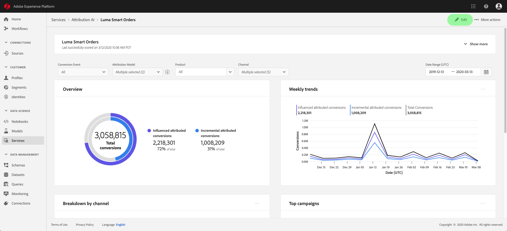
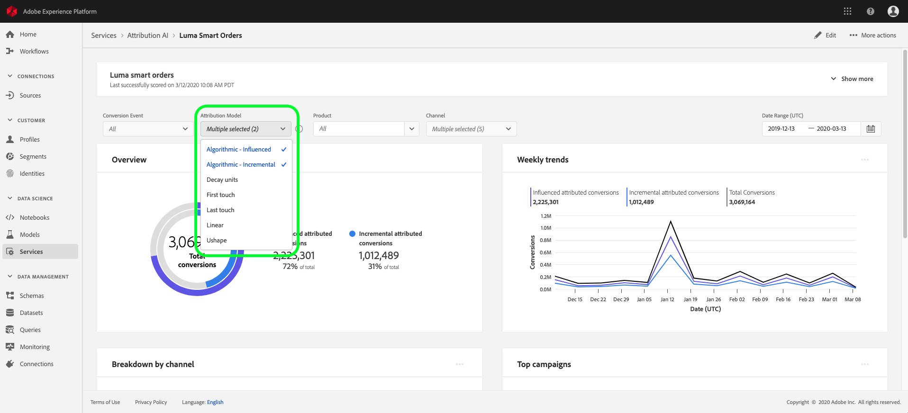

# Attribution AI에서 통찰력 살펴보기

Attribution AI 서비스 인스턴스는 마케팅 성과 및 투자 수익과 관련된 마케팅 결정을 내리고 측정하는 데 도움이 되는 인사이트를 제공합니다. 서비스 인스턴스를 선택하면 고객 여정의 각 단계에서 모든 고객 상호 작용의 영향을 이해하는 데 도움이 되는 시각화 및 필터가 제공됩니다.

이 문서는 Adobe Intelligent Services 사용자 인터페이스에서 서비스 인스턴스 인사이트와 상호 작용하기 위한 안내서 역할을 합니다.

## 시작하기

Attribution AI에 대한 인사이트를 활용하려면 성공적인 실행 상태가 제공되는 서비스 인스턴스가 있어야 합니다. 새 서비스 인스턴스를 만들려면 [Attribution AI 사용자 인터페이스 안내서](./user-guide.md)를 참조하세요. 최근에 서비스 인스턴스를 만들었지만 아직 교육 및 채점 중인 경우 24시간 동안 실행을 완료할 수 있도록 허용하십시오.

## 서비스 인스턴스 통찰력 개요

[!DNL Adobe Experience Platform] UI의 왼쪽 탐색에서 **[!UICONTROL 서비스]**&#x200B;를 선택합니다. **[!UICONTROL 서비스]** 브라우저가 나타나고 사용 가능한 Adobe Intelligent Services를 표시합니다. Attribution AI 컨테이너에서 **[!UICONTROL 열기]**&#x200B;를 선택합니다.

Attribution AI 서비스 페이지가 나타납니다. 이 페이지에는 Attribution AI의 서비스 인스턴스가 나열되며 인스턴스 이름, 전환 이벤트, 인스턴스 실행 빈도, 마지막 업데이트 상태 등 서비스 인스턴스에 대한 정보가 표시됩니다. 시작할 서비스 인스턴스 이름을 선택하십시오.

>[!NOTE]
>
>채점 실행이 완료된 서비스 인스턴스만 선택할 수 있습니다.

다음으로, 해당 서비스 인스턴스에 대한 인사이트 페이지가 표시되며, 여기에 시각화와 데이터와 상호 작용할 수 있는 여러 필터가 제공됩니다. 이 안내서 전체에서 시각화 및 필터에 대해 자세히 설명합니다.

### 서비스 인스턴스 세부 정보

서비스 인스턴스에 대한 추가 세부 정보를 보려면 오른쪽 상단에서 **[!UICONTROL 자세히 표시]**&#x200B;를 선택하십시오.

자세한 목록이 나타납니다. 나열된 속성에 대한 자세한 내용은 [Attribution AI 사용 안내서](./user-guide.md)를 참조하십시오.

### 인스턴스 편집

인스턴스를 편집하려면 오른쪽 상단 탐색에서 **[!UICONTROL 편집]**&#x200B;을 선택하십시오.

인스턴스의 이름, 설명 및 채점 빈도를 편집할 수 있는 편집 대화 상자가 나타납니다. 인스턴스 상태를 비활성화하면 채점 빈도를 편집할 수 없습니다. 변경 내용을 확인하고 대화 상자를 닫으려면 오른쪽 하단에서 **[!UICONTROL 저장]**&#x200B;을 선택합니다.

### 기타 액션 {#more-actions}

**[!UICONTROL 추가 작업]** 단추는 **[!UICONTROL 편집]** 옆의 오른쪽 상단 탐색에 있습니다. **[!UICONTROL 추가 작업]**&#x200B;을 선택하면 다음 작업 중 하나를 선택할 수 있는 드롭다운이 열립니다.

- **[!UICONTROL 복제]**: 인스턴스를 복제합니다.
- **[!UICONTROL 삭제]**: 인스턴스를 삭제합니다.
- **[!UICONTROL 요약 데이터 다운로드]**: 요약 데이터가 포함된 CSV 파일을 다운로드합니다.
- **[!UICONTROL 액세스 점수]**: **[!UICONTROL 액세스 점수]**&#x200B;를 선택하면 [Attribution AI 자습서에 대한 액세스 점수](./download-scores.md)(으)로 리디렉션됩니다.
- **[!UICONTROL 실행 기록 보기]**: 서비스 인스턴스와 연결된 모든 채점 실행 목록이 포함된 팝오버가 나타납니다.

## 데이터 필터링

Attribution AI 인사이트를 사용하면 데이터를 필터링하고 선택한 필터에 따라 UI 시각화를 자동으로 업데이트할 수 있습니다.

### 전환 이벤트

Attribution AI에서 새 인스턴스를 만들 때 필수 필드 중 하나는 &quot;전환 이벤트&quot;입니다. 전환 이벤트는 전자 상거래 주문, 매장 내 구매 및 웹 사이트 방문과 같은 마케팅 활동의 영향을 식별하는 비즈니스 목표입니다.

인스턴스 내에서 **[!UICONTROL 전환 이벤트]** 드롭다운을 사용하면 데이터를 필터링하기 위해 인스턴스에 대해 정의된 이벤트를 선택할 수 있습니다. 특정 이벤트를 선택하면 해당 이벤트에 속하는 전환만 채우도록 UI 시각화가 변경됩니다.

### 속성 모델

**[!UICONTROL 속성 모델]**&#x200B;을 선택하면 사용 가능한 모든 다양한 속성 모델이 있는 드롭다운이 열립니다. 여러 모델을 선택하여 결과를 비교할 수 있습니다. 다양한 속성 모델과 작동 방식에 대한 자세한 내용은 각 모델에 대한 정보가 포함된 표를 포함하는 [Attribution AI](./overview.md) 개요를 참조하십시오.

### 지역

>[!NOTE]
>
>이 필터는 서비스 인스턴스를 만들 때 Attribution AI 사용자 인터페이스 가이드의 선택적 단계 [지역 기반 모델링](./user-guide.md#region-based-modeling-optional)을 수행한 경우에만 표시됩니다.

이 필터를 사용하면 인스턴스 생성 프로세스에서 설정한 영역을 선택할 수 있습니다.

### 필터 추가

**필터** 아이콘을 선택하여 **[!UICONTROL 필터 추가]** 팝오버를 열어 필터를 추가할 수 있습니다. **[!UICONTROL 필터 추가]** 팝오버를 사용하면 채널, 지역, 미디어 유형 및 제품별로 필터링할 수 있습니다. 서비스 인스턴스에 적용 가능한 필터만 팝오버로 채워집니다. 예를 들어 지리적 데이터 또는 미디어 유형을 제공하지 않은 경우, 해당 필터 속성을 인스턴스에서 사용할 수 없습니다.

- **[!UICONTROL 채널]:** 채널 특성을 선택하면 사용 가능한 마케팅 채널을 필터링할 수 있습니다. 여러 채널을 선택하여 비교할 수 있습니다.
- **[!UICONTROL 지역]:** 지역 특성을 선택하면 지역 기반 모델을 기반으로 국가 코드를 필터링할 수 있습니다. 데이터에 따라 이 필터가 있을 수도 있고 없을 수도 있습니다. 국가 코드는 2자 길이입니다. 전체 국가 코드 목록 [여기](https://datahub.io/core/country-list)를 참조하세요.
- **[!UICONTROL 미디어 유형]:** 미디어 유형 특성을 선택하면 정의된 미디어 유형을 필터링할 수 있습니다.
- **[!UICONTROL 제품]:** 제품 특성을 선택하면 인스턴스 생성 시 처음 수집된 모든 제품을 필터링할 수 있습니다.

### 날짜 범위

달력 아이콘을 선택하여 날짜 범위 팝오버를 엽니다. 시작 및 종료 전환 이벤트 날짜는 UI에서 채워지는 데이터의 양을 결정합니다. 채워진 데이터 양에 초점을 맞추거나 확장하기 위해 날짜 범위를 좁히거나 넓히도록 선택할 수 있습니다.

## 데이터 개요

**[!UICONTROL 개요]** 카드는 기여도 분석 모델별 총 전환을 보여 줍니다. 총 개수 변경은 이 문서의 앞에 설명된 필터를 사용하여 검색하는 구체적인 방법에 따라 달라집니다. 모델을 더 선택하면 개요에 원이 더 추가되며, 각 원은 범례에 해당하는 고유 색상을 가집니다.

## 주간 트렌드

**[!UICONTROL 주별 트렌드]** 카드는 필터링 프로세스 중에 설정한 날짜 범위별로 전체 전환을 분류합니다.

**주별 트렌드** 카드의 오른쪽 상단에서 생략 부호를 선택하면 일별, 주별 또는 월별 트렌드를 선택할 수 있는 드롭다운이 표시됩니다.

특정 속성 모델의 데이터 라인 위로 마우스를 가져가면 해당 날짜에 대한 총 전환 수를 표시하는 팝오버가 만들어집니다.

## 채널별 분류

**[!UICONTROL 채널별 분류]** 카드를 사용하여 각 채널과 관련된 총 전환 수를 결정합니다. 이 카드는 각 채널의 효과성과 투자 수익률에 대한 결정을 내리는 데 도움이 될 수 있습니다.

**[!UICONTROL 채널별 분류]** 카드의 오른쪽 상단에서 생략 부호를 선택하면 터치포인트를 기반으로 데이터를 채울 수 있는 드롭다운이 열립니다.

## 상위 캠페인

**[!UICONTROL 상위 캠페인]** 카드에 캠페인의 개요와 각 채널에서 캠페인이 수행되는 방식이 표시됩니다. 이 카드를 통해 특정 채널 캠페인의 효과를 팀에 알리고 추가로 투자해야 하는 캠페인과 같은 통찰력을 제공할 수 있습니다.

## 접점 위치별 분류

**[!UICONTROL 경로 분석]** 탭을 선택하면 **[!UICONTROL 접점 위치별 분류]** 및 **[!UICONTROL 상위 전환 경로]** 그래프가 로드됩니다.

**[!UICONTROL 접점 위치별 분류]** 그래프는 모든 전환 경로에서 비교되는 접점 위치별 속성 전환의 분류입니다. 이 그래프는 전환 경로의 여러 단계에서 더 효과적인 접점을 파악하는 데 도움이 됩니다. 단계는 스타터, 플레이어 및 클로저입니다.

- **시작:** 접점이 전환 경로의 첫 번째 터치임을 나타냅니다.
- **플레이어:** 접점이 전환으로 이어지는 첫 번째 또는 마지막 접점이 아님을 나타냅니다.
- **가까이:** 접점이 전환 전 마지막 터치임을 나타냅니다.

>
>
> 모든 접점 및 위치에서 속성 모델에 대한 백분율 기여도의 합계는 100이어야 합니다.

## 상위 전환 경로

**[!UICONTROL 상위 전환 경로]** 그래프는 선택한 영역의 상위 전환 경로에 영향을 주는 점수와 알고리즘 점수를 보여줍니다. 이 그래프를 통해 전환에 기여하는 접점과 각 접점에 대한 속성 점수를 시각화할 수 있습니다. 이 정보를 사용하여 특정 영역에서 가장 빈번한 경로를 보고 다양한 터치포인트 세트 사이에 패턴이 나타나는지 확인할 수 있습니다.

## 접점 효율성

**[!UICONTROL 접점 효율성]** 탭을 선택하면 **[!UICONTROL 접점 효율성]** 카드가 로드됩니다. 이 카드는 Attribution AI의 데이터 배포를 사용하여 각 터치포인트에 대한 정보를 표시합니다. 이 테이블의 데이터는 카드의 오른쪽 상단에 있는 **[!UICONTROL 기준]** 날짜에 표시된 특정 기간 동안만 생성됩니다.

**[!UICONTROL 접점 효율성]** 카드 정보를 사용하여 접점이 전환에 기여하는 방식을 이해할 수 있습니다. 다음 성능 지표를 통해 각 접점이 얼마나 효과적인지도 확인할 수 있습니다.

**터치된 경로**: 이 지표는 접점에 대해 전환된 경로/전환되지 않은 경로의 비율을 표시합니다. 전환을 수행하지 않는 경로에 대한 전환을 수행하는 경로의 비율(백분율)이 높으면 더 높은 속성 전환이 표시됩니다.

**효율성 측정**: 이 지표는 별모양을 1에서 5까지 배율로 표시합니다. 배율은 전환을 위한 접점의 상대적 중요성을 나타냅니다.

>[!NOTE]
>
>접점 볼륨이 높다고 효율성 측정이 보장되지는 않습니다.

**총 볼륨**: 사용자가 터치포인트를 터치한 총 횟수입니다. 여기에는 전환을 수행하는 경로와 전환을 생성하지 않는 경로에 나타나는 터치포인트가 포함됩니다.

## 다음 단계

데이터 필터링을 완료하고 적절한 정보를 표시할 수 있으면 점수에 액세스할 수 있는 선택 사항이 있습니다. 점수에 액세스하는 방법에 대한 자세한 안내서는 [Attribution AI의 점수에 액세스](./download-scores.md) 자습서를 참조하십시오. 또한 [추가 작업](#more-actions)에 표시된 대로 요약 데이터를 다운로드할 수도 있습니다. &quot;요약 데이터 다운로드&quot;를 선택하면 날짜별로 집계된 요약 데이터가 다운로드됩니다.

## 추가 리소스

다음 비디오는 Attribution AI 통찰력 페이지를 사용하여 마케팅 채널 및 캠페인의 ROI를 파악하는 방법을 학습하는 데 도움이 되도록 설계되었습니다.

>[!VIDEO](https://video.tv.adobe.com/v/32669?learn=on&quality=12)
