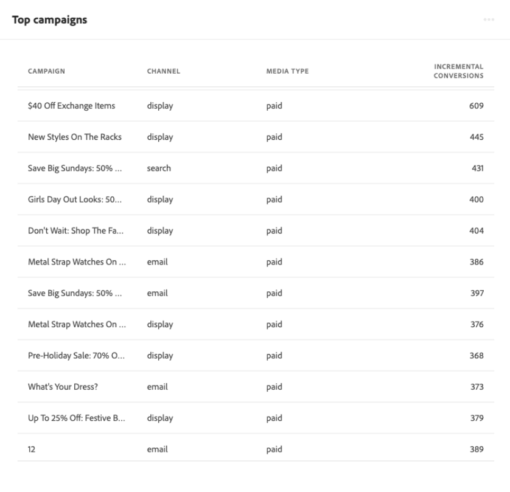

# Attribution AI에서 인사이트 살펴보기

Attribution AI 서비스 인스턴스는 마케팅 성과 및 ROI와 관련된 마케팅 결정을 내리고 측정하는 데 도움이 될 수 있는 통찰력을 제공합니다. 서비스 인스턴스를 선택하면 고객 여정의 각 단계에서 모든 고객 상호 작용이 미치는 영향을 이해하는 데 도움이 되는 시각화 및 필터가 제공됩니다.

이 문서는 Adobe Intelligent Services 사용자 인터페이스의 서비스 인스턴스 인사이트와 상호 작용하기 위한 안내서의 역할을 합니다.

## 시작하기

Attribution AI에 대한 인사이트를 활용하려면 성공적인 실행 상태인 서비스 인스턴스를 사용할 수 있어야 합니다. 새 서비스 인스턴스를 생성하려면 [Attribution AI 사용 인터페이스 안내서](./user-guide.md). 최근에 서비스 인스턴스를 만들었지만 여전히 교육 및 점수 책정 중이라면 실행을 완료하려면 24시간을 허용하십시오.

## 서비스 인스턴스 통찰력 개요

에서 [!DNL Adobe Experience Platform] UI, 선택 **[!UICONTROL 서비스]** 을 클릭합니다. 다음 **[!UICONTROL 서비스]** 브라우저가 나타나고 사용 가능한 Adobe Intelligent Services가 표시됩니다. Attribution AI 컨테이너에서 **[!UICONTROL 열기]**.

Attribution AI 서비스 페이지가 나타납니다. 이 페이지에는 Attribution AI의 서비스 인스턴스가 나열되며 인스턴스 이름, 전환 이벤트, 인스턴스가 실행되는 빈도 및 마지막 업데이트 상태 등 이러한 인스턴스에 대한 정보가 표시됩니다. 시작할 서비스 인스턴스 이름을 선택합니다.

>[!NOTE]
>
>성공적인 점수 책정 실행을 완료한 서비스 인스턴스만 선택할 수 있습니다.

다음으로, 데이터와 상호 작용하는 많은 필터와 시각화를 제공하는 서비스 인스턴스에 대한 인사이트 페이지가 나타납니다. 시각화 및 필터는 이 안내서 전체에서 자세히 설명합니다.

### 서비스 인스턴스 세부 사항

서비스 인스턴스에 대한 추가 세부 정보를 보려면 **[!UICONTROL 자세히 보기]** 오른쪽 위에 있습니다.

세부 목록이 나타납니다. 나열된 속성에 대한 자세한 내용은 [Attribution AI 사용 안내서](./user-guide.md).

### 인스턴스 편집

인스턴스를 편집하려면 **[!UICONTROL 편집]** 을 클릭합니다.

인스턴스의 이름, 설명 및 점수부여 빈도를 편집할 수 있는 편집 대화 상자가 나타납니다. 인스턴스 상태가 비활성화되어 있으면 점수부여 빈도를 편집할 수 없습니다. 변경 사항을 확인하고 대화 상자를 닫으려면 다음을 선택합니다 **[!UICONTROL 저장]** 오른쪽 아래 모서리에 있습니다.

### 추가 작업 {#more-actions}

다음 **[!UICONTROL 추가 작업]** 버튼은 옆에 있는 오른쪽 상단 탐색에 있습니다 **[!UICONTROL 편집]**. 선택 **[!UICONTROL 추가 작업]** 다음 작업 중 하나를 선택할 수 있는 드롭다운을 엽니다.

- **[!UICONTROL 복제]**: 인스턴스를 복제합니다.
- **[!UICONTROL 삭제]**: 인스턴스를 삭제합니다.
- **[!UICONTROL 요약 데이터 다운로드]**: 요약 데이터가 포함된 CSV 파일을 다운로드합니다.
- **[!UICONTROL 점수 책정 액세스]**: 선택 **[!UICONTROL 점수 책정 액세스]** 로 리디렉션합니다. [Attribution AI 자습서 액세스 점수](./download-scores.md).
- **[!UICONTROL 실행 기록 보기]**: 서비스 인스턴스와 연관된 모든 점수부여 실행 목록이 포함된 팝오버가 나타납니다.

## 데이터 필터링

Attribution AI 통찰력을 사용하면 데이터를 필터링하고 선택한 필터에 따라 UI 비주얼을 자동으로 업데이트할 수 있습니다.

### 전환 이벤트

Attribution AI에서 새 인스턴스를 만들면 필수 필드 중 하나는 &quot;전환 이벤트&quot;입니다. 전환 이벤트는 전자 상거래 주문, 매장 내 구매 및 웹 사이트 방문과 같은 마케팅 활동의 영향을 식별하는 비즈니스 목표입니다.

인스턴스 내에서 **[!UICONTROL 전환 이벤트]** 드롭다운을 사용하면 데이터를 필터링하기 위해 인스턴스에 대해 정의된 이벤트를 선택할 수 있습니다. 특정 이벤트를 선택하면 UI 시각화가 변경되어 해당 이벤트에 속하는 전환만 채웁니다.

### 속성 모델

선택 **[!UICONTROL 속성 모델]** 사용할 수 있는 모든 다른 속성 모델이 있는 드롭다운을 엽니다. 여러 모델을 선택하여 결과를 비교할 수 있습니다. 다양한 속성 모델 및 그 작동 방식에 대한 자세한 내용은 [Attribution AI](./overview.md) 각 모델에 대한 정보가 있는 테이블이 포함된 개요.

### 지역

>[!NOTE]
>
>이 필터는 선택적 단계를 수행한 경우에만 나타납니다 [지역 기반 모델링](./user-guide.md#region-based-modeling-optional) 서비스 인스턴스를 만들 때 Attribution AI 사용자 인터페이스 안내서에서 를 참조하십시오.

이 필터를 사용하면 인스턴스 생성 프로세스에서 설정한 영역을 선택할 수 있습니다.

### 필터 추가

을(를) 선택하여 추가 필터를 추가할 수 있습니다 **필터** 아이콘을 클릭하여 열기 **[!UICONTROL 필터 추가]** 팝오버 다음 **[!UICONTROL 필터 추가]** 팝오버를 사용하면 채널, 지역, 미디어 유형 및 제품별로 필터링할 수 있습니다. 서비스 인스턴스에 적용 가능한 필터만 팝오버로 채워집니다. 예를 들어 지역 데이터 또는 미디어 유형을 제공하지 않은 경우 해당 필터 속성을 인스턴스에 사용할 수 없습니다.

- **[!UICONTROL 채널]:** 채널 속성을 선택하면 사용 가능한 마케팅 채널을 필터링할 수 있습니다. 여러 채널을 선택하여 비교할 수 있습니다.
- **[!UICONTROL Geography]:** 지역 속성을 선택하면 지역 기반 모델을 기반으로 국가 코드를 필터링할 수 있습니다. 데이터에 따라 이 필터가 없거나 존재하지 않을 수 있습니다. 국가 코드는 두 자 길이입니다. 전체 국가 코드 목록을 참조하십시오 [여기](https://datahub.io/core/country-list).
- **[!UICONTROL 미디어 유형]:** 미디어 유형 속성을 선택하면 정의된 미디어 유형을 필터링할 수 있습니다.
- **[!UICONTROL 제품]:** 제품 속성을 선택하면 인스턴스를 만들 때 처음에 수집된 모든 제품을 필터링할 수 있습니다.

### 날짜 범위

달력 아이콘을 선택하여 날짜 범위 팝오버를 엽니다. 시작 및 종료 전환 이벤트 날짜는 UI에 채워진 데이터의 양을 결정합니다. 채워진 데이터 양을 집중하거나 확장하기 위해 날짜 범위를 좁히거나 넓히도록 선택할 수 있습니다.

## 데이터 개요

다음 **[!UICONTROL 개요]** 카드는 속성 모델별 총 전환을 보여줍니다. 이전에 이 문서에 요약된 필터를 사용하여 검색을 수행하는 방식에 따라 총 개수가 변경됩니다. 모델을 더 선택하면 범례에 해당하는 색상이 있는 추가 원이 개요에 추가됩니다.

## 주별 트렌드

다음 **[!UICONTROL 주별 트렌드]** 카드는 필터링 프로세스 중에 설정한 날짜 범위별로 총 전환을 분류합니다.

오른쪽 상단에 있는 줄임표 선택 **주별 트렌드** 카드에 일별, 주별 또는 월별 트렌드를 선택할 수 있는 드롭다운이 표시됩니다.

특정 속성 모델의 데이터 라인을 마우스로 가리키면 해당 날짜에 대한 총 전환 수를 보여주는 팝오버가 만들어집니다.

## 채널별 분류

다음 **[!UICONTROL 채널별 분류]** 카드는 각 채널과 관련된 총 전환 수를 결정하는 데 사용됩니다. 이 카드를 사용하여 각 채널의 효과와 투자 수익률을 결정할 수 있습니다.

오른쪽 상단에 있는 줄임표 선택 **[!UICONTROL 채널별 분류]** 카드가 드롭다운을 열어 터치포인트를 기반으로 데이터를 채울 수 있습니다.

## 상위 캠페인

다음 **[!UICONTROL 상위 캠페인]** 카드에는 캠페인과 각 채널에서 캠페인이 어떻게 수행되는지에 대한 개요가 표시됩니다. 이 카드를 통해 특정 채널에 대한 특정 캠페인의 효과를 팀에 알려주고 추가로 투자해야 하는 캠페인과 같은 인사이트를 얻을 수 있습니다.

## 터치 포인트 위치별 분류

선택 **[!UICONTROL 경로 분석]** 탭이 로드됨 **[!UICONTROL 터치 포인트 위치별 분류]** 및 **[!UICONTROL 최고 전환 경로]** 그래프.

다음 **[!UICONTROL 터치 포인트 위치별 분류]** 그래프는 모든 전환 경로에서 비교되는 터치 포인트의 위치별 속성 전환의 분류입니다. 이 그래프는 전환 경로의 여러 단계에서 더 효과적인 터치포인트를 이해하는 데 도움이 됩니다. 스테이지는 스타터, 플레이어, 그리고 더 가깝습니다.

- **시작:** 터치 포인트가 전환 경로에서 첫 번째 터치임을 나타냅니다.
- **플레이어:** 전환으로 이어지는 첫 번째 또는 마지막 터치가 터치포인트가 아님을 나타냅니다.
- **자세히:** 터치 포인트가 전환 전의 마지막 터치임을 나타냅니다.

>!![NOTE]
모든 터치포인트 및 위치에 걸친 속성 모델에 대한 기여도 비율 합은 100이어야 합니다.

## 최고 전환 경로

다음 **[!UICONTROL 최고 전환 경로]** 그래프는 선택한 지역의 상위 전환 경로에 대한 영향 및 알고리즘 점수를 보여줍니다. 이 그래프를 사용하면 전환에 기여하는 터치포인트와 각 터치포인트에 대한 속성 점수가 무엇인지 시각화할 수 있습니다. 이 정보를 사용하여 특정 영역에서 가장 빈번한 경로를 보고 다른 터치포인트 세트 간에 패턴이 발생하는지 확인할 수 있습니다.

## 터치포인트 효율성

선택 **[!UICONTROL 터치포인트 효율성]** 탭이 로드됨 **[!UICONTROL 터치포인트 효율성]** 카드. 이 카드는 Attribution AI의 데이터 배포를 사용하여 각 터치 포인트에 대한 정보를 표시합니다. 이 테이블의 데이터는 **[!UICONTROL 기준]** 카드 오른쪽 상단에 있는 날짜입니다.

를 사용할 수 있습니다 **[!UICONTROL 터치포인트 효율성]** 터치 포인트가 전환에 기여하는 방식을 이해하기 위한 카드 정보입니다. 또한 다음 성능 지표와 함께 각 터치포인트가 얼마나 효과적인지 확인할 수 있습니다.

**터치된 경로**: 이 지표는 터치 포인트에 대한 전환을 달성하는/않는 경로의 비율을 표시합니다. 전환을 이루지 않는 경로로의 전환을 구현하는 경로(백분율)의 비율이 높은 경우 속성 전환이 더 높게 표시됩니다.

**효율성 측정**: 이 지표는 1~5 범위의 별을 표시합니다. 배율은 전환과 관련한 터치포인트의 상대적 중요성을 나타냅니다.

>[!NOTE]
터치 포인트 볼륨이 조정되더라도 더 높은 효율성 측정이 보장되지는 않습니다.

**총 볼륨**: 사용자가 터치포인트를 터치한 총 횟수입니다. 여기에는 전환 경로 위에 표시되는 터치포인트와 전환이 발생하지 않는 경로가 포함됩니다.

## 다음 단계

데이터 필터링을 완료하고 적절한 정보를 표시할 수 있으면 점수에 액세스할 수 있습니다. 점수에 액세스하는 방법에 대한 자세한 지침은 [Attribution AI에서 점수 액세스](./download-scores.md) 자습서입니다. 또한, 에 명시된 대로 요약 데이터를 다운로드할 수도 있습니다. [추가 작업](#more-actions). &quot;요약 데이터 다운로드&quot;를 선택하면 날짜별로 집계된 요약 데이터가 다운로드됩니다.

## 추가 리소스

다음 비디오는 Attribution AI 통찰력 페이지를 사용하여 마케팅 채널 및 캠페인의 ROI를 이해하는 방법을 학습하도록 설계되었습니다.

>[!VIDEO](https://video.tv.adobe.com/v/32669?learn=on&quality=12)
